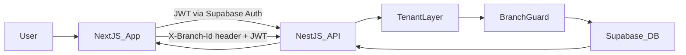

# Prompt 2 – Branch Management & Multi-Tenancy Plan

## Overview

Implement Prompt 2 in four steps: 0) introduce true SaaS multi-tenant “school” layer, 1) create branch entities and CRUD APIs, 2) add user–branch assignment and selection flow, and 3) make existing settings data branch- and tenant-scoped end‑to‑end (DB, backend, frontend). All changes must follow existing module patterns, central response format `{ data, meta, error }`, and strict TypeScript + theme rules.

## Phase 2.0 – Tenants (Schools) – True Multi-Tenancy

- **2.0.1 Database – `tenants` (or `schools`) table**
- Create a top-level tenants table, e.g. `public.tenants` (or `public.schools`), representing each school/customer:
    - Columns: `id UUID PRIMARY KEY DEFAULT gen_random_uuid()`, `name TEXT NOT NULL`, `code TEXT UNIQUE`, optional `domain TEXT`, `is_active BOOLEAN DEFAULT TRUE`, timestamps.
    - Enable RLS on `tenants`.
- **2.0.2 Database – Link branches to tenants**
- Alter `public.branches` to add `tenant_id UUID REFERENCES public.tenants(id) ON DELETE CASCADE`.
- Add an index on `(tenant_id, code)` for efficient lookups.
- **2.0.3 Database – RLS layering by tenant then branch**
- Update RLS policies so that access always isolates by **tenant first**, then branch:
    - Users are mapped to tenants (e.g. via a `user_tenants` table or inferred from `user_branches` join `branches.tenant_id`).
    - Policies on branch-scoped tables check that the row’s `tenant_id` (via its branch) belongs to the user, preventing any cross-school data visibility.
- **2.0.4 Onboarding flow concept**
- New school onboarding = create a new tenant (school) record, then allow its “owner/admin” user to create branches under that tenant. Different schools (tenants) are completely independent; branches are isolated per tenant.

## Phase 2.1 – Branch Entity & CRUD

- **2.1.1 Database – `branches` table**
- Use Supabase MCP to create `public.branches` exactly as defined in `prompts.md` Prompt 2.1 (id, name, name_ar, code, address, phone, email, storage_quota_gb, storage_used_bytes, is_active, timestamps) with **an additional `tenant_id` column** as described in Phase 2.0, and RLS enabled.
- Add basic RLS policy allowing only privileged roles to view/manage branches **for now** (temporary until Prompt 3 roles/permissions), e.g. simple `auth.uid() IS NOT NULL` for dev, documented for refinement later, while still ensuring tenant isolation via `tenant_id`.
- **2.1.2 Backend – Branch module**
- Add `BranchesModule` under [`backend/src/modules/branches`](backend/src/modules/branches) following existing module structure (controller, service, dto, entities).
- **DTOs**: `CreateBranchDto`, `UpdateBranchDto`, `QueryBranchesDto` (pagination + search + status) in `dto/` with class-validator + BasePaginationDto.
- **Service** (`branches.service.ts`):
    - Inject Supabase client from `supabase.config.ts`.
    - Implement methods for list (paginated + search by name/code), get by id, create, update, and storage breakdown (reading quota/used from `branches`).
- **Controller** (`branches.controller.ts`):
    - Add `@Controller('api/v1/branches')` with `@UseGuards(JwtAuthGuard)` and use global `ResponseInterceptor`.
    - Implement endpoints exactly per Prompt 2.1:
    - `GET /` → list branches (filtered later by user access once Prompt 3 roles are in place).
    - `GET /:id` → branch details.
    - `POST /` → create branch (temporarily guarded by a simple role/flag check stub until full permissions exist).
    - `PUT /:id` → update branch.
    - `GET /:id/storage` → storage breakdown (return quota, used bytes, and percentage).
- **2.1.3 Frontend – Branch admin screens**
- Add an admin page at [`frontend/src/app/dashboard/admin/branches/page.tsx`](frontend/src/app/dashboard/admin/branches/page.tsx) (or equivalent route group under `/dashboard/admin/branches`) using existing dashboard layout.
- Create feature components under [`frontend/src/components/features/branches`](frontend/src/components/features/branches):
    - `BranchCard.tsx` – shows name, code, status badge, and storage usage bar using Mantine `Card`, `Group`, `Progress`, `Badge` and theme system.
    - `BranchForm.tsx` – Mantine form (with Zod schema) for create/edit.
    - `StorageIndicator.tsx` – small reusable storage bar.
- Implement React Query hooks in [`frontend/src/hooks/useBranches.ts`](frontend/src/hooks/useBranches.ts) for list, get, create, update, and storage, using `ApiResponse<T>`.

## Phase 2.2 – Branch Selection Flow

- **2.2.1 Database – `user_branches` & profile link**
- Use Supabase MCP to:
    - Create `public.user_branches` as specified in Prompt 2.2 (user_id, branch_id, is_primary, created_at, PK (user_id, branch_id)) with RLS enabled.
    - Alter `public.profiles` to add `current_branch_id UUID REFERENCES public.branches(id)`.
- **2.2.2 Backend – Auth module extensions for branch selection**
- In existing `AuthModule` (`backend/src/modules/auth`):
    - Extend user fetching in `auth.service.ts` so that `/auth/me` includes:
    - `branches: BranchSummaryDto[]` (list from `user_branches` join `branches`).
    - `currentBranch: BranchSummaryDto | null` resolved via `profiles.current_branch_id`.
    - Add DTOs for `BranchSummaryDto` and extended `UserResponseDto` fields.
- Add two new endpoints in `auth.controller.ts` scoped under `/api/v1/auth`:
    - `GET /my-branches` – returns branches assigned to current user.
    - `POST /select-branch` – body `{ branchId: string }`; validates user has this branch in `user_branches`, then updates `profiles.current_branch_id`.
    - `GET /current-branch` – returns current branch context, used for client bootstrapping.
- **2.2.3 Frontend – Branch selection UI & header switcher**
- Add an auth route for initial selection: `[frontend/src/app/(auth)/select-branch/page.tsx](frontend/src/app/\\\(auth)/select-branch/page.tsx)`:
    - Requires Supabase session; uses `/auth/my-branches` to list options.
    - On selection, calls `/auth/select-branch` then redirects to `/dashboard`.
- Create components under `components/features/branches`:
    - `BranchSelector.tsx` – grid/cards for branch choices (used in select-branch page).
    - `BranchSwitcher.tsx` – small header dropdown component integrated into existing `Header.tsx` so user can switch branch at any time.
- Extend `useAuth.ts` so its `user` object includes `branches` and `currentBranch`; adjust types and consuming components (`UserMenu`, layout) as needed.
- **2.2.4 Frontend – Branch context propagation**
- Define a simple branch context utility (or Zustand store) in `frontend/src/lib/store/branch-store.ts` or extend an existing auth store:
    - Holds `currentBranchId` and `setCurrentBranchId`, initially populated from `useAuth()` data.
- Update Axios `api-client.ts` to automatically add `X-Branch-Id` header (if `currentBranchId` is set) on all requests.

## Phase 2.3 – Branch-Scoped Data Foundation

- **2.3.1 Database – Add `branch_id` to settings tables**
- Via Supabase MCP, alter existing Prompt 1 tables per Prompt 2.3:
    - Add `branch_id UUID REFERENCES public.branches(id)` to `subjects`, `classes`, `sections`, `levels`, `timing_templates`, `public_holidays`, `assessment_types`, and `grade_templates`.
    - Create branch indexes (`idx_subjects_branch`, `idx_classes_branch`, `idx_sections_branch`, etc.).
- Add/adjust RLS policies so that for each of these tables, allowed rows are restricted to branches in `user_branches` for the current user (as in the sample policy for `subjects`).
- Decide and document a **temporary migration strategy** for existing seed data (e.g. assign all existing rows to a default branch once one is created) so dev environment remains consistent.
- **2.3.2 Backend – BranchGuard and request context**
- Create `BranchGuard` in `backend/src/common/guards/branch.guard.ts`:
    - Reads `X-Branch-Id` header (or falls back to `profiles.current_branch_id` via a helper) for the authenticated user.
    - Verifies that the branch exists and is in `user_branches` for the user.
    - Attaches `branchId` (and later `academicYearId` when needed) to `request` object.
- Add `@CurrentBranch()` decorator in `backend/src/common/decorators/current-branch.decorator.ts` to inject branch context into controllers.
- Wire `BranchGuard` as a global or per-module guard (e.g. applied to configuration/academic modules), while leaving pure auth endpoints without it.
- **2.3.3 Backend – Update existing Prompt 1 modules for branch filtering**
- For **Academic Years**: keep mostly global but ensure that when other modules need the active year, they do so in combination with a branch context for later prompts.
- For **Core Lookups, Schedule, Assessment, System Settings** modules:
    - Update services to always filter reads/writes by `branchId` from the request context for branch-scoped tables.
    - Ensure create operations set `branch_id` to `branchId`.
    - Where list endpoints are currently global, narrow them to the active branch only.
- Maintain the existing response format and pagination; only adjust Supabase queries and DTOs to include `branch_id` where appropriate.
- **2.3.4 Frontend – Branch-aware queries and React Query keys**
- Update all existing React Query hooks (`useCoreLookups`, `useScheduleSettings`, `useAssessmentSettings`, `useSystemSettings`, `useAcademicYears` where applicable) so that:
    - Query keys include `currentBranchId` segment, e.g. `['subjects', currentBranchId]`.
    - Mutations invalidate branch‑specific keys.
- Ensure settings pages still function as before, but now scoped to the selected branch via automatic header injection and branch-aware keys.

## Implementation Todos

- **db-tenants-and-branches**: Create `tenants` table, add `tenant_id` to `branches`, then create `user_branches` table, add `current_branch_id` to `profiles`, and extend RLS as per Prompt 2.
- **backend-branches-module**: Implement `BranchesModule` with CRUD + storage endpoint and integrate into `AppModule`.
- **backend-auth-branch-context**: Extend auth service/controller and DTOs to return branch info and support `/my-branches`, `/select-branch`, `/current-branch`.
- **backend-branch-guard**: Implement `BranchGuard` and `@CurrentBranch` decorator, and apply to relevant modules.
- **db-branch-columns-existing-tables**: Add `branch_id` to Prompt 1 tables and create indices and RLS policies.