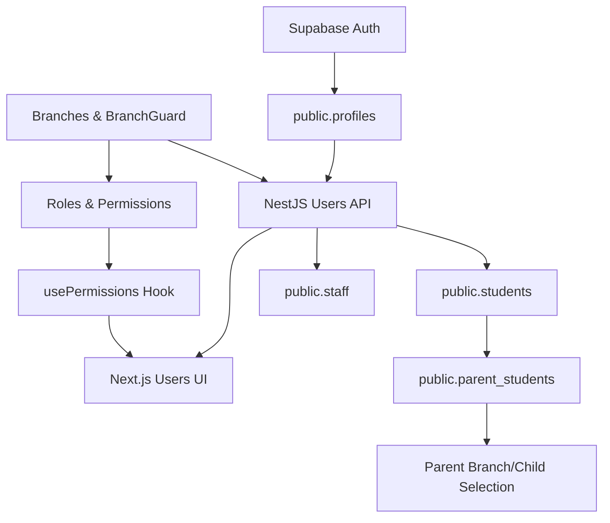

# Prompt 3 – User Management & Authentication Plan

## Scope & Phasing

- **Included**: Full Prompt 3 (Phases 3.1–3.5) – roles & permissions, user profiles/CRUD, students, parent–student linking, and staff management, wired into existing auth, **tenant (school)**, branch, and settings foundations from Prompts 0–2.
- **Multi-tenancy context**: Prompt 2 introduced `public.tenants` and `branches.tenant_id`. All new Prompt 3 data must be isolated per **tenant and branch** by:
  - Always taking `branch_id` from `BranchGuard` (which already validates that the branch belongs to the current tenant via `branches.tenant_id` and `user_branches`).
  - Ensuring every new table is either directly keyed by `branch_id`, or references another table that is branch- and tenant-scoped (e.g. `students.branch_id`).
  - Writing RLS policies that never allow access across tenants, typically by checking membership via `user_branches` → `branches.tenant_id`.
- **Order of work** (hard dependency chain):

1. **Phase 3.1** – Roles, features, and permission matrix (branch-aware)
2. **Phase 3.2** – User profiles & CRUD (multi-role, branch-aware)
3. **Phase 3.3** – Student profiles & IDs
4. **Phase 3.4** – Parent–student linking & selection flow
5. **Phase 3.5** – Staff management & link to roles, assignments

## Phase 3.1 – Roles & Permissions System

- **Database (Supabase)**
- Create `user_role` enum and tables: `public.roles`, `public.features`, `public.role_permissions` exactly as specified in `prompts.md`, adding **branch_id** and basic **RLS policies** that:
    - Allow only users with admin-type roles (`school_admin`, `principal`) in a branch to read/write role and permission data for that branch.
    - Ensure all queries are filtered by `branch_id`.
- **Backend (NestJS)**
- Add a new `RolesModule` (e.g. `[backend/src/modules/roles]`) with:
    - `roles.service.ts`: methods to read roles, features, and branch-scoped permission matrix; update permissions in bulk in a transaction.
    - `roles.controller.ts`: implement
    - `GET /api/v1/roles`
    - `GET /api/v1/features`
    - `GET /api/v1/permissions` (for current branch from `BranchGuard`)
    - `PUT /api/v1/permissions` (Admin only, validates payload against allowed permission values).
    - DTOs for the permission matrix shape and update payloads; map DB rows to `{ roleId, featureCode, permission }` per branch.
- Integrate:
    - Use existing `JwtAuthGuard` and `BranchGuard` on all routes.
    - Add a lightweight **authorisation helper** (e.g. `PermissionsService` or function) that can check `currentUser` + branch + feature to gate other modules later.
- **Frontend (Next.js + Mantine)**
- Add TS types in `frontend/src/types` for roles, features, and permission matrix, matching API contracts.
- Create a `usePermissions` hook in `frontend/src/hooks/usePermissions.ts` that:
    - Fetches `GET /api/v1/permissions` with React Query, keyed by `branch_id`.
    - Exposes helpers like `canView(featureCode)` and `canEdit(featureCode)`.
- Build settings UI:
    - Route: `[frontend/src/app/(dashboard)/settings/permissions/page.tsx]` (wrapped in existing dashboard layout, using standard `Container` + `Title` pattern).
    - Components: `PermissionMatrix`, `PermissionCell` under `frontend/src/components/features/settings/` that:
    - Render a grid of roles × features with Mantine `Table` and `Select`/`SegmentedControl` for `none/view/edit`.
    - Use React Query mutation to call `PUT /api/v1/permissions` and optimistic update.

## Phase 3.2 – User Profiles & CRUD

- **Database (Supabase)**
- Extend `public.profiles` with columns from Prompt 3 (phone, address, date_of_birth, gender, is_active), ensuring defaults and constraints are added as in `prompts.md`.
- Create `public.user_roles` table with `(user_id, role_id, branch_id, assigned_at)` as composite PK, RLS scoped by branch and admin roles.
- **Backend (NestJS)**
- Introduce a `UsersModule` under `backend/src/modules/users` that:
    - Encapsulates Supabase queries to `auth.users`, `public.profiles`, and `public.user_roles`.
    - Implements pagination and filtering by role and branch using the existing base pagination DTO pattern.
    - Provides methods for:
    - `listUsers` (joins profiles and user_roles, filtered by `branch_id` from `BranchGuard`).
    - `getUserWithRoles` by ID.
    - `createUser` (Supabase auth user + profile + initial roles in current branch, with transaction-like error handling/rollback where possible).
    - `updateUserProfile` and `updateUserRoles`.
    - `softDeleteUser` (set `profiles.is_active = false`, optionally disable sign-in via Supabase).
- Add controller `users.controller.ts` with endpoints:
    - `GET /api/v1/users` (query params: page, pageSize, role, branch, isActive).
    - `GET /api/v1/users/:id`.
    - `POST /api/v1/users`.
    - `PUT /api/v1/users/:id` (profile only).
    - `PUT /api/v1/users/:id/roles`.
    - `DELETE /api/v1/users/:id` (soft delete).
- Reuse existing DTO and response-wrapping patterns and apply `JwtAuthGuard` + permission checks (e.g. require `school_admin` or a `permissions` check for user management feature).
- **Frontend (Next.js + Mantine)**
- Add API client wrappers in `frontend/src/lib/api-client.ts` usage or a small `users` API helper module for `GET/POST/PUT/DELETE` calls.
- Create user management UI:
    - Route: `frontend/src/app/(dashboard)/users/page.tsx` with filters bar + table.
    - Components in `frontend/src/components/features/users/`:
    - `UserTable`: Mantine `Table` with role badges, active status, branch context.
    - `UserFilters`: `Select`/`MultiSelect` for role filter, `SegmentedControl` for status, hooks into query params and React Query refetch.
    - `UserForm`: Modal form for create/edit using `zod` + Mantine form, integrating Supabase constraints (e.g. unique email).
    - `RoleAssignment`: multi-select of roles per branch, calling `PUT /users/:id/roles` via mutation.
- Use `usePermissions` to hide/disable user management UI for roles without edit access.

## Phase 3.3 – Student Profiles

- **Database (Supabase)**
- Create `public.students` with all specified fields, indexes, and RLS rules that:
    - Enforce branch isolation and require that viewing/editing rights align with roles (e.g. class/subject teachers, coordinators, school admins) using `user_roles` and branch constraints.
- Implement `UNIQUE(student_id, branch_id)` and indexes for class/section queries.
- **Backend (NestJS)**
- Add `StudentsModule` under `backend/src/modules/students` that:
    - Uses `UsersModule` to create auth user + profile when creating a student.
    - Manages `public.students` records and ties them to classes/sections and academic year (using active year from existing settings logic).
    - Implements ID generation logic behind `GET /api/v1/students/generate-id` using a deterministic pattern like `year-class-section-sequence`, ensuring uniqueness per branch.
- Controller endpoints:
    - `GET /api/v1/students` (filters: class_id, section_id, branch_id, pagination).
    - `GET /api/v1/students/:id`.
    - `POST /api/v1/students` (composite creation of user + profile + student record).
    - `PUT /api/v1/students/:id`.
    - `POST /api/v1/students/bulk-import` (accept Excel, parse server-side, validate rows, and insert; return per-row success/error summary).
    - `GET /api/v1/students/generate-id`.
- Enforce `JwtAuthGuard`, `BranchGuard`, and role/permission checks (e.g. only admins/coordinators can bulk import; teachers can view within their classes only).
- **Frontend (Next.js + Mantine)**
- Types + hooks:
    - Student DTO types in `frontend/src/types/settings.ts` or a new `students.ts`.
    - `useStudents` hooks in `frontend/src/hooks/useStudents.ts` for list/detail/create/update.
- UI:
    - Route: `frontend/src/app/(dashboard)/students/page.tsx` (replace placeholder with real list + filters).
    - Components in `frontend/src/components/features/students/`:
    - `StudentTable`: table with columns for name, student ID, class, section, status.
    - `StudentForm`: full student form with linked fields (class/section selects using existing core lookups hooks).
    - `StudentCard`: detail view card for a single student.
    - `BulkImport`: upload area + preview table; calls bulk-import endpoint and shows row-wise result using Mantine `Alert`/`Notification`.
- ID generation UX: `StudentForm` calls `GET /students/generate-id` when class/section/year selected, pre-filling the `student_id` field.

## Phase 3.4 – Parent–Student Linking & Child Selection

- **Database (Supabase)**
- Create `public.parent_students` and extend `public.profiles` with `current_student_id` exactly as in `prompts.md`.
- Add RLS so that:
    - Parents can only see/edit links where `parent_user_id = auth.uid()`.
    - Admin staff can manage links per branch for their scope.
- **Backend (NestJS)**
- Extend `UsersModule` or add `ParentsModule` to:
    - Manage parent–student linking: create, list, delete links.
    - Update `profiles.current_student_id` for the current user.
- Controller endpoints:
    - `GET /api/v1/parents/:id/children`.
    - `POST /api/v1/parents/:id/children`.
    - `DELETE /api/v1/parents/:id/children/:studentId`.
    - `POST /api/v1/auth/select-child`.
    - `GET /api/v1/auth/current-child`.
- Integrate `current_student_id` and branch context into the `auth/me` response so the frontend can know active child and branch together.
- **Frontend (Next.js + Mantine)**
- Extend `useAuth` to include children list, current child, and helpers to switch child (calling `select-child`).
- Add selection UIs:
    - Route: `frontend/src/app/(auth)/select-child/page.tsx`.
    - Components in `frontend/src/components/features/parents/`:
    - `ChildSelector`: card grid of linked children with branch badges; calling `select-child` and redirecting to dashboard.
    - `LinkChildModal`: search students by name/ID + branch, link them to current parent; visible only to staff/admin or in controlled flows.
    - Add `ChildSwitcher` in layout header (for parents) to switch current child, reloading branch/child-aware data.

## Phase 3.5 – Staff Management

- **Database (Supabase)**
- Create `public.staff` with the specified fields and RLS that:
    - Restricts visibility and edits by branch, role, and permissions.
    - Ensures deactivation does not delete historical links (students, teacher assignments).
- **Backend (NestJS)**
- Add `StaffModule` under `backend/src/modules/staff` to:
    - CRUD staff records and tie them to `auth.users`/`profiles` (similar pattern to students but for staff).
    - Implement deactivation-flow endpoint that checks for existing assignments (in `teacher_assignments`, `class_sections.class_teacher_id`, etc.) and enforces replacement logic according to later prompts.
- Controller endpoints:
    - `GET /api/v1/staff` (filters: role, status, branch).
    - `GET /api/v1/staff/:id`.
    - `POST /api/v1/staff`.
    - `PUT /api/v1/staff/:id`.
    - `POST /api/v1/staff/:id/deactivate`.
    - `GET /api/v1/staff/:id/assignments` (reads from `teacher_assignments`/class-teacher mappings once implemented in Prompt 4).
- **Frontend (Next.js + Mantine)**
- Types and hooks for staff in `frontend/src/types` and `frontend/src/hooks/useStaff.ts` (list/detail/create/update/deactivate).
- UI under `frontend/src/app/(dashboard)/staff/page.tsx` and `frontend/src/components/features/staff/`:
    - `StaffTable`: list staff with roles, branch, status, and quick filters.
    - `StaffForm`: create/edit; reuses user-related fields and hooks.
    - `DeactivateModal`: shows assignments summary (using `GET /staff/:id/assignments`) and forces selection of replacement staff if needed.
    - `AssignmentsList`: simple list of current classes/subjects.

## Cross-Cutting Concerns & Testing

- **Branch & Year Context**
- Ensure all new queries and endpoints:
    - Take `branch_id` from `BranchGuard` and apply it at the DB layer.
    - Use the active academic year (from existing settings/academic year modules) when dealing with students and staff scope.
- **Permissions Integration**
- Before finishing the prompt, **wire `usePermissions` and backend permission checks** into user/students/staff UI and controllers, using `feature_code`s aligned with the Features table (e.g. `"user_management"`, `"students"`, `"staff"`).
- **Validation & Error Handling**
- Use `class-validator` DTOs on all new backend endpoints and `zod` schemas for all forms.
- Follow existing error-handling patterns (`http-exception.filter`, response interceptor) and avoid `any`.
- **Verification Strategy**
- For each phase: