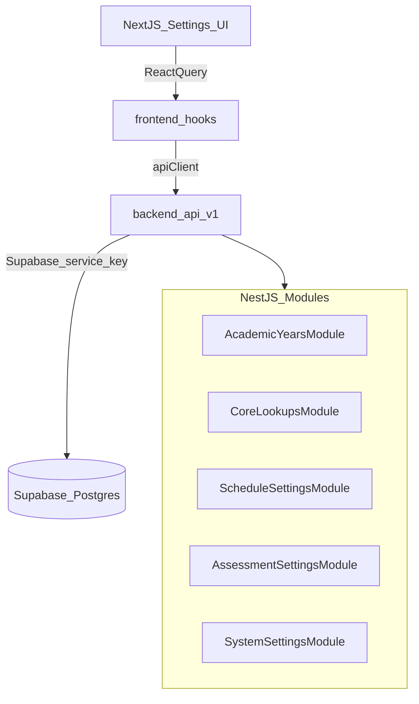

# Prompt 1 Implementation Plan (Settings Foundation)

## Scope (Prompt 1)

Implement the full Settings foundation in the order below, because later parts depend on earlier entities (e.g., holidays require an academic year, timing assignments require classes).

- **Phase 1.1** Academic Year Management
- **Phase 1.2** Core Lookup Tables (Subjects, Classes, Sections, Levels)
- **Phase 1.3** Timing & Schedule Settings (School days, timing templates, public holidays)
- **Phase 1.4** Assessment & Grade Settings (assessment types, grade templates/ranges, class assignments, leave quota)
- **Phase 1.5** System Settings (communication direction, behavior assessment, library categories)

## Global Implementation Rules Applied

- **Backend**: NestJS modules per feature under `backend/src/modules/*` (DTO validation via `class-validator`, business logic in services, `@UseGuards(JwtAuthGuard)` on all endpoints). Existing API prefix pattern is `@Controller('api/v1/...')` (see `backend/src/modules/auth/auth.controller.ts`).
- **API responses**: Return `{ data, meta? }` so the existing `ResponseInterceptor` doesn’t double-wrap (see `backend/src/common/interceptors/response.interceptor.ts`).
- **Frontend**: Next.js App Router pages + Mantine-only UI; follow the title-bar + content-area pattern from your design system and **no hardcoded colors/fonts/sizes** (use `themeConfig.ts` and existing theme provider rules).
- **Database**: Follow DB rules: every table includes `id`, `created_at`, `updated_at` (and enable RLS). Some tables in `prompts.md` omit `updated_at`; the migration should add it to comply with your `database.mdc` standards.

## Data Flow (high level)

## Phase 1.1 — Academic Year Management

### Database (Supabase migration)

- Create `public.academic_years` with:
- `id uuid pk default gen_random_uuid()`
- `name text not null unique`
- `start_date date not null`, `end_date date not null`
- `is_active boolean not null default false`
- `is_locked boolean not null default false`
- `created_at timestamptz not null default now()`, `updated_at timestamptz not null default now()`
- Enforce single active year via partial unique index.
- Enable RLS.
- Add trigger/function to keep `updated_at` current on updates.

### Backend (NestJS)

Files to add:

- `backend/src/modules/academic-years/academic-years.module.ts`
- `backend/src/modules/academic-years/academic-years.controller.ts`
- `backend/src/modules/academic-years/academic-years.service.ts`
- `backend/src/modules/academic-years/dto/*`

Endpoints (per `prompts.md`):

- `GET /api/v1/academic-years` (paginated list; include `meta`)
- `GET /api/v1/academic-years/active`
- `POST /api/v1/academic-years`
- `PATCH /api/v1/academic-years/:id/activate` (transaction-like behavior: set all `is_active=false` then set selected `true`)
- `PATCH /api/v1/academic-years/:id/lock`

Key validations/guards:

- Validate date range: `start_date < end_date`.
- Prevent editing/activating locked years where applicable.

### Frontend (Next.js + Mantine)

Routes/components (adapt to your existing `/dashboard/settings` structure):

- Add settings subsection route: `frontend/src/app/dashboard/settings/academic-years/page.tsx`
- Add feature components under `frontend/src/components/features/settings/`:
- `AcademicYearCard.tsx`
- `AcademicYearForm.tsx` (modal)
- Add hooks:
- `frontend/src/hooks/useAcademicYears.ts` (React Query: list, create, activate, lock)

UI expectations:

- Title bar + action button “Create year”.
- Card/list view with `Badge variant="light"` for Active/Inactive/Locked.
- Loading, error (Alert + retry), and empty states.

## Phase 1.2 — Core Lookup Tables

### Database migration

Create (with required timestamps + RLS):

- `subjects` (add `updated_at` + `created_at`, `is_active`, `sort_order`, optional `name_ar`, `code unique`)
- `classes` (include `updated_at`; keep `sort_order`, `is_active`)
- `sections` (include `updated_at`; `sort_order`, `is_active`)
- `levels` (include `updated_at`; `sort_order`)
- `level_classes` (junction table; add `created_at`, `updated_at` to match DB rules, or document an exception—prefer adding them for consistency)

### Backend

Create modules/services/controllers + DTOs for:

- `GET/POST /api/v1/subjects` (list supports pagination + `search`)
- `GET/POST /api/v1/classes` (list supports optional level filter + pagination)
- `GET/POST /api/v1/sections`
- `GET/POST /api/v1/levels` (return levels with nested classes)

Business rules:

- Provide stable ordering via `sort_order`.
- Validate uniqueness for optional codes.

### Frontend

- Create `frontend/src/app/dashboard/settings/academic/page.tsx` (tabbed settings page: Subjects, Classes, Sections, Levels).
- Feature components under `frontend/src/components/features/settings/`:
- `SubjectList.tsx`, `ClassList.tsx`, `SectionList.tsx`, `LevelManager.tsx`
- Hooks:
- `frontend/src/hooks/useSubjects.ts`, `useClasses.ts`, `useSections.ts`, `useLevels.ts`

Note: Drag-and-drop reordering is mentioned in the prompt; plan it as a second pass once CRUD is stable (requires order persistence endpoints such as `PATCH /reorder`).

## Phase 1.3 — Timing & Schedule Settings

### Database migration

Create (with timestamps + RLS):

- `school_days` (unique day_of_week)
- `timing_templates`
- `class_timing_assignments` (1:1 per class; include timestamps)
- `public_holidays` (references `academic_years`; include `updated_at`)

### Backend

Endpoints:

- `GET /api/v1/settings/school-days`
- `PUT /api/v1/settings/school-days`
- `GET/POST /api/v1/timing-templates`
- `PUT /api/v1/timing-templates/:id/assign-classes`
- `GET/POST/PUT/DELETE /api/v1/public-holidays`

Validations:

- Time ranges consistent (`start_time < end_time`, breaks within range).
- Holiday date ranges within the selected academic year.

### Frontend

- `frontend/src/app/dashboard/settings/schedule/page.tsx`
- Components:
- `SchoolDaysSelector.tsx`, `TimingTemplateForm.tsx`, `TimingTemplateCard.tsx`, `HolidayCalendar.tsx`
- Hooks:
- `useSchoolDays.ts`, `useTimingTemplates.ts`, `usePublicHolidays.ts`

## Phase 1.4 — Assessment & Grade Settings

### Database migration

Create (with timestamps + RLS):

- `assessment_types`
- `grade_templates`
- `grade_ranges`
- `class_grade_assignments` (include timestamps)
- `leave_settings` (unique by academic year; include `updated_at`)

### Backend

Endpoints:

- `GET/POST /api/v1/assessment-types`
- `GET/POST/PUT /api/v1/grade-templates`
- `PUT /api/v1/grade-templates/:id/assign-classes`
- `GET/PUT /api/v1/settings/leave-quota`

Validations:

- Grade ranges: `min_percentage <= max_percentage`, no overlaps per template, sorted `sort_order`.
- Assignment passing grade must exist in the template.

### Frontend

- `frontend/src/app/dashboard/settings/assessment/page.tsx`
- Components:
- `AssessmentTypeList.tsx`, `GradeTemplateBuilder.tsx`, `GradeTemplateAssignment.tsx`, `LeaveQuotaSetting.tsx`
- Hooks:
- `useAssessmentTypes.ts`, `useGradeTemplates.ts`, `useLeaveSettings.ts`

## Phase 1.5 — System Settings

### Database migration

- Create `system_settings (key text pk, value jsonb not null, updated_at timestamptz not null default now())`
- Enable RLS.
- Seed default keys from prompt:
- `communication_direction`
- `behavioral_assessment`
- `library_categories`

### Backend

Endpoints:

- `GET /api/v1/settings` (all)
- `GET /api/v1/settings/:key`
- `PUT /api/v1/settings/:key`

### Frontend

- Routes:
- `frontend/src/app/dashboard/settings/communication/page.tsx`
- `frontend/src/app/dashboard/settings/behavior/page.tsx`
- Components:
- `CommunicationSettings.tsx`, `BehaviorSettings.tsx`, `LibraryCategoryEditor.tsx`
- Hooks:
- `useSystemSettings.ts`

## Cross-cutting: Navigation + Settings Landing

- Upgrade `frontend/src/app/dashboard/settings/page.tsx` from placeholder to a Settings landing page that links to:
- Academic Years
- Academic (Subjects/Classes/Sections/Levels)
- Schedule
- Assessment
- Communication
- Behavior
- Keep the existing sidebar entry “Settings” (`frontend/src/components/layout/Sidebar.tsx`) pointing to `/dashboard/settings`.

## Non-functional Requirements & Consistency Checks

- **Pagination**: all list endpoints implement `page`, `limit`, `search`, `sortBy`, `sortOrder` (backend rule).
- **Error handling**: services throw Nest exceptions; error responses are shaped by `HttpExceptionFilter`.
- **No redirect loops**: keep auth checks in `AuthGuard` as-is (Supabase session only).
- **No theme violations**: no hardcoded colors/fonts/sizes; use Mantine tokens and the centralized theme.

## Files we will primarily touch/create

- Backend:
- [`backend/src/app.module.ts`](backend/src/app.module.ts) (import new modules)
- [`backend/src/modules/academic-years/*`](backend/src/modules/academic-years/) (new)
- Additional modules under `backend/src/modules/*` for phases 1.2–1.5
- Frontend:
- [`frontend/src/app/dashboard/settings/page.tsx`](frontend/src/app/dashboard/settings/page.tsx)