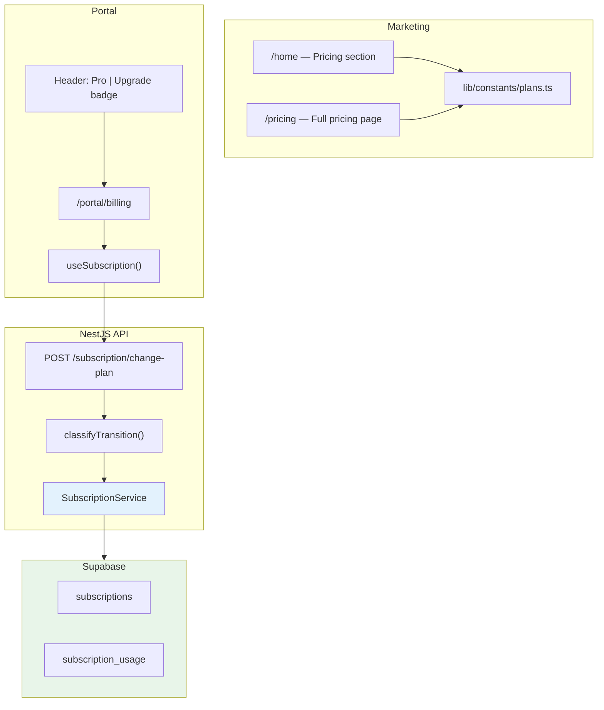

# Alma — School Subscription & Billing System (Implementation Guide)

> **Context:** Adapted from RMS subscription system for **school management domain**  
> **Goal:** Implement plan tiers, limits, transitions, and billing UI **without payment processing** (Stripe deferred)  
> **Tech Stack:** Next.js App Router, NestJS, Supabase/PostgreSQL, Mantine UI

---

## 1. System Overview



**Design Principles:**

1. **Manual billing first** - Plans tracked in DB, payment collection outside system initially
2. **One transition classifier** - `classifyTransition()` drives all plan changes
3. **Usage enforcement** - Block actions when limits exceeded, warn before downgrade
4. **Pending changes** - Downgrades scheduled for end of billing period
5. **Owner-only access** - Only school owner sees billing page

---

## 2. Plans, Cycles, and Pricing

### 2.1 Plan Tiers (School Context)

| Plan | `plan_id` | Tier | Target Audience | Payment |
|------|-----------|------|-----------------|---------|
| Free | `free` | 0 | Trial/Demo (1 branch, basic features) | None |
| Starter | `starter` | 1 | Small schools (1-2 branches) | Manual invoice |
| Pro | `pro` | 2 | Medium schools (up to 5 branches) | Manual invoice |
| Enterprise | `enterprise` | 3 | Large school networks (unlimited) | Custom contract |

```typescript
enum PlanId {
  FREE = 'free',
  STARTER = 'starter',
  PRO = 'pro',
  ENTERPRISE = 'enterprise',
}

enum BillingCycle {
  MONTHLY = 'monthly',
  YEARLY = 'yearly',
}
```

### 2.2 Billing Cycles

| Cycle | DB Value | Description |
|-------|----------|-------------|
| Monthly | `monthly` | Billed every month |
| Yearly | `yearly` | Billed annually (10% discount) |

**Discount:** `YEARLY_DISCOUNT = 0.1` → Yearly = `monthly × 12 × 0.9`

### 2.3 List Prices (USD/PKR)

**USD Pricing:**

| Plan | Monthly | Yearly (10% off) |
|------|---------|------------------|
| Free | $0 | $0 |
| Starter | $50 | $540 |
| Pro | $150 | $1,620 |
| Enterprise | Custom | Custom |

**PKR Pricing (1 USD ≈ 280 PKR):**

| Plan | Monthly | Yearly |
|------|---------|--------|
| Free | ₨0 | ₨0 |
| Starter | ₨14,000 | ₨151,200 |
| Pro | ₨42,000 | ₨453,600 |
| Enterprise | Custom | Custom |

*Note: Adjust PKR rates based on current exchange rate and market positioning*

### 2.4 School-Specific Limits

| Plan | Branches | Students | Teachers/Staff | Classes | Storage | Monthly Reports | SMS/Month |
|------|----------|----------|----------------|---------|---------|-----------------|-----------|
| Free | 1 | 50 | 5 | 5 | 500 MB | 50 | 100 |
| Starter | 2 | 500 | 25 | 25 | 5 GB | 500 | 1,000 |
| Pro | 5 | 2,000 | 100 | 100 | 25 GB | 2,000 | 5,000 |
| Enterprise | Unlimited | Unlimited | Unlimited | Unlimited | 100 GB | Unlimited | Unlimited |

### 2.5 Feature Flags

| Feature | Free | Starter | Pro | Enterprise |
|---------|------|---------|-----|------------|
| **Core Features** |
| Student Management | ✅ | ✅ | ✅ | ✅ |
| Attendance Tracking | ✅ | ✅ | ✅ | ✅ |
| Basic Reports | ✅ | ✅ | ✅ | ✅ |
| **Premium Features** |
| Fee Management | ❌ | ✅ | ✅ | ✅ |
| Advanced Reports | ❌ | ✅ | ✅ | ✅ |
| Result Cards (PDF) | ❌ | ✅ | ✅ | ✅ |
| Parent Portal | ❌ | ✅ | ✅ | ✅ |
| SMS Notifications | ❌ | ✅ | ✅ | ✅ |
| Timetable Management | ❌ | ✅ | ✅ | ✅ |
| **Advanced Features** |
| Multi-branch Management | ❌ | Limited (2) | ✅ | ✅ |
| Custom Branding | ❌ | ❌ | ✅ | ✅ |
| API Access | ❌ | ❌ | ✅ | ✅ |
| Behavioral Tracking | ❌ | ❌ | ✅ | ✅ |
| Library Management | ❌ | ❌ | ✅ | ✅ |
| Inventory Management | ❌ | ❌ | ✅ | ✅ |
| **Enterprise Only** |
| Dedicated Support | ❌ | ❌ | ❌ | ✅ |
| Custom Integrations | ❌ | ❌ | ❌ | ✅ |
| SLA Guarantee | ❌ | ❌ | ❌ | ✅ |
| White-label Option | ❌ | ❌ | ❌ | ✅ |

---

## 3. Configuration Files

### 3.1 Backend Authority (`backend/src/modules/subscription/plan-config.ts`)

```typescript
// Plan configurations
export const YEARLY_DISCOUNT = 0.1;

export interface PlanLimits {
  branches: number;
  students: number;
  teachers: number;
  classes: number;
  storageMB: number;
  monthlyReports: number;
  monthlySMS: number;
}

export interface PlanFeatures {
  hasFeeManagement: boolean;
  hasAdvancedReports: boolean;
  hasResultCards: boolean;
  hasParentPortal: boolean;
  hasSMSNotifications: boolean;
  hasTimetable: boolean;
  hasMultiBranch: boolean;
  hasCustomBranding: boolean;
  hasAPIAccess: boolean;
  hasBehavioralTracking: boolean;
  hasLibraryManagement: boolean;
  hasInventoryManagement: boolean;
  supportedLanguages: string[];
}

export interface PlanConfig {
  id: PlanId;
  name: string;
  order: number;
  prices: {
    monthly: number;
    yearly: number;
  };
  limits: PlanLimits;
  features: PlanFeatures;
}

export const PLAN_CONFIGS: Record<PlanId, PlanConfig> = {
  free: {
    id: 'free',
    name: 'Free',
    order: 0,
    prices: { monthly: 0, yearly: 0 },
    limits: {
      branches: 1,
      students: 50,
      teachers: 5,
      classes: 5,
      storageMB: 500,
      monthlyReports: 50,
      monthlySMS: 100,
    },
    features: {
      hasFeeManagement: false,
      hasAdvancedReports: false,
      hasResultCards: false,
      hasParentPortal: false,
      hasSMSNotifications: false,
      hasTimetable: false,
      hasMultiBranch: false,
      hasCustomBranding: false,
      hasAPIAccess: false,
      hasBehavioralTracking: false,
      hasLibraryManagement: false,
      hasInventoryManagement: false,
      supportedLanguages: ['en'],
    },
  },
  starter: {
    id: 'starter',
    name: 'Starter',
    order: 1,
    prices: { monthly: 50, yearly: 540 },
    limits: {
      branches: 2,
      students: 500,
      teachers: 25,
      classes: 25,
      storageMB: 5120,
      monthlyReports: 500,
      monthlySMS: 1000,
    },
    features: {
      hasFeeManagement: true,
      hasAdvancedReports: true,
      hasResultCards: true,
      hasParentPortal: true,
      hasSMSNotifications: true,
      hasTimetable: true,
      hasMultiBranch: true,
      hasCustomBranding: false,
      hasAPIAccess: false,
      hasBehavioralTracking: false,
      hasLibraryManagement: false,
      hasInventoryManagement: false,
      supportedLanguages: ['en', 'ar'],
    },
  },
  pro: {
    id: 'pro',
    name: 'Pro',
    order: 2,
    prices: { monthly: 150, yearly: 1620 },
    limits: {
      branches: 5,
      students: 2000,
      teachers: 100,
      classes: 100,
      storageMB: 25600,
      monthlyReports: 2000,
      monthlySMS: 5000,
    },
    features: {
      hasFeeManagement: true,
      hasAdvancedReports: true,
      hasResultCards: true,
      hasParentPortal: true,
      hasSMSNotifications: true,
      hasTimetable: true,
      hasMultiBranch: true,
      hasCustomBranding: true,
      hasAPIAccess: true,
      hasBehavioralTracking: true,
      hasLibraryManagement: true,
      hasInventoryManagement: true,
      supportedLanguages: ['en', 'ar', 'ur'],
    },
  },
  enterprise: {
    id: 'enterprise',
    name: 'Enterprise',
    order: 3,
    prices: { monthly: 0, yearly: 0 }, // Custom pricing
    limits: {
      branches: -1, // Unlimited
      students: -1,
      teachers: -1,
      classes: -1,
      storageMB: 102400,
      monthlyReports: -1,
      monthlySMS: -1,
    },
    features: {
      hasFeeManagement: true,
      hasAdvancedReports: true,
      hasResultCards: true,
      hasParentPortal: true,
      hasSMSNotifications: true,
      hasTimetable: true,
      hasMultiBranch: true,
      hasCustomBranding: true,
      hasAPIAccess: true,
      hasBehavioralTracking: true,
      hasLibraryManagement: true,
      hasInventoryManagement: true,
      supportedLanguages: ['en', 'ar', 'ur', 'fr'],
    },
  },
};

// Helper functions
export function getPlanConfig(planId: PlanId): PlanConfig {
  return PLAN_CONFIGS[planId];
}

export function getPlanOrder(planId: PlanId): number {
  return PLAN_CONFIGS[planId].order;
}

export function getPlanPrice(planId: PlanId, cycle: BillingCycle): number {
  return cycle === 'monthly' 
    ? PLAN_CONFIGS[planId].prices.monthly 
    : PLAN_CONFIGS[planId].prices.yearly;
}

export function exceedsLimit(
  planId: PlanId,
  metric: keyof PlanLimits,
  value: number,
): boolean {
  const limit = PLAN_CONFIGS[planId].limits[metric];
  if (limit === -1) return false; // Unlimited
  return value > limit;
}

export function canDowngrade(
  targetPlanId: PlanId,
  currentUsage: Partial<PlanLimits>,
): { allowed: boolean; reasons: string[] } {
  const config = getPlanConfig(targetPlanId);
  const reasons: string[] = [];

  Object.entries(currentUsage).forEach(([metric, value]) => {
    if (value && exceedsLimit(targetPlanId, metric as keyof PlanLimits, value)) {
      const limit = config.limits[metric as keyof PlanLimits];
      reasons.push(`${metric}: ${value} exceeds ${targetPlanId} limit of ${limit}`);
    }
  });

  return { allowed: reasons.length === 0, reasons };
}

// Feature checks
export function planHasFeature(
  planId: PlanId,
  feature: keyof PlanFeatures,
): boolean {
  return PLAN_CONFIGS[planId].features[feature] as boolean;
}
```

### 3.2 Transition Classification

```typescript
export type PlanTransitionType =
  | 'noop'
  | 'contact-sales'
  | 'upgrade'
  | 'downgrade-scheduled'
  | 'pending-cleared';

export function classifyTransition(
  currentPlan: PlanId,
  currentCycle: BillingCycle,
  targetPlan: PlanId,
  targetCycle: BillingCycle,
): PlanTransitionType {
  // Same plan and cycle
  if (currentPlan === targetPlan && currentCycle === targetCycle) {
    return 'noop';
  }

  // Enterprise always requires contact
  if (targetPlan === PlanId.ENTERPRISE) {
    return 'contact-sales';
  }

  // Get plan orders
  const currentOrder = getPlanOrder(currentPlan);
  const targetOrder = getPlanOrder(targetPlan);

  // Downgrade to Free
  if (targetPlan === PlanId.FREE) {
    return 'downgrade-scheduled';
  }

  // Tier upgrade
  if (targetOrder > currentOrder) {
    return 'upgrade';
  }

  // Tier downgrade
  if (targetOrder < currentOrder) {
    return 'downgrade-scheduled';
  }

  // Same tier, different cycle
  if (currentCycle === BillingCycle.MONTHLY && targetCycle === BillingCycle.YEARLY) {
    return 'upgrade'; // Monthly to yearly is upgrade
  }

  // Same tier, yearly to monthly
  return 'downgrade-scheduled';
}
```

---

## 4. Database Schema

### 4.1 `subscriptions` Table

```sql
CREATE TABLE subscriptions (
  id UUID PRIMARY KEY DEFAULT gen_random_uuid(),
  organization_id UUID NOT NULL UNIQUE REFERENCES organizations(id) ON DELETE CASCADE,
  
  -- Current plan
  plan_id VARCHAR(50) NOT NULL DEFAULT 'free',
  billing_cycle VARCHAR(10) NOT NULL DEFAULT 'monthly'
    CHECK (billing_cycle IN ('monthly', 'yearly')),
  status VARCHAR(20) NOT NULL DEFAULT 'active'
    CHECK (status IN ('trial', 'active', 'past_due', 'cancelled')),
  
  -- Billing period
  current_period_start TIMESTAMPTZ NOT NULL DEFAULT NOW(),
  current_period_end TIMESTAMPTZ NOT NULL DEFAULT (NOW() + INTERVAL '1 month'),
  
  -- Trial (if applicable)
  trial_ends_at TIMESTAMPTZ,
  
  -- Pending changes (for downgrades)
  pending_plan_id VARCHAR(50),
  pending_billing_cycle VARCHAR(10)
    CHECK (pending_billing_cycle IS NULL OR pending_billing_cycle IN ('monthly', 'yearly')),
  
  -- Cancellation
  cancelled_at TIMESTAMPTZ,
  
  -- Metadata
  notes TEXT,
  created_at TIMESTAMPTZ DEFAULT NOW(),
  updated_at TIMESTAMPTZ DEFAULT NOW()
);

-- Create index
CREATE INDEX idx_subscriptions_org ON subscriptions(organization_id);
CREATE INDEX idx_subscriptions_plan ON subscriptions(plan_id);
```

### 4.2 `subscription_usage` Table

```sql
CREATE TABLE subscription_usage (
  id UUID PRIMARY KEY DEFAULT gen_random_uuid(),
  subscription_id UUID NOT NULL UNIQUE REFERENCES subscriptions(id) ON DELETE CASCADE,
  
  -- Current usage
  branches_used INT DEFAULT 0,
  students_used INT DEFAULT 0,
  teachers_used INT DEFAULT 0,
  classes_used INT DEFAULT 0,
  storage_used_mb INT DEFAULT 0,
  reports_this_month INT DEFAULT 0,
  sms_this_month INT DEFAULT 0,
  
  -- Last reset (for monthly counters)
  last_reset_at TIMESTAMPTZ DEFAULT NOW(),
  
  -- Metadata
  recorded_at TIMESTAMPTZ DEFAULT NOW(),
  updated_at TIMESTAMPTZ DEFAULT NOW()
);

-- Create index
CREATE INDEX idx_usage_subscription ON subscription_usage(subscription_id);
```

### 4.3 RLS Policies

```sql
-- Users can only view their own organization's subscription
ALTER TABLE subscriptions ENABLE ROW LEVEL SECURITY;

CREATE POLICY subscription_select_policy ON subscriptions
  FOR SELECT
  USING (organization_id IN (
    SELECT organization_id FROM organization_users WHERE user_id = auth.uid()
  ));

-- Only owners can update subscriptions
CREATE POLICY subscription_update_policy ON subscriptions
  FOR UPDATE
  USING (organization_id IN (
    SELECT organization_id FROM organization_users 
    WHERE user_id = auth.uid() AND role = 'owner'
  ));

-- Similar for usage
ALTER TABLE subscription_usage ENABLE ROW LEVEL SECURITY;

CREATE POLICY usage_select_policy ON subscription_usage
  FOR SELECT
  USING (subscription_id IN (
    SELECT id FROM subscriptions WHERE organization_id IN (
      SELECT organization_id FROM organization_users WHERE user_id = auth.uid()
    )
  ));
```

### 4.4 Bootstrap Free Subscription

```sql
-- Function to create free subscription on organization creation
CREATE OR REPLACE FUNCTION create_free_subscription()
RETURNS TRIGGER AS $$
BEGIN
  INSERT INTO subscriptions (
    organization_id,
    plan_id,
    billing_cycle,
    status,
    current_period_start,
    current_period_end
  ) VALUES (
    NEW.id,
    'free',
    'monthly',
    'active',
    NOW(),
    NOW() + INTERVAL '1 year' -- Free never expires
  );
  
  RETURN NEW;
END;
$$ LANGUAGE plpgsql;

-- Trigger on organization creation
CREATE TRIGGER on_organization_created
  AFTER INSERT ON organizations
  FOR EACH ROW
  EXECUTE FUNCTION create_free_subscription();
```

---

## 5. NestJS Backend Implementation

### 5.1 Module Structure

```
backend/src/modules/subscription/
├── subscription.module.ts
├── subscription.service.ts
├── subscription.controller.ts
├── plan-config.ts (from §3)
├── dto/
│   ├── change-plan.dto.ts
│   ├── subscription.dto.ts
│   └── usage.dto.ts
└── guards/
    ├── feature-access.guard.ts
    └── subscription.guard.ts
```

### 5.2 DTOs

```typescript
// change-plan.dto.ts
export class ChangePlanDto {
  @IsEnum(PlanId)
  planId: PlanId;

  @IsEnum(BillingCycle)
  @IsOptional()
  billingCycle?: BillingCycle;
}

// subscription-response.dto.ts
export class SubscriptionResponseDto {
  id: string;
  organizationId: string;
  planId: PlanId;
  billingCycle: BillingCycle;
  status: string;
  currentPeriodStart: Date;
  currentPeriodEnd: Date;
  trialEndsAt?: Date;
  pendingPlanId?: string;
  pendingBillingCycle?: string;
  cancelledAt?: Date;
}

// change-plan-result.dto.ts
export type ChangePlanResultType =
  | 'noop'
  | 'upgrade'
  | 'downgrade-scheduled'
  | 'pending-cleared'
  | 'contact-sales';

export class ChangePlanResultDto {
  type: ChangePlanResultType;
  subscription?: SubscriptionResponseDto;
  message?: string;
  effectiveDate?: string;
}
```

### 5.3 Service (`subscription.service.ts`)

```typescript
@Injectable()
export class SubscriptionService {
  constructor(
    @Inject('SUPABASE_CLIENT') private supabase: SupabaseClient,
  ) {}

  async getSubscription(organizationId: string): Promise<SubscriptionResponseDto> {
    const { data, error } = await this.supabase
      .from('subscriptions')
      .select('*')
      .eq('organization_id', organizationId)
      .single();

    if (error) throw new NotFoundException('Subscription not found');
    return this.mapToDto(data);
  }

  async changePlan(
    organizationId: string,
    dto: ChangePlanDto,
  ): Promise<ChangePlanResultDto> {
    const subscription = await this.getSubscription(organizationId);
    const { planId: targetPlan, billingCycle: targetCycle = subscription.billingCycle } = dto;

    // Check if clearing pending change
    if (
      subscription.pendingPlanId &&
      targetPlan === subscription.planId &&
      targetCycle === subscription.billingCycle
    ) {
      await this.clearPendingChange(organizationId);
      return {
        type: 'pending-cleared',
        message: 'Pending change cancelled',
        subscription: await this.getSubscription(organizationId),
      };
    }

    // Classify transition
    const transitionType = classifyTransition(
      subscription.planId as PlanId,
      subscription.billingCycle as BillingCycle,
      targetPlan,
      targetCycle,
    );

    switch (transitionType) {
      case 'noop':
        return {
          type: 'noop',
          message: 'Already on this plan',
          subscription,
        };

      case 'contact-sales':
        return {
          type: 'contact-sales',
          message: 'Please contact sales for Enterprise plan',
        };

      case 'upgrade':
        return await this.applyUpgrade(organizationId, targetPlan, targetCycle);

      case 'downgrade-scheduled':
        return await this.scheduleDowngrade(organizationId, targetPlan, targetCycle);

      default:
        throw new BadRequestException('Invalid transition');
    }
  }

  private async applyUpgrade(
    organizationId: string,
    targetPlan: PlanId,
    targetCycle: BillingCycle,
  ): Promise<ChangePlanResultDto> {
    const now = new Date();
    const periodEnd = this.calculatePeriodEnd(now, targetCycle);

    const { data, error } = await this.supabase
      .from('subscriptions')
      .update({
        plan_id: targetPlan,
        billing_cycle: targetCycle,
        current_period_start: now,
        current_period_end: periodEnd,
        pending_plan_id: null,
        pending_billing_cycle: null,
        updated_at: now,
      })
      .eq('organization_id', organizationId)
      .select()
      .single();

    if (error) throw new BadRequestException('Failed to upgrade plan');

    return {
      type: 'upgrade',
      message: 'Plan upgraded successfully',
      subscription: this.mapToDto(data),
    };
  }

  private async scheduleDowngrade(
    organizationId: string,
    targetPlan: PlanId,
    targetCycle: BillingCycle,
  ): Promise<ChangePlanResultDto> {
    // Check if downgrade is allowed
    const usage = await this.getUsage(organizationId);
    const { allowed, reasons } = canDowngrade(targetPlan, {
      branches: usage.branchesUsed,
      students: usage.studentsUsed,
      teachers: usage.teachersUsed,
      classes: usage.classesUsed,
    });

    if (!allowed) {
      throw new BadRequestException({
        message: 'Cannot downgrade - current usage exceeds target plan limits',
        reasons,
      });
    }

    const subscription = await this.getSubscription(organizationId);

    const { data, error } = await this.supabase
      .from('subscriptions')
      .update({
        pending_plan_id: targetPlan,
        pending_billing_cycle: targetCycle,
        updated_at: new Date(),
      })
      .eq('organization_id', organizationId)
      .select()
      .single();

    if (error) throw new BadRequestException('Failed to schedule downgrade');

    return {
      type: 'downgrade-scheduled',
      message: `Downgrade to ${targetPlan} scheduled for end of billing period`,
      effectiveDate: subscription.currentPeriodEnd.toISOString(),
      subscription: this.mapToDto(data),
    };
  }

  async clearPendingChange(organizationId: string): Promise<void> {
    await this.supabase
      .from('subscriptions')
      .update({
        pending_plan_id: null,
        pending_billing_cycle: null,
        updated_at: new Date(),
      })
      .eq('organization_id', organizationId);
  }

  private calculatePeriodEnd(start: Date, cycle: BillingCycle): Date {
    const end = new Date(start);
    if (cycle === 'monthly') {
      end.setMonth(end.getMonth() + 1);
    } else {
      end.setFullYear(end.getFullYear() + 1);
    }
    return end;
  }

  async getUsage(organizationId: string): Promise<UsageDto> {
    const { data, error } = await this.supabase
      .from('subscription_usage')
      .select('*, subscription:subscriptions!inner(organization_id)')
      .eq('subscription.organization_id', organizationId)
      .single();

    if (error) throw new NotFoundException('Usage not found');
    return data;
  }

  // Called by cron job or manual trigger
  async processEndOfPeriod(organizationId: string): Promise<void> {
    const subscription = await this.getSubscription(organizationId);
    
    if (new Date() >= subscription.currentPeriodEnd) {
      if (subscription.pendingPlanId) {
        // Apply pending downgrade
        await this.applyUpgrade(
          organizationId,
          subscription.pendingPlanId as PlanId,
          subscription.pendingBillingCycle as BillingCycle,
        );
      } else {
        // Renew current plan
        const newStart = subscription.currentPeriodEnd;
        const newEnd = this.calculatePeriodEnd(newStart, subscription.billingCycle as BillingCycle);
        
        await this.supabase
          .from('subscriptions')
          .update({
            current_period_start: newStart,
            current_period_end: newEnd,
            updated_at: new Date(),
          })
          .eq('organization_id', organizationId);
      }
    }
  }

  private mapToDto(data: any): SubscriptionResponseDto {
    return {
      id: data.id,
      organizationId: data.organization_id,
      planId: data.plan_id,
      billingCycle: data.billing_cycle,
      status: data.status,
      currentPeriodStart: new Date(data.current_period_start),
      currentPeriodEnd: new Date(data.current_period_end),
      trialEndsAt: data.trial_ends_at ? new Date(data.trial_ends_at) : undefined,
      pendingPlanId: data.pending_plan_id,
      pendingBillingCycle: data.pending_billing_cycle,
      cancelledAt: data.cancelled_at ? new Date(data.cancelled_at) : undefined,
    };
  }
}
```

### 5.4 Controller

```typescript
@Controller('subscription')
@UseGuards(JwtAuthGuard)
export class SubscriptionController {
  constructor(private readonly subscriptionService: SubscriptionService) {}

  @Get()
  async getSubscription(@Request() req) {
    return this.subscriptionService.getSubscription(req.user.organizationId);
  }

  @Post('change-plan')
  async changePlan(@Request() req, @Body() dto: ChangePlanDto) {
    return this.subscriptionService.changePlan(req.user.organizationId, dto);
  }

  @Delete('pending-change')
  async clearPendingChange(@Request() req) {
    await this.subscriptionService.clearPendingChange(req.user.organizationId);
    return { message: 'Pending change cleared' };
  }

  @Get('usage')
  async getUsage(@Request() req) {
    return this.subscriptionService.getUsage(req.user.organizationId);
  }

  @Get('plan-limits/:planId')
  getPlanLimits(@Param('planId') planId: PlanId) {
    return getPlanConfig(planId).limits;
  }

  @Get('can-use-feature/:feature')
  canUseFeature(@Request() req, @Param('feature') feature: string) {
    const subscription = await this.subscriptionService.getSubscription(req.user.organizationId);
    return {
      allowed: planHasFeature(subscription.planId as PlanId, feature as any),
    };
  }
}
```

### 5.5 Feature Guards

```typescript
// feature-access.guard.ts
@Injectable()
export class FeatureAccessGuard implements CanActivate {
  constructor(
    private reflector: Reflector,
    private subscriptionService: SubscriptionService,
  ) {}

  async canActivate(context: ExecutionContext): Promise<boolean> {
    const requiredFeature = this.reflector.get<keyof PlanFeatures>(
      'feature',
      context.getHandler(),
    );

    if (!requiredFeature) return true;

    const request = context.switchToHttp().getRequest();
    const subscription = await this.subscriptionService.getSubscription(
      request.user.organizationId,
    );

    return planHasFeature(subscription.planId as PlanId, requiredFeature);
  }
}

// Decorator
export const RequiresFeature = (feature: keyof PlanFeatures) =>
  SetMetadata('feature', feature);

// Usage in controller
@Get('reports')
@RequiresFeature('hasAdvancedReports')
async getReports() {
  // ...
}
```

---

## 6. Frontend Implementation

### 6.1 API Client (`frontend/src/lib/api/subscription.ts`)

```typescript
import { apiClient } from './client';

export interface Subscription {
  id: string;
  organizationId: string;
  planId: string;
  billingCycle: string;
  status: string;
  currentPeriodStart: string;
  currentPeriodEnd: string;
  pendingPlanId?: string;
  pendingBillingCycle?: string;
}

export interface ChangePlanResult {
  type: 'noop' | 'upgrade' | 'downgrade-scheduled' | 'pending-cleared' | 'contact-sales';
  subscription?: Subscription;
  message?: string;
  effectiveDate?: string;
}

export const subscriptionApi = {
  get: () => apiClient.get<Subscription>('/subscription'),
  
  changePlan: (planId: string, billingCycle?: string) =>
    apiClient.post<ChangePlanResult>('/subscription/change-plan', {
      planId,
      billingCycle,
    }),
  
  clearPendingChange: () =>
    apiClient.delete('/subscription/pending-change'),
  
  getUsage: () => apiClient.get('/subscription/usage'),
  
  getPlanLimits: (planId: string) =>
    apiClient.get(`/subscription/plan-limits/${planId}`),
};
```

### 6.2 Hook (`frontend/src/hooks/useSubscription.ts`)

```typescript
'use client';

import { useEffect, useState } from 'react';
import { subscriptionApi } from '@/lib/api/subscription';

export function useSubscription() {
  const [subscription, setSubscription] = useState<any>(null);
  const [usage, setUsage] = useState<any>(null);
  const [loading, setLoading] = useState(true);

  const load = async () => {
    try {
      setLoading(true);
      const [subData, usageData] = await Promise.all([
        subscriptionApi.get(),
        subscriptionApi.getUsage(),
      ]);
      setSubscription(subData);
      setUsage(usageData);
    } catch (error) {
      console.error('Failed to load subscription:', error);
    } finally {
      setLoading(false);
    }
  };

  useEffect(() => {
    load();
  }, []);

  const refresh = () => load();

  return {
    subscription,
    usage,
    loading,
    refresh,
    isFreePlan: subscription?.planId === 'free',
    isStarterPlan: subscription?.planId === 'starter',
    isProPlan: subscription?.planId === 'pro',
    isEnterprisePlan: subscription?.planId === 'enterprise',
  };
}
```

### 6.3 Constants (`frontend/src/lib/constants/plans.ts`)

```typescript
export const PLANS = {
  free: {
    id: 'free',
    name: 'Free',
    price: { monthly: 0, yearly: 0 },
    features: [
      '1 Branch',
      'Up to 50 Students',
      '5 Teachers/Staff',
      '5 Classes',
      'Basic Reporting',
      '500MB Storage',
    ],
  },
  starter: {
    id: 'starter',
    name: 'Starter',
    price: { monthly: 50, yearly: 540 },
    features: [
      '2 Branches',
      'Up to 500 Students',
      '25 Teachers/Staff',
      '25 Classes',
      'Fee Management',
      'Result Cards',
      'Parent Portal',
      'SMS Notifications (1,000/mo)',
      '5GB Storage',
    ],
  },
  pro: {
    id: 'pro',
    name: 'Pro',
    price: { monthly: 150, yearly: 1620 },
    features: [
      '5 Branches',
      'Up to 2,000 Students',
      '100 Teachers/Staff',
      '100 Classes',
      'Everything in Starter, plus:',
      'Custom Branding',
      'API Access',
      'Behavioral Tracking',
      'Library & Inventory',
      'SMS (5,000/mo)',
      '25GB Storage',
    ],
    popular: true,
  },
  enterprise: {
    id: 'enterprise',
    name: 'Enterprise',
    price: { monthly: 0, yearly: 0 },
    custom: true,
    features: [
      'Unlimited Everything',
      'White-label Option',
      'Dedicated Support',
      'Custom Integrations',
      'SLA Guarantee',
      '100GB+ Storage',
    ],
  },
};
```

### 6.4 Billing Page (`frontend/src/app/(portal)/billing/page.tsx`)

```tsx
'use client';

import { useState } from 'react';
import { 
  Container, 
  Title, 
  Card, 
  Badge, 
  Button, 
  SegmentedControl,
  Alert,
  Group,
  Stack,
  Text,
  Progress,
  Table,
  Grid,
} from '@mantine/core';
import { IconInfoCircle, IconCheck } from '@tabler/icons-react';
import { useSubscription } from '@/hooks/useSubscription';
import { subscriptionApi } from '@/lib/api/subscription';
import { PLANS } from '@/lib/constants/plans';
import { classifyTransition } from '@/lib/utils/subscription';

export default function BillingPage() {
  const { subscription, usage, loading, refresh } = useSubscription();
  const [cycle, setCycle] = useState<'monthly' | 'yearly'>('monthly');

  if (loading) return <div>Loading...</div>;

  const handlePlanChange = async (planId: string) => {
    try {
      const result = await subscriptionApi.changePlan(planId, cycle);
      
      switch (result.type) {
        case 'contact-sales':
          window.open('/contact', '_blank');
          break;
        case 'upgrade':
          toast.success('Plan upgraded successfully!');
          refresh();
          break;
        case 'downgrade-scheduled':
          toast.success(`Downgrade scheduled for ${result.effectiveDate}`);
          refresh();
          break;
        case 'pending-cleared':
          toast.success('Pending change cancelled');
          refresh();
          break;
        case 'noop':
          toast.info('Already on this plan');
          break;
      }
    } catch (error) {
      toast.error('Failed to change plan');
    }
  };

  const getButtonLabel = (planId: string) => {
    if (!subscription) return 'Select';
    
    const type = classifyTransition(
      subscription.planId,
      subscription.billingCycle,
      planId,
      cycle,
    );
    
    if (type === 'noop') return 'Current';
    if (type === 'contact-sales') return 'Contact Sales';
    if (type === 'upgrade') return 'Upgrade';
    if (type === 'downgrade-scheduled') return 'Downgrade';
    
    return 'Select';
  };

  return (
    <Container size="xl">
      <Stack spacing="xl">
        {/* Header */}
        <div>
          <Title order={2}>Billing & Subscription</Title>
          <Text color="dimmed">Manage your school's subscription plan</Text>
        </div>

        {/* Current Plan Card */}
        <Card shadow="sm" padding="lg">
          <Group position="apart" mb="md">
            <div>
              <Text weight={600} size="lg">
                Current Plan: {subscription.planId.toUpperCase()}
              </Text>
              <Text size="sm" color="dimmed">
                {subscription.billingCycle === 'monthly' ? 'Monthly' : 'Yearly'} billing
              </Text>
            </div>
            <Badge color="green">Active</Badge>
          </Group>
          
          <Text size="sm" color="dimmed">
            Current period: {new Date(subscription.currentPeriodStart).toLocaleDateString()} 
            {' - '}
            {new Date(subscription.currentPeriodEnd).toLocaleDateString()}
          </Text>
        </Card>

        {/* Pending Change Alert */}
        {subscription.pendingPlanId && (
          <Alert 
            icon={<IconInfoCircle size={16} />} 
            title="Scheduled Change"
            color="yellow"
          >
            <Group position="apart">
              <Text size="sm">
                Your plan will change to <strong>{subscription.pendingPlanId}</strong> on{' '}
                {new Date(subscription.currentPeriodEnd).toLocaleDateString()}
              </Text>
              <Button 
                variant="subtle" 
                size="xs"
                onClick={() => subscriptionApi.clearPendingChange().then(refresh)}
              >
                Keep Current Plan
              </Button>
            </Group>
          </Alert>
        )}

        {/* Usage Card */}
        <Card shadow="sm" padding="lg">
          <Title order={4} mb="md">Current Usage</Title>
          <Grid>
            <Grid.Col span={6}>
              <Text size="sm" weight={500}>Branches</Text>
              <Progress 
                value={(usage.branchesUsed / limits.branches) * 100} 
                label={`${usage.branchesUsed} / ${limits.branches}`}
              />
            </Grid.Col>
            <Grid.Col span={6}>
              <Text size="sm" weight={500}>Students</Text>
              <Progress 
                value={(usage.studentsUsed / limits.students) * 100}
                label={`${usage.studentsUsed} / ${limits.students}`}
              />
            </Grid.Col>
            {/* Add more usage bars */}
          </Grid>
        </Card>

        {/* Plan Selection */}
        <div>
          <Group position="apart" mb="md">
            <Title order={3}>Available Plans</Title>
            <SegmentedControl
              value={cycle}
              onChange={setCycle}
              data={[
                { label: 'Monthly', value: 'monthly' },
                { label: 'Yearly (Save 10%)', value: 'yearly' },
              ]}
            />
          </Group>

          <Grid>
            {Object.values(PLANS).map((plan) => (
              <Grid.Col key={plan.id} span={3}>
                <Card shadow="sm" padding="lg" style={{ height: '100%' }}>
                  <Stack>
                    <div>
                      <Text weight={700} size="xl">{plan.name}</Text>
                      <Text size="xs" color="dimmed">
                        {plan.custom ? 'Custom Pricing' : (
                          <>
                            ${plan.price[cycle]}
                            <Text component="span" size="xs"> /{cycle === 'monthly' ? 'mo' : 'yr'}</Text>
                          </>
                        )}
                      </Text>
                    </div>

                    <Stack spacing="xs">
                      {plan.features.map((feature, i) => (
                        <Group key={i} spacing="xs">
                          <IconCheck size={16} />
                          <Text size="sm">{feature}</Text>
                        </Group>
                      ))}
                    </Stack>

                    <Button
                      fullWidth
                      variant={plan.id === subscription.planId ? 'light' : 'filled'}
                      disabled={getButtonLabel(plan.id) === 'Current'}
                      onClick={() => handlePlanChange(plan.id)}
                    >
                      {getButtonLabel(plan.id)}
                    </Button>
                  </Stack>
                </Card>
              </Grid.Col>
            ))}
          </Grid>
        </div>
      </Stack>
    </Container>
  );
}
```

### 6.5 Header Badge (`frontend/src/components/layout/Header.tsx`)

```tsx
import { Badge, Group } from '@mantine/core';
import { IconSparkles } from '@tabler/icons-react';
import { useRouter } from 'next/navigation';
import { useSubscription } from '@/hooks/useSubscription';

export function SubscriptionBadge() {
  const router = useRouter();
  const { subscription } = useSubscription();
  
  if (!subscription || subscription.planId === 'enterprise') return null;

  const planDisplay = {
    free: 'Free',
    starter: 'Starter',
    pro: 'Pro',
  }[subscription.planId];

  return (
    <Badge
      size="lg"
      variant="gradient"
      gradient={{ from: 'indigo', to: 'cyan' }}
      style={{ cursor: 'pointer' }}
      onClick={() => router.push('/portal/billing')}
    >
      <Group spacing={4}>
        <IconSparkles size={14} />
        <span>{planDisplay}</span>
        {subscription.planId !== 'pro' && (
          <>
            <span>|</span>
            <span>Upgrade</span>
          </>
        )}
      </Group>
    </Badge>
  );
}
```

---

## 7. Feature Enforcement

### 7.1 Route Guards

```typescript
// frontend/src/components/RouteGuard.tsx
'use client';

import { useSubscription } from '@/hooks/useSubscription';
import { useRouter } from 'next/navigation';
import { useEffect } from 'react';

interface RouteGuardProps {
  children: React.ReactNode;
  requiredPlan?: 'starter' | 'pro' | 'enterprise';
}

export function RouteGuard({ children, requiredPlan }: RouteGuardProps) {
  const { subscription, loading } = useSubscription();
  const router = useRouter();

  useEffect(() => {
    if (loading) return;
    
    if (requiredPlan) {
      const planOrder = { free: 0, starter: 1, pro: 2, enterprise: 3 };
      const requiredOrder = planOrder[requiredPlan];
      const currentOrder = planOrder[subscription.planId];
      
      if (currentOrder < requiredOrder) {
        router.push('/portal/billing');
      }
    }
  }, [subscription, loading, requiredPlan]);

  if (loading) return <div>Loading...</div>;
  return <>{children}</>;
}

// Usage in page
export default function ReportsPage() {
  return (
    <RouteGuard requiredPlan="starter">
      {/* Page content */}
    </RouteGuard>
  );
}
```

### 7.2 Limit Checks in Actions

```typescript
// Example: Creating a new class
async function createClass(data: ClassData) {
  const usage = await subscriptionApi.getUsage();
  const limits = await subscriptionApi.getPlanLimits(subscription.planId);
  
  if (usage.classesUsed >= limits.classes) {
    toast.error(
      `Class limit reached (${limits.classes}). Upgrade to add more classes.`,
      {
        action: {
          label: 'Upgrade',
          onClick: () => router.push('/portal/billing'),
        },
      }
    );
    return;
  }
  
  // Proceed with creation
  await classApi.create(data);
}
```

---

## 8. Cron Job (End-of-Period Processing)

```typescript
// backend/src/modules/subscription/subscription.cron.ts
import { Injectable } from '@nestjs/common';
import { Cron, CronExpression } from '@nestjs/schedule';
import { SubscriptionService } from './subscription.service';

@Injectable()
export class SubscriptionCron {
  constructor(private readonly subscriptionService: SubscriptionService) {}

  @Cron(CronExpression.EVERY_DAY_AT_MIDNIGHT)
  async processEndOfPeriod() {
    // Get all subscriptions ending today
    const { data: subscriptions } = await this.supabase
      .from('subscriptions')
      .select('organization_id')
      .lte('current_period_end', new Date().toISOString());

    for (const sub of subscriptions) {
      await this.subscriptionService.processEndOfPeriod(sub.organization_id);
    }
  }
}
```

---

## 9. Implementation Checklist

### Phase 1: Database & Config (Week 1)
- [ ] Create migrations for `subscriptions` and `subscription_usage` tables
- [ ] Add RLS policies
- [ ] Create bootstrap trigger for Free subscription
- [ ] Implement `plan-config.ts` with all helpers
- [ ] Test classification logic with unit tests

### Phase 2: Backend API (Week 2)
- [ ] Create `SubscriptionModule`, `Service`, `Controller`
- [ ] Implement `changePlan` with all transition types
- [ ] Add `scheduleDowngrade` with usage checks
- [ ] Create feature guards and decorators
- [ ] Add API endpoints for usage and limits
- [ ] Test all plan transitions

### Phase 3: Frontend Foundation (Week 3)
- [ ] Create API client (`subscription.ts`)
- [ ] Implement `useSubscription` hook
- [ ] Add constants file (`plans.ts`)
- [ ] Create utility functions (mirror `classifyTransition`)
- [ ] Add i18n keys for billing

### Phase 4: Billing UI (Week 4)
- [ ] Build `/portal/billing` page
  - Current plan card
  - Pending change alert
  - Usage display
  - Plan grid with cycle toggle
- [ ] Implement plan change handlers
- [ ] Add header subscription badge
- [ ] Test all UI flows

### Phase 5: Enforcement (Week 5)
- [ ] Add route guards for premium features
- [ ] Implement limit checks in entity creation
- [ ] Add usage warnings before limits
- [ ] Gate sidebar items by plan
- [ ] Test downgrade blocking

### Phase 6: Marketing Pages (Week 6)
- [ ] Add pricing section to `/home`
- [ ] Create `/pricing` page
- [ ] Ensure prices match backend config
- [ ] Add CTAs linking to billing

### Phase 7: Automation (Week 7)
- [ ] Implement cron job for end-of-period
- [ ] Add email notifications for upgrades/downgrades
- [ ] Create admin panel for manual plan changes
- [ ] Add analytics for plan distribution

---

## 10. Testing Matrix

Test all transitions:

| From | To | Expected Result |
|------|-----|-----------------|
| Free | Starter Monthly | Upgrade (immediate) |
| Free | Pro Yearly | Upgrade (immediate) |
| Starter Monthly | Starter Yearly | Upgrade (immediate) |
| Starter Monthly | Pro Monthly | Upgrade (immediate) |
| Pro Monthly | Free | Downgrade (scheduled) |
| Pro Monthly | Starter Monthly | Downgrade (scheduled) |
| Pro Yearly | Pro Monthly | Downgrade (scheduled) |
| Pro Monthly | Pro Monthly | Noop |
| Any | Enterprise | Contact Sales |

---

## 11. Key Differences from RMS

| Aspect | RMS | Alma |
|--------|-----|------|
| **Payment** | Stripe integration | Manual/deferred |
| **Limits** | Locations, menu items, orders | Branches, students, teachers |
| **Features** | Reports, analytics | Results, fees, SMS, parent portal |
| **Domain** | Restaurant management | School management |
| **Trial** | 14-day trial | No trial (Free plan) |
| **Checkout** | Automated Stripe | Manual invoice/contact |

---

## 12. Future Enhancements (Post-MVP)

- [ ] **Payment Integration**
  - Add Stripe/PayPal for automated billing
  - Generate invoices automatically
  - Payment history tracking

- [ ] **Advanced Features**
  - Usage-based pricing (per-student tier)
  - Add-ons (extra SMS, storage)
  - Multi-currency support (PKR, USD, SAR)

- [ ] **Admin Tools**
  - Override plan limits for specific schools
  - Grant temporary feature access
  - Manual subscription adjustments

- [ ] **Analytics**
  - Plan conversion tracking
  - Feature usage by plan
  - Churn prediction

---

## 13. Environment Variables

```env
# No Stripe keys needed for MVP

# Supabase
SUPABASE_URL=your_supabase_url
SUPABASE_ANON_KEY=your_anon_key
SUPABASE_SERVICE_ROLE_KEY=your_service_key

# App
NEXT_PUBLIC_APP_URL=http://localhost:3000
```

---

## 14. i18n Keys (Minimum Set)

Add to `en.json`:

```json
{
  "billing": {
    "title": "Billing & Subscription",
    "currentPlan": "Current Plan",
    "active": "Active",
    "usage": "Current Usage",
    "branches": "Branches",
    "students": "Students",
    "teachers": "Teachers/Staff",
    "classes": "Classes",
    "storage": "Storage",
    "reports": "Monthly Reports",
    "sms": "SMS This Month",
    "pendingChange": "Scheduled Change",
    "pendingChangeMessage": "Your plan will change to {plan} on {date}",
    "keepCurrentPlan": "Keep Current Plan",
    "upgrade": "Upgrade",
    "downgrade": "Downgrade",
    "select": "Select",
    "current": "Current",
    "contactSales": "Contact Sales",
    "perMonth": "per month",
    "perYear": "per year",
    "save10Percent": "Save 10%",
    "planUpgraded": "Plan upgraded successfully!",
    "planDowngraded": "Downgrade scheduled for {date}",
    "limitReached": "{limit} limit reached. Upgrade to add more.",
    "cannotDowngrade": "Cannot downgrade - current usage exceeds target plan limits"
  }
}
```
