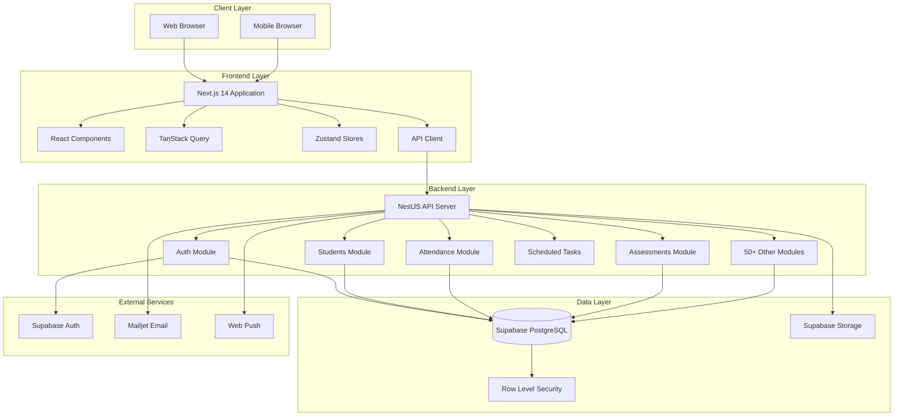
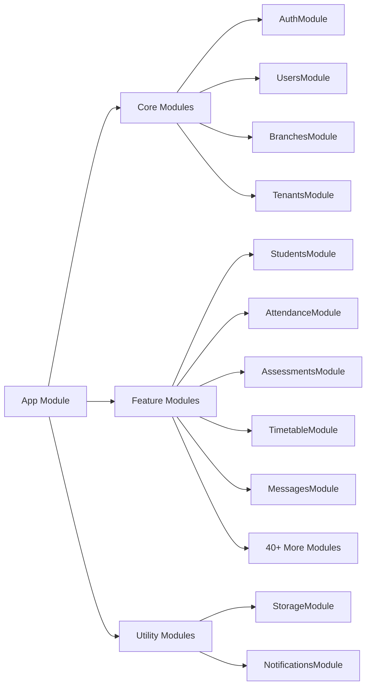
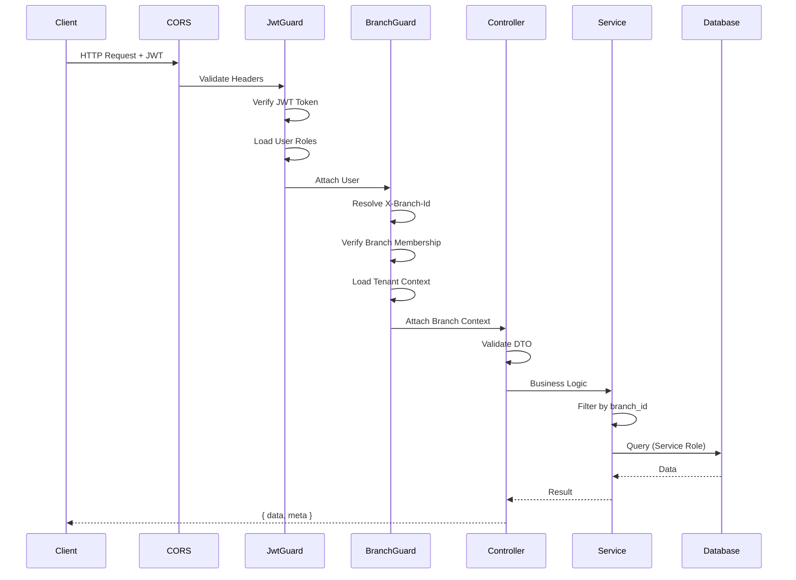
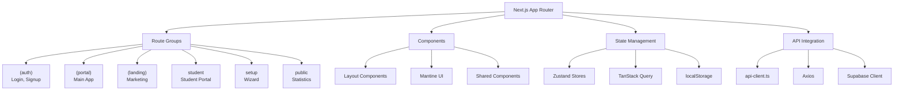
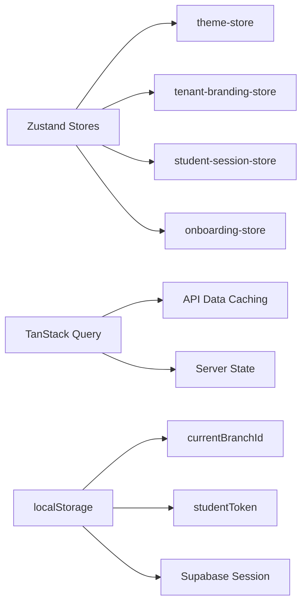
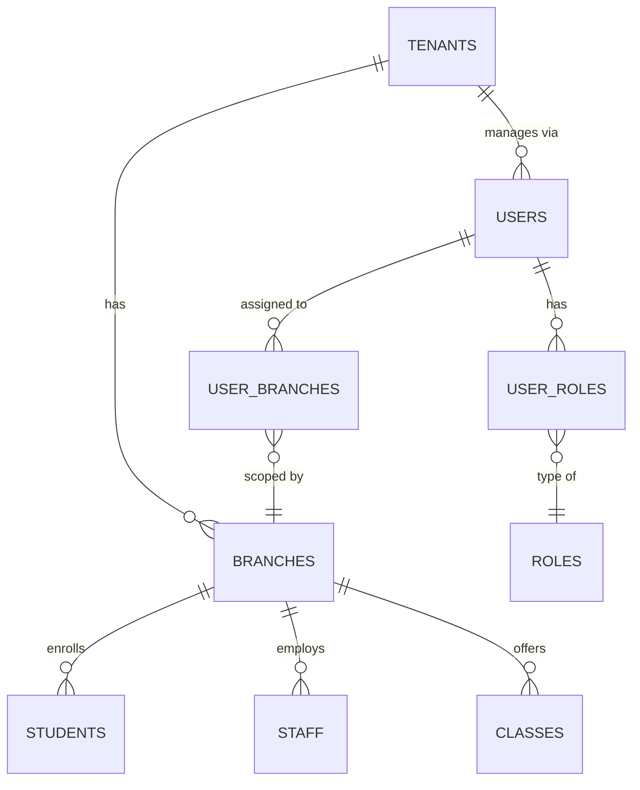
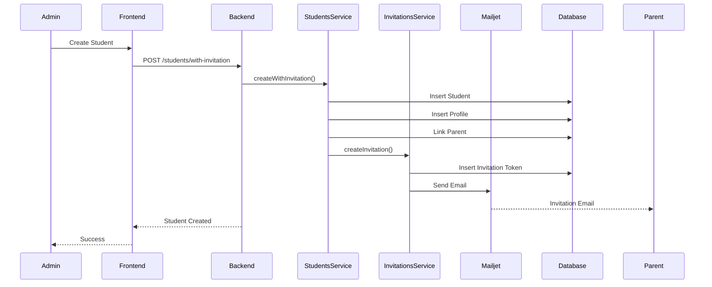
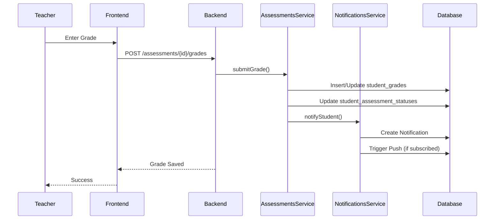
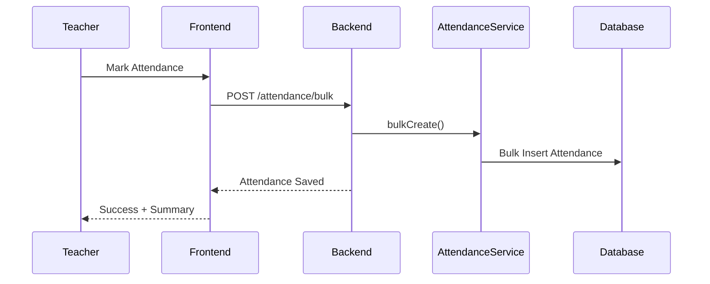
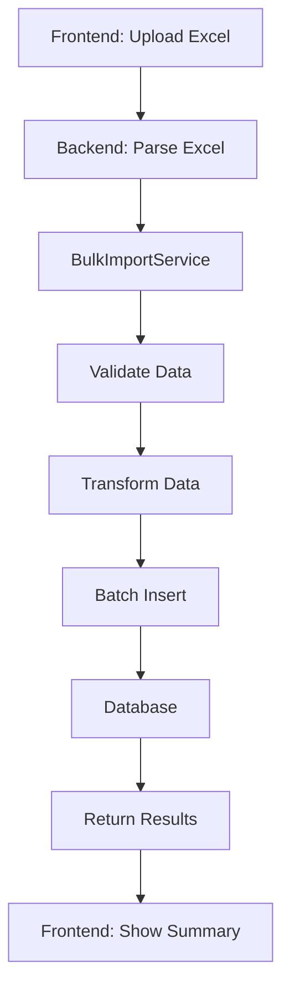

# 🏗️ Architecture

This document provides a comprehensive overview of the NTG Alma School Management System architecture.

## 📐 System Architecture



## 🎯 Design Principles




#### Multi-Tenancy

* **Tenant Isolation**: Each school operates as a separate tenant
* **Branch Scoping**: Each campus/site within a school is a branch
* **Data Segregation**: Row-level security ensures data isolation
* **Scalability**: Support for multiple schools and branches
  



#### Modular Architecture

* **Feature Modules**: Each feature is a self-contained NestJS module (49 modules)
* **Separation of Concerns**: Clear boundaries between layers
* **Reusability**: Shared services and utilities
* **Maintainability**: Independent module development and testing
  



#### Security First

* **Authentication**: Supabase Auth + JWT-based authentication
* **Authorization**: Role-based access control (9 user roles)
* **Data Protection**: Row-level security in database
* **API Security**: Branch guards and permission checks
  



#### Branch Isolation

* **Request Context**: Every request carries branch context via `X-Branch-Id` header
* **Service Role Bypass**: Backend uses service role key (bypasses RLS)
* **Manual Filtering**: Services must filter by `branch_id` explicitly
* **Guard Enforcement**: `BranchGuard` validates branch membership
  



#### Scheduled Tasks

* **Cron Jobs**: Background tasks for scheduled operations
* **Invitation Cleanup**: Expired invitation token removal (every 10 minutes)
* **Tenant Deletion**: Scheduled tenant deletion queue (every 30 seconds)
  
  

## 🏛️ Backend Architecture

### Module Structure



### Module Catalog (49 Modules)

Listed by functional area:

#### Core System (6 modules)

| Module                 | Purpose                                            | Key Tables                                         |
| ---------------------- | -------------------------------------------------- | -------------------------------------------------- |
| **AuthModule**         | Authentication, login, password flows              | `auth.users`, `profiles`                           |
| **TenantsModule**      | School organization management, deletion scheduler | `tenants`                                          |
| **BranchesModule**     | Campus/site management, storage quotas             | `branches`                                         |
| **UsersModule**        | User administration, branch/role assignments       | `profiles`, `user_branches`, `user_roles`, `staff` |
| **RolesModule**        | RBAC matrix, permissions                           | `roles`, `features`, `role_permissions`            |
| **RegistrationModule** | Sign-up, tenant onboarding                         | `tenants`, `branches`, `profiles`                  |

#### Academic Structure (8 modules)

| Module                       | Purpose                                  | Key Tables                                       |
| ---------------------------- | ---------------------------------------- | ------------------------------------------------ |
| **AcademicYearsModule**      | Academic year management, activate/lock  | `academic_years`                                 |
| **CoreLookupsModule**        | Levels, classes, sections, subjects      | `levels`, `classes`, `sections`, `subjects`      |
| **ClassSectionsModule**      | Class sections per academic year         | `class_sections`                                 |
| **SubjectTemplatesModule**   | Subject bundles and assignments          | `subject_templates`, `subject_template_subjects` |
| **ScheduleModule**           | Timing templates, school days, vacations | `timing_templates`, `school_days`, `vacations`   |
| **TimetableModule**          | Weekly timetable, period scheduling      | `timetable_slots`                                |
| **TeacherAssignmentsModule** | Teaching load assignments                | `teacher_assignments`                            |
| **GradesModule**             | Grade templates and letter ranges        | `grade_templates`, `grade_ranges`                |

#### Student Management (4 modules)

| Module                | Purpose                               | Key Tables                                          |
| --------------------- | ------------------------------------- | --------------------------------------------------- |
| **StudentsModule**    | Student CRUD, enrollment, invitations | `students`, `student_enrolments`, `parent_students` |
| **ParentsModule**     | Guardian features, student linkage    | `parent_students`                                   |
| **StaffModule**       | Employee records                      | `staff`                                             |
| **StudentSelfModule** | Student portal APIs (student JWT)     | `students`, `student_grades`                        |

#### Assessment & Grading (3 modules)

| Module                | Purpose                           | Key Tables                                                |
| --------------------- | --------------------------------- | --------------------------------------------------------- |
| **AssessmentModule**  | Assessment type settings          | `assessment_types`                                        |
| **AssessmentsModule** | Assessments, submissions, grading | `assessments`, `student_grades`, `assessment_attachments` |
| **ResultsModule**     | Result card generation, PDFs      | `result_cards`                                            |

#### Attendance & Leave (3 modules)

| Module                   | Purpose                           | Key Tables                         |
| ------------------------ | --------------------------------- | ---------------------------------- |
| **AttendanceModule**     | Daily attendance tracking         | `attendance`                       |
| **LeaveRequestsModule**  | Student leave requests, approvals | `leave_requests`, `leave_settings` |
| **EarlyDepartureModule** | Early pickup requests             | `early_departure_requests`         |

#### Communication (2 modules)

| Module                  | Purpose                       | Key Tables                                   |
| ----------------------- | ----------------------------- | -------------------------------------------- |
| **MessagesModule**      | Internal messaging system     | `conversations`, `messages`, `message_reads` |
| **NotificationsModule** | In-app and push notifications | `notifications`, `push_subscriptions`        |

#### Events & Behavior (3 modules)

| Module                         | Purpose                                         | Key Tables                                                                 |
| ------------------------------ | ----------------------------------------------- | -------------------------------------------------------------------------- |
| **EventsModule**               | School events, participation, consents          | `events`, `event_participants`, `event_consents`                           |
| **BehavioralModule**           | Star-based behavioural assessments              | `behavioral_assessments`, `behavioral_scores`                              |
| **BehavioralFrameworkModule**  | Framework-based ratings (e.g. Ontario Learning Skills) | `behavioral_framework_presets`, `behavioral_framework_categories`, `branch_behavioral_config`, `student_framework_ratings`, `student_framework_category_scores` |

#### Library & Resources (1 module)

| Module            | Purpose                | Key Tables      |
| ----------------- | ---------------------- | --------------- |
| **LibraryModule** | Digital library assets | `library_items` |

#### Uniforms (3 modules)

| Module                     | Purpose                       | Key Tables                                  |
| -------------------------- | ----------------------------- | ------------------------------------------- |
| **UniformsModule**         | Uniform catalog and stock     | `uniform_items`, `uniform_stock`            |
| **UniformRequestsModule**  | Uniform requests              | `uniform_requests`, `uniform_request_items` |
| **UniformIssuancesModule** | Uniform distribution tracking | `uniform_issuances`                         |

#### Reporting & Analytics (3 modules)

| Module              | Purpose                        | Key Tables                 |
| ------------------- | ------------------------------ | -------------------------- |
| **ReportsModule**   | PDF/Excel report generation    | Multiple (aggregates data) |
| **DashboardModule** | Dashboard widgets, preferences | `dashboard_preferences`    |

#### Utilities & Support (13 modules)

| Module                         | Purpose                                | Key Tables                    |
| ------------------------------ | -------------------------------------- | ----------------------------- |
| **StorageModule**              | Supabase storage orchestration         | Storage buckets               |
| **InvitationsModule**          | Invitation tokens, email, cleanup cron | `invitations`                 |
| **PushModule**                 | Web push subscriptions                 | `push_subscriptions`          |
| **BulkImportModule**           | Excel bulk imports                     | Many                          |
| **SettingsImportModule**       | Settings import                        | Settings tables               |
| **SystemSettingsModule**       | System-wide key-value config           | `system_settings`             |
| **SettingsStatusModule**       | Settings readiness checks              | Multiple                      |
| **PromotionPlacementModule**   | Year-end promotion UI                  | `student_promotion_decisions` |
| **SetupWizardModule**          | First-run wizard                       | Multiple                      |
| Plus 3 more utility modules... |                                        |                               |

### Request Flow



### Guard Flow Details

**1. CORS Middleware (`main.ts`)**

* Allows `FRONTEND_URL`, localhost, Cloudflare tunnel, ngrok
* Headers: `Authorization`, `X-Branch-Id`, etc.

**2. JwtAuthGuard**

* Reads `Authorization: Bearer <token>`
* Calls `supabase.auth.getUser(token)`
* Loads **all** user roles across branches
* Attaches `request.user = { id, email, roles }`

**3. BranchGuard**

* Resolves branch from `X-Branch-Id` header or `profiles.current_branch_id`
* Verifies user membership in `user_branches`
* Loads `tenant_id` from branch
* Blocks inactive branch/tenant for all users
* Attaches `request.branch = { branchId, tenantId }`

**4. Permission Checks (Controller Level)**

* Many controllers implement private `ensureFeatureEditAccess()` method
* Checks `features` + `role_permissions` for `edit` permission
* `school_admin` role bypasses checks

## 🎨 Frontend Architecture

### Application Structure



### Route Structure

```
app/
├── (auth)/              # Authentication routes
│   ├── login/
│   ├── signup/
│   ├── reset-password/
│   ├── auth/callback/
│   └── select-child/    # Parent child selection
│
├── (portal)/            # Main school application
│   ├── dashboard/
│   ├── students/
│   ├── parents/
│   ├── staff/
│   ├── attendance/
│   ├── assessments/
│   ├── timetable/
│   ├── messages/
│   ├── events/
│   ├── library/
│   ├── uniforms/
│   ├── settings/
│   └── ...
│
├── (landing)/           # Marketing pages
│   ├── home/
│   ├── features/
│   ├── pricing/
│   ├── contact/
│   └── about/
│
├── student/             # Student portal
│   ├── dashboard/
│   ├── assessments/
│   ├── attendance/
│   └── results/
│
├── setup/               # Setup wizard
└── public/
    └── statistics/
        └── [branchCode]/  # Public stats
```

### State Management



**Zustand Stores:**

* `theme-store` - UI theme preferences
* `tenant-branding-store` - School branding (logo, colors)
* `student-session-store` - Student portal session
* `onboarding-store` - Setup wizard state

**TanStack Query:**

* All API data fetching
* Automatic caching and revalidation
* Optimistic updates
* Pagination support

**localStorage:**

* `currentBranchId` - Selected branch
* `studentToken` - Student JWT (short-lived)
* Supabase session - Auth tokens

### API Integration

**API Client (`lib/api-client.ts`):**

```typescript
// Base URL resolution
const baseURL = getEffectiveApiBaseURL(); // Handles localhost, Cloudflare tunnels

// Axios instance
const apiClient = axios.create({ baseURL });

// Request interceptor
apiClient.interceptors.request.use((config) => {
  // Attach Supabase access token
  const token = getSupabaseAccessToken();
  config.headers.Authorization = `Bearer ${token}`;
  
  // Attach branch context
  const branchId = localStorage.getItem('currentBranchId');
  config.headers['X-Branch-Id'] = branchId;
  
  return config;
});
```

**Response Format:**

All APIs return:

```typescript
{
  data: T,           // The actual data
  meta?: {           // Optional metadata
    total?: number,  // Total count for pagination
    page?: number,
    limit?: number
  }
}
```

## 🗄️ Database Architecture

### Multi-Tenancy Pattern



### Data Scoping Layers

**1. Tenant Level:**

* `tenants` table
* Organization-wide settings
* Logo, branding, domain

**2. Branch Level:**

* `branches` table
* Campus/site within tenant
* Most operational data scoped here

**3. Academic Year Level:**

* `academic_years` table
* Time-based data scoping
* Assessments, attendance, enrollments

**4. User Level:**

* `profiles`, `users` tables
* User-specific data
* Permissions via roles

### Row-Level Security

```sql
-- Typical branch isolation policy
CREATE POLICY branch_isolation ON table_name
  FOR ALL
  USING (
    branch_id IN (
      SELECT branch_id 
      FROM user_branches 
      WHERE user_id = auth.uid()
    )
  );
```

**RLS Enforcement:**

* Enabled on most tables
* Backend uses **service role key** (bypasses RLS)
* Services must **manually filter** by `branch_id`
* Frontend uses **anon key** (RLS applies)

## 🔄 Data Flow

### Student Creation Flow



### Assessment Grading Flow



### Attendance Marking Flow



## 📡 API Architecture

### RESTful Design

* **Resources**: Nouns (students, attendance, assessments)
* **HTTP Methods**: GET, POST, PUT, DELETE, PATCH
* **Status Codes**: Standard HTTP (200, 201, 400, 401, 403, 404, 500)
* **Pagination**: Query params (`page`, `limit`)
* **Filtering**: Query params specific to resource
* **Versioning**: `/api/v1/` prefix

### API Endpoint Structure

```
/api/v1/
├── auth/                    # Authentication
│   ├── POST /login
│   ├── POST /signup
│   ├── POST /refresh
│   └── POST /reset-password
│
├── students/                # Students
│   ├── GET /
│   ├── POST /with-invitation
│   ├── GET /:id
│   ├── PUT /:id
│   └── DELETE /:id
│
├── attendance/              # Attendance
│   ├── GET /
│   ├── POST /bulk
│   ├── GET /student/:studentId
│   └── GET /class-section/:classSectionId
│
├── assessments/             # Assessments
│   ├── GET /
│   ├── POST /
│   ├── GET /:id
│   ├── POST /:id/grades
│   └── GET /:id/submissions
│
├── messages/                # Messaging
│   ├── GET /conversations
│   ├── POST /conversations
│   ├── GET /conversations/:id/messages
│   └── POST /conversations/:id/messages
│
└── ... (40+ more resource endpoints)
```

### Bulk Import System



**Supported Entities:**

* Students
* Parents
* Staff
* Classes & Sections
* Subjects
* Assessment Types
* And more...

## 🌐 Multi-Language Architecture

**Implementation:**

* Frontend: `next-intl` with JSON message files
* Backend: Not implemented (English API responses)
* Database: `*_translations` columns (JSONB) in some tables

**Message Files:**

```
frontend/messages/
├── en.json      # English
├── ar.json      # Arabic
└── ku.json      # Kurdish
```

## 📊 Performance Considerations

### Caching Strategy

* **API Responses**: TanStack Query client-side caching
* **Database Queries**: Indexed columns (276 indexes)
* **Static Assets**: Next.js automatic optimization
* **Images**: Next Image component optimization

### Optimization Techniques

1. **Database Indexes**: 276 B-tree indexes on frequently queried columns
2. **Pagination**: All list endpoints support pagination
3. **Lazy Loading**: React components code-split automatically
4. **Query Optimization**: Avoid N+1 queries, use joins
5. **Bulk Operations**: Batch inserts/updates where possible

### Known Performance Migrations

* `20260223100000_performance_indexes_reports_attendance_notifications.sql`
* `20260407120000_messages_list_performance.sql`

## 📈 Scalability

### Horizontal Scaling

* **Stateless Backend**: NestJS instances can scale horizontally
* **Database**: Supabase handles scaling (managed PostgreSQL)
* **Storage**: Supabase Storage (S3-compatible)
* **Load Balancing**: Can add load balancer for multiple backend instances

### Vertical Scaling

* **Database**: Scale Supabase resources (compute, storage)
* **Backend**: Increase container resources
* **Storage**: Expand storage capacity

## 🛠️ Development Tools

* **TypeScript**: Full type safety across frontend and backend
* **ESLint**: Code quality (if configured)
* **Prettier**: Code formatting (if configured)
* **Docker**: Containerization
* **Git**: Version control with GitHub Actions

### i18n Translation Workflow (Excel ⇄ JSON)

**Purpose:** Allow non-technical translators to work with Excel instead of JSON files.

**Location:** `frontend/messages/` directory contains JSON translation files

**Available Commands:**

```bash
# Export JSON to Excel (for translators)
cd frontend
npm run i18n:export
# Generates: frontend/messages.xlsx

# Import Excel back to JSON (after translation)
cd frontend
npm run i18n:import
# Updates: frontend/messages/*.json files
```

**Excel Structure:**

| Column  | Purpose                       |
| ------- | ----------------------------- |
| `key`   | Translation key (DO NOT EDIT) |
| `en`    | English translation           |
| `en-GB` | British English               |
| `en-US` | American English              |
| `ar`    | Arabic translation            |




#### Export current translations to Excel

```bash
cd frontend
npm run i18n:export
```

This creates `frontend/messages.xlsx`




#### Send Excel to translator

* Share `messages.xlsx` with translation team
* Instruct them: **DO NOT edit the `key` column**
* They can edit any language columns (`en`, `ar`, etc.)
  



#### Receive edited Excel back

* Save the edited file as `frontend/messages.xlsx` (replace existing)
* Keep sheet name as `translations` (or importer uses first sheet)
  



#### Import Excel back to JSON

```bash
cd frontend
npm run i18n:import
```

This updates all JSON files in `frontend/messages/`




#### Validate the import

```bash
npm run build
```

If build passes, the translation structure is valid



**Important Behaviors:**

* **Empty cells preserve existing values** - Translators can edit only some rows without wiping others
* **Duplicate key detection** - Import fails if duplicate keys found (shows row numbers)
* **Key validation** - Import fails if `key` column is modified (shows bad keys and rows)
* **No partial writes** - If validation fails, NO JSON files are modified

**Error Handling:**

```bash
# If import fails with key errors:
# Error: Duplicate keys found: "common.save" at rows 15, 42
# Error: Invalid keys (modified): "comon.save" at row 15

# Solution: Fix the Excel file and re-import
```

**Example Workflow:**

```bash
# Before sending to translator
cd frontend
npm run i18n:export
# Email messages.xlsx to translator

# After receiving back
cd frontend
npm run i18n:import
npm run build  # Validate
git add messages/
git commit -m "Update translations from client"
```

## 📝 Best Practices

1. **Error Handling**: Consistent error responses with proper HTTP codes
2. **Logging**: Structured logging (currently minimal - could be improved)
3. **Validation**: DTO validation at all entry points
4. **Documentation**: Keep this doc updated with architecture changes
5. **Testing**: No tests currently - should be added
6. **Code Review**: Peer review process recommended
7. **Version Control**: Git workflow with feature branches

## ⚠️ Architecture Limitations

### Current Known Issues

1. **No Automated Tests**: Zero test coverage (Jest configured but no `*.spec.ts` files)
2. **Manual Branch Filtering**: Services must remember to filter by `branch_id`
3. **RLS Bypass**: Backend bypasses RLS entirely (relies on application logic)
4. **Limited Logging**: No structured logging framework
5. **No API Rate Limiting**: Could be added at API gateway level
6. **No Caching Layer**: Could add Redis for performance

### Future Improvements

1. Add comprehensive test suite
2. Implement structured logging (Winston, Pino)
3. Add API rate limiting
4. Implement Redis caching layer
5. Add monitoring and alerting (Sentry, DataDog)
6. Improve error handling and logging
7. Add API versioning strategy
8. Implement GraphQL for complex queries (optional)


---
