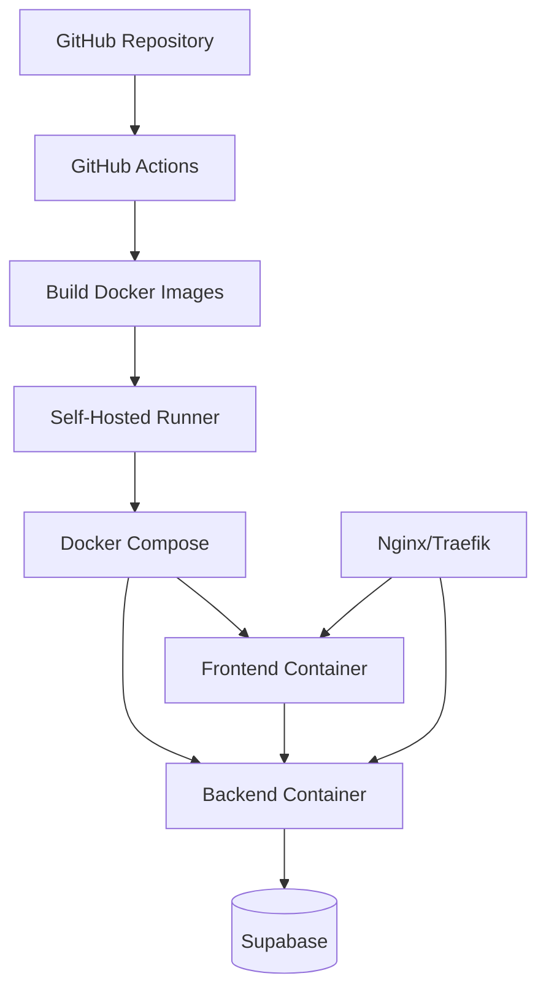

# 🚢 CI/CD Deployment

This document provides comprehensive deployment instructions for the NTG Alma School Management System using Docker and GitHub Actions.

## 📋 Deployment Overview

NTG Alma supports multiple deployment strategies:

1. **Self-Hosted Docker** - Using Docker Compose on your own server
2. **DigitalOcean App Platform** - Managed platform deployment
3. **GitHub Actions CI/CD** - Automated deployment pipeline

***

## 🐳 Docker Deployment

### Architecture



### Prerequisites

* Docker 20.10+ and Docker Compose 2.0+
* Self-hosted GitHub Actions runner (for `.github/workflows/deploy.yml`)
* Server with at least 2GB RAM, 2 CPU cores
* Domain name with DNS configured

### Docker Images

**Backend Dockerfile** (`backend/Dockerfile`):

```dockerfile
FROM node:20-alpine AS builder
WORKDIR /app
COPY package*.json ./
RUN npm ci
COPY . .
RUN npm run build

FROM node:20-alpine
WORKDIR /app
COPY --from=builder /app/dist ./dist
COPY --from=builder /app/node_modules ./node_modules
COPY package*.json ./
EXPOSE 3001
CMD ["node", "dist/main.js"]
```

**Frontend Dockerfile** (`frontend/Dockerfile`):

```dockerfile
FROM node:20-alpine AS builder
WORKDIR /app
COPY package*.json ./
RUN npm ci
COPY . .
ARG NEXT_PUBLIC_SUPABASE_URL
ARG NEXT_PUBLIC_SUPABASE_ANON_KEY
ARG NEXT_PUBLIC_API_URL
ENV NEXT_PUBLIC_SUPABASE_URL=$NEXT_PUBLIC_SUPABASE_URL
ENV NEXT_PUBLIC_SUPABASE_ANON_KEY=$NEXT_PUBLIC_SUPABASE_ANON_KEY
ENV NEXT_PUBLIC_API_URL=$NEXT_PUBLIC_API_URL
RUN npm run build

FROM node:20-alpine
WORKDIR /app
COPY --from=builder /app/.next ./.next
COPY --from=builder /app/node_modules ./node_modules
COPY --from=builder /app/package*.json ./
COPY --from=builder /app/public ./public
EXPOSE 3000
CMD ["npm", "start"]
```

### Docker Compose Configuration

**Main Production** (`docker-compose.yml`):

```yaml
version: '3.8'

services:
  backend:
    build:
      context: ./backend
      dockerfile: Dockerfile
    container_name: ntg-alma-backend
    restart: unless-stopped
    ports:
      - "${BACKEND_PORT}:3001"
    env_file:
      - .env.prod
    environment:
      - NODE_ENV=production
      - PORT=3001
    healthcheck:
      test: ["CMD", "wget", "--quiet", "--tries=1", "--spider", "http://localhost:3001/health"]
      interval: 30s
      timeout: 10s
      retries: 3
      start_period: 40s
    networks:
      - ntg-alma-network

  frontend:
    build:
      context: ./frontend
      dockerfile: Dockerfile
      args:
        - NEXT_PUBLIC_SUPABASE_URL=${NEXT_PUBLIC_SUPABASE_URL}
        - NEXT_PUBLIC_SUPABASE_ANON_KEY=${NEXT_PUBLIC_SUPABASE_ANON_KEY}
        - NEXT_PUBLIC_API_URL=${NEXT_PUBLIC_API_URL}
    container_name: ntg-alma-frontend
    restart: unless-stopped
    ports:
      - "${FRONTEND_PORT}:3000"
    environment:
      - NODE_ENV=production
    depends_on:
      - backend
    networks:
      - ntg-alma-network

networks:
  ntg-alma-network:
    driver: bridge
```

**Staging Environment** (`docker-compose-staging.yml`):

```yaml
version: '3.8'

services:
  backend:
    build:
      context: ./backend
      dockerfile: Dockerfile
    container_name: ntg-alma-backend-staging
    restart: unless-stopped
    ports:
      - "${STAGING_BACKEND_PORT}:3001"
    env_file:
      - .env.staging
    environment:
      - NODE_ENV=staging
    networks:
      - ntg-alma-staging-network

  frontend:
    build:
      context: ./frontend
      dockerfile: Dockerfile
      args:
        - NEXT_PUBLIC_SUPABASE_URL=${NEXT_PUBLIC_SUPABASE_URL}
        - NEXT_PUBLIC_SUPABASE_ANON_KEY=${NEXT_PUBLIC_SUPABASE_ANON_KEY}
        - NEXT_PUBLIC_API_URL=${NEXT_PUBLIC_API_URL}
    container_name: ntg-alma-frontend-staging
    restart: unless-stopped
    ports:
      - "${STAGING_FRONTEND_PORT}:3000"
    depends_on:
      - backend
    networks:
      - ntg-alma-staging-network

networks:
  ntg-alma-staging-network:
    driver: bridge
```

### Environment Configuration

**Production** (`.env.prod`):

```env
# Backend
SUPABASE_URL=https://your-project.supabase.co
SUPABASE_SERVICE_KEY=your_service_role_key
SUPABASE_JWT_SECRET=your_jwt_secret
BACKEND_PORT=3001
FRONTEND_URL=https://alma.ntgapps.com

# Mailjet
MAILJET_API_KEY=your_mailjet_key
MAILJET_SECRET_KEY=your_mailjet_secret
MAILJET_FROM_EMAIL=noreply@yourdomain.com
MAILJET_FROM_NAME=NTG Alma

# Optional
VAPID_PUBLIC_KEY=your_vapid_public
VAPID_PRIVATE_KEY=your_vapid_private
NTG_ALMA_LOGO_URL=https://your-cdn.com/logo.png
INVITATION_NTG_LOGO_URL=https://your-app.example.com/NTGTempLogo.svg

# CRITICAL: Production logo URLs must be publicly accessible HTTPS URLs
# localhost will NOT work for email recipients
# If INVITATION_NTG_LOGO_URL is unset, it defaults to {FRONTEND_URL}/NTGTempLogo.svg
# Ensure all URLs are reachable by email clients (Mailjet recipients)

# Rate Limiting
INVITATIONS_RATE_LIMIT_PER_MINUTE=20

# Frontend
NEXT_PUBLIC_SUPABASE_URL=https://your-project.supabase.co
NEXT_PUBLIC_SUPABASE_ANON_KEY=your_anon_key
NEXT_PUBLIC_API_URL=https://api.alma.ntgapps.com
FRONTEND_PORT=3000
```

**Staging** (`.env.staging`):

```env
# Similar to .env.prod but with staging values
STAGING_BACKEND_PORT=3002
STAGING_FRONTEND_PORT=3001
# ... other staging-specific values
```

### Deployment Commands

**Build and start:**

```bash
# Production
docker-compose -f docker-compose.yml up -d --build

# Staging
docker-compose -f docker-compose-staging.yml up -d --build
```

**Stop services:**

```bash
# Production
docker-compose -f docker-compose.yml down

# Staging
docker-compose -f docker-compose-staging.yml down
```

**View logs:**

```bash
# All services
docker-compose logs -f

# Specific service
docker-compose logs -f backend
docker-compose logs -f frontend
```

**Restart services:**

```bash
docker-compose restart backend
docker-compose restart frontend
```

***

## 🔄 GitHub Actions CI/CD

### Workflow Configuration

**File:** `.github/workflows/deploy.yml`

```yaml
name: Deploy

on:
  push:
    branches:
      - main     # Production deployment
      - dev      # Staging deployment

jobs:
  deploy:
    runs-on: self-hosted    # Requires self-hosted runner

    steps:
      - name: Checkout code
        uses: actions/checkout@v3

      - name: Determine environment
        id: env
        run: |
          if [[ "${{ github.ref }}" == "refs/heads/main" ]]; then
            echo "env=production" >> $GITHUB_OUTPUT
            echo "compose_file=docker-compose.yml" >> $GITHUB_OUTPUT
            echo "env_file=.env.prod" >> $GITHUB_OUTPUT
          else
            echo "env=staging" >> $GITHUB_OUTPUT
            echo "compose_file=docker-compose-staging.yml" >> $GITHUB_OUTPUT
            echo "env_file=.env.staging" >> $GITHUB_OUTPUT
          fi

      - name: Create environment file
        run: |
          cat > ${{ steps.env.outputs.env_file }} <<EOF
          SUPABASE_URL=${{ secrets.SUPABASE_URL }}
          SUPABASE_SERVICE_KEY=${{ secrets.SUPABASE_SERVICE_KEY }}
          SUPABASE_JWT_SECRET=${{ secrets.SUPABASE_JWT_SECRET }}
          MAILJET_API_KEY=${{ secrets.MAILJET_API_KEY }}
          MAILJET_SECRET_KEY=${{ secrets.MAILJET_SECRET_KEY }}
          MAILJET_FROM_EMAIL=${{ secrets.MAILJET_FROM_EMAIL }}
          MAILJET_FROM_NAME=${{ secrets.MAILJET_FROM_NAME }}
          NEXT_PUBLIC_SUPABASE_URL=${{ secrets.NEXT_PUBLIC_SUPABASE_URL }}
          NEXT_PUBLIC_SUPABASE_ANON_KEY=${{ secrets.NEXT_PUBLIC_SUPABASE_ANON_KEY }}
          NEXT_PUBLIC_API_URL=${{ secrets.NEXT_PUBLIC_API_URL }}
          FRONTEND_URL=${{ secrets.FRONTEND_URL }}
          EOF

      - name: Build and deploy
        run: |
          docker-compose -f ${{ steps.env.outputs.compose_file }} down
          docker-compose -f ${{ steps.env.outputs.compose_file }} up -d --build

      - name: Wait for services
        run: sleep 30

      - name: Health check
        run: |
          response=$(curl -s -o /dev/null -w "%{http_code}" http://localhost:${BACKEND_PORT}/health)
          if [ $response -eq 200 ]; then
            echo "Backend health check passed"
          else
            echo "Backend health check failed"
            exit 1
          fi

      - name: Clean up old images
        run: docker image prune -af
```

### Self-Hosted Runner Setup




### Install GitHub Actions Runner

```bash
# Create runner directory
mkdir actions-runner && cd actions-runner

# Download runner
curl -o actions-runner-linux-x64-2.311.0.tar.gz -L \
  https://github.com/actions/runner/releases/download/v2.311.0/actions-runner-linux-x64-2.311.0.tar.gz

# Extract
tar xzf ./actions-runner-linux-x64-2.311.0.tar.gz

# Configure (use token from GitHub repo settings)
./config.sh --url https://github.com/your-org/ntg-sms-v1 --token YOUR_TOKEN

# Install as service
sudo ./svc.sh install
sudo ./svc.sh start
```





### Install Dependencies on Runner

```bash
# Docker
curl -fsSL https://get.docker.com -o get-docker.sh
sudo sh get-docker.sh
sudo usermod -aG docker $USER

# Docker Compose
sudo curl -L "https://github.com/docker/compose/releases/download/v2.23.0/docker-compose-$(uname -s)-$(uname -m)" \
  -o /usr/local/bin/docker-compose
sudo chmod +x /usr/local/bin/docker-compose
```




### GitHub Secrets Configuration

Add these secrets in GitHub repository settings:

**Production Secrets:**

* `SUPABASE_URL`
* `SUPABASE_SERVICE_KEY`
* `SUPABASE_JWT_SECRET`
* `MAILJET_API_KEY`
* `MAILJET_SECRET_KEY`
* `MAILJET_FROM_EMAIL`
* `MAILJET_FROM_NAME`
* `NEXT_PUBLIC_SUPABASE_URL`
* `NEXT_PUBLIC_SUPABASE_ANON_KEY`
* `NEXT_PUBLIC_API_URL`
* `FRONTEND_URL`

**Staging Secrets** (suffix with `_STAGING`):

* `SUPABASE_URL_STAGING`
* ... (same as above)

***

## ☁️ DigitalOcean App Platform

### Deployment Configuration

**Current Deployment:**

* URL: `https://ntg-alma-sj4u5.ondigitalocean.app`
* Custom domain: `alma.ntgapps.com`

### App Spec Configuration

**`app.yaml`** (for DigitalOcean):

```yaml
name: ntg-alma
region: nyc

services:
  - name: backend
    github:
      repo: your-org/ntg-sms-v1
      branch: main
      deploy_on_push: true
    source_dir: /backend
    build_command: npm ci && npm run build
    run_command: node dist/main.js
    environment_slug: node-js
    instance_count: 1
    instance_size_slug: basic-xs
    http_port: 3001
    routes:
      - path: /api
    health_check:
      http_path: /health
      initial_delay_seconds: 30
      period_seconds: 10
      timeout_seconds: 5
    envs:
      - key: NODE_ENV
        value: production
      - key: PORT
        value: "3001"
      - key: SUPABASE_URL
        value: ${SUPABASE_URL}
        type: SECRET
      - key: SUPABASE_SERVICE_KEY
        value: ${SUPABASE_SERVICE_KEY}
        type: SECRET
      # ... other env vars

  - name: frontend
    github:
      repo: your-org/ntg-sms-v1
      branch: main
      deploy_on_push: true
    source_dir: /frontend
    build_command: npm ci && npm run build
    run_command: npm start
    environment_slug: node-js
    instance_count: 1
    instance_size_slug: basic-xs
    http_port: 3000
    routes:
      - path: /
    envs:
      - key: NEXT_PUBLIC_SUPABASE_URL
        value: ${NEXT_PUBLIC_SUPABASE_URL}
      - key: NEXT_PUBLIC_SUPABASE_ANON_KEY
        value: ${NEXT_PUBLIC_SUPABASE_ANON_KEY}
      - key: NEXT_PUBLIC_API_URL
        value: https://ntg-alma-sj4u5.ondigitalocean.app/api
      # ... other env vars

domains:
  - domain: alma.ntgapps.com
    type: PRIMARY
```

### Custom Domain Setup




### Add CNAME Record

```
Type: CNAME
Name: alma (or @)
Value: ntg-alma-sj4u5.ondigitalocean.app
TTL: 7 days (or 3600 seconds)
Proxy: Disabled (if using Cloudflare)
```





### SSL Certificate

* DigitalOcean automatically provisions Let's Encrypt SSL
* Wait 5-10 minutes for certificate generation
* Verify at `https://alma.ntgapps.com`
  
  

### Deployment via CLI

```bash
# Install doctl
brew install doctl  # macOS
# or snap install doctl  # Linux

# Authenticate
doctl auth init

# Deploy from spec
doctl apps create --spec app.yaml

# Update existing app
doctl apps update YOUR_APP_ID --spec app.yaml

# View logs
doctl apps logs YOUR_APP_ID --type run
```

***

## 🔧 Production Configuration

### Nginx Reverse Proxy (Optional)

If using self-hosted Docker with Nginx:

**`/etc/nginx/sites-available/alma`:**

```nginx
# Backend API
server {
    listen 80;
    listen 443 ssl http2;
    server_name api.alma.ntgapps.com;

    ssl_certificate /etc/letsencrypt/live/alma.ntgapps.com/fullchain.pem;
    ssl_certificate_key /etc/letsencrypt/live/alma.ntgapps.com/privkey.pem;

    location / {
        proxy_pass http://localhost:3001;
        proxy_http_version 1.1;
        proxy_set_header Upgrade $http_upgrade;
        proxy_set_header Connection 'upgrade';
        proxy_set_header Host $host;
        proxy_set_header X-Real-IP $remote_addr;
        proxy_set_header X-Forwarded-For $proxy_add_x_forwarded_for;
        proxy_set_header X-Forwarded-Proto $scheme;
        proxy_cache_bypass $http_upgrade;
    }
}

# Frontend
server {
    listen 80;
    listen 443 ssl http2;
    server_name alma.ntgapps.com;

    ssl_certificate /etc/letsencrypt/live/alma.ntgapps.com/fullchain.pem;
    ssl_certificate_key /etc/letsencrypt/live/alma.ntgapps.com/privkey.pem;

    location / {
        proxy_pass http://localhost:3000;
        proxy_http_version 1.1;
        proxy_set_header Upgrade $http_upgrade;
        proxy_set_header Connection 'upgrade';
        proxy_set_header Host $host;
        proxy_cache_bypass $http_upgrade;
    }
}

# Redirect HTTP to HTTPS
server {
    listen 80;
    server_name alma.ntgapps.com api.alma.ntgapps.com;
    return 301 https://$server_name$request_uri;
}
```

**Enable and reload:**

```bash
sudo ln -s /etc/nginx/sites-available/alma /etc/nginx/sites-enabled/
sudo nginx -t
sudo systemctl reload nginx
```

### SSL Certificate (Let's Encrypt)

```bash
# Install certbot
sudo apt install certbot python3-certbot-nginx

# Obtain certificate
sudo certbot --nginx -d alma.ntgapps.com -d api.alma.ntgapps.com

# Auto-renewal (already configured by certbot)
sudo certbot renew --dry-run
```

### Supabase Auth URL Configuration

**CRITICAL:** When deploying to a new domain or changing URLs, you MUST update Supabase Auth settings.




### Go to Supabase Dashboard

[Supabase Dashboard → Auth → URL Configuration](https://supabase.com/dashboard/project/YOUR_PROJECT_ID/auth/url-configuration)




### Update the following fields

* **Site URL**: `https://alma.ntgapps.com` (your production domain)
* **Redirect URLs**: Add all valid redirect URLs:

```
https://alma.ntgapps.com/auth/callback
https://alma.ntgapps.com/*
http://localhost:3000/auth/callback  # For development
```





### Verify email templates

* Auth → Email Templates
* Ensure all links use `{{ .SiteURL }}` variable
* Password reset links should point to production domain
  
  

**Why This Matters:**

* Password reset emails will fail if Site URL is incorrect
* Email verification links won't work
* OAuth redirects will fail
* Invitation links may break

**Testing After Update:**

```bash
# Test password reset flow
curl -X POST https://your-project.supabase.co/auth/v1/recover \
  -H "Content-Type: application/json" \
  -d '{"email": "test@example.com"}'

# Check the email received - link should point to production domain
```

### Environment Variables Best Practices

**1. Never commit `.env` files**

Add to `.gitignore`:

```
.env
.env.local
.env.prod
.env.staging
```

**2. Use secret management**

For production:

* GitHub Secrets (for CI/CD)
* Environment variables on server
* HashiCorp Vault (advanced)
* AWS Secrets Manager (advanced)

**3. Rotate secrets regularly**

* JWT secrets: Every 90 days
* API keys: Every 180 days
* Database passwords: Every 90 days

***

## 🔍 Health Checks & Monitoring

### Health Check Endpoint

**Backend** (`/health`):

```typescript
@Get('health')
health() {
  return {
    status: 'ok',
    timestamp: new Date().toISOString(),
    uptime: process.uptime(),
    environment: process.env.NODE_ENV,
  };
}
```

**Test:**

```bash
curl http://localhost:3001/health
```

**Expected Response:**

```json
{
  "status": "ok",
  "timestamp": "2026-04-14T12:00:00.000Z",
  "uptime": 12345.67,
  "environment": "production"
}
```

### Monitoring Setup

**1. Docker Health Checks:**

```yaml
healthcheck:
  test: ["CMD", "wget", "--quiet", "--tries=1", "--spider", "http://localhost:3001/health"]
  interval: 30s
  timeout: 10s
  retries: 3
  start_period: 40s
```

**2. External Monitoring:**

Recommended services:

* **UptimeRobot** - Free tier for uptime monitoring
* **Pingdom** - Advanced monitoring
* **DataDog** - Full APM (paid)
* **New Relic** - Application monitoring (paid)

**3. Log Aggregation:**

```bash
# View Docker logs
docker-compose logs -f --tail=100

# Export to file
docker-compose logs --no-color > logs.txt

# Integration with log services
# - Papertrail
# - Loggly
# - ELK Stack
```

***

## 🚨 Troubleshooting

### Common Deployment Issues

**1. Container Won't Start**

```bash
# Check logs
docker-compose logs backend

# Common issues:
# - Missing environment variables
# - Port already in use
# - Database connection failed
```

**Solution:**

```bash
# Verify env file
cat .env.prod

# Check port availability
sudo lsof -i :3001

# Test database connection
docker-compose exec backend node -e "console.log(process.env.SUPABASE_URL)"
```

**2. Build Failures**

```bash
# Clear Docker cache
docker-compose build --no-cache

# Remove old images
docker system prune -a

# Check disk space
df -h
```

**3. Frontend Can't Reach Backend**

```bash
# Verify NEXT_PUBLIC_API_URL is correct
echo $NEXT_PUBLIC_API_URL

# Check backend is accessible
curl http://localhost:3001/health

# Check Docker network
docker network inspect ntg-alma-network
```

**4. SSL Certificate Issues**

```bash
# Renew certificate manually
sudo certbot renew

# Check certificate expiry
sudo certbot certificates

# Test SSL configuration
curl -vI https://alma.ntgapps.com
```

### GitHub Actions Troubleshooting

**Runner Offline:**

```bash
# Check runner status
cd actions-runner
./run.sh

# Restart service
sudo ./svc.sh stop
sudo ./svc.sh start
```

**Build Fails:**

```bash
# Check runner logs
journalctl -u actions.runner.*

# Verify Docker is running
sudo systemctl status docker

# Check disk space
df -h
```

***

## 📊 Deployment Checklist

### Pre-Deployment

* [ ] All tests passing (when tests exist)
* [ ] Code reviewed and approved
* [ ] Environment variables configured
* [ ] **Supabase Auth URLs updated** (if domain changed)
* [ ] Database migrations ready
* [ ] Backup created
* [ ] Security scan completed
* [ ] Load testing (if major changes)

### Deployment

* [ ] Notify team of deployment
* [ ] Deploy to staging first
* [ ] Verify staging deployment
* [ ] Run smoke tests on staging
* [ ] Deploy to production
* [ ] Verify production deployment
* [ ] Monitor logs for errors

### Post-Deployment

* [ ] Health checks passing
* [ ] All services responding
* [ ] Database connections stable
* [ ] External services (Mailjet, etc.) working
* [ ] User acceptance testing
* [ ] Monitor for 24 hours
* [ ] Update documentation if needed
* [ ] Notify team of completion

***

## 🔄 Rollback Procedure

If deployment fails:

**1. Immediate Rollback (Docker):**

```bash
# Stop current deployment
docker-compose down

# Revert to previous image
docker-compose up -d <previous-image-tag>
```

**2. GitHub Actions Rollback:**

```bash
# Trigger redeployment of last working commit
git revert HEAD
git push origin main
```

**3. DigitalOcean Rollback:**

```bash
# Via dashboard: Deployments → Redeploy previous version
# Or via CLI:
doctl apps create-deployment YOUR_APP_ID --force-rebuild
```

**4. Database Rollback (if needed):**

```sql
-- Manually revert migrations in Supabase SQL Editor
-- Or via Supabase CLI:
supabase db reset --linked
```

***

## 📈 Scaling Considerations

### Horizontal Scaling

**Docker Swarm:**

```yaml
version: '3.8'
services:
  backend:
    deploy:
      replicas: 3
      update_config:
        parallelism: 1
        delay: 10s
      restart_policy:
        condition: on-failure
```

**Kubernetes (Future):**

```yaml
apiVersion: apps/v1
kind: Deployment
metadata:
  name: ntg-alma-backend
spec:
  replicas: 3
  selector:
    matchLabels:
      app: backend
  template:
    metadata:
      labels:
        app: backend
    spec:
      containers:
      - name: backend
        image: ntg-alma-backend:latest
        ports:
        - containerPort: 3001
```

### Load Balancing

**Nginx Load Balancer:**

```nginx
upstream backend {
    least_conn;
    server backend1:3001;
    server backend2:3001;
    server backend3:3001;
}

server {
    location / {
        proxy_pass http://backend;
    }
}
```

***

## 🎓 Best Practices

1. **Never deploy on Fridays** (unless emergency)
2. **Always deploy to staging first**
3. **Monitor for 24 hours after deployment**
4. **Keep deployment windows short** (< 30 minutes)
5. **Have rollback plan ready**
6. **Document all changes**
7. **Automate everything possible**
8. **Test backups regularly**


---
