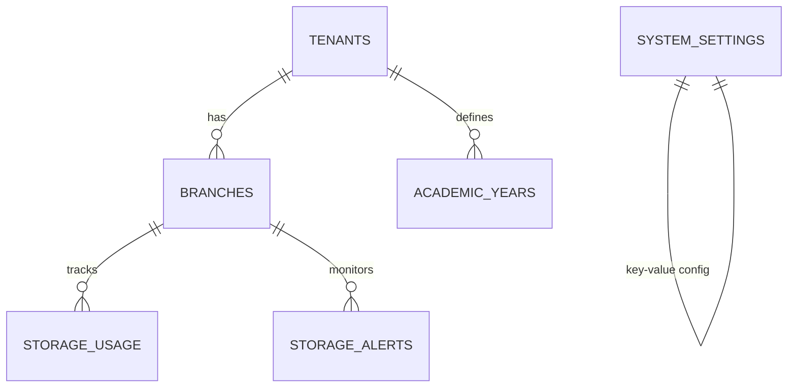
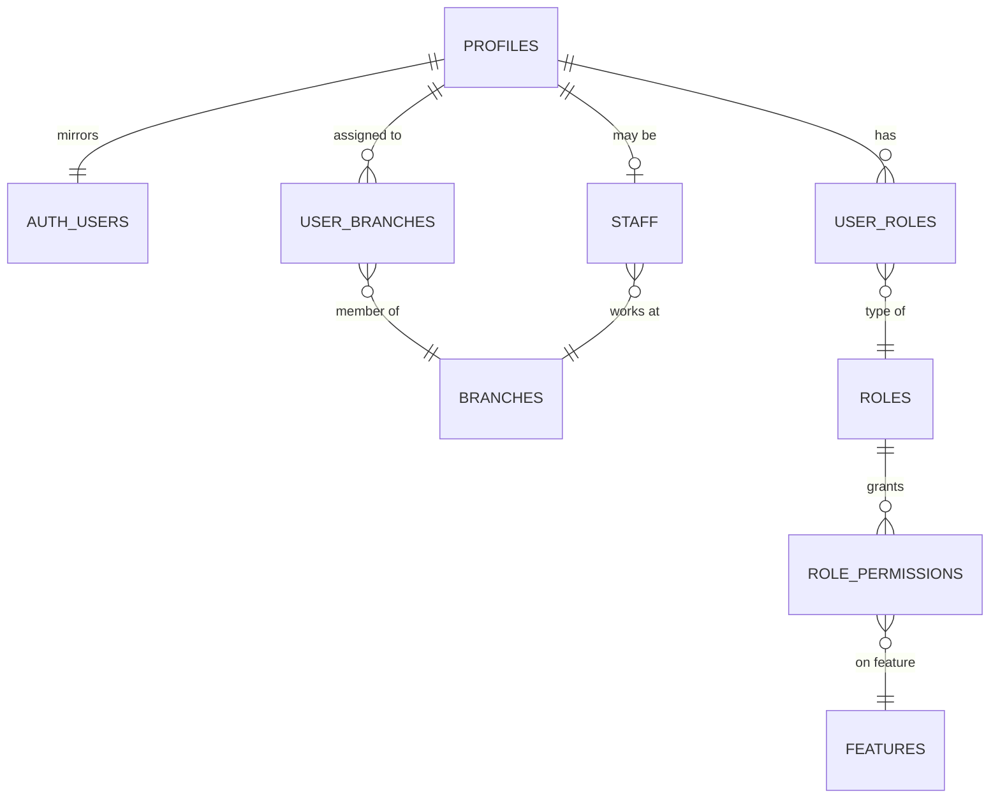
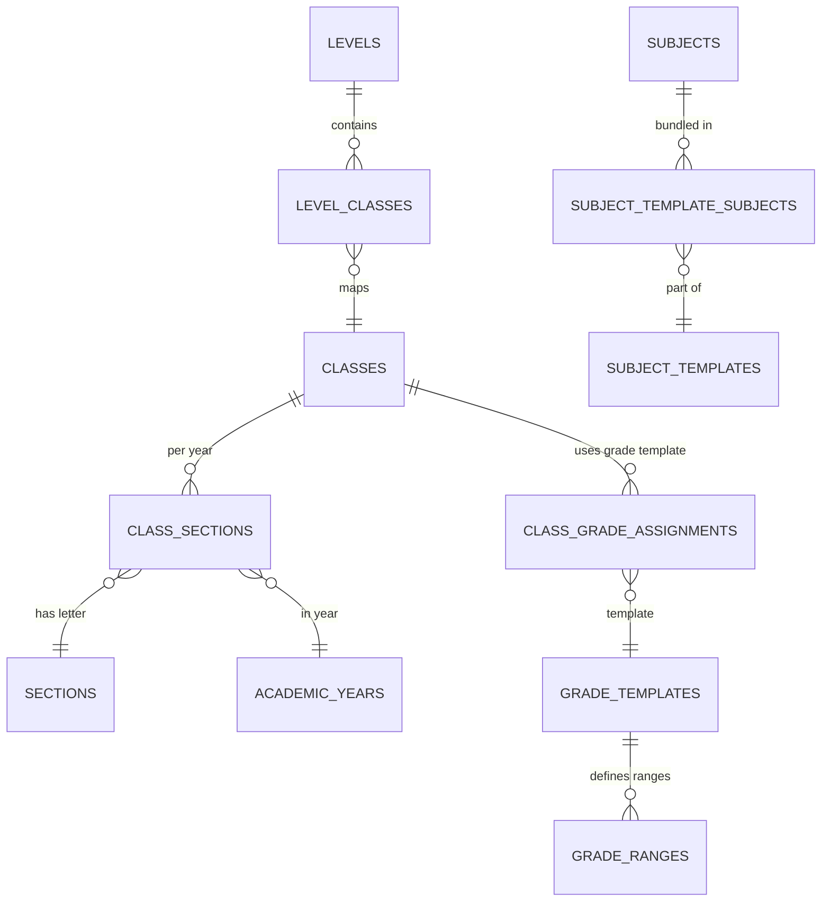
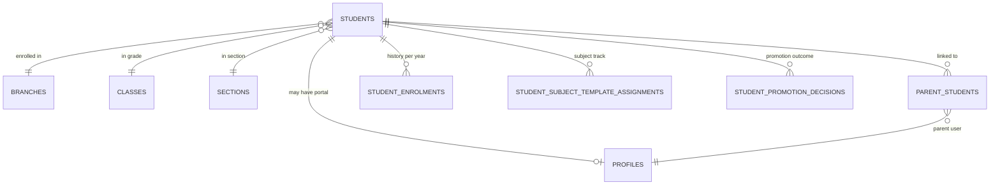
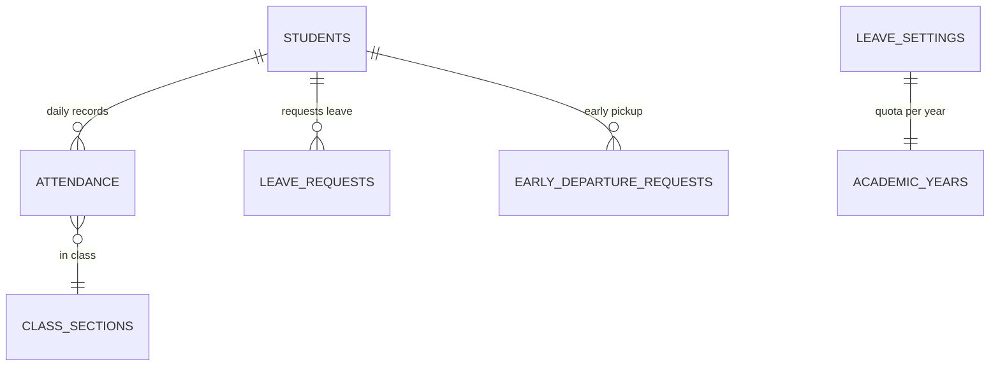
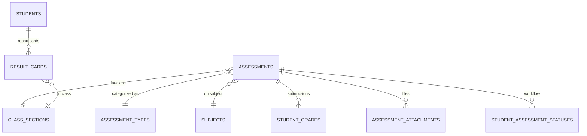
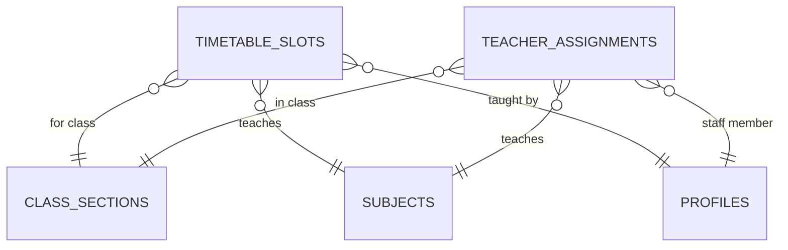
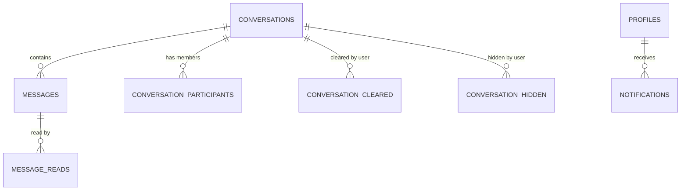
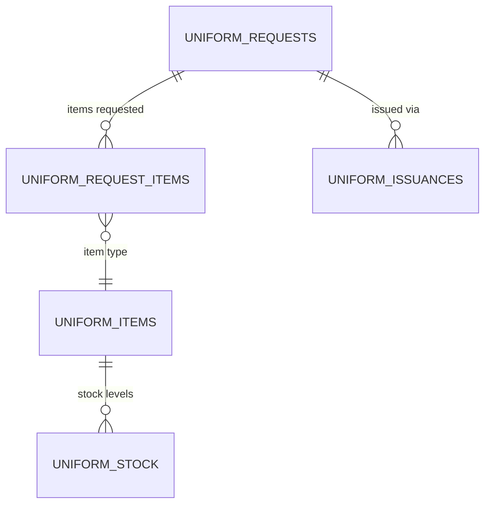

# 🗄️ Database Schema

Complete database schema documentation for the NTG Alma School Management System.

## 📊 Schema Overview

| Metric                  | Value                                      |
| ----------------------- | ------------------------------------------ |
| **Total Tables**        | 67                                         |
| **Indexes**             | 276 (mostly B-tree)                        |
| **PostgreSQL Enums**    | 7                                          |
| **Foreign Keys**        | 100+                                       |
| **RLS Enabled**         | Most tables                                |
| **Soft Delete Pattern** | Flag-based (`is_active`, not `deleted_at`) |

## 🗂️ Schema Organization

Tables are organized by functional domain:

1. **Core System** (5 tables) - Tenants, branches, system settings
2. **User Management** (10 tables) - Users, roles, permissions, staff
3. **Academic Structure** (15 tables) - Classes, subjects, templates, academic years
4. **Student Management** (6 tables) - Students, parents, enrollments
5. **Attendance & Leave** (4 tables) - Attendance, leave, early departure
6. **Assessment & Grading** (9 tables) - Assessments, grades, result cards
7. **Timetable & Schedule** (6 tables) - Timetable, timing templates
8. **Communication** (7 tables) - Messages, notifications
9. **Events** (3 tables) - School events, participation, consents
10. **Library** (1 table) - Digital library
11. **Uniforms** (5 tables) - Inventory, requests, issuances
12. **Utilities** (6 tables) - Invitations, audit logs, storage

***

## 📐 PostgreSQL Enums

| Enum Type                | Values                                                                                                                                                               |
| ------------------------ | -------------------------------------------------------------------------------------------------------------------------------------------------------------------- |
| `attendance_status`      | `present`, `absent`, `late`, `excused`                                                                                                                               |
| `consent_status`         | `pending`, `approved`, `rejected`                                                                                                                                    |
| `early_departure_status` | `pending`, `approved`, `rejected`, `cancelled`, `excused`                                                                                                            |
| `leave_status`           | `pending`, `approved`, `rejected`, `cancelled`                                                                                                                       |
| `timetable_slot_type`    | `class`, `assembly`, `break`, `free`                                                                                                                                 |
| `uniform_request_status` | `pending`, `approved`, `rejected`, `issued`, `cancelled`                                                                                                             |
| `user_role`              | `parent`, `student`, `principal`, `school_admin`, `academic_coordinator`, `class_teacher`, `subject_teacher`, `guidance_counselor`, `admin_assistant`, `super_admin` |

***

## 🏗️ Core System Tables

### Entity Relationship Diagram



### `tenants`

School organizations.

**Purpose:** Top-level entity representing a school or educational organization.

**Scope:** System-wide (no parent)

```sql
CREATE TABLE tenants (
    id UUID PRIMARY KEY DEFAULT gen_random_uuid(),
    name TEXT NOT NULL,
    code TEXT NOT NULL UNIQUE,
    domain TEXT,
    is_active BOOLEAN DEFAULT true,
    created_at TIMESTAMPTZ DEFAULT NOW(),
    updated_at TIMESTAMPTZ DEFAULT NOW(),
    logo_url TEXT,
    phone TEXT,
    email TEXT,
    timezone TEXT DEFAULT 'Asia/Baghdad',
    fiscal_year_start DATE,
    vat_number TEXT,
    created_by TEXT,
    updated_by TEXT,
    deletion_status TEXT DEFAULT 'none',
    deletion_requested_at TIMESTAMPTZ,
    deletion_execute_at TIMESTAMPTZ,
    deletion_cancelled_at TIMESTAMPTZ,
    deletion_requested_by UUID,
    pre_deletion_is_active BOOLEAN
);
```

**Key Fields:**

* `code` - Unique identifier for tenant
* `domain` - Custom domain (optional)
* `deletion_status` - Soft deletion workflow state
* `timezone` - School timezone (default Iraq)

**RLS:** Authenticated users can SELECT all tenants

***

### `branches`

Campuses/sites within a school.

**Purpose:** Physical locations or departments within a tenant.

**Scope:** Owned by tenant

```sql
CREATE TABLE branches (
    id UUID PRIMARY KEY DEFAULT gen_random_uuid(),
    tenant_id UUID NOT NULL REFERENCES tenants(id) ON DELETE CASCADE,
    name TEXT NOT NULL,
    name_ar TEXT,
    code TEXT NOT NULL,
    address TEXT,
    phone TEXT,
    email TEXT,
    storage_quota_gb INTEGER DEFAULT 100,
    storage_used_bytes BIGINT DEFAULT 0,
    is_active BOOLEAN DEFAULT true,
    created_at TIMESTAMPTZ DEFAULT NOW(),
    updated_at TIMESTAMPTZ DEFAULT NOW(),
    created_by TEXT,
    updated_by TEXT,
    public_stats_enabled BOOLEAN,
    public_stats_password TEXT,
    name_translations JSONB DEFAULT '{}'
);
```

**Key Fields:**

* `storage_quota_gb` - Storage limit for branch
* `storage_used_bytes` - Current storage usage
* `public_stats_enabled` - Allow public statistics page

**Indexes:**

* Primary key on `id`
* Unique on `(tenant_id, code)`

**RLS:** Authenticated users can SELECT all branches (branch selection enforced in app)

***

### `academic_years`

School years.

**Purpose:** Define academic year periods and active/locked states.

```sql
CREATE TABLE academic_years (
    id UUID PRIMARY KEY DEFAULT gen_random_uuid(),
    name TEXT NOT NULL,
    start_date DATE NOT NULL,
    end_date DATE NOT NULL,
    is_active BOOLEAN DEFAULT false,
    is_locked BOOLEAN DEFAULT false,
    created_at TIMESTAMPTZ DEFAULT NOW(),
    updated_at TIMESTAMPTZ DEFAULT NOW(),
    tenant_id UUID REFERENCES tenants(id),
    created_by TEXT,
    updated_by TEXT
);
```

**Key Fields:**

* `is_active` - Currently active year (typically only one)
* `is_locked` - Prevent modifications to historical data

**RLS:** Enabled but **no policies** (service role access only)

***

### `system_settings`

Global key-value configuration.

**Purpose:** System-wide settings (not branch-specific).

```sql
CREATE TABLE system_settings (
    key TEXT PRIMARY KEY,
    value JSONB,
    created_at TIMESTAMPTZ DEFAULT NOW(),
    updated_at TIMESTAMPTZ DEFAULT NOW(),
    created_by TEXT,
    updated_by TEXT
);
```

**RLS:** Enabled but **no policies**

***

### `storage_usage` / `storage_alerts`

Track branch storage usage and alert thresholds.

```sql
CREATE TABLE storage_usage (
    id UUID PRIMARY KEY DEFAULT gen_random_uuid(),
    branch_id UUID REFERENCES branches(id),
    -- usage tracking fields
);

CREATE TABLE storage_alerts (
    id UUID PRIMARY KEY DEFAULT gen_random_uuid(),
    branch_id UUID REFERENCES branches(id),
    -- alert configuration fields
);
```

**RLS:** Branch isolation

***

## 👥 User Management Tables

### Entity Relationship Diagram



### `profiles`

Application user profiles.

**Purpose:** Extends `auth.users` with app-specific data. One-to-one mapping.

```sql
CREATE TABLE profiles (
    id UUID PRIMARY KEY REFERENCES auth.users(id),
    full_name TEXT,
    avatar_url TEXT,
    created_at TIMESTAMPTZ DEFAULT NOW(),
    updated_at TIMESTAMPTZ DEFAULT NOW(),
    current_branch_id UUID REFERENCES branches(id),
    phone TEXT,
    address TEXT,
    date_of_birth DATE,
    gender TEXT,
    is_active BOOLEAN DEFAULT true,
    current_student_id UUID,
    created_by TEXT,
    updated_by TEXT,
    preferred_locale VARCHAR DEFAULT 'ar',
    email TEXT,
    onboarding_seen_tours_modal BOOLEAN,
    invitation_recipient_email TEXT,
    invitation_sent_at TIMESTAMPTZ
);
```

**Key Fields:**

* `id` - Same as `auth.users.id` (FK)
* `current_branch_id` - Last selected branch
* `current_student_id` - For parent switching between children
* `preferred_locale` - UI language (ar, en, ku)

**RLS:** User can only SELECT/UPDATE own profile (`auth.uid()`)

***

### `user_branches`

Many-to-many: users assigned to branches.

```sql
CREATE TABLE user_branches (
    id UUID PRIMARY KEY DEFAULT gen_random_uuid(),
    user_id UUID REFERENCES profiles(id),
    branch_id UUID REFERENCES branches(id),
    created_at TIMESTAMPTZ DEFAULT NOW(),
    created_by TEXT,
    updated_by TEXT,
    UNIQUE(user_id, branch_id)
);
```

**RLS:** User owns their own rows

***

### `roles`

Role definitions.

**Purpose:** Predefined roles in the system.

```sql
CREATE TABLE roles (
    id UUID PRIMARY KEY DEFAULT gen_random_uuid(),
    name TEXT NOT NULL UNIQUE, -- enum user_role values
    display_name TEXT,
    description TEXT,
    created_at TIMESTAMPTZ DEFAULT NOW(),
    updated_at TIMESTAMPTZ DEFAULT NOW(),
    created_by TEXT,
    updated_by TEXT
);
```

**Role Values (from enum):**

* `super_admin` - System administrator
* `principal` - School principal
* `school_admin` - School administrator
* `academic_coordinator` - Academic coordinator
* `class_teacher` - Homeroom/class teacher
* `subject_teacher` - Subject specialist
* `guidance_counselor` - Counselor
* `admin_assistant` - Administrative assistant
* `parent` - Guardian/parent
* `student` - Student

**RLS:** Authenticated users can SELECT

***

### `user_roles`

User role assignments per branch.

```sql
CREATE TABLE user_roles (
    id UUID PRIMARY KEY DEFAULT gen_random_uuid(),
    user_id UUID REFERENCES profiles(id),
    role_id UUID REFERENCES roles(id),
    branch_id UUID REFERENCES branches(id),
    created_at TIMESTAMPTZ DEFAULT NOW(),
    created_by TEXT,
    updated_by TEXT,
    UNIQUE(user_id, role_id, branch_id)
);
```

**RLS:** Can view in own branches; school\_admin/principal can manage

***

### `features`

Permission feature codes.

```sql
CREATE TABLE features (
    id UUID PRIMARY KEY DEFAULT gen_random_uuid(),
    code TEXT NOT NULL UNIQUE,
    name TEXT NOT NULL,
    created_at TIMESTAMPTZ DEFAULT NOW(),
    created_by TEXT,
    updated_by TEXT
);
```

**Example Codes:** `students`, `attendance`, `assessments`, etc.

**RLS:** Authenticated SELECT

***

### `role_permissions`

RBAC permission matrix.

```sql
CREATE TABLE role_permissions (
    id UUID PRIMARY KEY DEFAULT gen_random_uuid(),
    role_id UUID REFERENCES roles(id),
    feature_id UUID REFERENCES features(id),
    branch_id UUID REFERENCES branches(id),
    permission TEXT NOT NULL, -- 'view', 'edit', etc.
    created_at TIMESTAMPTZ DEFAULT NOW(),
    created_by TEXT,
    updated_by TEXT
);
```

**Permission Values:** Typically `view` or `edit`

**RLS:** User can view in own branches

***

### `staff`

Employee records.

**Purpose:** HR-lite staff records linked to user accounts.

```sql
CREATE TABLE staff (
    id UUID PRIMARY KEY DEFAULT gen_random_uuid(),
    user_id UUID REFERENCES profiles(id),
    branch_id UUID REFERENCES branches(id),
    employee_id TEXT,
    department TEXT,
    join_date DATE,
    is_active BOOLEAN DEFAULT true,
    deactivated_at TIMESTAMPTZ,
    deactivation_reason TEXT,
    created_at TIMESTAMPTZ DEFAULT NOW(),
    updated_at TIMESTAMPTZ DEFAULT NOW(),
    created_by TEXT,
    updated_by TEXT
);
```

**RLS:** Branch SELECT all; school\_admin/principal can manage

***

### `dashboard_preferences`

Per-user dashboard layout.

```sql
CREATE TABLE dashboard_preferences (
    id UUID PRIMARY KEY DEFAULT gen_random_uuid(),
    user_id UUID REFERENCES profiles(id),
    branch_id UUID REFERENCES branches(id),
    preferences JSONB DEFAULT '{}',
    updated_at TIMESTAMPTZ DEFAULT NOW()
);
```

**RLS:** User owns their preferences

***

### `push_subscriptions`

Web Push notification subscriptions.

```sql
CREATE TABLE push_subscriptions (
    id UUID PRIMARY KEY DEFAULT gen_random_uuid(),
    user_id UUID REFERENCES profiles(id),
    endpoint TEXT NOT NULL,
    p256dh TEXT NOT NULL,
    auth TEXT NOT NULL,
    created_at TIMESTAMPTZ DEFAULT NOW(),
    updated_at TIMESTAMPTZ DEFAULT NOW()
);
```

**RLS:** User owns their subscriptions

***

## 🎓 Academic Structure Tables

### Entity Relationship Diagram



### `levels`

Curriculum levels (Primary, Middle, High).

```sql
CREATE TABLE levels (
    id UUID PRIMARY KEY DEFAULT gen_random_uuid(),
    name TEXT NOT NULL,
    description TEXT,
    branch_id UUID REFERENCES branches(id),
    tenant_id UUID REFERENCES tenants(id),
    sort_order INTEGER,
    is_active BOOLEAN DEFAULT true,
    created_at TIMESTAMPTZ DEFAULT NOW(),
    updated_at TIMESTAMPTZ DEFAULT NOW(),
    created_by TEXT,
    updated_by TEXT
);
```

**RLS:** Branch isolation

***

### `classes`

Grade/year labels (Grade 1, Grade 2, etc.).

```sql
CREATE TABLE classes (
    id UUID PRIMARY KEY DEFAULT gen_random_uuid(),
    name TEXT NOT NULL,
    display_name TEXT,
    sort_order INTEGER,
    is_active BOOLEAN DEFAULT true,
    created_at TIMESTAMPTZ DEFAULT NOW(),
    updated_at TIMESTAMPTZ DEFAULT NOW(),
    tenant_id UUID REFERENCES tenants(id),
    branch_id UUID REFERENCES branches(id),
    created_by TEXT,
    updated_by TEXT
);
```

**RLS:** Branch CRUD split policies

***

### `level_classes`

Maps levels to classes.

```sql
CREATE TABLE level_classes (
    level_id UUID REFERENCES levels(id),
    class_id UUID REFERENCES classes(id),
    created_at TIMESTAMPTZ DEFAULT NOW(),
    created_by TEXT,
    updated_by TEXT,
    PRIMARY KEY (level_id, class_id)
);
```

**RLS:** Enabled but **no policies**

***

### `sections`

Section letters (A, B, C, etc.).

```sql
CREATE TABLE sections (
    id UUID PRIMARY KEY DEFAULT gen_random_uuid(),
    name TEXT NOT NULL,
    sort_order INTEGER,
    is_active BOOLEAN DEFAULT true,
    created_at TIMESTAMPTZ DEFAULT NOW(),
    updated_at TIMESTAMPTZ DEFAULT NOW(),
    tenant_id UUID REFERENCES tenants(id),
    branch_id UUID REFERENCES branches(id),
    created_by TEXT,
    updated_by TEXT
);
```

**RLS:** Branch CRUD split policies

***

### `class_sections`

Concrete class instances per academic year.

**Purpose:** Represents a specific class-section combination in an academic year (e.g., "Grade 5-A, 2025-2026").

```sql
CREATE TABLE class_sections (
    id UUID PRIMARY KEY DEFAULT gen_random_uuid(),
    class_id UUID REFERENCES classes(id),
    section_id UUID REFERENCES sections(id),
    branch_id UUID REFERENCES branches(id),
    academic_year_id UUID REFERENCES academic_years(id),
    capacity INTEGER DEFAULT 30,
    is_active BOOLEAN DEFAULT true,
    class_teacher_id UUID,
    created_at TIMESTAMPTZ DEFAULT NOW(),
    updated_at TIMESTAMPTZ DEFAULT NOW(),
    created_by TEXT,
    updated_by TEXT
);
```

**Key Fields:**

* `class_teacher_id` - Homeroom teacher
* `capacity` - Maximum students

**RLS:** Branch isolation ALL

***

### `subjects`

Teachable subjects.

```sql
CREATE TABLE subjects (
    id UUID PRIMARY KEY DEFAULT gen_random_uuid(),
    name TEXT NOT NULL,
    code TEXT,
    branch_id UUID REFERENCES branches(id),
    tenant_id UUID REFERENCES tenants(id),
    is_active BOOLEAN DEFAULT true,
    created_at TIMESTAMPTZ DEFAULT NOW(),
    updated_at TIMESTAMPTZ DEFAULT NOW(),
    created_by TEXT,
    updated_by TEXT
);
```

**RLS:** Branch CRUD split policies

***

### `subject_templates`

Named subject bundles (Science Track, Commerce Track).

```sql
CREATE TABLE subject_templates (
    id UUID PRIMARY KEY DEFAULT gen_random_uuid(),
    name TEXT NOT NULL,
    description TEXT,
    branch_id UUID REFERENCES branches(id),
    is_active BOOLEAN DEFAULT true,
    created_at TIMESTAMPTZ DEFAULT NOW(),
    updated_at TIMESTAMPTZ DEFAULT NOW(),
    created_by TEXT,
    updated_by TEXT
);
```

**RLS:** Branch isolation

***

### `subject_template_subjects`

Subjects in a template.

```sql
CREATE TABLE subject_template_subjects (
    id UUID PRIMARY KEY DEFAULT gen_random_uuid(),
    subject_template_id UUID REFERENCES subject_templates(id),
    subject_id UUID REFERENCES subjects(id),
    created_at TIMESTAMPTZ DEFAULT NOW(),
    created_by TEXT,
    updated_by TEXT
);
```

**RLS:** Via template's branch

***

### `class_subject_template_assignments`

Which subject template applies to a class.

```sql
CREATE TABLE class_subject_template_assignments (
    id UUID PRIMARY KEY DEFAULT gen_random_uuid(),
    class_id UUID REFERENCES classes(id),
    subject_template_id UUID REFERENCES subject_templates(id),
    branch_id UUID REFERENCES branches(id),
    created_at TIMESTAMPTZ DEFAULT NOW(),
    created_by TEXT,
    updated_by TEXT
);
```

**RLS:** Branch ALL

***

### `level_subject_template_assignments`

Subject templates per level.

```sql
CREATE TABLE level_subject_template_assignments (
    id UUID PRIMARY KEY DEFAULT gen_random_uuid(),
    level_id UUID REFERENCES levels(id),
    subject_template_id UUID REFERENCES subject_templates(id),
    branch_id UUID REFERENCES branches(id),
    created_at TIMESTAMPTZ DEFAULT NOW(),
    created_by TEXT,
    updated_by TEXT
);
```

**RLS:** Branch isolation

***

### `grade_templates`

Letter grade templates.

```sql
CREATE TABLE grade_templates (
    id UUID PRIMARY KEY DEFAULT gen_random_uuid(),
    name TEXT NOT NULL,
    description TEXT,
    branch_id UUID REFERENCES branches(id),
    tenant_id UUID REFERENCES tenants(id),
    is_active BOOLEAN DEFAULT true,
    created_at TIMESTAMPTZ DEFAULT NOW(),
    updated_at TIMESTAMPTZ DEFAULT NOW(),
    created_by TEXT,
    updated_by TEXT
);
```

**RLS:** Branch policies

***

### `grade_ranges`

Letter grade percentage bands.

```sql
CREATE TABLE grade_ranges (
    id UUID PRIMARY KEY DEFAULT gen_random_uuid(),
    grade_template_id UUID REFERENCES grade_templates(id),
    letter TEXT NOT NULL, -- A, B, C, D, F
    min_percentage NUMERIC NOT NULL,
    max_percentage NUMERIC NOT NULL,
    sort_order INTEGER,
    created_at TIMESTAMPTZ DEFAULT NOW(),
    updated_at TIMESTAMPTZ DEFAULT NOW(),
    created_by TEXT,
    updated_by TEXT
);
```

**RLS:** Enabled but **no policies**

***

### `class_grade_assignments`

Maps class to grade template.

```sql
CREATE TABLE class_grade_assignments (
    id UUID PRIMARY KEY DEFAULT gen_random_uuid(),
    class_id UUID REFERENCES classes(id),
    grade_template_id UUID REFERENCES grade_templates(id),
    minimum_passing_grade TEXT DEFAULT 'D',
    created_at TIMESTAMPTZ DEFAULT NOW(),
    updated_at TIMESTAMPTZ DEFAULT NOW(),
    created_by TEXT,
    updated_by TEXT
);
```

**RLS:** Enabled but **no policies**

***

### `timing_templates`

Reusable school day schedules.

```sql
CREATE TABLE timing_templates (
    id UUID PRIMARY KEY DEFAULT gen_random_uuid(),
    name TEXT NOT NULL,
    description TEXT,
    period_duration_minutes INTEGER,
    branch_id UUID REFERENCES branches(id),
    is_active BOOLEAN DEFAULT true,
    created_at TIMESTAMPTZ DEFAULT NOW(),
    updated_at TIMESTAMPTZ DEFAULT NOW(),
    created_by TEXT,
    updated_by TEXT
);
```

**RLS:** Branch isolation

***

### `timing_template_slots`

Time slots within a timing template.

```sql
CREATE TABLE timing_template_slots (
    id UUID PRIMARY KEY DEFAULT gen_random_uuid(),
    timing_template_id UUID REFERENCES timing_templates(id),
    name TEXT NOT NULL,
    start_time TIME NOT NULL,
    end_time TIME NOT NULL,
    slot_type TEXT, -- period, break, etc.
    sort_order INTEGER,
    created_at TIMESTAMPTZ DEFAULT NOW(),
    updated_at TIMESTAMPTZ DEFAULT NOW(),
    created_by TEXT,
    updated_by TEXT
);
```

**RLS:** Authenticated manage (review if should tighten)

***

### `class_timing_assignments`

Which timing template a class uses.

```sql
CREATE TABLE class_timing_assignments (
    id UUID PRIMARY KEY DEFAULT gen_random_uuid(),
    class_id UUID REFERENCES classes(id),
    timing_template_id UUID REFERENCES timing_templates(id),
    created_at TIMESTAMPTZ DEFAULT NOW(),
    updated_at TIMESTAMPTZ DEFAULT NOW(),
    created_by TEXT,
    updated_by TEXT
);
```

**RLS:** Enabled but **no policies**

***

### `school_days`

Active school days of the week.

```sql
CREATE TABLE school_days (
    id UUID PRIMARY KEY DEFAULT gen_random_uuid(),
    day_of_week INTEGER NOT NULL, -- 0=Sunday, 6=Saturday
    is_active BOOLEAN DEFAULT true,
    created_at TIMESTAMPTZ DEFAULT NOW(),
    updated_at TIMESTAMPTZ DEFAULT NOW(),
    created_by TEXT,
    updated_by TEXT
);
```

**RLS:** Enabled but **no policies**

***

### `vacations` / `public_holidays`

Vacation periods and holidays.

```sql
CREATE TABLE vacations (
    id UUID PRIMARY KEY DEFAULT gen_random_uuid(),
    name TEXT NOT NULL,
    start_date DATE NOT NULL,
    end_date DATE NOT NULL,
    academic_year_id UUID REFERENCES academic_years(id),
    created_at TIMESTAMPTZ DEFAULT NOW(),
    updated_at TIMESTAMPTZ DEFAULT NOW(),
    created_by TEXT,
    updated_by TEXT
);

CREATE TABLE public_holidays (
    id UUID PRIMARY KEY DEFAULT gen_random_uuid(),
    name TEXT NOT NULL,
    date DATE NOT NULL,
    branch_id UUID REFERENCES branches(id),
    tenant_id UUID REFERENCES tenants(id),
    academic_year_id UUID REFERENCES academic_years(id),
    created_at TIMESTAMPTZ DEFAULT NOW(),
    updated_at TIMESTAMPTZ DEFAULT NOW(),
    created_by TEXT,
    updated_by TEXT
);
```

**RLS:** Authenticated read; manage for holidays has branch isolation

***

## 👨‍🎓 Student Management Tables

### Entity Relationship Diagram



### `students`

Student records.

**Purpose:** Core student information and profile.

```sql
CREATE TABLE students (
    id UUID PRIMARY KEY DEFAULT gen_random_uuid(),
    user_id UUID REFERENCES profiles(id), -- Optional student portal login
    branch_id UUID REFERENCES branches(id),
    student_id TEXT NOT NULL, -- School-assigned ID
    class_id UUID REFERENCES classes(id),
    section_id UUID REFERENCES sections(id),
    blood_group TEXT,
    medical_notes TEXT,
    admission_date DATE,
    academic_year_id UUID REFERENCES academic_years(id),
    is_active BOOLEAN DEFAULT true,
    created_at TIMESTAMPTZ DEFAULT NOW(),
    updated_at TIMESTAMPTZ DEFAULT NOW(),
    first_name TEXT,
    last_name TEXT,
    account_status TEXT DEFAULT 'active',
    invitation_recipient_email TEXT,
    invitation_sent_at TIMESTAMPTZ,
    created_by TEXT,
    updated_by TEXT
);
```

**Key Fields:**

* `student_id` - School-facing identifier (unique per branch)
* `user_id` - Optional link to auth.users for student portal
* `account_status` - active, inactive, etc.
* `invitation_recipient_email` - Where invitation was sent (often parent email)

**RLS:**

* Branch view
* Admin manage
* Student self-access via JWT claim

**Note:** No `roll_number` column in current schema (may be generated in app)

***

### `parent_students`

Guardian-student linkage.

**Purpose:** Maps parents to their children with relationship metadata.

```sql
CREATE TABLE parent_students (
    id UUID PRIMARY KEY DEFAULT gen_random_uuid(),
    parent_user_id UUID REFERENCES profiles(id),
    student_id UUID REFERENCES students(id),
    relationship TEXT,
    is_primary BOOLEAN,
    can_approve BOOLEAN,
    created_at TIMESTAMPTZ DEFAULT NOW(),
    priority INTEGER,
    created_by TEXT,
    updated_by TEXT
);
```

**Key Fields:**

* `is_primary` - Primary guardian
* `can_approve` - Can approve requests
* `priority` - Order for contact

**RLS:** Parents own rows; admins/coordinators can view in branch

***

### `student_enrolments`

Enrollment history per academic year.

```sql
CREATE TABLE student_enrolments (
    id UUID PRIMARY KEY DEFAULT gen_random_uuid(),
    student_id UUID REFERENCES students(id),
    academic_year_id UUID REFERENCES academic_years(id),
    class_id UUID REFERENCES classes(id),
    section_id UUID REFERENCES sections(id),
    status TEXT DEFAULT 'active',
    branch_id UUID REFERENCES branches(id),
    created_at TIMESTAMPTZ DEFAULT NOW(),
    updated_at TIMESTAMPTZ DEFAULT NOW(),
    created_by TEXT,
    updated_by TEXT
);
```

**Key Fields:**

* `status` - active, transferred, etc.

**RLS:** Branch isolation

***

### `student_subject_template_assignments`

Per-student subject track.

**Purpose:** Assigns student to a subject template (e.g., Science vs Commerce).

```sql
CREATE TABLE student_subject_template_assignments (
    id UUID PRIMARY KEY DEFAULT gen_random_uuid(),
    student_id UUID REFERENCES students(id),
    subject_template_id UUID REFERENCES subject_templates(id),
    academic_year_id UUID REFERENCES academic_years(id),
    branch_id UUID REFERENCES branches(id),
    created_at TIMESTAMPTZ DEFAULT NOW(),
    created_by TEXT,
    updated_by TEXT
);
```

**RLS:** Branch isolation

***

### `student_promotion_decisions`

Year-end promotion outcomes.

```sql
CREATE TABLE student_promotion_decisions (
    id UUID PRIMARY KEY DEFAULT gen_random_uuid(),
    student_id UUID REFERENCES students(id),
    source_academic_year_id UUID REFERENCES academic_years(id),
    outcome TEXT, -- promoted, retained, etc.
    target_class_id UUID REFERENCES classes(id),
    target_section_id UUID REFERENCES sections(id),
    branch_id UUID REFERENCES branches(id),
    created_at TIMESTAMPTZ DEFAULT NOW(),
    updated_at TIMESTAMPTZ DEFAULT NOW(),
    created_by TEXT,
    updated_by TEXT
);
```

**RLS:** Branch isolation

***

### `academic_year_rollovers`

Audit trail of year-end rollover jobs.

```sql
CREATE TABLE academic_year_rollovers (
    id UUID PRIMARY KEY DEFAULT gen_random_uuid(),
    branch_id UUID REFERENCES branches(id),
    source_academic_year_id UUID REFERENCES academic_years(id),
    target_academic_year_id UUID REFERENCES academic_years(id),
    carry_forward JSONB DEFAULT '{}',
    result JSONB DEFAULT '{}',
    created_by TEXT,
    created_at TIMESTAMPTZ DEFAULT NOW()
);
```

**RLS:** Branch isolation policy

***

## 📅 Attendance & Leave Tables

### Entity Relationship Diagram



### `attendance`

Daily attendance records.

```sql
CREATE TABLE attendance (
    id UUID PRIMARY KEY DEFAULT gen_random_uuid(),
    student_id UUID REFERENCES students(id),
    class_section_id UUID REFERENCES class_sections(id),
    date DATE NOT NULL,
    status attendance_status NOT NULL,
    entry_time TIME,
    exit_time TIME,
    notes TEXT,
    marked_by UUID,
    branch_id UUID REFERENCES branches(id),
    academic_year_id UUID REFERENCES academic_years(id),
    created_at TIMESTAMPTZ DEFAULT NOW(),
    updated_at TIMESTAMPTZ DEFAULT NOW(),
    created_by TEXT,
    updated_by TEXT
);
```

**Status Enum:** `present`, `absent`, `late`, `excused`

**RLS:**

* Class teacher for their class section
* School\_admin/principal for branch
* Parent linked via parent\_students

**Indexes:** Performance index on `(branch_id, date, class_section_id)`

***

### `leave_requests`

Student leave applications.

```sql
CREATE TABLE leave_requests (
    id UUID PRIMARY KEY DEFAULT gen_random_uuid(),
    student_id UUID REFERENCES students(id),
    requested_by UUID,
    start_date DATE NOT NULL,
    end_date DATE NOT NULL,
    reason TEXT,
    attachment_url TEXT,
    status leave_status DEFAULT 'pending',
    reviewed_by UUID,
    reviewed_at TIMESTAMPTZ,
    review_notes TEXT,
    branch_id UUID REFERENCES branches(id),
    academic_year_id UUID REFERENCES academic_years(id),
    created_at TIMESTAMPTZ DEFAULT NOW(),
    updated_at TIMESTAMPTZ DEFAULT NOW(),
    created_by TEXT,
    updated_by TEXT
);
```

**Status Enum:** `pending`, `approved`, `rejected`, `cancelled`

**RLS:** Requester or approver roles

***

### `leave_settings`

Annual leave quota.

```sql
CREATE TABLE leave_settings (
    id UUID PRIMARY KEY DEFAULT gen_random_uuid(),
    annual_quota INTEGER DEFAULT 7,
    academic_year_id UUID REFERENCES academic_years(id),
    created_at TIMESTAMPTZ DEFAULT NOW(),
    updated_at TIMESTAMPTZ DEFAULT NOW(),
    created_by TEXT,
    updated_by TEXT
);
```

**RLS:** Enabled but **no policies**

***

### `early_departure_requests`

Early pickup requests.

```sql
CREATE TABLE early_departure_requests (
    id UUID PRIMARY KEY DEFAULT gen_random_uuid(),
    student_id UUID REFERENCES students(id),
    requested_by UUID,
    date DATE NOT NULL,
    departure_time TIME NOT NULL,
    reason TEXT,
    attachment_url TEXT,
    status early_departure_status DEFAULT 'pending',
    reviewed_by UUID,
    reviewed_at TIMESTAMPTZ,
    review_notes TEXT,
    branch_id UUID REFERENCES branches(id),
    academic_year_id UUID REFERENCES academic_years(id),
    created_at TIMESTAMPTZ DEFAULT NOW(),
    updated_at TIMESTAMPTZ DEFAULT NOW(),
    created_by TEXT,
    updated_by TEXT
);
```

**Status Enum:** `pending`, `approved`, `rejected`, `cancelled`, `excused`

**RLS:** Requester or staff roles

***

## 📝 Assessment & Grading Tables

### Entity Relationship Diagram



### `assessment_types`

Assessment categories (Quiz, Exam, Homework, etc.).

```sql
CREATE TABLE assessment_types (
    id UUID PRIMARY KEY DEFAULT gen_random_uuid(),
    name TEXT NOT NULL,
    name_ar TEXT,
    is_active BOOLEAN DEFAULT true,
    sort_order INTEGER,
    created_at TIMESTAMPTZ DEFAULT NOW(),
    updated_at TIMESTAMPTZ DEFAULT NOW(),
    tenant_id UUID REFERENCES tenants(id),
    branch_id UUID REFERENCES branches(id),
    created_by TEXT,
    updated_by TEXT,
    name_translations JSONB DEFAULT '{}'
);
```

**RLS:** Branch CRUD split policies

***

### `assessments`

Assessment headers.

```sql
CREATE TABLE assessments (
    id UUID PRIMARY KEY DEFAULT gen_random_uuid(),
    title TEXT NOT NULL,
    description TEXT,
    assessment_type_id UUID REFERENCES assessment_types(id),
    subject_id UUID REFERENCES subjects(id),
    class_section_id UUID REFERENCES class_sections(id),
    created_by UUID REFERENCES auth.users(id),
    total_marks NUMERIC NOT NULL,
    due_date DATE,
    publish_date DATE,
    is_published BOOLEAN DEFAULT false,
    allow_late_submission BOOLEAN,
    branch_id UUID REFERENCES branches(id),
    academic_year_id UUID REFERENCES academic_years(id),
    created_at TIMESTAMPTZ DEFAULT NOW(),
    updated_at TIMESTAMPTZ DEFAULT NOW(),
    updated_by TEXT
);
```

**Key Fields:**

* `is_published` - Visible to students when true
* `allow_late_submission` - Accept submissions after due date

**RLS:** Branch select + branch modification

***

### `student_grades`

Assessment submissions and grades.

```sql
CREATE TABLE student_grades (
    id UUID PRIMARY KEY DEFAULT gen_random_uuid(),
    assessment_id UUID REFERENCES assessments(id),
    student_id UUID REFERENCES students(id),
    marks_obtained NUMERIC,
    submission_status TEXT DEFAULT 'not_submitted',
    submitted_at TIMESTAMPTZ,
    graded_by UUID,
    graded_at TIMESTAMPTZ,
    feedback TEXT,
    branch_id UUID REFERENCES branches(id),
    academic_year_id UUID REFERENCES academic_years(id),
    created_at TIMESTAMPTZ DEFAULT NOW(),
    updated_at TIMESTAMPTZ DEFAULT NOW(),
    created_by TEXT,
    updated_by TEXT
);
```

**Submission Status:** `not_submitted`, `submitted`, `graded`, etc. (text field)

**RLS:** Branch select + modification

***

### `assessment_attachments`

Files attached to assessments.

```sql
CREATE TABLE assessment_attachments (
    id UUID PRIMARY KEY DEFAULT gen_random_uuid(),
    assessment_id UUID REFERENCES assessments(id),
    file_name TEXT NOT NULL,
    file_url TEXT NOT NULL,
    file_size_bytes BIGINT,
    mime_type TEXT,
    created_at TIMESTAMPTZ DEFAULT NOW(),
    created_by TEXT,
    updated_by TEXT
);
```

**RLS:** Select + modification via assessment's branch

***

### `assessment_draft_files`

Draft assessment uploads (storage metadata).

```sql
CREATE TABLE assessment_draft_files (
    id UUID PRIMARY KEY DEFAULT gen_random_uuid(),
    draft_id UUID,
    branch_id UUID REFERENCES branches(id),
    created_by UUID,
    file_path TEXT,
    file_name TEXT,
    file_size_bytes BIGINT,
    mime_type TEXT,
    created_at TIMESTAMPTZ DEFAULT NOW()
);
```

**⚠️ Security Issue:** RLS **disabled** (public table without RLS - advisor ERROR)

***

### `student_assessment_statuses`

Per-student workflow tracking.

```sql
CREATE TABLE student_assessment_statuses (
    id UUID PRIMARY KEY DEFAULT gen_random_uuid(),
    assessment_id UUID REFERENCES assessments(id),
    student_id UUID REFERENCES students(id),
    status TEXT DEFAULT 'not_started',
    is_read BOOLEAN DEFAULT false,
    branch_id UUID REFERENCES branches(id),
    academic_year_id UUID REFERENCES academic_years(id),
    created_at TIMESTAMPTZ DEFAULT NOW(),
    updated_at TIMESTAMPTZ DEFAULT NOW(),
    created_by TEXT,
    updated_by TEXT
);
```

**RLS:** Enabled but **no policies** (see security section)

***

### `result_cards`

Generated report cards.

```sql
CREATE TABLE result_cards (
    id UUID PRIMARY KEY DEFAULT gen_random_uuid(),
    student_id UUID REFERENCES students(id),
    class_section_id UUID REFERENCES class_sections(id),
    academic_year_id UUID REFERENCES academic_years(id),
    branch_id UUID REFERENCES branches(id),
    result_type TEXT,
    generated_at TIMESTAMPTZ,
    generated_by UUID,
    result_data JSONB,
    pdf_url TEXT,
    status TEXT DEFAULT 'draft',
    approved_by UUID,
    approved_at TIMESTAMPTZ,
    created_at TIMESTAMPTZ DEFAULT NOW(),
    updated_at TIMESTAMPTZ DEFAULT NOW(),
    class_teacher_comment TEXT
);
```

**Key Fields:**

* `result_data` - JSONB snapshot of grades
* `pdf_url` - Generated PDF location
* `status` - draft, published, etc.

**⚠️ Security Issue:** RLS policy `USING (true)` is overly permissive

***

### `behavioral_assessments` / `behavioral_scores`

Monthly behavioral assessments.

```sql
CREATE TABLE behavioral_assessments (
    id UUID PRIMARY KEY DEFAULT gen_random_uuid(),
    student_id UUID REFERENCES students(id),
    assessed_by UUID,
    assessment_month DATE,
    branch_id UUID REFERENCES branches(id),
    academic_year_id UUID REFERENCES academic_years(id),
    created_at TIMESTAMPTZ DEFAULT NOW(),
    updated_at TIMESTAMPTZ DEFAULT NOW(),
    created_by TEXT,
    updated_by TEXT
);

CREATE TABLE behavioral_scores (
    id UUID PRIMARY KEY DEFAULT gen_random_uuid(),
    behavioral_assessment_id UUID REFERENCES behavioral_assessments(id),
    attribute_name TEXT NOT NULL,
    score INTEGER,
    created_at TIMESTAMPTZ DEFAULT NOW(),
    created_by TEXT,
    updated_by TEXT
);
```

**RLS:** Branch via user\_branches

***

## 🗓️ Timetable & Schedule Tables

### Entity Relationship Diagram



### `timetable_slots`

Weekly timetable grid.

```sql
CREATE TABLE timetable_slots (
    id UUID PRIMARY KEY DEFAULT gen_random_uuid(),
    branch_id UUID REFERENCES branches(id),
    academic_year_id UUID REFERENCES academic_years(id),
    class_section_id UUID REFERENCES class_sections(id),
    slot_type timetable_slot_type DEFAULT 'class',
    subject_template_id UUID,
    period_number INTEGER,
    day_of_week INTEGER, -- 0=Sunday, 6=Saturday
    start_time TIME,
    end_time TIME,
    subject_id UUID REFERENCES subjects(id),
    staff_id UUID, -- teacher
    room TEXT,
    created_at TIMESTAMPTZ DEFAULT NOW(),
    updated_at TIMESTAMPTZ DEFAULT NOW(),
    created_by TEXT,
    updated_by TEXT
);
```

**Slot Type Enum:** `class`, `assembly`, `break`, `free`

**RLS:** Staff manage + teacher read (complex EXISTS policy)

***

### `teacher_assignments`

Teaching load assignments.

```sql
CREATE TABLE teacher_assignments (
    id UUID PRIMARY KEY DEFAULT gen_random_uuid(),
    staff_id UUID,
    subject_id UUID REFERENCES subjects(id),
    class_section_id UUID REFERENCES class_sections(id),
    academic_year_id UUID REFERENCES academic_years(id),
    branch_id UUID REFERENCES branches(id),
    created_at TIMESTAMPTZ DEFAULT NOW(),
    updated_at TIMESTAMPTZ DEFAULT NOW(),
    created_by TEXT,
    updated_by TEXT
);
```

**RLS:** Branch ALL

***

## 💬 Communication Tables

### Entity Relationship Diagram



### `conversations`

Message threads.

```sql
CREATE TABLE conversations (
    id UUID PRIMARY KEY DEFAULT gen_random_uuid(),
    branch_id UUID REFERENCES branches(id),
    type TEXT,
    class_section_id UUID REFERENCES class_sections(id),
    academic_year_id UUID REFERENCES academic_years(id),
    created_at TIMESTAMPTZ DEFAULT NOW()
);
```

**Types:** private, class, group, etc.

**RLS:** Participant-based

***

### `conversation_participants`

Thread membership.

```sql
CREATE TABLE conversation_participants (
    conversation_id UUID REFERENCES conversations(id),
    user_id UUID REFERENCES profiles(id),
    joined_at TIMESTAMPTZ DEFAULT NOW(),
    PRIMARY KEY (conversation_id, user_id)
);
```

**RLS:** Participant-based

***

### `messages`

Individual messages.

```sql
CREATE TABLE messages (
    id UUID PRIMARY KEY DEFAULT gen_random_uuid(),
    conversation_id UUID REFERENCES conversations(id),
    sender_id UUID REFERENCES profiles(id),
    message_type TEXT,
    subject TEXT,
    body TEXT,
    created_at TIMESTAMPTZ DEFAULT NOW()
);
```

**RLS:** Participant-based

**Indexes:** Performance index on conversation\_id

***

### `message_reads`

Read receipts.

```sql
CREATE TABLE message_reads (
    message_id UUID REFERENCES messages(id),
    user_id UUID REFERENCES profiles(id),
    read_at TIMESTAMPTZ DEFAULT NOW(),
    PRIMARY KEY (message_id, user_id)
);
```

**RLS:** Split policies for read/write

***

### `conversation_cleared` / `conversation_hidden`

Per-user conversation state.

```sql
CREATE TABLE conversation_cleared (
    conversation_id UUID REFERENCES conversations(id),
    user_id UUID REFERENCES profiles(id),
    cleared_at TIMESTAMPTZ DEFAULT NOW(),
    PRIMARY KEY (conversation_id, user_id)
);

CREATE TABLE conversation_hidden (
    conversation_id UUID REFERENCES conversations(id),
    user_id UUID REFERENCES profiles(id),
    hidden_at TIMESTAMPTZ DEFAULT NOW(),
    PRIMARY KEY (conversation_id, user_id)
);
```

**RLS:** User owns rows

***

### `notifications`

In-app notifications.

```sql
CREATE TABLE notifications (
    id UUID PRIMARY KEY DEFAULT gen_random_uuid(),
    user_id UUID REFERENCES profiles(id),
    type TEXT,
    title TEXT,
    body TEXT,
    data JSONB,
    is_read BOOLEAN DEFAULT false,
    created_at TIMESTAMPTZ DEFAULT NOW(),
    is_critical BOOLEAN,
    created_by TEXT,
    updated_by TEXT
);
```

**RLS:** `user_id = auth.uid()`

***

## 🎉 Events Tables

### `events`

School events.

```sql
CREATE TABLE events (
    id UUID PRIMARY KEY DEFAULT gen_random_uuid(),
    title TEXT NOT NULL,
    description TEXT,
    event_date DATE,
    branch_id UUID REFERENCES branches(id),
    academic_year_id UUID REFERENCES academic_years(id),
    created_at TIMESTAMPTZ DEFAULT NOW(),
    updated_at TIMESTAMPTZ DEFAULT NOW(),
    created_by TEXT,
    updated_by TEXT
);
```

**RLS:** Branch isolation

***

### `event_participants`

Student participation tracking.

```sql
CREATE TABLE event_participants (
    id UUID PRIMARY KEY DEFAULT gen_random_uuid(),
    event_id UUID REFERENCES events(id),
    student_id UUID REFERENCES students(id),
    created_at TIMESTAMPTZ DEFAULT NOW()
);
```

**RLS:** Branch isolation

***

### `event_consents`

Parental consent workflow.

```sql
CREATE TABLE event_consents (
    id UUID PRIMARY KEY DEFAULT gen_random_uuid(),
    event_id UUID REFERENCES events(id),
    student_id UUID REFERENCES students(id),
    parent_user_id UUID,
    status consent_status DEFAULT 'pending',
    responded_at TIMESTAMPTZ,
    notes TEXT,
    created_at TIMESTAMPTZ DEFAULT NOW()
);
```

**Status Enum:** `pending`, `approved`, `rejected`

**RLS:** Branch isolation

***

## 📚 Library Tables

### `library_items`

Digital library assets.

```sql
CREATE TABLE library_items (
    id UUID PRIMARY KEY DEFAULT gen_random_uuid(),
    title TEXT NOT NULL,
    author TEXT,
    description TEXT,
    subject_id UUID REFERENCES subjects(id),
    class_id UUID REFERENCES classes(id),
    category TEXT,
    file_url TEXT,
    file_name TEXT,
    file_size_bytes BIGINT,
    mime_type TEXT,
    thumbnail_url TEXT,
    is_active BOOLEAN DEFAULT true,
    view_count INTEGER DEFAULT 0,
    download_count INTEGER DEFAULT 0,
    uploaded_by UUID,
    branch_id UUID REFERENCES branches(id),
    created_at TIMESTAMPTZ DEFAULT NOW(),
    updated_at TIMESTAMPTZ DEFAULT NOW()
);
```

**RLS:** Branch isolation

***

## 👔 Uniforms Tables

### Entity Relationship Diagram



### `uniform_items`

Uniform catalog.

```sql
CREATE TABLE uniform_items (
    id UUID PRIMARY KEY DEFAULT gen_random_uuid(),
    name TEXT NOT NULL,
    description TEXT,
    category TEXT,
    branch_id UUID REFERENCES branches(id),
    is_active BOOLEAN DEFAULT true,
    created_at TIMESTAMPTZ DEFAULT NOW(),
    updated_at TIMESTAMPTZ DEFAULT NOW(),
    created_by TEXT,
    updated_by TEXT
);
```

**RLS:** Branch isolation

***

### `uniform_stock`

Stock levels by size.

```sql
CREATE TABLE uniform_stock (
    id UUID PRIMARY KEY DEFAULT gen_random_uuid(),
    uniform_item_id UUID REFERENCES uniform_items(id),
    size TEXT,
    quantity INTEGER DEFAULT 0,
    branch_id UUID REFERENCES branches(id),
    created_at TIMESTAMPTZ DEFAULT NOW(),
    updated_at TIMESTAMPTZ DEFAULT NOW()
);
```

**RLS:** Branch isolation

***

### `uniform_requests`

Parent/student requests.

```sql
CREATE TABLE uniform_requests (
    id UUID PRIMARY KEY DEFAULT gen_random_uuid(),
    student_id UUID REFERENCES students(id),
    requested_by UUID,
    status uniform_request_status DEFAULT 'pending',
    reviewed_by UUID,
    reviewed_at TIMESTAMPTZ,
    branch_id UUID REFERENCES branches(id),
    created_at TIMESTAMPTZ DEFAULT NOW(),
    updated_at TIMESTAMPTZ DEFAULT NOW(),
    created_by TEXT,
    updated_by TEXT
);
```

**Status Enum:** `pending`, `approved`, `rejected`, `issued`, `cancelled`

**RLS:** Branch isolation

***

### `uniform_request_items`

Items in a request.

```sql
CREATE TABLE uniform_request_items (
    id UUID PRIMARY KEY DEFAULT gen_random_uuid(),
    uniform_request_id UUID REFERENCES uniform_requests(id),
    uniform_item_id UUID REFERENCES uniform_items(id),
    size TEXT,
    quantity INTEGER,
    created_at TIMESTAMPTZ DEFAULT NOW()
);
```

**RLS:** Via request's branch

***

### `uniform_issuances`

Distribution records.

```sql
CREATE TABLE uniform_issuances (
    id UUID PRIMARY KEY DEFAULT gen_random_uuid(),
    uniform_request_id UUID REFERENCES uniform_requests(id),
    issued_by UUID,
    issued_at TIMESTAMPTZ,
    notes TEXT,
    created_at TIMESTAMPTZ DEFAULT NOW()
);
```

**RLS:** Branch isolation

***

## 🛠️ Utility Tables

### `invitations`

Email invitation tokens.

```sql
CREATE TABLE invitations (
    id UUID PRIMARY KEY DEFAULT gen_random_uuid(),
    token TEXT NOT NULL UNIQUE,
    user_id UUID,
    recipient_email TEXT,
    invitation_type TEXT, -- student, staff, parent
    created_by UUID,
    created_at TIMESTAMPTZ DEFAULT NOW(),
    expires_at TIMESTAMPTZ,
    used_at TIMESTAMPTZ
);
```

**⚠️ Critical Security Issue:**

* RLS **disabled**
* Contains sensitive `token` field
* Public table exposure risk

**Cleanup:** Cron job runs every 10 minutes to delete expired invitations

***

### `audit_logs`

Immutable audit trail.

```sql
CREATE TABLE audit_logs (
    id UUID PRIMARY KEY DEFAULT gen_random_uuid(),
    table_name TEXT,
    record_id UUID,
    action TEXT,
    user_email TEXT,
    username TEXT,
    branch_id UUID,
    tenant_id UUID,
    old_values JSONB,
    new_values JSONB,
    changed_fields TEXT[],
    ip_address TEXT,
    user_agent TEXT,
    created_at TIMESTAMPTZ DEFAULT NOW()
);
```

**RLS:** Super admin SELECT only

***

## 🔒 Row-Level Security Summary

### Typical Isolation Patterns

**Branch Isolation:**

```sql
CREATE POLICY branch_isolation ON table_name
  FOR ALL
  USING (
    branch_id IN (
      SELECT branch_id FROM user_branches WHERE user_id = auth.uid()
    )
  );
```

**User Owns Rows:**

```sql
CREATE POLICY user_owns_rows ON table_name
  FOR ALL
  USING (user_id = auth.uid());
```

**Role-Based:**

```sql
CREATE POLICY admin_manage ON table_name
  FOR ALL
  USING (
    EXISTS (
      SELECT 1 FROM user_roles ur
      JOIN roles r ON ur.role_id = r.id
      WHERE ur.user_id = auth.uid()
      AND r.name IN ('school_admin', 'principal')
    )
  );
```

### Security Issues Summary

| Table                             | Issue                            | Severity    |
| --------------------------------- | -------------------------------- | ----------- |
| `invitations`                     | RLS disabled                     | 🔴 Critical |
| `assessment_draft_files`          | RLS disabled                     | 🔴 Critical |
| `result_cards`                    | Overly permissive `USING (true)` | 🟠 High     |
| Storage bucket `assessment-files` | Public listing allowed           | 🟡 Medium   |
| Multiple settings tables          | RLS enabled but no policies      | 🟡 Medium   |

***

## 📈 Indexes & Performance

### Index Strategy

**276 total indexes** including:

* **Primary keys** (67 - one per table)
* **Foreign keys** (100+)
* **Unique constraints** (20+)
* **Performance indexes** (custom for hot queries)

### Notable Performance Migrations

1. **`20260223100000_performance_indexes_reports_attendance_notifications.sql`**
   * Indexes on attendance queries
   * Notification lookups
   * Report generation
2. **`20260407120000_messages_list_performance.sql`**
   * Message conversation queries
   * Participant lookups

### Common Index Patterns

```sql
-- Branch scoped queries
CREATE INDEX idx_students_branch ON students(branch_id);

-- Date range queries
CREATE INDEX idx_attendance_date ON attendance(date);

-- Composite for common filters
CREATE INDEX idx_attendance_branch_date 
  ON attendance(branch_id, date, class_section_id);

-- Foreign key performance
CREATE INDEX idx_messages_conversation 
  ON messages(conversation_id);
```

***

## 🔄 Regenerating Schema Documentation

To regenerate this documentation from the live database:

```sql
-- All columns with types
SELECT 
    table_name, 
    column_name,
    CASE 
        WHEN data_type = 'USER-DEFINED' 
        THEN udt_name::text 
        ELSE data_type 
    END AS dtype,
    is_nullable, 
    column_default
FROM information_schema.columns
WHERE table_schema = 'public'
ORDER BY table_name, ordinal_position;

-- RLS policies
SELECT 
    tablename, 
    policyname, 
    cmd, 
    qual, 
    with_check
FROM pg_policies 
WHERE schemaname = 'public' 
ORDER BY tablename, policyname;

-- Foreign keys
SELECT 
    conrelid::regclass AS table,
    conname AS constraint_name,
    pg_get_constraintdef(oid) AS definition
FROM pg_constraint 
WHERE contype = 'f' 
  AND connamespace = 'public'::regnamespace;

-- Indexes
SELECT 
    tablename,
    indexname,
    indexdef
FROM pg_indexes
WHERE schemaname = 'public'
ORDER BY tablename, indexname;
```


---
