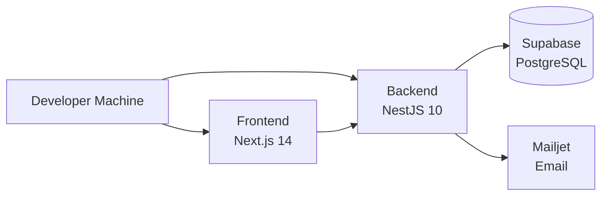

# 🚀 Getting Started

Welcome to NTG Alma! This guide will help you get the system up and running on your local machine.

## 📋 Prerequisites

Before you begin, ensure you have the following installed:

* **Node.js** (v20.x LTS) - [Download](https://nodejs.org/)
* **npm** (v9 or higher) - Comes with Node.js
* **Git** - [Download](https://git-scm.com/)
* **Supabase Account** - [Sign up](https://supabase.com/)
* **Mailjet Account** (for email features) - [Sign up](https://www.mailjet.com/)

## 🏗️ Architecture Overview



## 📦 Step 1: Clone the Repository

```bash
git clone <repository-url>
cd ntg-sms-v1
```

The repository is a monorepo with the following structure:

```
ntg-sms-v1/
├── backend/          # NestJS backend
├── frontend/         # Next.js frontend
├── supabase/        # Database migrations
└── .github/         # CI/CD workflows
```

## 🔧 Step 2: Backend Setup

### 2.1 Install Dependencies

```bash
cd backend
npm install
```

### 2.2 Configure Environment Variables

Copy the example environment file:

```bash
cp .env.example .env
```

**Security:** `backend/.env.example` must contain placeholders only. Never commit real Mailjet, Stripe, or Google secrets.

Edit `.env` with your configuration:

```env
# Supabase Configuration
SUPABASE_URL=your_supabase_project_url
SUPABASE_SERVICE_KEY=your_service_role_key
SUPABASE_JWT_SECRET=your_jwt_secret

# Application
PORT=3001
NODE_ENV=development

# CORS
FRONTEND_URL=http://localhost:3000

# Mailjet Configuration (get your own keys)
MAILJET_API_KEY=your_mailjet_api_key
MAILJET_SECRET_KEY=your_mailjet_secret_key
MAILJET_FROM_EMAIL=noreply@yourdomain.com
MAILJET_FROM_NAME=NTG Alma

# Mailjet Rate Limiting
# Limit is per created invitation record
# Bulk import may create 2 per student when parent accounts are enabled
INVITATIONS_RATE_LIMIT_PER_MINUTE=20

# Optional: Branding (IMPORTANT for production)
INVITATION_NTG_LOGO_URL=https://your-app.example.com/NTGTempLogo.svg
NTG_ALMA_LOGO_URL=https://your-cdn.com/alma-logo.png

# IMPORTANT: In production, FRONTEND_URL (and logo URLs) must be stable HTTPS hosts
# localhost will NOT load images for real email recipients
# If unset, INVITATION_NTG_LOGO_URL defaults to {FRONTEND_URL}/NTGTempLogo.svg
# Ensure this URL is publicly reachable by email clients

# Optional: Web Push Notifications
VAPID_PUBLIC_KEY=your_vapid_public_key
VAPID_PRIVATE_KEY=your_vapid_private_key

# Optional: PDF Generation (system will auto-detect if not set)
PUPPETEER_EXECUTABLE_PATH=/usr/bin/chromium
# or CHROME_EXECUTABLE_PATH=/usr/bin/google-chrome
# or CHROMIUM_EXECUTABLE_PATH=/usr/bin/chromium-browser
```

### 2.3 Set Up Supabase




#### Create a Supabase Project

* Go to [Supabase Dashboard](https://app.supabase.com/)
* Create a new project
* Note down your project URL and API keys
  



#### Get Your Keys

* **Project URL**: Settings → API → Project URL
* **Service Role Key**: Settings → API → Service Role Key (secret)
* **JWT Secret**: Settings → API → JWT Secret
  



#### Run Database Migrations

Migrations are in `supabase/migrations/` directory. You can apply them via:

**Option A: Supabase Dashboard**

* Go to SQL Editor
* Copy and paste migration files in order
* Execute them sequentially

**Option B: Supabase CLI**

```bash
# Install Supabase CLI
npm install -g supabase

# Link to your project
supabase link --project-ref your-project-ref

# Push migrations
supabase db push
```





#### Configure Storage

Create storage buckets in Supabase Dashboard:

* `assessment-files` - For assessment attachments
* Set appropriate permissions (authenticated users)
  



#### Configure Auth URLs

**IMPORTANT:** If your website URL changes, update it in Supabase Auth provider settings:

* Go to: [Supabase Dashboard → Auth → URL Configuration](https://supabase.com/dashboard/project/YOUR_PROJECT_ID/auth/url-configuration)
* Update **Site URL** to your production domain (e.g., `https://alma.ntgapps.com`)
* Update **Redirect URLs** to include your production domain
* This ensures password reset and email verification links work correctly
  
  

### 2.4 Start the Backend Server

```bash
npm run start:dev
```

The backend will start on `http://localhost:3001`

**Verify it's running:**

* Health check: `http://localhost:3001/health`
* Should return: `{"status":"ok","timestamp":"..."}`

## 🎨 Step 3: Frontend Setup

### 3.1 Install Dependencies

Open a new terminal:

```bash
cd frontend
npm install
```

### 3.2 Configure Environment Variables

Copy the example environment file:

```bash
cp .env.local.example .env.local
```

**Note:** The `.env.local.example` file in the repo is UTF-16 encoded. Convert to UTF-8 if needed.

Edit `.env.local`:

```env
# Supabase Configuration
NEXT_PUBLIC_SUPABASE_URL=your_supabase_url
NEXT_PUBLIC_SUPABASE_ANON_KEY=your_supabase_anon_key

# Backend API
NEXT_PUBLIC_API_URL=http://localhost:3001
```

**Where to get these values:**

* `NEXT_PUBLIC_SUPABASE_URL`: Same as backend `SUPABASE_URL`
* `NEXT_PUBLIC_SUPABASE_ANON_KEY`: Supabase Dashboard → Settings → API → Anon/Public Key
* `NEXT_PUBLIC_API_URL`: Your backend URL (localhost:3001 for dev)

### 3.3 Start the Frontend Server

```bash
npm run dev
```

The frontend will start on `http://localhost:3000`

## ✅ Step 4: Verify Installation




#### Backend Health Check

Visit `http://localhost:3001/health`

Should return:

```json
{
  "status": "ok",
  "timestamp": "2026-04-14T..."
}
```





#### Frontend

Visit `http://localhost:3000`

Should show the login page




#### Database Connection

Check Supabase dashboard → Table Editor

Should see all 67 tables created



## 🔐 Step 5: Create Your First Account




#### Sign Up as School Admin

* Go to `http://localhost:3000/signup`
* Fill in the registration form:
  * School Name
  * Email (will be your admin account)
  * Password
  * Branch Name
  * Subdomain (unique identifier for your school)
* Submit the form

This will create:

* A tenant (school organization)
* A branch (campus)
* An admin user account
* Initial roles and permissions
  



#### Login

* Go to `http://localhost:3000/login`
* Use the email and password you just created
* You'll be redirected to the dashboard
  



#### Initial Setup Wizard

On first login, you'll see the Setup Wizard. This helps configure:

* Academic year
* Classes and sections
* Subjects
* Timing templates
* School days

Complete the wizard to set up your school structure.



## 🔧 Step 6: Configure Third-Party Services

### 6.1 Mailjet Setup




#### Go to Mailjet Dashboard

Go to [Mailjet Dashboard](https://app.mailjet.com/)




#### Create API keys

Create API keys (API Key Management)




#### Add your domain

* Account → Sender Addresses & Domains
* Add your domain (e.g., `yourdomain.com`)
* Configure DNS records (SPF, DKIM)
* Verify domain
  



#### Update backend `.env`

Update backend `.env` with your keys



### 6.2 Web Push Notifications (Optional)

Generate VAPID keys:

```bash
# Using web-push library
npx web-push generate-vapid-keys
```

Add the keys to backend `.env`:

```env
VAPID_PUBLIC_KEY=your_generated_public_key
VAPID_PRIVATE_KEY=your_generated_private_key
```

## 🐳 Docker Setup (Optional)

### Backend Docker

```bash
cd backend
docker build -t ntg-alma-backend .
docker run -p 3001:3001 --env-file .env ntg-alma-backend
```

### Frontend Docker

```bash
cd frontend
docker build -t ntg-alma-frontend .
docker run -p 3000:3000 --env-file .env.local ntg-alma-frontend
```

### Docker Compose

See [CI/CD Deployment Guide] for full Docker Compose setup.

## 🧪 Testing the Setup

### Test Backend API

```bash
# Health check
curl http://localhost:3001/health

# Login (get access token)
curl -X POST http://localhost:3001/api/v1/auth/login \
  -H "Content-Type: application/json" \
  -d '{
    "email": "your-email@example.com",
    "password": "your-password"
  }'
```

### Test Frontend

1. Open browser to `http://localhost:3000`
2. Login with your credentials
3. Navigate to different sections:
   * Dashboard
   * Students
   * Attendance
   * Assessments
4. Check browser console for errors

## 🐛 Troubleshooting

### Backend Issues

**Port Already in Use**

```bash
# Find process using port 3001
lsof -i :3001

# Kill the process
kill -9 <PID>

# Or use a different port in .env
PORT=3002
```

**Database Connection Error**

* Verify `SUPABASE_URL` in `.env`
* Check if Supabase project is active
* Verify `SUPABASE_SERVICE_KEY` is the service role key (not anon key)
* Check network connectivity

**Migration Errors**

* Ensure migrations run in order (numbered files)
* Check for existing data conflicts
* Verify Supabase project is empty before first migration
* Check SQL syntax in migration files

**Mailjet Email Errors**

* Verify API keys are correct
* Check domain is verified in Mailjet
* Ensure DNS records (SPF, DKIM) are configured
* Check Mailjet dashboard for delivery errors

### Frontend Issues

**API Connection Error**

* Verify `NEXT_PUBLIC_API_URL` in `.env.local`
* Check if backend is running (`http://localhost:3001/health`)
* Verify CORS settings in backend allow `http://localhost:3000`
* Check browser console for CORS errors

**Build Errors**

```bash
# Clear Next.js cache
rm -rf .next

# Reinstall dependencies
rm -rf node_modules
npm install

# Rebuild
npm run dev
```

**Authentication Errors**

* Verify Supabase URL and anon key in `.env.local`
* Check if Supabase Auth is enabled
* Verify user exists in Supabase Auth dashboard
* Clear browser cookies and try again

**Environment Variable Not Working**

* Ensure variables start with `NEXT_PUBLIC_` for client-side access
* Restart dev server after changing `.env.local`
* Check for typos in variable names
* Verify values don't have trailing spaces

### Database Issues

**Tables Not Created**

* Verify all migrations ran successfully
* Check Supabase SQL Editor → History for errors
* Run migrations manually in SQL Editor
* Check migration file syntax

**RLS Policy Errors**

* Current known issues (see [Security Guide]):
  * `invitations` table has RLS disabled
  * `assessment_draft_files` has RLS disabled
  * `result_cards` has overly permissive policy
* These need to be fixed for production use

**Permission Denied Errors**

* Using service role key bypasses RLS (correct for backend)
* Check that backend is using `SUPABASE_SERVICE_KEY` not anon key
* Verify RLS policies are configured correctly

## 📚 Next Steps

* Read the [Architecture Documentation] to understand system design
* Explore [Database Schema] to learn the data model
* Review [Security Guide] for security best practices
* Check [Student Lifecycle] for workflow documentation

## 💡 Development Tips

1. **Use TypeScript**: The project is fully typed - leverage IDE autocomplete
2. **Check API Responses**: All APIs return `{ data, meta? }` format
3. **Database Queries**: Always filter by `branch_id` in services
4. **Environment Variables**: Never commit `.env` or `.env.local` files
5. **Code Formatting**: Follow existing code style (use Prettier if configured)
6. **Branch Isolation**: Always verify branch context in `BranchGuard`
7. **RLS Bypass**: Backend uses service role key which bypasses RLS
8. **Mantine UI Only**: Frontend uses Mantine v7 - don't add other UI libraries
9. **TanStack Query**: Use React Query for all data fetching
10. **Error Handling**: Implement proper try-catch in all async operations

## 🔒 Security Checklist

Before deploying to production:

* [ ] Confirm .env.example has placeholders only
* [ ] Rotate any previously exposed third-party keys
* [ ] Enable RLS on `invitations` table
* [ ] Enable RLS on `assessment_draft_files` table
* [ ] Fix overly permissive `result_cards` RLS policy
* [ ] Restrict public bucket listing for `assessment-files`
* [ ] Review all RLS policies
* [ ] Set strong JWT secret
* [ ] Configure production CORS origins
* [ ] Enable HTTPS only
* [ ] Set up monitoring and logging

See [Security Guide] for complete security checklist.

## 📞 Getting Help

If you encounter issues:

1. Check this troubleshooting section
2. Review error logs in terminal
3. Check browser console for frontend errors
4. Review Supabase logs
5. Contact development team


---
