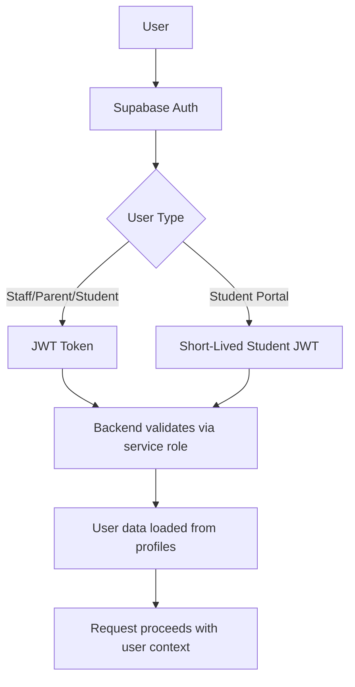
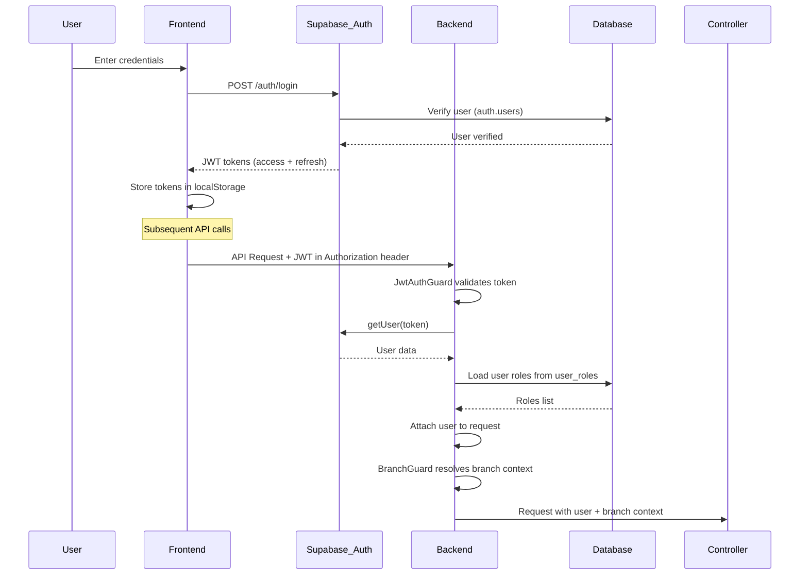
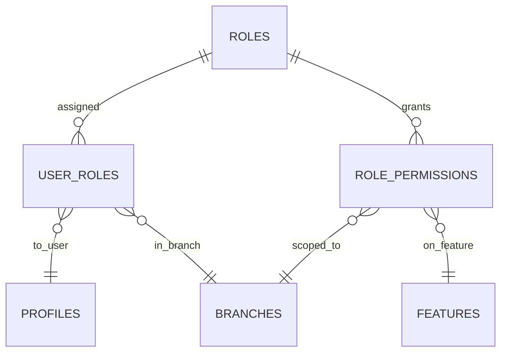

# 🔐 Security

This document covers security implementation, best practices, and known security issues in the NTG Alma School Management System.

## 🔐 Security Overview

NTG Alma implements security at multiple layers:

1. **Authentication** - Supabase Auth + JWT tokens
2. **Authorization** - Role-Based Access Control (RBAC)
3. **Database Security** - Row-Level Security (RLS) policies
4. **API Security** - Guards and permission checks
5. **Data Protection** - Encryption and secure storage

***

## 🔑 Authentication

### Supabase Auth Integration



### Authentication Flow



### JWT Token Structure

**Standard User Token:**

```json
{
  "sub": "user-uuid",
  "email": "user@example.com",
  "role": "authenticated",
  "aud": "authenticated",
  "exp": 1713000000,
  "iat": 1712996400
}
```

**Student Portal Token (custom):**

```json
{
  "student_id": "student-uuid",
  "branch_id": "branch-uuid",
  "exp": 1712997000  // Short-lived (10 minutes)
}
```

### Token Management

**Access Token:**

* Duration: 24 hours (Supabase default)
* Storage: Frontend localStorage
* Used for: All API requests

**Refresh Token:**

* Duration: 7 days (Supabase default)
* Storage: Frontend localStorage (httpOnly would be better)
* Used for: Getting new access tokens

**Student Token:**

* Duration: 10 minutes (custom implementation)
* Signed with: Same `SUPABASE_JWT_SECRET`
* Used for: Student portal `/api/v1/student/*` endpoints only

### Login Endpoints

**Regular Login:**

```
POST /api/v1/auth/login
Body: { email, password }
Returns: { user, session }
```

**Student Portal Login:**

```
POST /api/v1/auth/student-token
Body: { studentId, password }
Returns: { studentToken, student }
```

**Refresh Token:**

```
POST /api/v1/auth/refresh
Body: { refreshToken }
Returns: { accessToken, refreshToken }
```

***

## 👥 Authorization (RBAC)

### User Roles

From `user_role` enum (10 roles):

| Role                 | Code                   | Typical Users         | Scope            |
| -------------------- | ---------------------- | --------------------- | ---------------- |
| Super Admin          | `super_admin`          | System administrators | System-wide      |
| Principal            | `principal`            | School principals     | Branch-wide      |
| School Admin         | `school_admin`         | School administrators | Branch-wide      |
| Academic Coordinator | `academic_coordinator` | Academic heads        | Branch-wide      |
| Class Teacher        | `class_teacher`        | Homeroom teachers     | Class-level      |
| Subject Teacher      | `subject_teacher`      | Subject specialists   | Subject-level    |
| Guidance Counselor   | `guidance_counselor`   | Counselors            | Student-level    |
| Admin Assistant      | `admin_assistant`      | Office staff          | Branch-wide      |
| Parent               | `parent`               | Guardians             | Child-level only |
| Student              | `student`              | Students              | Self only        |

### Permission Matrix

**Features** (from `features` table):

* `students` - Student management
* `attendance` - Attendance tracking
* `assessments` - Assessment management
* `timetable` - Timetable management
* `messages` - Internal messaging
* `reports` - Report generation
* `settings` - System settings
* ... (20+ features)

**Permissions** (from `role_permissions.permission`):

* `view` - Read-only access
* `edit` - Full CRUD access

### RBAC Implementation

**Database Tables:**



**Permission Check Pattern (Controllers):**

```typescript
// Example from StudentsController
private async ensureFeatureEditAccess(
  user: CurrentUserPayload,
  branchId: string,
  featureCode: string,
): Promise<void> {
  const roleNames = user.roles || [];
  
  // school_admin bypasses all checks
  if (roleNames.includes('school_admin')) return;
  
  // Get user's role IDs in this branch
  const { data: userRoleRows } = await supabase
    .from('user_roles')
    .select('role_id')
    .eq('user_id', user.id)
    .eq('branch_id', branchId);
  
  const roleIds = userRoleRows.map(r => r.role_id);
  
  // Get feature ID
  const { data: featureData } = await supabase
    .from('features')
    .select('id')
    .eq('code', featureCode)
    .single();
  
  // Check if any role has 'edit' permission
  const { data: permissionRows } = await supabase
    .from('role_permissions')
    .select('permission')
    .eq('branch_id', branchId)
    .eq('feature_id', featureData.id)
    .in('role_id', roleIds);
  
  const canEdit = permissionRows.some(row => row.permission === 'edit');
  
  if (!canEdit) {
    throw new ForbiddenException('No edit permission for this feature');
  }
}
```

### Special Role Privileges

**Super Admin:**

* System-wide access
* Can view audit logs
* Can manage any tenant/branch
* Can access all data regardless of RLS

**School Admin:**

* Bypasses most permission checks within branch
* Full access to all features in assigned branches
* Cannot access other branches

**Principal:**

* Similar to school admin
* Typically has view access system-wide
* Edit access to assigned branch

***

## 🔒 Database Security (RLS)

### Row-Level Security Overview

**What is RLS?**

* PostgreSQL feature for row-level access control
* Policies attached to tables
* Evaluated for every query
* **Backend bypasses RLS** (uses service role key)

### Backend RLS Bypass

**Critical Understanding:**

```typescript
// Backend uses service role key
const supabase = createClient(
  process.env.SUPABASE_URL,
  process.env.SUPABASE_SERVICE_KEY  // Service role bypasses RLS!
);
```

**This means:**

* Backend **must** manually filter by `branch_id`
* RLS policies don't protect backend queries
* RLS only applies to:
  * Direct database access (PostgREST API)
  * Frontend using anon key

### RLS Policy Patterns

**1. Branch Isolation Pattern**

Most operational tables:

```sql
CREATE POLICY branch_isolation ON students
  FOR ALL
  USING (
    branch_id IN (
      SELECT branch_id 
      FROM user_branches 
      WHERE user_id = auth.uid()
    )
  );
```

**2. User Owns Rows Pattern**

User-specific data:

```sql
CREATE POLICY user_owns_rows ON profiles
  FOR ALL
  USING (id = auth.uid());

CREATE POLICY user_owns_rows ON notifications
  FOR ALL
  USING (user_id = auth.uid());
```

**3. Role-Based Pattern**

Admin-only tables:

```sql
CREATE POLICY super_admin_only ON audit_logs
  FOR SELECT
  USING (
    EXISTS (
      SELECT 1 
      FROM user_roles ur
      JOIN roles r ON ur.role_id = r.id
      WHERE ur.user_id = auth.uid()
        AND r.name = 'super_admin'
    )
  );
```

**4. Complex Multi-Condition Pattern**

Example from `attendance`:

```sql
CREATE POLICY attendance_access ON attendance
  FOR ALL
  USING (
    -- Class teacher for their class section
    EXISTS (
      SELECT 1 FROM class_sections cs
      WHERE cs.id = attendance.class_section_id
        AND cs.class_teacher_id = auth.uid()
    )
    OR
    -- School admin or principal in branch
    EXISTS (
      SELECT 1 FROM user_roles ur
      JOIN roles r ON ur.role_id = r.id
      WHERE ur.user_id = auth.uid()
        AND ur.branch_id = attendance.branch_id
        AND r.name IN ('school_admin', 'principal')
    )
    OR
    -- Parent linked to student
    EXISTS (
      SELECT 1 FROM parent_students ps
      WHERE ps.student_id = attendance.student_id
        AND ps.parent_user_id = auth.uid()
    )
  );
```

**5. Student Self-Access Pattern**

Example from `students`:

```sql
CREATE POLICY student_self_access ON students
  FOR SELECT
  USING (
    -- JWT claim contains student_id
    (current_setting('request.jwt.claims', true)::json->>'student_id')::uuid = id
  );
```

### RLS Security Issues

| Table                        | Issue                    | Severity        | Impact                                          |
| ---------------------------- | ------------------------ | --------------- | ----------------------------------------------- |
| **`invitations`**            | RLS disabled             | 🔴 **Critical** | Token exposure via PostgREST                    |
| **`assessment_draft_files`** | RLS disabled             | 🔴 **Critical** | File path exposure                              |
| **`result_cards`**           | `USING (true)` policy    | 🟠 **High**     | Any authenticated user can see all result cards |
| **Settings tables**          | RLS enabled, no policies | 🟡 **Medium**   | Service role access only (backend only)         |

**Recommended Fixes:**

**1. Enable RLS on `invitations`:**

```sql
ALTER TABLE invitations ENABLE ROW LEVEL SECURITY;

CREATE POLICY creator_can_manage ON invitations
  FOR ALL
  USING (created_by = auth.uid());

CREATE POLICY branch_admin_can_view ON invitations
  FOR SELECT
  USING (
    EXISTS (
      SELECT 1 FROM user_roles ur
      JOIN roles r ON ur.role_id = r.id
      WHERE ur.user_id = auth.uid()
        AND r.name IN ('school_admin', 'principal', 'admin_assistant')
    )
  );
```

**2. Enable RLS on `assessment_draft_files`:**

```sql
ALTER TABLE assessment_draft_files ENABLE ROW LEVEL SECURITY;

CREATE POLICY creator_owns ON assessment_draft_files
  FOR ALL
  USING (created_by = auth.uid());
```

**3. Fix `result_cards` policy:**

```sql
DROP POLICY IF EXISTS "Result cards are accessible by branch" ON result_cards;

CREATE POLICY branch_staff_can_view ON result_cards
  FOR SELECT
  USING (
    branch_id IN (
      SELECT branch_id FROM user_branches WHERE user_id = auth.uid()
    )
  );

CREATE POLICY student_can_view_own ON result_cards
  FOR SELECT
  USING (
    student_id = (
      current_setting('request.jwt.claims', true)::json->>'student_id'
    )::uuid
  );

CREATE POLICY parent_can_view_child ON result_cards
  FOR SELECT
  USING (
    EXISTS (
      SELECT 1 FROM parent_students 
      WHERE student_id = result_cards.student_id
        AND parent_user_id = auth.uid()
    )
  );
```

***

## 🛡️ API Security

### Request Guards

**1. JwtAuthGuard**

Applied to all protected routes:

```typescript
@UseGuards(JwtAuthGuard)
@Controller('api/v1/students')
export class StudentsController {
  // ...
}
```

**Workflow:**

1. Extracts JWT from `Authorization: Bearer <token>`
2. Validates token with Supabase
3. Loads user data
4. Loads all user roles (across all branches)
5. Attaches to `request.user`

**2. BranchGuard**

Applied after authentication:

```typescript
@UseGuards(JwtAuthGuard, BranchGuard)
@Controller('api/v1/students')
export class StudentsController {
  // ...
}
```

**Workflow:**

1. Resolves branch ID from:
   * `X-Branch-Id` header (priority)
   * `profiles.current_branch_id` (fallback)
   * First branch in `user_branches` (last resort)
2. Verifies user is member of branch
3. Loads tenant ID from branch
4. Checks if branch/tenant is active
5. **Privileged bypass**: `@ntg.com`, `@ntgclarity.com`, `@example.com` emails skip inactive checks
6. **Super admin bypass**: `super_admin` role skips inactive checks
7. Attaches to `request.branch = { branchId, tenantId }`

**3. Permission Checks (Custom per controller)**

Many controllers implement their own permission logic:

```typescript
// Private method in controller
private async ensureFeatureEditAccess(
  user: CurrentUserPayload,
  branchId: string,
  featureCode: string,
): Promise<void> {
  // Check role_permissions table
  // school_admin bypasses
}

// Used in endpoints
@Post()
async create(@CurrentUser() user, @CurrentBranch() branch, @Body() dto) {
  await this.ensureFeatureEditAccess(user, branch.branchId, 'students');
  // ... proceed with creation
}
```

### CORS Configuration

**Allowed origins** (from `main.ts`):

```typescript
const allowedOrigins = [
  process.env.FRONTEND_URL,          // Production frontend
  'http://localhost:3000',            // Local development
  /\.trycloudflare\.com$/,            // Cloudflare tunnel
  /\.ngrok\.io$/,                     // Ngrok tunnel
];
```

**Allowed headers:**

* `Authorization`
* `X-Branch-Id`
* `Content-Type`
* Standard headers

### Rate Limiting

**Current Status:** ❌ Not implemented

**Recommendation:** Add rate limiting at:

* API gateway level (if using one)
* Or in NestJS middleware:

```typescript
// Example with @nestjs/throttler
@Throttle({
  default: {
    limit: 100,        // 100 requests
    ttl: 60000,        // per 60 seconds
  }
})
```

***

## 🔐 Data Protection

### Password Security

**Handled by Supabase Auth:**

* Passwords hashed with bcrypt
* Never stored in plain text
* Never returned in API responses
* Reset via email-only flow

### Sensitive Data

**Student Data:**

* Medical notes (HIPAA-like sensitivity)
* Blood group
* Parent contact info
* Academic records

**Protection:**

* RLS policies restrict access
* Audit logging for changes
* Export restrictions (could be improved)

### File Storage Security

**Supabase Storage buckets:**

* `assessment-files` - Assessment attachments
  * **⚠️ Issue:** Public listing allowed
  * **Fix:** Restrict bucket policies

**Recommended bucket policy:**

```sql
-- Disable public listing
CREATE POLICY "Authenticated users only" ON storage.objects
  FOR SELECT
  USING (auth.role() = 'authenticated');

-- Require branch membership to upload
CREATE POLICY "Branch members can upload" ON storage.objects
  FOR INSERT
  WITH CHECK (
    EXISTS (
      SELECT 1 FROM user_branches 
      WHERE user_id = auth.uid()
        AND branch_id = (storage.foldername(name))[1]::uuid
    )
  );
```

***

## 📝 Audit Logging

### Audit Trail

**`audit_logs` table:**

```sql
CREATE TABLE audit_logs (
    id UUID PRIMARY KEY,
    table_name TEXT,
    record_id UUID,
    action TEXT,               -- INSERT, UPDATE, DELETE
    user_email TEXT,
    username TEXT,
    branch_id UUID,
    tenant_id UUID,
    old_values JSONB,          -- Before state
    new_values JSONB,          -- After state
    changed_fields TEXT[],     -- What changed
    ip_address TEXT,
    user_agent TEXT,
    created_at TIMESTAMPTZ
);
```

**What's logged:**

* User management changes
* Student record modifications
* Grade changes
* Settings changes
* Sensitive data access (could be improved)

**RLS:** Super admin SELECT only

**Usage:**

```typescript
// Example from AuditLogModule
await this.auditLogService.log({
  tableName: 'students',
  recordId: studentId,
  action: 'UPDATE',
  oldValues: oldStudent,
  newValues: newStudent,
  changedFields: ['class_id', 'section_id'],
  userEmail: user.email,
  branchId: branch.branchId,
});
```

***

## ⚠️ Known Security Issues

### Critical Issues (Fix Immediately)




### `backend/.env.example` contains real credentials

* **Risk:** Mailjet keys exposed in git
* **Action:**
  * Remove from git history
  * Rotate keys in Mailjet
  * Replace with placeholders
    



### `invitations` table RLS disabled

* **Risk:** Token exposure via direct database access
* **Action:** Enable RLS with appropriate policies
  



### `assessment_draft_files` RLS disabled

* **Risk:** File path exposure
* **Action:** Enable RLS
  
  

### High Priority Issues




### `result_cards` overly permissive RLS

* **Risk:** Any authenticated user can view all result cards
* **Action:** Implement branch-scoped policies
  



### Storage bucket public listing

* **Risk:** Enumerate all assessment files
* **Action:** Restrict bucket policies
  
  

### Medium Priority Issues




### No API rate limiting

* **Risk:** DDoS, brute force attacks
* **Action:** Implement rate limiting
  



### Refresh tokens in localStorage

* **Risk:** XSS can steal tokens
* **Action:** Consider httpOnly cookies (requires architecture change)
  



### No HTTPS enforcement in development

* **Risk:** Token interception
* **Action:** Enforce HTTPS in production
  
  

### Low Priority Issues




### Limited audit logging

* **Risk:** Incomplete audit trail
* **Action:** Expand logging coverage
  



### No file upload size limits visible

* **Risk:** Storage exhaustion
* **Action:** Document and enforce limits
  
  

***

## ✅ Security Checklist

### Pre-Production Checklist

**Authentication:**

* [x] JWT tokens properly validated
* [x] Password reset flow secure
* [ ] Session timeout configured
* [ ] Multi-factor authentication (not implemented)

**Authorization:**

* [x] RBAC implemented
* [x] Permission checks in controllers
* [ ] Consistent permission checks across all endpoints
* [ ] Regular permission audit

**Database:**

* [x] RLS enabled on most tables
* [ ] RLS policies reviewed and tested
* [ ] Fix critical RLS issues (invitations, result\_cards)
* [x] Audit logging implemented

**API:**

* [x] CORS properly configured
* [ ] Rate limiting implemented
* [x] Input validation (DTOs)
* [x] Error messages don't leak sensitive info

**Data Protection:**

* [x] Passwords hashed
* [ ] Sensitive data encrypted at rest (Supabase default)
* [ ] Sensitive data encrypted in transit (HTTPS)
* [ ] Data export restrictions

**Infrastructure:**

* [ ] HTTPS enforced
* [ ] Security headers configured
* [ ] Regular backups
* [ ] Incident response plan

### Production Security Hardening




### Rotate all credentials

* Mailjet API keys
* JWT secrets
* Database passwords
  



### Enable all RLS policies

* Fix `invitations` table
* Fix `assessment_draft_files` table
* Fix `result_cards` table
* Review all tables with no policies
  



### Implement rate limiting

* API endpoints
* Login attempts
* Password reset requests
  



### Security headers

```typescript
// Add to main.ts
app.use(helmet({
  contentSecurityPolicy: false, // Configure properly
  hsts: { maxAge: 31536000 },
}));
```





### Regular security audits

* Quarterly permission review
* Monthly RLS policy review
* Weekly audit log review
  
  

***

## 🔍 Security Monitoring

### What to Monitor

**Failed Login Attempts:**

* More than 5 failures from same IP
* Unusual login patterns

**Permission Escalation:**

* User role changes
* New admin accounts created

**Data Access Patterns:**

* Bulk data exports
* Access to sensitive student data
* Cross-branch access attempts

**API Abuse:**

* High request rates
* Unusual endpoints accessed
* Error rate spikes

### Recommended Tools

* **Supabase Dashboard** - Built-in monitoring
* **Sentry** - Error tracking
* **DataDog / New Relic** - Application monitoring
* **Custom alerts** - Via audit logs

***

## 📚 Security Resources

### Internal Documentation

* [Database Schema] - RLS policies detailed
* [Architecture] - Security architecture
* [Getting Started] - Secure setup

### External Resources

* [Supabase RLS Guide](https://supabase.com/docs/guides/auth/row-level-security)
* [NestJS Security Best Practices](https://docs.nestjs.com/security/authentication)
* [OWASP Top 10](https://owasp.org/www-project-top-ten/)


---
