# Student Lifecycle

This document explains the key workflows and state machines in the NTG Alma School Management System, focusing on student-centric processes.

## 📊 Overview

The student lifecycle encompasses several interconnected workflows:

1. **Student Enrollment** - From admission to account setup
2. **Attendance Tracking** - Daily presence monitoring
3. **Assessment & Grading** - Academic evaluation workflow
4. **Result Card Generation** - Report card creation and approval
5. **Promotion & Placement** - Year-end advancement decisions
6. **Leave Management** - Absence request workflows

***

## 🎓 Student Enrollment Workflow

### Enrollment States

A student can be in different states throughout their time at the school:

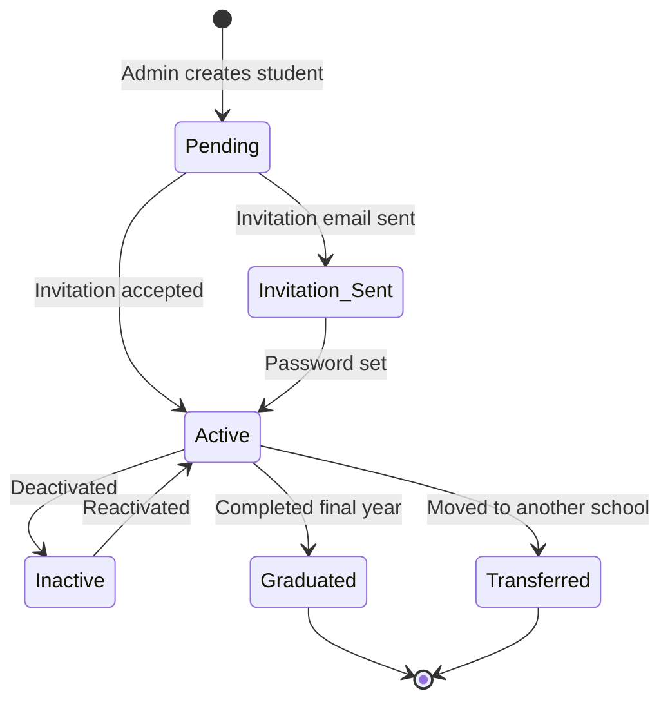
```mermaid
stateDiagram-v2
    [*] --> Pending: Admin creates student
    Pending --> Active: Invitation accepted
    Pending --> Invitation_Sent: Invitation email sent
    Invitation_Sent --> Active: Password set
    Active --> Inactive: Deactivated
    Inactive --> Active: Reactivated
    Active --> Transferred: Moved to another school
    Active --> Graduated: Completed final year
    Graduated --> [*]
    Transferred --> [*]
```

### Enrollment Process Flow

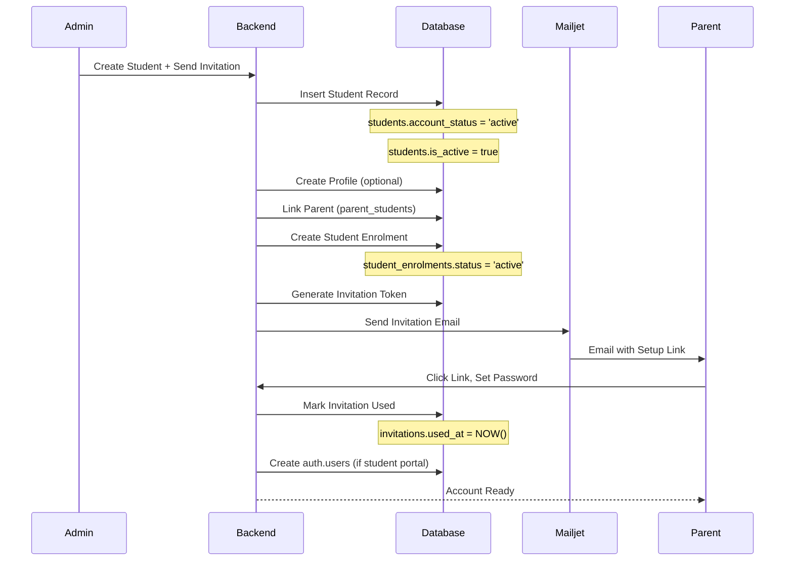
```mermaid
sequenceDiagram
    participant Admin
    participant Backend
    participant Database
    participant Mailjet
    participant Parent

    Admin->>Backend: Create Student + Send Invitation
    Backend->>Database: Insert Student Record
    Note over Database: students.account_status = 'active'
    Note over Database: students.is_active = true
    Backend->>Database: Create Profile (optional)
    Backend->>Database: Link Parent (parent_students)
    Backend->>Database: Create Student Enrolment
    Note over Database: student_enrolments.status = 'active'
    Backend->>Database: Generate Invitation Token
    Backend->>Mailjet: Send Invitation Email
    Mailjet->>Parent: Email with Setup Link
    Parent->>Backend: Click Link, Set Password
    Backend->>Database: Mark Invitation Used
    Note over Database: invitations.used_at = NOW()
    Backend->>Database: Create auth.users (if student portal)
    Backend-->>Parent: Account Ready
```

### Database States

**`students` table:**

* `is_active` - Boolean flag (true = enrolled, false = withdrawn/inactive)
* `account_status` - Text field (default: 'active')
  * Values: 'active', 'inactive', 'transferred', etc.

**`student_enrolments` table:**

* Per academic year enrollment records
* `status` - Text field (default: 'active')
  * Values: 'active', 'transferred', 'withdrawn', etc.

**`invitations` table:**

* `used_at` - NULL = pending, timestamp = completed

***

## 📅 Attendance Workflow

### Attendance Status State Machine

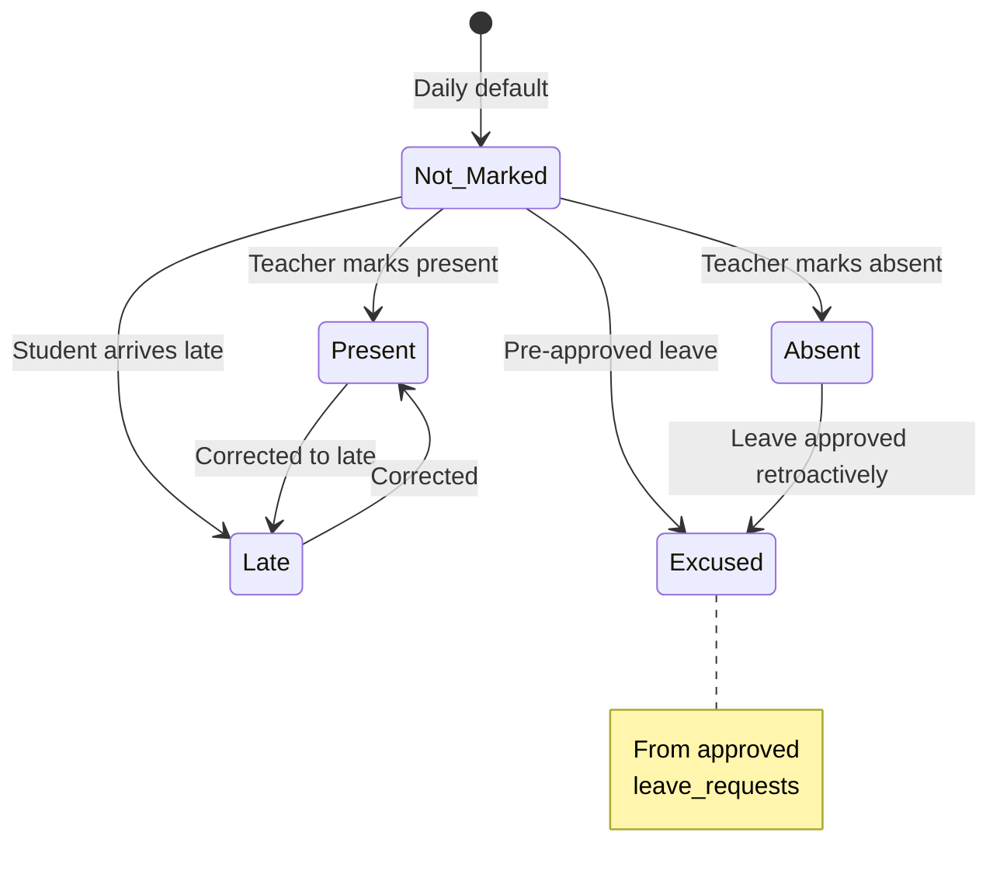
```mermaid
stateDiagram-v2
    [*] --> Not_Marked: Daily default
    Not_Marked --> Present: Teacher marks present
    Not_Marked --> Absent: Teacher marks absent
    Not_Marked --> Late: Student arrives late
    Not_Marked --> Excused: Pre-approved leave
    
    Present --> Late: Corrected to late
    Absent --> Excused: Leave approved retroactively
    Late --> Present: Corrected
    
    Note right of Excused: From approved<br/>leave_requests
```

### Attendance Status Enum

From `attendance_status` PostgreSQL enum:

* `present` - Student attended on time
* `absent` - Student did not attend
* `late` - Student arrived after start time
* `excused` - Absence approved (sick leave, etc.)

### Daily Attendance Flow

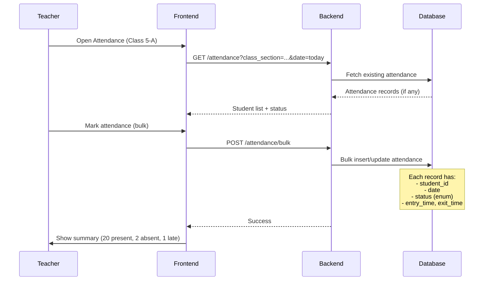
```mermaid
sequenceDiagram
    participant Teacher
    participant Frontend
    participant Backend
    participant Database

    Teacher->>Frontend: Open Attendance (Class 5-A)
    Frontend->>Backend: GET /attendance?class_section=...&date=today
    Backend->>Database: Fetch existing attendance
    Database-->>Backend: Attendance records (if any)
    Backend-->>Frontend: Student list + status
    
    Teacher->>Frontend: Mark attendance (bulk)
    Frontend->>Backend: POST /attendance/bulk
    Backend->>Database: Bulk insert/update attendance
    Note over Database: Each record has:<br/>- student_id<br/>- date<br/>- status (enum)<br/>- entry_time, exit_time
    Backend-->>Frontend: Success
    
    Frontend->>Teacher: Show summary (20 present, 2 absent, 1 late)
```

### Attendance Modification

Teachers can modify attendance within the current academic year:

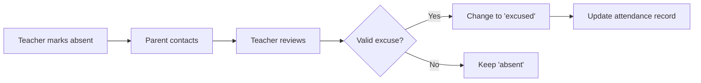
```mermaid
graph LR
    A[Teacher marks absent] --> B[Parent contacts]
    B --> C[Teacher reviews]
    C --> D{Valid excuse?}
    D -->|Yes| E[Change to 'excused']
    D -->|No| F[Keep 'absent']
    E --> G[Update attendance record]
```

***

## 📝 Assessment & Grading Workflow

### Assessment Lifecycle

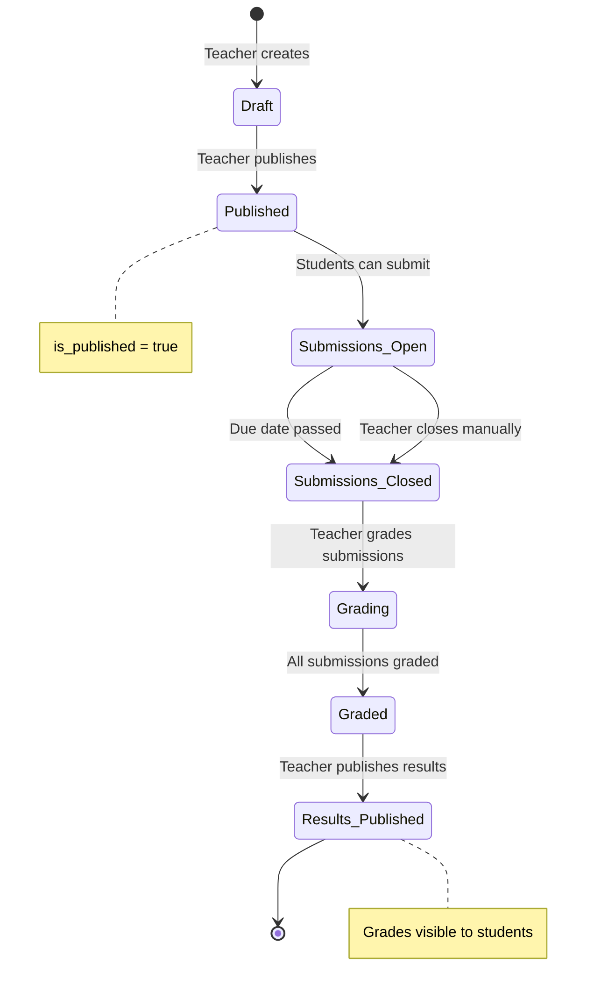
```mermaid
stateDiagram-v2
    [*] --> Draft: Teacher creates
    Draft --> Published: Teacher publishes
    Published --> Submissions_Open: Students can submit
    Submissions_Open --> Submissions_Closed: Due date passed
    Submissions_Open --> Submissions_Closed: Teacher closes manually
    Submissions_Closed --> Grading: Teacher grades submissions
    Grading --> Graded: All submissions graded
    Graded --> Results_Published: Teacher publishes results
    Results_Published --> [*]
    
    Note right of Published: is_published = true
    Note right of Results_Published: Grades visible to students
```

### Student Submission States

From `student_grades.submission_status` (text field):

* `not_submitted` - Default state
* `submitted` - Student submitted work
* `graded` - Teacher provided marks/feedback
* `late_submission` - Submitted after due date

### Complete Assessment Flow

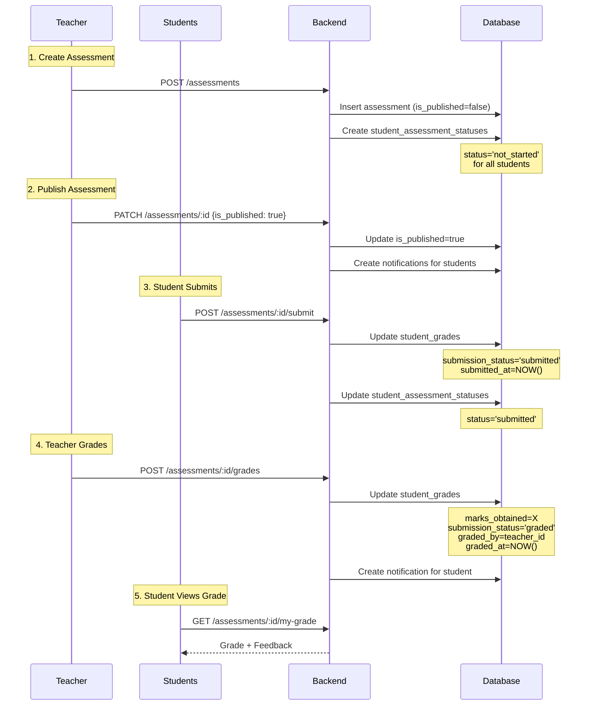
```mermaid
sequenceDiagram
    participant Teacher
    participant Students
    participant Backend
    participant Database

    Note over Teacher: 1. Create Assessment
    Teacher->>Backend: POST /assessments
    Backend->>Database: Insert assessment (is_published=false)
    Backend->>Database: Create student_assessment_statuses
    Note over Database: status='not_started'<br/>for all students
    
    Note over Teacher: 2. Publish Assessment
    Teacher->>Backend: PATCH /assessments/:id {is_published: true}
    Backend->>Database: Update is_published=true
    Backend->>Database: Create notifications for students
    
    Note over Students: 3. Student Submits
    Students->>Backend: POST /assessments/:id/submit
    Backend->>Database: Update student_grades
    Note over Database: submission_status='submitted'<br/>submitted_at=NOW()
    Backend->>Database: Update student_assessment_statuses
    Note over Database: status='submitted'
    
    Note over Teacher: 4. Teacher Grades
    Teacher->>Backend: POST /assessments/:id/grades
    Backend->>Database: Update student_grades
    Note over Database: marks_obtained=X<br/>submission_status='graded'<br/>graded_by=teacher_id<br/>graded_at=NOW()
    Backend->>Database: Create notification for student
    
    Note over Students: 5. Student Views Grade
    Students->>Backend: GET /assessments/:id/my-grade
    Backend-->>Students: Grade + Feedback
```

### Assessment Types & Workflow

Different assessment types may have different workflows:

| Type     | Submission Required | Grading Timeline |
| -------- | ------------------- | ---------------- |
| Quiz     | Optional            | Same day         |
| Homework | Yes                 | Within 1 week    |
| Exam     | Optional (in-class) | Within 2 weeks   |
| Project  | Yes                 | Within 1 month   |

***

## 🎯 Result Card Generation Workflow

### Result Card States

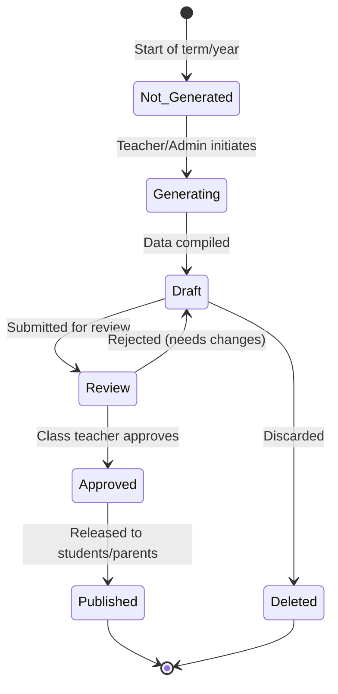
```mermaid
stateDiagram-v2
    [*] --> Not_Generated: Start of term/year
    Not_Generated --> Generating: Teacher/Admin initiates
    Generating --> Draft: Data compiled
    Draft --> Review: Submitted for review
    Review --> Draft: Rejected (needs changes)
    Review --> Approved: Class teacher approves
    Approved --> Published: Released to students/parents
    Published --> [*]
    
    Draft --> Deleted: Discarded
    Deleted --> [*]
```

### Generation Process

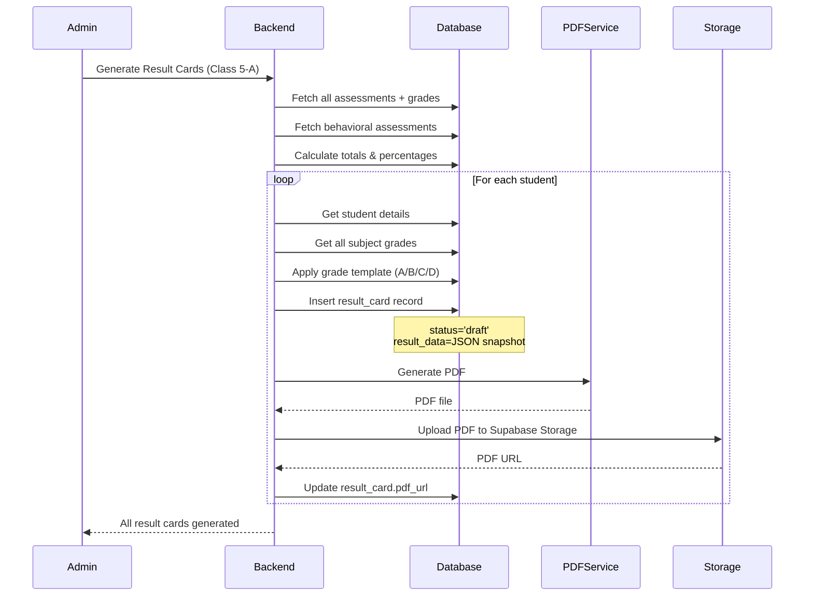
```mermaid
sequenceDiagram
    participant Admin
    participant Backend
    participant Database
    participant PDFService
    participant Storage

    Admin->>Backend: Generate Result Cards (Class 5-A)
    Backend->>Database: Fetch all assessments + grades
    Backend->>Database: Fetch behavioral assessments
    Backend->>Database: Calculate totals & percentages
    
    loop For each student
        Backend->>Database: Get student details
        Backend->>Database: Get all subject grades
        Backend->>Database: Apply grade template (A/B/C/D)
        Backend->>Database: Insert result_card record
        Note over Database: status='draft'<br/>result_data=JSON snapshot
        Backend->>PDFService: Generate PDF
        PDFService-->>Backend: PDF file
        Backend->>Storage: Upload PDF to Supabase Storage
        Storage-->>Backend: PDF URL
        Backend->>Database: Update result_card.pdf_url
    end
    
    Backend-->>Admin: All result cards generated
```

### Result Card Data Structure

**`result_cards` table:**

```json
{
  "result_type": "mid_term" or "final",
  "status": "draft" | "published",
  "result_data": {
    "student": {...},
    "subjects": [
      {
        "subject_name": "Mathematics",
        "marks_obtained": 85,
        "total_marks": 100,
        "percentage": 85,
        "grade": "A"
      },
      ...
    ],
    "overall": {
      "total_marks": 850,
      "marks_obtained": 765,
      "percentage": 90,
      "grade": "A+",
      "rank": 2
    },
    "behavioral_scores": {...}
  },
  "pdf_url": "https://...",
  "approved_by": "teacher_uuid",
  "class_teacher_comment": "Excellent performance..."
}
```

### Approval Workflow

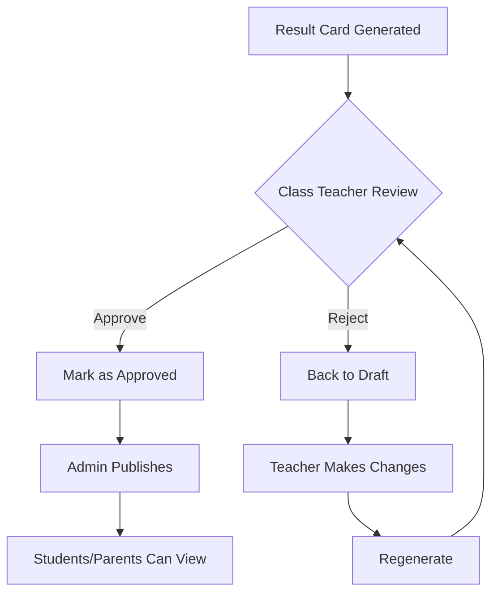
```mermaid
graph TB
    A[Result Card Generated] --> B{Class Teacher Review}
    B -->|Approve| C[Mark as Approved]
    B -->|Reject| D[Back to Draft]
    C --> E[Admin Publishes]
    E --> F[Students/Parents Can View]
    D --> G[Teacher Makes Changes]
    G --> H[Regenerate]
    H --> B
```

***

## 🎓 Promotion & Placement Workflow

### Year-End Process

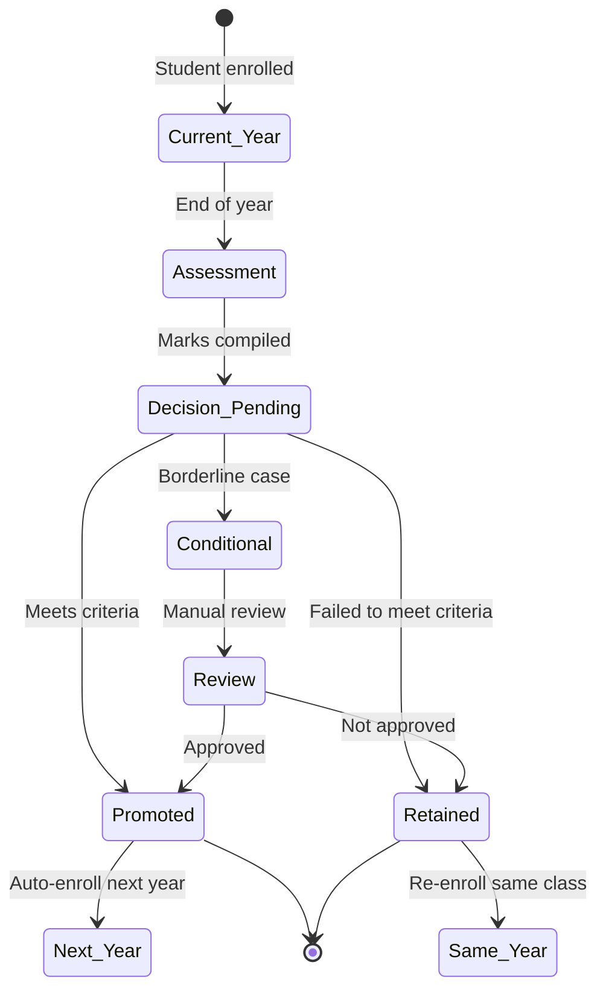
```mermaid
stateDiagram-v2
    [*] --> Current_Year: Student enrolled
    Current_Year --> Assessment: End of year
    Assessment --> Decision_Pending: Marks compiled
    Decision_Pending --> Promoted: Meets criteria
    Decision_Pending --> Retained: Failed to meet criteria
    Decision_Pending --> Conditional: Borderline case
    
    Promoted --> Next_Year: Auto-enroll next year
    Retained --> Same_Year: Re-enroll same class
    Conditional --> Review: Manual review
    Review --> Promoted: Approved
    Review --> Retained: Not approved
    
    Promoted --> [*]
    Retained --> [*]
```

### Promotion Decision Flow

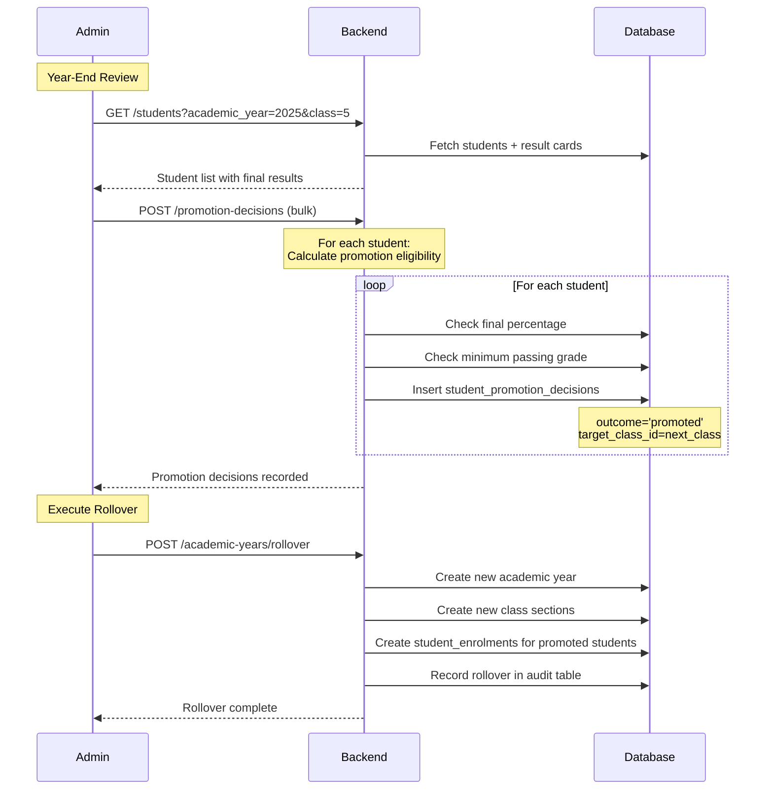
```mermaid
sequenceDiagram
    participant Admin
    participant Backend
    participant Database

    Note over Admin: Year-End Review
    Admin->>Backend: GET /students?academic_year=2025&class=5
    Backend->>Database: Fetch students + result cards
    Backend-->>Admin: Student list with final results
    
    Admin->>Backend: POST /promotion-decisions (bulk)
    Note over Backend: For each student:<br/>Calculate promotion eligibility
    
    loop For each student
        Backend->>Database: Check final percentage
        Backend->>Database: Check minimum passing grade
        Backend->>Database: Insert student_promotion_decisions
        Note over Database: outcome='promoted'<br/>target_class_id=next_class
    end
    
    Backend-->>Admin: Promotion decisions recorded
    
    Note over Admin: Execute Rollover
    Admin->>Backend: POST /academic-years/rollover
    Backend->>Database: Create new academic year
    Backend->>Database: Create new class sections
    Backend->>Database: Create student_enrolments for promoted students
    Backend->>Database: Record rollover in audit table
    Backend-->>Admin: Rollover complete
```

### Promotion Criteria (Configurable)

Typical criteria:

* Overall percentage ≥ minimum passing threshold
* No more than X failing subjects
* Behavioral assessment scores acceptable
* Class teacher recommendation

**Decision outcomes** (from `student_promotion_decisions.outcome`):

* `promoted` - Advance to next grade
* `retained` - Repeat current grade
* `conditional` - Pending additional review
* `transferred` - Moving to different school

***

## 🏥 Leave & Early Departure Workflows

### Leave Request States

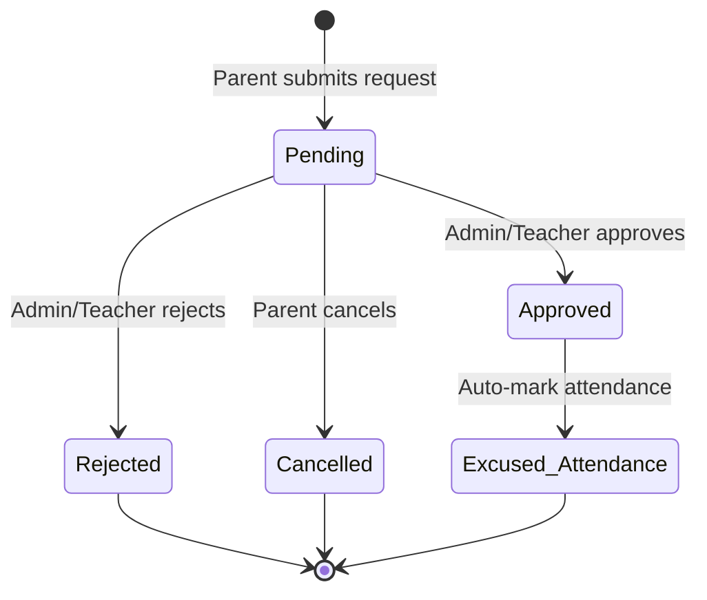
```mermaid
stateDiagram-v2
    [*] --> Pending: Parent submits request
    Pending --> Approved: Admin/Teacher approves
    Pending --> Rejected: Admin/Teacher rejects
    Pending --> Cancelled: Parent cancels
    
    Approved --> Excused_Attendance: Auto-mark attendance
    Rejected --> [*]
    Cancelled --> [*]
    Excused_Attendance --> [*]
```

### Leave Request Flow

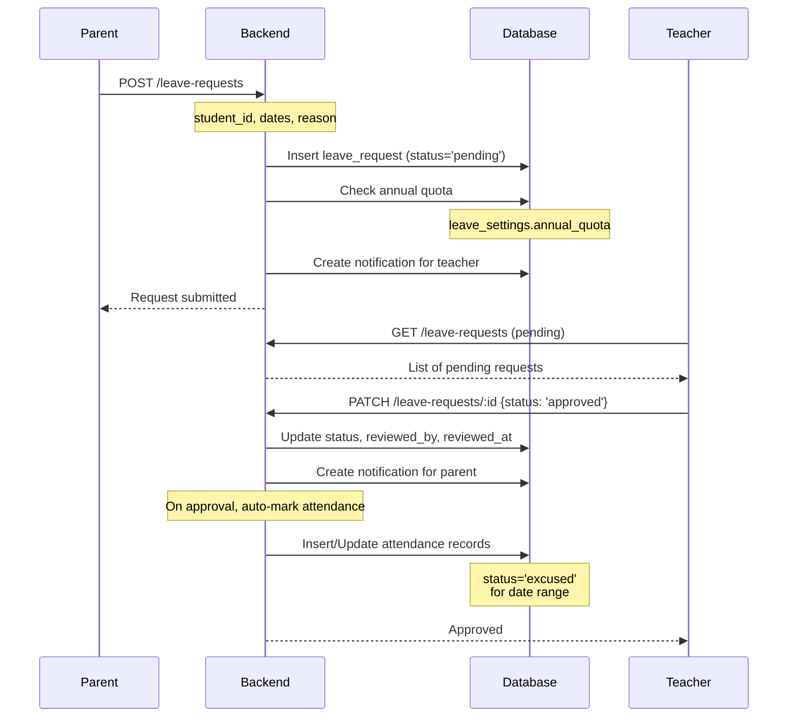
```mermaid
sequenceDiagram
    participant Parent
    participant Backend
    participant Database
    participant Teacher

    Parent->>Backend: POST /leave-requests
    Note over Backend: student_id, dates, reason
    Backend->>Database: Insert leave_request (status='pending')
    Backend->>Database: Check annual quota
    Note over Database: leave_settings.annual_quota
    Backend->>Database: Create notification for teacher
    Backend-->>Parent: Request submitted
    
    Teacher->>Backend: GET /leave-requests (pending)
    Backend-->>Teacher: List of pending requests
    
    Teacher->>Backend: PATCH /leave-requests/:id {status: 'approved'}
    Backend->>Database: Update status, reviewed_by, reviewed_at
    Backend->>Database: Create notification for parent
    
    Note over Backend: On approval, auto-mark attendance
    Backend->>Database: Insert/Update attendance records
    Note over Database: status='excused'<br/>for date range
    Backend-->>Teacher: Approved
```

### Early Departure Flow

Very similar to leave requests, but for same-day pickup:

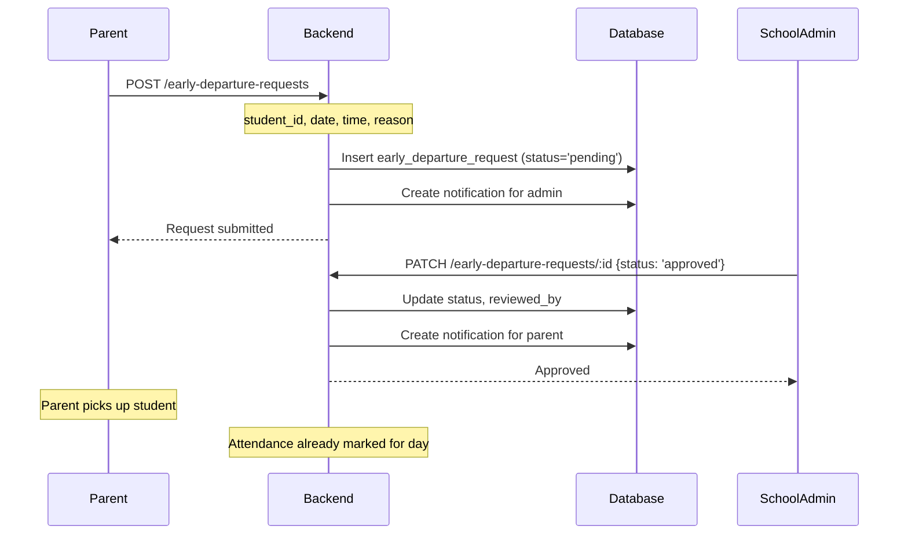
```mermaid
sequenceDiagram
    participant Parent
    participant Backend
    participant Database
    participant SchoolAdmin

    Parent->>Backend: POST /early-departure-requests
    Note over Backend: student_id, date, time, reason
    Backend->>Database: Insert early_departure_request (status='pending')
    Backend->>Database: Create notification for admin
    Backend-->>Parent: Request submitted
    
    SchoolAdmin->>Backend: PATCH /early-departure-requests/:id {status: 'approved'}
    Backend->>Database: Update status, reviewed_by
    Backend->>Database: Create notification for parent
    Backend-->>SchoolAdmin: Approved
    
    Note over Parent: Parent picks up student
    Note over Backend: Attendance already marked for day
```

### Annual Quota Tracking

**`leave_settings` table:**

* `annual_quota` - Default: 7 days per academic year

**Quota calculation:**

```sql
SELECT COUNT(*) 
FROM leave_requests 
WHERE student_id = ? 
  AND academic_year_id = ?
  AND status = 'approved';
```

If count ≥ annual\_quota, additional requests require special approval.

***

## 📊 Data Consistency & Integrity

### Key Relationships

**Student → Enrollment → Attendance → Assessment → Result Card**

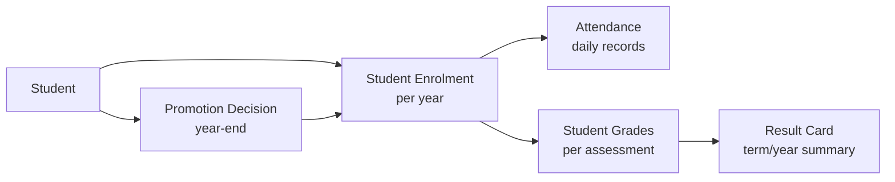
```mermaid
graph LR
    A[Student] --> B[Student Enrolment<br/>per year]
    B --> C[Attendance<br/>daily records]
    B --> D[Student Grades<br/>per assessment]
    D --> E[Result Card<br/>term/year summary]
    A --> F[Promotion Decision<br/>year-end]
    F --> B
```

### Cascade Rules

**When a student is deleted:**

* `student_enrolments` - CASCADE (deleted)
* `attendance` - CASCADE (deleted)
* `student_grades` - CASCADE (deleted)
* `result_cards` - CASCADE (deleted)
* `parent_students` - CASCADE (deleted)

**When an academic year is locked:**

* Prevent modifications to:
  * Attendance records
  * Assessment grades
  * Result cards
* Allow viewing only

***

## ⚙️ Background Jobs & Automation

### Scheduled Tasks

**Invitation Cleanup** (runs every 10 minutes):

* Deletes expired invitation tokens
* `invitations` table where `expires_at < NOW()`

**Tenant Deletion** (runs every 30 seconds):

* Processes deletion queue for schools requesting account deletion

### Real-Time Triggers

**On Assessment Published:**

* Create notifications for all students in class section
* Update `student_assessment_statuses` to 'not\_started'

**On Grade Entry:**

* Create notification for student
* Update `student_assessment_statuses` to 'graded'

**On Leave Approval:**

* Auto-mark attendance as 'excused' for date range
* Create notification for parent

***

## 🎯 Best Practices

### For Administrators




### Enrollment

* Send invitations immediately after creating student records
* Follow up with parents if invitation not used within 7 days
* Keep student records active only for currently enrolled students
  



### Attendance

* Mark attendance daily within first period
* Review and approve leave requests promptly
* Reconcile excused absences with leave requests
  



### Assessments

* Publish assessments only when ready for students
* Grade submissions within announced timeframe
* Provide meaningful feedback with grades
  



### Result Cards

* Generate draft cards before term end
* Review for accuracy before publishing
* Publish on scheduled date to avoid confusion
  



### Promotions

* Run promotion process before academic year rollover
* Manually review borderline cases
* Communicate decisions to parents before new year
  
  

### For Developers

1. **Always filter by branch and academic year** in queries
2. **Check RLS policies** for each table when modifying
3. **Use transactions** for multi-step workflows (enrollment, rollover)
4. **Log significant state changes** in audit\_logs table
5. **Handle edge cases** (student transfers, leave quota exceeded, etc.)

***

## 📝 Common Scenarios




### Scenario 1: New Student Enrollment Mid-Year

1. Admin creates student record
2. Sets `admission_date` to current date
3. Creates `student_enrolment` for current academic year
4. Links to parent via `parent_students`
5. Sends invitation to parent email
6. Parent sets up account
7. Student appears in class roster
8. Teacher can mark attendance going forward
   



### Scenario 2: Student Transfer to Another School

1. Admin marks student as transferred
2. Sets `students.is_active = false`
3. Sets `students.account_status = 'transferred'`
4. Student no longer appears in active rosters
5. Historical data (attendance, grades) is preserved
6. Can generate transfer certificate with historical data
   



### Scenario 3: Result Card Correction After Publishing

1. Teacher notices error in published result card
2. Teacher cannot edit published card directly
3. Options: a. Admin generates new result card (versioning) b. Admin unpublishes card, teacher edits, republishes
4. Audit log tracks all changes
5. Parent notification sent about update
   
   


---
