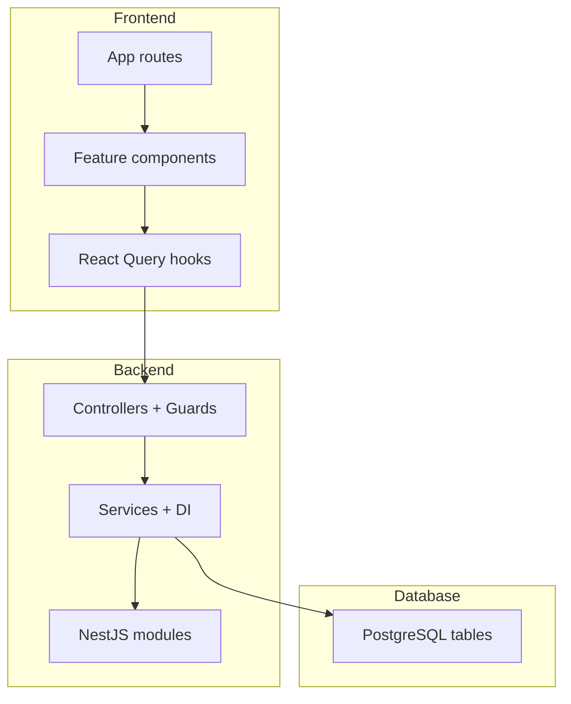
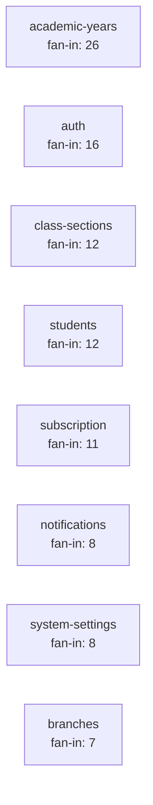

<!-- AUTO-GENERATED by scripts/generate-module-deps — do not edit -->

# Module Dependency Atlas

Auto-generated full-stack dependency report for NTG Alma.

**Generated:** 2026-08-20T05:50:07.576Z

**Regenerate:** `npm run docs:module-deps`

## How to read this report

| Metric | Meaning |
|--------|--------|
| **Fan-out** | Distinct modules this module depends on |
| **Fan-in** | Modules/features that depend on this one |
| **Hub rank** | 1 = most depended-on module |
| **Blast radius** | Transitive dependents within 3 hops |
| **Dependency rate** | `(fan-in + fan-out) / total modules × 100` |
| **Leaf** | No outbound deps at import level |
| **Hub** | Fan-in ≥ 10 |
| **Aggregator** | High frontend composition, low backend imports (e.g. Dashboard) |

## Dependency layers

## Top 10 hubs (highest fan-in)

| Rank | Module | Fan-in | Fan-out | Blast radius | Type |
|------|--------|--------|---------|--------------|------|
| 1 | [Academic Years](./modules/academic-years.md) | 26 | 2 | 33 | hub |
| 2 | [Auth](./modules/auth.md) | 16 | 5 | 27 | hub |
| 3 | [Class Sections](./modules/class-sections.md) | 12 | 3 | 22 | hub |
| 4 | [Students](./modules/students.md) | 12 | 10 | 17 | hub |
| 5 | [Subscription](./modules/subscription.md) | 11 | 4 | 33 | hub |
| 6 | [Notifications](./modules/notifications.md) | 8 | 1 | 23 | standard |
| 7 | [System Settings](./modules/system-settings.md) | 8 | 0 | 32 | leaf |
| 8 | [Branches](./modules/branches.md) | 7 | 2 | 17 | standard |
| 9 | [Staff](./modules/staff.md) | 7 | 2 | 14 | standard |
| 10 | [Roles](./modules/roles.md) | 5 | 0 | 21 | leaf |

## Top aggregators (high frontend composition)

| Module | Fan-out | Frontend fan-out | Backend fan-out | Type |
|--------|---------|------------------|-----------------|------|
| [Settings](./modules/settings.md) | 25 | 26 | 0 | aggregator |
| [Timetable](./modules/timetable.md) | 17 | 17 | 4 | standard |
| [Dashboard](./modules/dashboard.md) | 14 | 14 | 0 | aggregator |
| [Reports](./modules/reports.md) | 13 | 6 | 8 | standard |
| [Id Cards](./modules/id-cards.md) | 11 | 6 | 7 | standard |
| [Students](./modules/students.md) | 10 | 7 | 6 | hub |
| [Certificates](./modules/certificates.md) | 9 | 6 | 5 | standard |
| [Early Departure](./modules/early-departure.md) | 9 | 7 | 3 | standard |
| [Library](./modules/library.md) | 9 | 7 | 4 | standard |
| [Academic](./modules/academic.md) | 9 | 9 | 0 | aggregator |

## Plan-gated modules

These modules require subscription plan features (`FeatureAccessGuard` / sidebar `planLocked`):

- [Behavioral](./modules/behavioral.md)
- [Behavioral Framework](./modules/behavioral-framework.md)
- [Fees](./modules/fees.md)
- [Library](./modules/library.md)
- [Uniforms](./modules/uniforms.md)

## Known anomalies

| Module | Kind | Detail |
|--------|------|--------|
| invitations | duplicate-provider | Re-provides MailjetService without importing auth module |
| results | duplicate-provider | Re-provides PdfLogoCacheService without importing assessments module |
| student-self | duplicate-provider | Re-provides AcademicYearsService without importing academic-years module |
| student-self | duplicate-provider | Re-provides FeeCalculationService without importing fees module |
| student-self | duplicate-provider | Re-provides FeePdfService without importing fees module |
| student-self | duplicate-provider | Re-provides ChallanService without importing fees module |
| student-self | duplicate-provider | Re-provides PaymentService without importing fees module |
| academic-years | forwardRef-cycle | Circular forwardRef between academic-years and promotion-placement |
| promotion-placement | forwardRef-cycle | Circular forwardRef between promotion-placement and academic-years |

## Ecosystem overview

```mermaid
graph TB
  subgraph g0 ["Core System"]
    auth["auth"]
    tenants["tenants"]
    branches["branches"]
    users["users"]
    roles["roles"]
    registration["registration"]
    subscription["subscription"]
    invitations["invitations"]
  end
  subgraph g1 ["Academic Structure"]
    academic_years["academic-years"]
    core_lookups["core-lookups"]
    class_sections["class-sections"]
    subject_templates["subject-templates"]
    schedule["schedule"]
    timetable["timetable"]
    teacher_assignments["teacher-assignments"]
    grades["grades"]
  end
  subgraph g2 ["Student Management"]
    students["students"]
    parents["parents"]
    staff["staff"]
    student_self["student-self"]
  end
  subgraph g3 ["Assessment & Grading"]
    assessment["assessment"]
    assessments["assessments"]
    results["results"]
    rubrics["rubrics"]
  end
  subgraph g4 ["Attendance & Leave"]
    attendance["attendance"]
    leave_requests["leave-requests"]
    early_departure["early-departure"]
  end
  subgraph g5 ["Communication"]
    messages["messages"]
    notifications["notifications"]
    push["push"]
  end
  subgraph g6 ["Events & Behaviour"]
    events["events"]
    behavioral["behavioral"]
    behavioral_framework["behavioral-framework"]
  end
  subgraph g7 ["Library & Resources"]
    library["library"]
  end
  subgraph g8 ["Uniforms & Inventory"]
    uniforms["uniforms"]
    uniform_requests["uniform-requests"]
    uniform_issuances["uniform-issuances"]
  end
  subgraph g9 ["Finance"]
    fees["fees"]
  end
  subgraph g10 ["Reporting & Analytics"]
    reports["reports"]
    dashboard["dashboard"]
  end
  subgraph g11 ["Documents"]
    certificates["certificates"]
    id_cards["id-cards"]
  end
  subgraph g12 ["Utilities"]
    storage["storage"]
    bulk_import["bulk-import"]
    settings_import["settings-import"]
    system_settings["system-settings"]
    settings_status["settings-status"]
    setup_wizard["setup-wizard"]
    data_export["data-export"]
    student_placement["student-placement"]
  end
  subgraph g13 ["Scheduling"]
    substitutions["substitutions"]
  end
  subgraph g14 ["Integrations"]
    google_workspace["google-workspace"]
  end
```

## Module index

| Module | Category | Fan-in | Fan-out | Rate | Detail |
|--------|----------|--------|---------|------|--------|
| Academic | Frontend Feature | 0 | 9 | 15% | [View](./modules/academic.md) |
| Academic Years | Academic Structure | 26 | 2 | 46% | [View](./modules/academic-years.md) |
| Assessment | Assessment & Grading | 2 | 0 | 3% | [View](./modules/assessment.md) |
| Assessments | Assessment & Grading | 3 | 9 | 20% | [View](./modules/assessments.md) |
| Attendance | Attendance & Leave | 2 | 7 | 15% | [View](./modules/attendance.md) |
| Audit Logs | Other | 0 | 0 | 0% | [View](./modules/audit-logs.md) |
| Auth | Core System | 16 | 5 | 34% | [View](./modules/auth.md) |
| Behavioral | Events & Behaviour | 2 | 6 | 13% | [View](./modules/behavioral.md) |
| Behavioral Framework | Events & Behaviour | 2 | 3 | 8% | [View](./modules/behavioral-framework.md) |
| Branches | Core System | 7 | 2 | 15% | [View](./modules/branches.md) |
| Bulk Import | Utilities | 0 | 1 | 2% | [View](./modules/bulk-import.md) |
| Certificates | Documents | 1 | 9 | 16% | [View](./modules/certificates.md) |
| Class Sections | Academic Structure | 12 | 3 | 25% | [View](./modules/class-sections.md) |
| Core Lookups | Academic Structure | 1 | 0 | 2% | [View](./modules/core-lookups.md) |
| Dashboard | Reporting & Analytics | 0 | 14 | 23% | [View](./modules/dashboard.md) |
| Data Export | Utilities | 1 | 2 | 5% | [View](./modules/data-export.md) |
| Early Departure | Attendance & Leave | 1 | 9 | 16% | [View](./modules/early-departure.md) |
| Events | Events & Behaviour | 1 | 5 | 10% | [View](./modules/events.md) |
| Fees | Finance | 1 | 6 | 11% | [View](./modules/fees.md) |
| Google Classroom | Frontend Feature | 0 | 8 | 13% | [View](./modules/google-classroom.md) |
| Google Workspace | Integrations | 2 | 6 | 13% | [View](./modules/google-workspace.md) |
| Grades | Academic Structure | 3 | 4 | 11% | [View](./modules/grades.md) |
| Id Cards | Documents | 0 | 11 | 18% | [View](./modules/id-cards.md) |
| Inventory | Frontend Feature | 0 | 5 | 8% | [View](./modules/inventory.md) |
| Invitations | Core System | 2 | 2 | 7% | [View](./modules/invitations.md) |
| Leave Requests | Attendance & Leave | 3 | 3 | 10% | [View](./modules/leave-requests.md) |
| Leaves | Frontend Feature | 0 | 3 | 5% | [View](./modules/leaves.md) |
| Library | Library & Resources | 0 | 9 | 15% | [View](./modules/library.md) |
| Mapping | Frontend Feature | 0 | 6 | 10% | [View](./modules/mapping.md) |
| Messages | Communication | 1 | 3 | 7% | [View](./modules/messages.md) |
| Notifications | Communication | 8 | 1 | 15% | [View](./modules/notifications.md) |
| Offline | Frontend Feature | 0 | 0 | 0% | [View](./modules/offline.md) |
| Parents | Student Management | 3 | 5 | 13% | [View](./modules/parents.md) |
| Promotion Placement | Academic Structure | 1 | 2 | 5% | [View](./modules/promotion-placement.md) |
| Public | Frontend Feature | 0 | 0 | 0% | [View](./modules/public.md) |
| Push | Communication | 1 | 1 | 3% | [View](./modules/push.md) |
| Registration | Core System | 0 | 2 | 3% | [View](./modules/registration.md) |
| Reports | Reporting & Analytics | 1 | 13 | 23% | [View](./modules/reports.md) |
| Results | Assessment & Grading | 1 | 5 | 10% | [View](./modules/results.md) |
| Roles | Core System | 5 | 0 | 8% | [View](./modules/roles.md) |
| Rubrics | Assessment & Grading | 2 | 0 | 3% | [View](./modules/rubrics.md) |
| Schedule | Academic Structure | 2 | 0 | 3% | [View](./modules/schedule.md) |
| Settings | Frontend Feature | 2 | 25 | 44% | [View](./modules/settings.md) |
| Settings Import | Utilities | 0 | 6 | 10% | [View](./modules/settings-import.md) |
| Settings Status | Utilities | 1 | 0 | 2% | [View](./modules/settings-status.md) |
| Setup Wizard | Utilities | 1 | 1 | 3% | [View](./modules/setup-wizard.md) |
| Staff | Student Management | 7 | 2 | 15% | [View](./modules/staff.md) |
| Storage | Utilities | 4 | 1 | 8% | [View](./modules/storage.md) |
| Student Self | Student Management | 1 | 2 | 5% | [View](./modules/student-self.md) |
| Students | Student Management | 12 | 10 | 36% | [View](./modules/students.md) |
| Subject Templates | Academic Structure | 3 | 1 | 7% | [View](./modules/subject-templates.md) |
| Subscription | Core System | 11 | 4 | 25% | [View](./modules/subscription.md) |
| Substitutions | Scheduling | 1 | 3 | 7% | [View](./modules/substitutions.md) |
| System Settings | Utilities | 8 | 0 | 13% | [View](./modules/system-settings.md) |
| Teacher Assignments | Academic Structure | 4 | 1 | 8% | [View](./modules/teacher-assignments.md) |
| Tenants | Core System | 4 | 0 | 7% | [View](./modules/tenants.md) |
| Timetable | Academic Structure | 2 | 17 | 31% | [View](./modules/timetable.md) |
| Uniform Issuances | Uniforms & Inventory | 1 | 1 | 3% | [View](./modules/uniform-issuances.md) |
| Uniform Requests | Uniforms & Inventory | 1 | 2 | 5% | [View](./modules/uniform-requests.md) |
| Uniforms | Uniforms & Inventory | 4 | 4 | 13% | [View](./modules/uniforms.md) |
| Users | Core System | 2 | 5 | 11% | [View](./modules/users.md) |

## Quick debugging guide

1. **Dashboard widget broken** → open [Dashboard](./modules/dashboard.md), find widget row, jump to backend module page.
2. **403 on API** → check module's Access gates; verify RBAC matrix or plan feature.
3. **Blank nav item** → `navFeatureMap.ts` + `Sidebar.tsx` plan gates.
4. **Hub module regression** → check Top hubs table for blast radius before deploying.
5. **Data missing** → module Database tables section + branch_id filtering in service.
