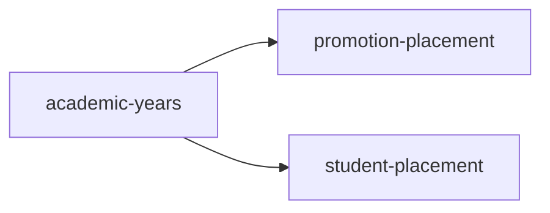

<!-- AUTO-GENERATED by scripts/generate-module-deps — do not edit -->

# Academic Years

> **Hub module** — many other modules depend on this. Changes here have wide impact.

## Dependency summary

| Fan-out | Fan-in | Hub rank | Blast radius | Dependency rate | Type |
|---------|--------|----------|--------------|-----------------|------|
| 2 | 26 | 1/61 | 33 | 46% | Hub |

- **Backend module:** `backend/src/modules/academic-years/academic-years.module.ts`
- **Category:** Academic Structure

## Depends on (outbound)

| Module | Layer | Via | Condition |
|--------|-------|-----|----------|
| promotion-placement | BE module | backend/src/modules/academic-years/academic-years.module.ts imports; forwardRef | — |
| student-placement | BE service | backend/src/modules/academic-years/academic-years.service.ts → StudentPlacementService | — |

## Depended on by (inbound)

| Consumer | Layer | Via | Condition |
|----------|-------|-----|----------|
| academic | FE feature | components/features/academic | — |
| assessments | BE module | backend/src/modules/assessments/assessments.module.ts imports | — |
| assessments | BE service | backend/src/modules/assessments/assessments.service.ts → AcademicYearsService | — |
| attendance | BE module | backend/src/modules/attendance/attendance.module.ts imports | — |
| attendance | BE service | backend/src/modules/attendance/attendance.service.ts → AcademicYearsService | — |
| behavioral | BE module | backend/src/modules/behavioral/behavioral.module.ts imports | — |
| behavioral | BE service | backend/src/modules/behavioral/behavioral.service.ts → AcademicYearsService | — |
| behavioral-framework | BE module | backend/src/modules/behavioral-framework/behavioral-framework.module.ts imports | — |
| behavioral-framework | BE service | backend/src/modules/behavioral-framework/behavioral-framework.service.ts → AcademicYearsService | — |
| certificates | BE module | backend/src/modules/certificates/certificates.module.ts imports | — |
| certificates | BE service | backend/src/modules/certificates/certificate-student-data.service.ts → AcademicYearsService | — |
| certificates | FE feature | components/features/certificates | — |
| class-sections | BE module | backend/src/modules/class-sections/class-sections.module.ts imports | — |
| class-sections | BE service | backend/src/modules/class-sections/class-sections.service.ts → AcademicYearsService | — |
| early-departure | BE module | backend/src/modules/early-departure/early-departure.module.ts imports | — |
| early-departure | BE service | backend/src/modules/early-departure/early-departure.service.ts → AcademicYearsService | — |
| events | BE module | backend/src/modules/events/events.module.ts imports | — |
| events | BE service | backend/src/modules/events/events.service.ts → AcademicYearsService | — |
| fees | BE module | backend/src/modules/fees/fees.module.ts imports | — |
| fees | BE service | backend/src/modules/fees/challan.service.ts → AcademicYearsService | — |
| fees | BE service | backend/src/modules/fees/fee-calculation.service.ts → AcademicYearsService | — |
| google-classroom | FE feature | components/features/google-classroom | — |
| grades | BE module | backend/src/modules/grades/grades.module.ts imports | — |
| grades | BE service | backend/src/modules/grades/grades.service.ts → AcademicYearsService | — |
| hook:useAcademicYears | FE hook | /api/v1/academic-years | — |
| id-cards | BE module | backend/src/modules/id-cards/id-cards.module.ts imports | — |
| id-cards | BE service | backend/src/modules/id-cards/id-cards.service.ts → AcademicYearsService | — |
| id-cards | FE feature | components/features/id-cards | — |
| leave-requests | BE module | backend/src/modules/leave-requests/leave-requests.module.ts imports | — |
| leave-requests | BE service | backend/src/modules/leave-requests/leave-requests.service.ts → AcademicYearsService | — |
| messages | BE module | backend/src/modules/messages/messages.module.ts imports | — |
| messages | BE service | backend/src/modules/messages/messages.service.ts → AcademicYearsService | — |
| promotion-placement | BE module | backend/src/modules/promotion-placement/promotion-placement.module.ts imports | — |
| promotion-placement | BE module | forwardRef | — |
| promotion-placement | BE service | backend/src/modules/promotion-placement/promotion-placement.service.ts → AcademicYearsService | — |
| registration | BE module | backend/src/modules/registration/registration.module.ts imports | — |
| registration | BE service | backend/src/modules/registration/registration.service.ts → AcademicYearsService | — |
| reports | BE module | backend/src/modules/reports/reports.module.ts imports | — |
| reports | BE service | backend/src/modules/reports/reports.service.ts → AcademicYearsService | — |
| results | BE module | backend/src/modules/results/results.module.ts imports | — |
| results | BE service | backend/src/modules/results/results.service.ts → AcademicYearsService | — |
| settings | FE feature | components/features/settings | — |
| settings-import | BE module | backend/src/modules/settings-import/settings-import.module.ts imports | — |
| settings-import | BE service | backend/src/modules/settings-import/settings-import.service.ts → AcademicYearsService | — |
| students | BE module | backend/src/modules/students/students.module.ts imports | — |
| students | BE service | backend/src/modules/students/students.service.ts → AcademicYearsService | — |
| students | FE feature | components/features/students | — |
| subject-templates | BE module | backend/src/modules/subject-templates/subject-templates.module.ts imports | — |
| subject-templates | BE service | backend/src/modules/subject-templates/subject-templates.service.ts → AcademicYearsService | — |
| substitutions | BE module | backend/src/modules/substitutions/substitutions.module.ts imports | — |
| substitutions | BE service | backend/src/modules/substitutions/substitutions.service.ts → AcademicYearsService | — |
| teacher-assignments | BE module | backend/src/modules/teacher-assignments/teacher-assignments.module.ts imports | — |
| teacher-assignments | BE service | backend/src/modules/teacher-assignments/teacher-assignments.service.ts → AcademicYearsService | — |
| timetable | BE module | backend/src/modules/timetable/timetable.module.ts imports | — |
| timetable | BE service | backend/src/modules/timetable/timetable.service.ts → AcademicYearsService | — |
| timetable | FE feature | components/features/timetable | — |

## Access gates

| Gate type | Condition | Applies to | Source |
|-----------|-----------|------------|--------|
| jwt | JwtAuthGuard | academic-years API | `backend/src/modules/academic-years/academic-years.controller.ts` |
| branch | BranchGuard (X-Branch-Id) | academic-years API | `backend/src/modules/academic-years/academic-years.controller.ts` |

## Database tables

| Table | Source file |
|-------|-------------|
| `academic_year_rollovers` | `backend/src/modules/academic-years/academic-years.service.ts` |
| `academic_years` | `backend/src/modules/academic-years/academic-years.service.ts` |
| `branches` | `backend/src/modules/academic-years/academic-years.service.ts` |
| `class_sections` | `backend/src/modules/academic-years/academic-years.service.ts` |
| `leave_settings` | `backend/src/modules/academic-years/academic-years.service.ts` |
| `student_enrolments` | `backend/src/modules/academic-years/academic-years.service.ts` |
| `student_promotion_decisions` | `backend/src/modules/academic-years/academic-years.service.ts` |
| `students` | `backend/src/modules/academic-years/academic-years.service.ts` |
| `teacher_assignments` | `backend/src/modules/academic-years/academic-years.service.ts` |
| `timetable_slots` | `backend/src/modules/academic-years/academic-years.service.ts` |

## Known anomalies

| Kind | Detail | Source |
|------|--------|--------|
| forwardRef-cycle | Circular forwardRef between academic-years and promotion-placement | — |

## Troubleshooting

| Symptom | Likely cause | Check first |
|---------|--------------|-------------|
| Many features broken after change | High fan-in hub — wide blast radius | Inbound dependents; blast radius: 33 |
| API returns 403 | RBAC or plan gate | Access gates section + `role_permissions` matrix |

## Dependency graph

