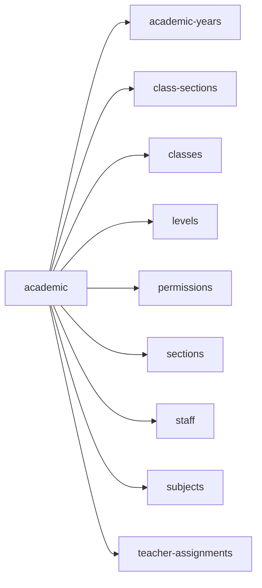

<!-- AUTO-GENERATED by scripts/generate-module-deps — do not edit -->

# Academic

> **Aggregator module** — composes multiple other modules (often via frontend widgets/hooks).

## Dependency summary

| Fan-out | Fan-in | Hub rank | Blast radius | Dependency rate | Type |
|---------|--------|----------|--------------|-----------------|------|
| 9 | 0 | 55/61 | 0 | 15% | Aggregator |

- **Frontend feature:** `frontend/src/components/features/academic`
- **Category:** Frontend Feature

## Depends on (outbound)

| Module | Layer | Via | Condition |
|--------|-------|-----|----------|
| academic-years | FE feature | components/features/academic | — |
| class-sections | FE feature | components/features/academic | — |
| classes | FE feature | components/features/academic | — |
| levels | FE feature | components/features/academic | — |
| permissions | FE feature | components/features/academic | — |
| sections | FE feature | components/features/academic | — |
| staff | FE feature | components/features/academic | — |
| subjects | FE feature | components/features/academic | — |
| teacher-assignments | FE feature | components/features/academic | — |

## Depended on by (inbound)

_No inbound dependencies detected._

## Access gates

| Gate type | Condition | Applies to | Source |
|-----------|-----------|------------|--------|
| jwt | JwtAuthGuard | academic-years API | `backend/src/modules/academic-years/academic-years.controller.ts` |
| branch | BranchGuard (X-Branch-Id) | academic-years API | `backend/src/modules/academic-years/academic-years.controller.ts` |
| widget-role | ROLE_WIDGETS.academic_coordinator | dashboard widgets for academic_coordinator role | `backend/src/modules/dashboard/dashboard.service.ts` |
| nav-rbac | canView('class_sections') | nav path /academic/class-sections | `frontend/src/lib/permission/navFeatureMap.ts` |
| nav-rbac | canView('teacher_mapping') | nav path /academic/teacher-mapping | `frontend/src/lib/permission/navFeatureMap.ts` |

## Database tables

_No `.from()` table references found in this module's services/controllers._

## Troubleshooting

| Symptom | Likely cause | Check first |
|---------|--------------|-------------|
| API 401/403 | Auth, branch, or permission gate | Controller guards + `ensureFeatureEditAccess` |
| Empty list or wrong branch data | Missing branch_id filter | Service `.eq('branch_id', branchId)` |
| Frontend not loading data | Hook or API mismatch | `frontend/src/hooks/` + Network tab |

## Dependency graph

