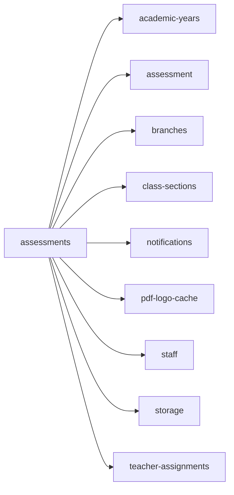

<!-- AUTO-GENERATED by scripts/generate-module-deps — do not edit -->

# Assessments

## Dependency summary

| Fan-out | Fan-in | Hub rank | Blast radius | Dependency rate | Type |
|---------|--------|----------|--------------|-----------------|------|
| 9 | 3 | 15/61 | 9 | 20% | Standard |

- **Backend module:** `backend/src/modules/assessments/assessments.module.ts`
- **Category:** Assessment & Grading

## Depends on (outbound)

| Module | Layer | Via | Condition |
|--------|-------|-----|----------|
| academic-years | BE module, BE service | backend/src/modules/assessments/assessments.module.ts imports; backend/src/modules/assessments/assessments.service.ts → AcademicYearsService | — |
| assessment | BE module | backend/src/modules/assessments/assessments.module.ts imports | — |
| branches | BE module, BE service | backend/src/modules/assessments/assessments.module.ts imports; backend/src/modules/assessments/assessments.service.ts → BranchesService | — |
| class-sections | BE module, BE service | backend/src/modules/assessments/assessments.module.ts imports; backend/src/modules/assessments/assessments.service.ts → ClassSectionsService | — |
| notifications | BE module, BE service | backend/src/modules/assessments/assessments.module.ts imports; backend/src/modules/assessments/assessments.service.ts → NotificationsService | — |
| pdf-logo-cache | BE service | backend/src/modules/assessments/assessments.service.ts → PdfLogoCacheService | — |
| staff | BE module, BE service | backend/src/modules/assessments/assessments.module.ts imports; backend/src/modules/assessments/assessments.service.ts → StaffService | — |
| storage | BE module, BE service | backend/src/modules/assessments/assessments.module.ts imports; backend/src/modules/assessments/assessments.service.ts → StorageService | — |
| teacher-assignments | BE module, BE service | backend/src/modules/assessments/assessments.module.ts imports; backend/src/modules/assessments/assessments.service.ts → TeacherAssignmentsService | — |

## Depended on by (inbound)

| Consumer | Layer | Via | Condition |
|----------|-------|-----|----------|
| dashboard | FE feature | components/features/dashboard | — |
| dashboard | FE feature | widget:pending_grading | — |
| dashboard | FE feature | widget:upcoming_assessments | — |
| grades | BE module | backend/src/modules/grades/grades.module.ts imports | — |
| grades | BE service | backend/src/modules/grades/grades.service.ts → AssessmentsService | — |
| hook:useAssessmentAttachments | FE hook | /api/v1/assessments | — |
| hook:useAssessments | FE hook | /api/v1/assessments | — |
| hook:useMyAssessments | FE hook | /api/v1/assessments | — |
| sidebar | FE nav | /assessments | RBAC feature assessment |
| sidebar | FE nav | /my-assessments | RBAC feature my_assessments |
| student-self | BE module | backend/src/modules/student-self/student-self.module.ts imports | — |

## Access gates

| Gate type | Condition | Applies to | Source |
|-----------|-----------|------------|--------|
| jwt | JwtAuthGuard | assessments API | `backend/src/modules/assessments/assessments.controller.ts` |
| branch | BranchGuard (X-Branch-Id) | assessments API | `backend/src/modules/assessments/assessments.controller.ts` |
| nav-rbac | canView('assessment') | nav path /assessments | `frontend/src/lib/permission/navFeatureMap.ts` |
| nav-rbac | canView('my_assessments') | nav path /my-assessments | `frontend/src/lib/permission/navFeatureMap.ts` |

## Database tables

| Table | Source file |
|-------|-------------|
| `assessment_attachments` | `backend/src/modules/assessments/assessments.service.ts` |
| `assessment_draft_files` | `backend/src/modules/assessments/assessments.service.ts` |
| `assessment_types` | `backend/src/modules/assessments/assessments.service.ts` |
| `assessments` | `backend/src/modules/assessments/assessments.service.ts` |
| `branches` | `backend/src/modules/assessments/assessments.controller.ts` |
| `class_sections` | `backend/src/modules/assessments/assessments.service.ts` |
| `features` | `backend/src/modules/assessments/assessments.controller.ts` |
| `parent_students` | `backend/src/modules/assessments/assessments.service.ts` |
| `profiles` | `backend/src/modules/assessments/assessments.service.ts` |
| `role_permissions` | `backend/src/modules/assessments/assessments.controller.ts` |
| `roles` | `backend/src/modules/assessments/assessments.controller.ts` |
| `staff` | `backend/src/modules/assessments/assessments.service.ts` |
| `student_assessment_statuses` | `backend/src/modules/assessments/assessments.service.ts` |
| `student_enrolments` | `backend/src/modules/assessments/assessments.service.ts` |
| `student_grades` | `backend/src/modules/assessments/assessments.service.ts` |
| `student_subject_template_assignments` | `backend/src/modules/assessments/assessments.service.ts` |
| `students` | `backend/src/modules/assessments/assessments.service.ts` |
| `subject_template_subjects` | `backend/src/modules/assessments/assessments.service.ts` |
| `subjects` | `backend/src/modules/assessments/assessments.service.ts` |
| `teacher_assignments` | `backend/src/modules/assessments/assessments.service.ts` |
| `tenants` | `backend/src/modules/assessments/assessments.service.ts` |
| `user_roles` | `backend/src/modules/assessments/assessments.service.ts` |

## Troubleshooting

| Symptom | Likely cause | Check first |
|---------|--------------|-------------|
| API 401/403 | Auth, branch, or permission gate | Controller guards + `ensureFeatureEditAccess` |
| Empty list or wrong branch data | Missing branch_id filter | Service `.eq('branch_id', branchId)` |
| Frontend not loading data | Hook or API mismatch | `frontend/src/hooks/` + Network tab |

## Dependency graph

