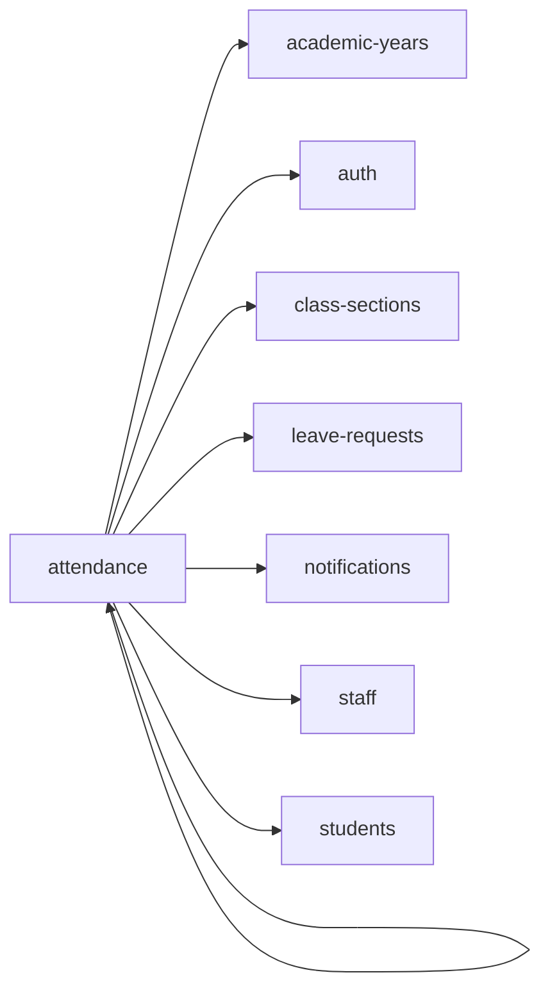

<!-- AUTO-GENERATED by scripts/generate-module-deps — do not edit -->

# Attendance

## Dependency summary

| Fan-out | Fan-in | Hub rank | Blast radius | Dependency rate | Type |
|---------|--------|----------|--------------|-----------------|------|
| 7 | 2 | 21/61 | 4 | 15% | Standard |

- **Backend module:** `backend/src/modules/attendance/attendance.module.ts`
- **Frontend feature:** `frontend/src/components/features/attendance`
- **Category:** Attendance & Leave

## Depends on (outbound)

| Module | Layer | Via | Condition |
|--------|-------|-----|----------|
| academic-years | BE module, BE service | backend/src/modules/attendance/attendance.module.ts imports; backend/src/modules/attendance/attendance.service.ts → AcademicYearsService | — |
| attendance | FE feature | components/features/attendance | — |
| auth | FE feature | components/features/attendance | — |
| class-sections | FE feature | components/features/attendance | — |
| leave-requests | BE module, BE service | backend/src/modules/attendance/attendance.module.ts imports; backend/src/modules/attendance/attendance.service.ts → LeaveRequestsService | — |
| notifications | BE module, BE service | backend/src/modules/attendance/attendance.module.ts imports; backend/src/modules/attendance/attendance.service.ts → NotificationsService | — |
| staff | FE feature | components/features/attendance | — |
| students | FE feature | components/features/attendance | — |

## Depended on by (inbound)

| Consumer | Layer | Via | Condition |
|----------|-------|-----|----------|
| attendance | FE feature | components/features/attendance | — |
| dashboard | FE feature | components/features/dashboard | — |
| dashboard | FE feature | widget:class_attendance | — |
| dashboard | FE feature | widget:child_today | — |
| hook:useAttendance | FE hook | /api/v1/attendance | — |
| reports | BE module | backend/src/modules/reports/reports.module.ts imports | — |
| reports | BE service | backend/src/modules/reports/reports.service.ts → AttendanceService | — |
| sidebar | FE nav | /attendance | RBAC feature attendance |

## Access gates

| Gate type | Condition | Applies to | Source |
|-----------|-----------|------------|--------|
| jwt | JwtAuthGuard | attendance API | `backend/src/modules/attendance/attendance.controller.ts` |
| branch | BranchGuard (X-Branch-Id) | attendance API | `backend/src/modules/attendance/attendance.controller.ts` |
| rbac | ensureFeatureEditAccess('attendance') | attendance write endpoints | `backend/src/modules/attendance/attendance.controller.ts` |
| nav-rbac | canView('attendance') | nav path /attendance | `frontend/src/lib/permission/navFeatureMap.ts` |

## Database tables

| Table | Source file |
|-------|-------------|
| `academic_years` | `backend/src/modules/attendance/attendance.service.ts` |
| `attendance` | `backend/src/modules/attendance/attendance.service.ts` |
| `class_sections` | `backend/src/modules/attendance/attendance.service.ts` |
| `classes` | `backend/src/modules/attendance/attendance.service.ts` |
| `features` | `backend/src/modules/attendance/attendance.controller.ts` |
| `leave_requests` | `backend/src/modules/attendance/attendance.service.ts` |
| `parent_students` | `backend/src/modules/attendance/attendance.service.ts` |
| `profiles` | `backend/src/modules/attendance/attendance.service.ts` |
| `role_permissions` | `backend/src/modules/attendance/attendance.controller.ts` |
| `roles` | `backend/src/modules/attendance/attendance.controller.ts` |
| `sections` | `backend/src/modules/attendance/attendance.service.ts` |
| `staff` | `backend/src/modules/attendance/attendance.service.ts` |
| `student_enrolments` | `backend/src/modules/attendance/attendance.service.ts` |
| `students` | `backend/src/modules/attendance/attendance.service.ts` |
| `teacher_assignments` | `backend/src/modules/attendance/attendance.service.ts` |

## Troubleshooting

| Symptom | Likely cause | Check first |
|---------|--------------|-------------|
| API 401/403 | Auth, branch, or permission gate | Controller guards + `ensureFeatureEditAccess` |
| Empty list or wrong branch data | Missing branch_id filter | Service `.eq('branch_id', branchId)` |
| Frontend not loading data | Hook or API mismatch | `frontend/src/hooks/` + Network tab |

## Dependency graph

