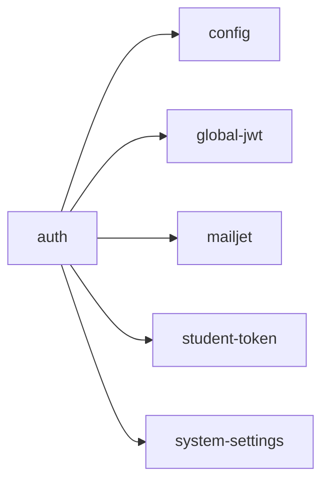

<!-- AUTO-GENERATED by scripts/generate-module-deps — do not edit -->

# Auth

> **Hub module** — many other modules depend on this. Changes here have wide impact.

## Dependency summary

| Fan-out | Fan-in | Hub rank | Blast radius | Dependency rate | Type |
|---------|--------|----------|--------------|-----------------|------|
| 5 | 16 | 2/61 | 27 | 34% | Hub |

- **Backend module:** `backend/src/modules/auth/auth.module.ts`
- **Category:** Core System

## Depends on (outbound)

| Module | Layer | Via | Condition |
|--------|-------|-----|----------|
| config | BE service | backend/src/modules/auth/password-reset.service.ts → ConfigService | — |
| global-jwt | BE module | backend/src/modules/auth/auth.module.ts imports | — |
| mailjet | BE service | backend/src/modules/auth/password-reset.service.ts → MailjetService | — |
| student-token | BE service | backend/src/modules/auth/auth.service.ts → StudentTokenService | — |
| system-settings | BE module, BE service | backend/src/modules/auth/auth.module.ts imports; backend/src/modules/auth/auth.service.ts → SystemSettingsService | — |

## Depended on by (inbound)

| Consumer | Layer | Via | Condition |
|----------|-------|-----|----------|
| attendance | FE feature | components/features/attendance | — |
| branches | BE module | backend/src/modules/branches/branches.module.ts imports | — |
| branches | FE feature | components/features/branches | — |
| certificates | FE feature | components/features/certificates | — |
| dashboard | FE feature | components/features/dashboard | — |
| dashboard | FE feature | widget:class_attendance | — |
| dashboard | FE feature | widget:child_today | — |
| dashboard | FE feature | widget:branch_overview | — |
| dashboard | FE feature | widget:today_schedule | — |
| dashboard | FE feature | widget:grades_overview | — |
| early-departure | FE feature | components/features/early-departure | — |
| events | FE feature | components/features/events | — |
| grades | BE module | backend/src/modules/grades/grades.module.ts imports | — |
| hook:useAuth | FE hook | /api/v1/auth | — |
| hook:useBranchSwitcher | FE hook | /api/v1/auth | — |
| hook:useProfile | FE hook | /api/v1/auth | — |
| hook:useStudents | FE hook | /api/v1/auth | — |
| inventory | FE feature | components/features/inventory | — |
| leaves | FE feature | components/features/leaves | — |
| library | FE feature | components/features/library | — |
| mapping | FE feature | components/features/mapping | — |
| parents | FE feature | components/features/parents | — |
| reports | FE feature | components/features/reports | — |
| settings | FE feature | components/features/settings | — |
| students | FE feature | components/features/students | — |
| timetable | FE feature | components/features/timetable | — |

## Access gates

| Gate type | Condition | Applies to | Source |
|-----------|-----------|------------|--------|
| jwt | JwtAuthGuard | auth API | `backend/src/modules/auth/auth.controller.ts` |

## Database tables

| Table | Source file |
|-------|-------------|
| `academic_years` | `backend/src/modules/auth/auth.service.ts` |
| `assessment_types` | `backend/src/modules/auth/auth.service.ts` |
| `branches` | `backend/src/modules/auth/auth.service.ts` |
| `invitations` | `backend/src/modules/auth/password-reset.service.ts` |
| `parent_students` | `backend/src/modules/auth/auth.service.ts` |
| `profiles` | `backend/src/modules/auth/auth-public.controller.ts` |
| `roles` | `backend/src/modules/auth/auth.service.ts` |
| `students` | `backend/src/modules/auth/auth-public.controller.ts` |
| `tenants` | `backend/src/modules/auth/auth.service.ts` |
| `user_branches` | `backend/src/modules/auth/auth.service.ts` |
| `user_roles` | `backend/src/modules/auth/auth.service.ts` |

## Troubleshooting

| Symptom | Likely cause | Check first |
|---------|--------------|-------------|
| Many features broken after change | High fan-in hub — wide blast radius | Inbound dependents; blast radius: 27 |
| API returns 403 | RBAC or plan gate | Access gates section + `role_permissions` matrix |

## Dependency graph

