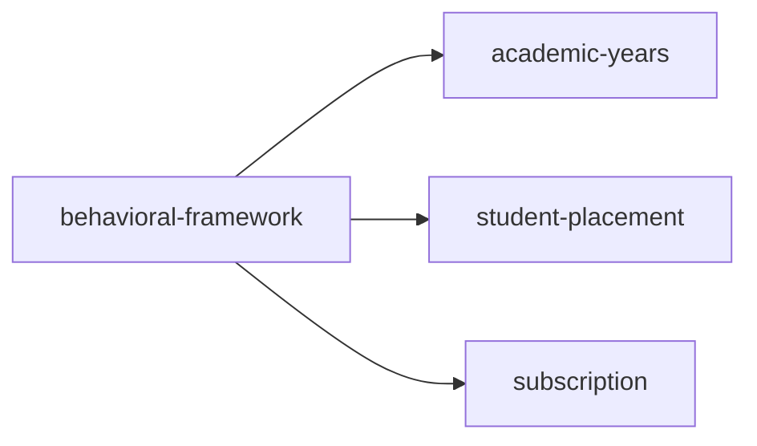

<!-- AUTO-GENERATED by scripts/generate-module-deps — do not edit -->

# Behavioral Framework

## Dependency summary

| Fan-out | Fan-in | Hub rank | Blast radius | Dependency rate | Type |
|---------|--------|----------|--------------|-----------------|------|
| 3 | 2 | 23/61 | 7 | 8% | Standard |

- **Backend module:** `backend/src/modules/behavioral-framework/behavioral-framework.module.ts`
- **Category:** Events & Behaviour

## Depends on (outbound)

| Module | Layer | Via | Condition |
|--------|-------|-----|----------|
| academic-years | BE module, BE service | backend/src/modules/behavioral-framework/behavioral-framework.module.ts imports; backend/src/modules/behavioral-framework/behavioral-framework.service.ts → AcademicYearsService | — |
| student-placement | BE service | backend/src/modules/behavioral-framework/behavioral-framework.service.ts → StudentPlacementService | — |
| subscription | BE module | backend/src/modules/behavioral-framework/behavioral-framework.module.ts imports | — |

## Depended on by (inbound)

| Consumer | Layer | Via | Condition |
|----------|-------|-----|----------|
| behavioral | FE feature | components/features/behavioral | — |
| hook:useBehavioralFramework | FE hook | /api/v1/behavioral-framework | — |
| settings | FE feature | components/features/settings | — |

## Access gates

| Gate type | Condition | Applies to | Source |
|-----------|-----------|------------|--------|
| jwt | JwtAuthGuard | behavioral-framework API | `backend/src/modules/behavioral-framework/behavioral-framework.controller.ts` |
| branch | BranchGuard (X-Branch-Id) | behavioral-framework API | `backend/src/modules/behavioral-framework/behavioral-framework.controller.ts` |
| plan | RequiresFeature('hasBehavioralTracking') | behavioral-framework API | `backend/src/modules/behavioral-framework/behavioral-framework.controller.ts` |
| rbac | ensureFeatureEditAccess() | behavioral-framework write endpoints | `backend/src/modules/behavioral-framework/behavioral-framework.controller.ts` |

## Database tables

| Table | Source file |
|-------|-------------|
| `behavioral_assessments` | `backend/src/modules/behavioral-framework/behavioral-framework.service.ts` |
| `behavioral_framework_categories` | `backend/src/modules/behavioral-framework/behavioral-framework.service.ts` |
| `behavioral_framework_presets` | `backend/src/modules/behavioral-framework/behavioral-framework.service.ts` |
| `behavioral_scores` | `backend/src/modules/behavioral-framework/behavioral-framework.service.ts` |
| `branch_behavioral_config` | `backend/src/modules/behavioral-framework/behavioral-framework.service.ts` |
| `class_sections` | `backend/src/modules/behavioral-framework/behavioral-framework.service.ts` |
| `features` | `backend/src/modules/behavioral-framework/behavioral-framework.controller.ts` |
| `role_permissions` | `backend/src/modules/behavioral-framework/behavioral-framework.controller.ts` |
| `roles` | `backend/src/modules/behavioral-framework/behavioral-framework.controller.ts` |
| `student_framework_category_scores` | `backend/src/modules/behavioral-framework/behavioral-framework.service.ts` |
| `student_framework_ratings` | `backend/src/modules/behavioral-framework/behavioral-framework.service.ts` |
| `students` | `backend/src/modules/behavioral-framework/behavioral-framework.service.ts` |

## Troubleshooting

| Symptom | Likely cause | Check first |
|---------|--------------|-------------|
| Feature locked or 403 | Subscription plan missing feature | `FeatureAccessGuard`, `useSubscriptionFeatures()` |
| Nav item dimmed/disabled | Plan gate on sidebar | `Sidebar.tsx` subscriptionNavFeatures |

## Dependency graph

