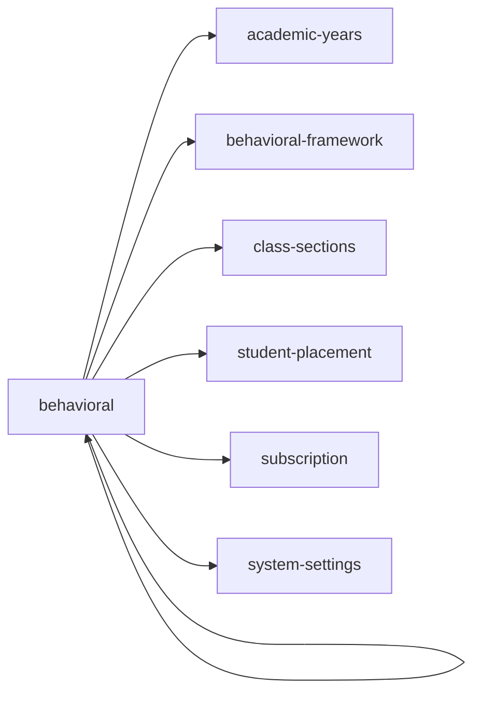

<!-- AUTO-GENERATED by scripts/generate-module-deps — do not edit -->

# Behavioral

## Dependency summary

| Fan-out | Fan-in | Hub rank | Blast radius | Dependency rate | Type |
|---------|--------|----------|--------------|-----------------|------|
| 6 | 2 | 22/61 | 5 | 13% | Standard |

- **Backend module:** `backend/src/modules/behavioral/behavioral.module.ts`
- **Frontend feature:** `frontend/src/components/features/behavioral`
- **Category:** Events & Behaviour

## Depends on (outbound)

| Module | Layer | Via | Condition |
|--------|-------|-----|----------|
| academic-years | BE module, BE service | backend/src/modules/behavioral/behavioral.module.ts imports; backend/src/modules/behavioral/behavioral.service.ts → AcademicYearsService | — |
| behavioral | FE feature | components/features/behavioral | — |
| behavioral-framework | FE feature | components/features/behavioral | — |
| class-sections | FE feature | components/features/behavioral | — |
| student-placement | BE service | backend/src/modules/behavioral/behavioral.service.ts → StudentPlacementService | — |
| subscription | BE module | backend/src/modules/behavioral/behavioral.module.ts imports | — |
| system-settings | BE module, BE service | backend/src/modules/behavioral/behavioral.module.ts imports; backend/src/modules/behavioral/behavioral.service.ts → SystemSettingsService | — |

## Depended on by (inbound)

| Consumer | Layer | Via | Condition |
|----------|-------|-----|----------|
| behavioral | FE feature | components/features/behavioral | — |
| hook:useBehavioral | FE hook | /api/v1/behavioral | — |
| reports | BE module | backend/src/modules/reports/reports.module.ts imports | — |
| reports | BE service | backend/src/modules/reports/reports.service.ts → BehavioralService | — |
| results | BE module | backend/src/modules/results/results.module.ts imports | — |
| results | BE service | backend/src/modules/results/results.service.ts → BehavioralService | — |
| sidebar | FE nav | /behavioral | RBAC feature behavioral |

## Access gates

| Gate type | Condition | Applies to | Source |
|-----------|-----------|------------|--------|
| jwt | JwtAuthGuard | behavioral API | `backend/src/modules/behavioral/behavioral.controller.ts` |
| branch | BranchGuard (X-Branch-Id) | behavioral API | `backend/src/modules/behavioral/behavioral.controller.ts` |
| plan | RequiresFeature('hasBehavioralTracking') | behavioral API | `backend/src/modules/behavioral/behavioral.controller.ts` |
| rbac | ensureFeatureEditAccess('behavioral') | behavioral write endpoints | `backend/src/modules/behavioral/behavioral.controller.ts` |
| jwt | JwtAuthGuard | behavioral-framework API | `backend/src/modules/behavioral-framework/behavioral-framework.controller.ts` |
| branch | BranchGuard (X-Branch-Id) | behavioral-framework API | `backend/src/modules/behavioral-framework/behavioral-framework.controller.ts` |
| plan | RequiresFeature('hasBehavioralTracking') | behavioral-framework API | `backend/src/modules/behavioral-framework/behavioral-framework.controller.ts` |
| rbac | ensureFeatureEditAccess() | behavioral-framework write endpoints | `backend/src/modules/behavioral-framework/behavioral-framework.controller.ts` |
| nav-rbac | canView('behavioral') | nav path /behavioral | `frontend/src/lib/permission/navFeatureMap.ts` |
| nav-plan | hasBehavioralTracking | nav path /behavioral (planLocked when false) | `frontend/src/components/layout/Sidebar.tsx` |

## Database tables

| Table | Source file |
|-------|-------------|
| `behavioral_assessments` | `backend/src/modules/behavioral/behavioral.service.ts` |
| `behavioral_scores` | `backend/src/modules/behavioral/behavioral.service.ts` |
| `class_sections` | `backend/src/modules/behavioral/behavioral.service.ts` |
| `classes` | `backend/src/modules/behavioral/behavioral.service.ts` |
| `features` | `backend/src/modules/behavioral/behavioral.controller.ts` |
| `profiles` | `backend/src/modules/behavioral/behavioral.service.ts` |
| `role_permissions` | `backend/src/modules/behavioral/behavioral.controller.ts` |
| `roles` | `backend/src/modules/behavioral/behavioral.controller.ts` |
| `sections` | `backend/src/modules/behavioral/behavioral.service.ts` |
| `staff` | `backend/src/modules/behavioral/behavioral.service.ts` |
| `students` | `backend/src/modules/behavioral/behavioral.service.ts` |
| `teacher_assignments` | `backend/src/modules/behavioral/behavioral.service.ts` |

## Troubleshooting

| Symptom | Likely cause | Check first |
|---------|--------------|-------------|
| Feature locked or 403 | Subscription plan missing feature | `FeatureAccessGuard`, `useSubscriptionFeatures()` |
| Nav item dimmed/disabled | Plan gate on sidebar | `Sidebar.tsx` subscriptionNavFeatures |

## Dependency graph

