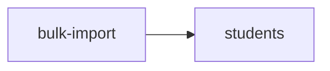

<!-- AUTO-GENERATED by scripts/generate-module-deps — do not edit -->

# Bulk Import

## Dependency summary

| Fan-out | Fan-in | Hub rank | Blast radius | Dependency rate | Type |
|---------|--------|----------|--------------|-----------------|------|
| 1 | 0 | 49/61 | 0 | 2% | Standard |

- **Backend module:** `backend/src/modules/bulk-import/bulk-import.module.ts`
- **Category:** Utilities

## Depends on (outbound)

| Module | Layer | Via | Condition |
|--------|-------|-----|----------|
| students | BE module, BE service | backend/src/modules/bulk-import/bulk-import.module.ts imports; backend/src/modules/bulk-import/bulk-import.service.ts → StudentsService | — |

## Depended on by (inbound)

_No inbound dependencies detected._

## Access gates

| Gate type | Condition | Applies to | Source |
|-----------|-----------|------------|--------|
| jwt | JwtAuthGuard | bulk-import API | `backend/src/modules/bulk-import/bulk-import.controller.ts` |
| branch | BranchGuard (X-Branch-Id) | bulk-import API | `backend/src/modules/bulk-import/bulk-import.controller.ts` |

## Database tables

| Table | Source file |
|-------|-------------|
| `branches` | `backend/src/modules/bulk-import/bulk-import.service.ts` |
| `class_subject_template_assignments` | `backend/src/modules/bulk-import/bulk-import.service.ts` |
| `classes` | `backend/src/modules/bulk-import/bulk-import.service.ts` |
| `level_classes` | `backend/src/modules/bulk-import/bulk-import.service.ts` |
| `level_subject_template_assignments` | `backend/src/modules/bulk-import/bulk-import.service.ts` |
| `sections` | `backend/src/modules/bulk-import/bulk-import.service.ts` |
| `subject_templates` | `backend/src/modules/bulk-import/bulk-import.service.ts` |
| `tenants` | `backend/src/modules/bulk-import/bulk-import.service.ts` |

## Troubleshooting

| Symptom | Likely cause | Check first |
|---------|--------------|-------------|
| API 401/403 | Auth, branch, or permission gate | Controller guards + `ensureFeatureEditAccess` |
| Empty list or wrong branch data | Missing branch_id filter | Service `.eq('branch_id', branchId)` |
| Frontend not loading data | Hook or API mismatch | `frontend/src/hooks/` + Network tab |

## Dependency graph

