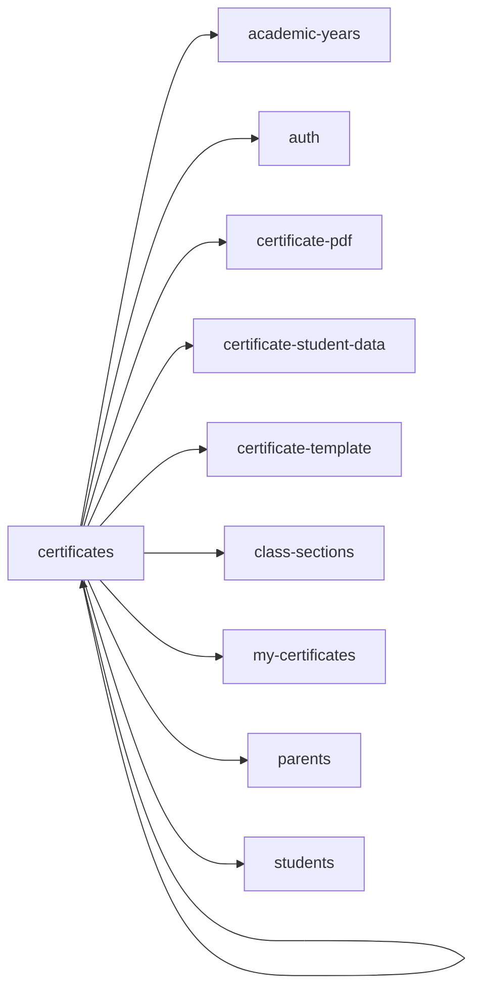

<!-- AUTO-GENERATED by scripts/generate-module-deps — do not edit -->

# Certificates

## Dependency summary

| Fan-out | Fan-in | Hub rank | Blast radius | Dependency rate | Type |
|---------|--------|----------|--------------|-----------------|------|
| 9 | 1 | 31/61 | 4 | 16% | Standard |

- **Backend module:** `backend/src/modules/certificates/certificates.module.ts`
- **Frontend feature:** `frontend/src/components/features/certificates`
- **Category:** Documents

## Depends on (outbound)

| Module | Layer | Via | Condition |
|--------|-------|-----|----------|
| academic-years | BE module, BE service, FE feature | backend/src/modules/certificates/certificates.module.ts imports; backend/src/modules/certificates/certificate-student-data.service.ts → AcademicYearsService | — |
| auth | FE feature | components/features/certificates | — |
| certificate-pdf | BE service | backend/src/modules/certificates/certificates.service.ts → CertificatePdfService | — |
| certificate-student-data | BE service | backend/src/modules/certificates/certificates.service.ts → CertificateStudentDataService | — |
| certificate-template | BE service | backend/src/modules/certificates/certificates.service.ts → CertificateTemplateService | — |
| certificates | FE feature | components/features/certificates | — |
| class-sections | FE feature | components/features/certificates | — |
| my-certificates | FE feature | components/features/certificates | — |
| parents | BE module, BE service | backend/src/modules/certificates/certificates.module.ts imports; backend/src/modules/certificates/certificate-student-data.service.ts → ParentsService | — |
| students | FE feature | components/features/certificates | — |

## Depended on by (inbound)

| Consumer | Layer | Via | Condition |
|----------|-------|-----|----------|
| certificates | FE feature | components/features/certificates | — |
| hook:useCertificates | FE hook | /api/v1/certificates | — |
| sidebar | FE nav | /certificates | RBAC feature certificates |
| sidebar | FE nav | /my-certificates | RBAC feature certificates |
| sidebar | FE nav | /settings/certificates | RBAC feature certificates |
| student-self | BE module | backend/src/modules/student-self/student-self.module.ts imports | — |

## Access gates

| Gate type | Condition | Applies to | Source |
|-----------|-----------|------------|--------|
| jwt | JwtAuthGuard | certificates API | `backend/src/modules/certificates/certificates-portal.controller.ts` |
| branch | BranchGuard (X-Branch-Id) | certificates API | `backend/src/modules/certificates/certificates-portal.controller.ts` |
| jwt | JwtAuthGuard | certificates API | `backend/src/modules/certificates/certificates.controller.ts` |
| branch | BranchGuard (X-Branch-Id) | certificates API | `backend/src/modules/certificates/certificates.controller.ts` |
| rbac | ensureFeatureEditAccess() | certificates write endpoints | `backend/src/modules/certificates/certificates.controller.ts` |
| nav-rbac | canView('certificates') | nav path /certificates | `frontend/src/lib/permission/navFeatureMap.ts` |
| nav-rbac | canView('certificates') | nav path /my-certificates | `frontend/src/lib/permission/navFeatureMap.ts` |
| nav-rbac | canView('certificates') | nav path /settings/certificates | `frontend/src/lib/permission/navFeatureMap.ts` |

## Database tables

| Table | Source file |
|-------|-------------|
| `academic_years` | `backend/src/modules/certificates/certificate-student-data.service.ts` |
| `branches` | `backend/src/modules/certificates/certificates.service.ts` |
| `certificate_settings` | `backend/src/modules/certificates/certificates.service.ts` |
| `certificates` | `backend/src/modules/certificates/certificates-portal.controller.ts` |
| `class_sections` | `backend/src/modules/certificates/certificate-student-data.service.ts` |
| `classes` | `backend/src/modules/certificates/certificate-student-data.service.ts` |
| `features` | `backend/src/modules/certificates/certificates-portal.controller.ts` |
| `parent_students` | `backend/src/modules/certificates/certificates-portal.controller.ts` |
| `profiles` | `backend/src/modules/certificates/certificate-student-data.service.ts` |
| `role_permissions` | `backend/src/modules/certificates/certificates-portal.controller.ts` |
| `roles` | `backend/src/modules/certificates/certificates-portal.controller.ts` |
| `sections` | `backend/src/modules/certificates/certificate-student-data.service.ts` |
| `staff` | `backend/src/modules/certificates/certificate-student-data.service.ts` |
| `student_enrolments` | `backend/src/modules/certificates/certificate-student-data.service.ts` |
| `students` | `backend/src/modules/certificates/certificate-student-data.service.ts` |
| `tenants` | `backend/src/modules/certificates/certificates.service.ts` |

## Troubleshooting

| Symptom | Likely cause | Check first |
|---------|--------------|-------------|
| API 401/403 | Auth, branch, or permission gate | Controller guards + `ensureFeatureEditAccess` |
| Empty list or wrong branch data | Missing branch_id filter | Service `.eq('branch_id', branchId)` |
| Frontend not loading data | Hook or API mismatch | `frontend/src/hooks/` + Network tab |

## Dependency graph

