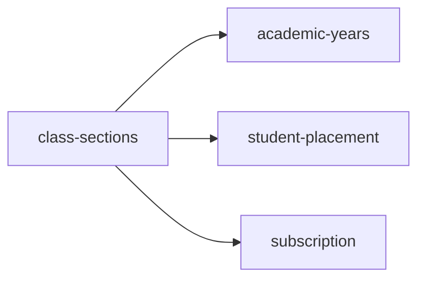

<!-- AUTO-GENERATED by scripts/generate-module-deps — do not edit -->

# Class Sections

> **Hub module** — many other modules depend on this. Changes here have wide impact.

## Dependency summary

| Fan-out | Fan-in | Hub rank | Blast radius | Dependency rate | Type |
|---------|--------|----------|--------------|-----------------|------|
| 3 | 12 | 3/61 | 22 | 25% | Hub |

- **Backend module:** `backend/src/modules/class-sections/class-sections.module.ts`
- **Category:** Academic Structure

## Depends on (outbound)

| Module | Layer | Via | Condition |
|--------|-------|-----|----------|
| academic-years | BE module, BE service | backend/src/modules/class-sections/class-sections.module.ts imports; backend/src/modules/class-sections/class-sections.service.ts → AcademicYearsService | — |
| student-placement | BE service | backend/src/modules/class-sections/class-sections.service.ts → StudentPlacementService | — |
| subscription | BE module, BE service | backend/src/modules/class-sections/class-sections.module.ts imports; backend/src/modules/class-sections/class-sections.service.ts → SubscriptionService | — |

## Depended on by (inbound)

| Consumer | Layer | Via | Condition |
|----------|-------|-----|----------|
| academic | FE feature | components/features/academic | — |
| assessments | BE module | backend/src/modules/assessments/assessments.module.ts imports | — |
| assessments | BE service | backend/src/modules/assessments/assessments.service.ts → ClassSectionsService | — |
| attendance | FE feature | components/features/attendance | — |
| behavioral | FE feature | components/features/behavioral | — |
| certificates | FE feature | components/features/certificates | — |
| dashboard | FE feature | components/features/dashboard | — |
| dashboard | FE feature | widget:class_attendance | — |
| events | BE module | backend/src/modules/events/events.module.ts imports | — |
| events | BE service | backend/src/modules/events/events.service.ts → ClassSectionsService | — |
| events | FE feature | components/features/events | — |
| google-classroom | FE feature | components/features/google-classroom | — |
| hook:useClassSections | FE hook | /api/v1/class-sections | — |
| id-cards | FE feature | components/features/id-cards | — |
| settings | FE feature | components/features/settings | — |
| sidebar | FE nav | /academic/class-sections | RBAC feature class_sections |
| students | FE feature | components/features/students | — |
| timetable | FE feature | components/features/timetable | — |

## Access gates

| Gate type | Condition | Applies to | Source |
|-----------|-----------|------------|--------|
| jwt | JwtAuthGuard | class-sections API | `backend/src/modules/class-sections/class-sections.controller.ts` |
| branch | BranchGuard (X-Branch-Id) | class-sections API | `backend/src/modules/class-sections/class-sections.controller.ts` |
| rbac | ensureFeatureEditAccess('class_sections') | class-sections write endpoints | `backend/src/modules/class-sections/class-sections.controller.ts` |
| nav-rbac | canView('class_sections') | nav path /academic/class-sections | `frontend/src/lib/permission/navFeatureMap.ts` |

## Database tables

| Table | Source file |
|-------|-------------|
| `branches` | `backend/src/modules/class-sections/class-sections.service.ts` |
| `class_sections` | `backend/src/modules/class-sections/class-sections.service.ts` |
| `classes` | `backend/src/modules/class-sections/class-sections.service.ts` |
| `features` | `backend/src/modules/class-sections/class-sections.controller.ts` |
| `profiles` | `backend/src/modules/class-sections/class-sections.service.ts` |
| `role_permissions` | `backend/src/modules/class-sections/class-sections.controller.ts` |
| `roles` | `backend/src/modules/class-sections/class-sections.controller.ts` |
| `sections` | `backend/src/modules/class-sections/class-sections.service.ts` |
| `staff` | `backend/src/modules/class-sections/class-sections.service.ts` |
| `student_enrolments` | `backend/src/modules/class-sections/class-sections.service.ts` |
| `students` | `backend/src/modules/class-sections/class-sections.service.ts` |
| `teacher_assignments` | `backend/src/modules/class-sections/class-sections.service.ts` |

## Troubleshooting

| Symptom | Likely cause | Check first |
|---------|--------------|-------------|
| Many features broken after change | High fan-in hub — wide blast radius | Inbound dependents; blast radius: 22 |
| API returns 403 | RBAC or plan gate | Access gates section + `role_permissions` matrix |

## Dependency graph

