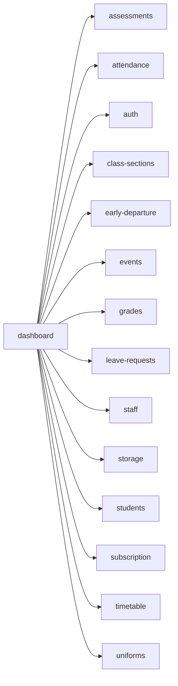

<!-- AUTO-GENERATED by scripts/generate-module-deps — do not edit -->

# Dashboard

> **Aggregator module** — composes multiple other modules (often via frontend widgets/hooks).

## Dependency summary

| Fan-out | Fan-in | Hub rank | Blast radius | Dependency rate | Type |
|---------|--------|----------|--------------|-----------------|------|
| 14 | 0 | 50/61 | 0 | 23% | Aggregator |

- **Backend module:** `backend/src/modules/dashboard/dashboard.module.ts`
- **Frontend feature:** `frontend/src/components/features/dashboard`
- **Category:** Reporting & Analytics

## Depends on (outbound)

| Module | Layer | Via | Condition |
|--------|-------|-----|----------|
| assessments | FE feature | components/features/dashboard; widget:pending_grading | — |
| attendance | FE feature | components/features/dashboard; widget:class_attendance | — |
| auth | FE feature | components/features/dashboard; widget:class_attendance | — |
| class-sections | FE feature | components/features/dashboard; widget:class_attendance | — |
| early-departure | FE feature | components/features/dashboard; widget:pending_tasks | — |
| events | FE feature | components/features/dashboard; widget:upcoming_events | — |
| grades | FE feature | components/features/dashboard; widget:grades_overview | — |
| leave-requests | FE feature | components/features/dashboard; widget:pending_tasks | — |
| staff | FE feature | components/features/dashboard; widget:class_attendance | — |
| storage | FE feature | components/features/dashboard; widget:storage | — |
| students | FE feature | components/features/dashboard; widget:branch_overview | — |
| subscription | FE feature | components/features/dashboard; widget:low_stock | plan: hasInventoryManagement |
| timetable | FE feature | components/features/dashboard; widget:schedule_today | — |
| uniforms | FE feature | components/features/dashboard; widget:low_stock | plan: hasInventoryManagement |

## Depended on by (inbound)

| Consumer | Layer | Via | Condition |
|----------|-------|-----|----------|
| hook:useDashboard | FE hook | /api/v1/dashboard | — |
| sidebar | FE nav | /dashboard | RBAC feature dashboard |

## Dashboard widgets

| Widget | Hooks | Backend modules | Gates |
|--------|-------|-----------------|-------|
| `class_attendance` | useAttendance, useClassSections, useAuth, useStaff | attendance, auth, class-sections, staff | — |
| `child_today` | useAttendance, useAuth | attendance, auth | — |
| `upcoming_events` | useEvents | events | — |
| `pending_tasks` | useLeaveRequests, useEarlyDepartures | early-departure, leave-requests | — |
| `pending_grading` | useAssessments | assessments | — |
| `schedule_today` | useStaff, useTimetable | staff, timetable | — |
| `branch_overview` | useStudents, useStaff | auth, staff, students | — |
| `pending_approvals` | useLeaveRequests, useEarlyDepartures | early-departure, leave-requests | — |
| `low_stock` | useInventory, useSubscription | subscription, uniforms | plan: hasInventoryManagement |
| `storage` | useStorage | storage | — |
| `today_schedule` | useStudents, useTimetable | auth, students, timetable | — |
| `upcoming_assessments` | useMyAssessments | assessments | — |
| `grades_overview` | useStudents, useGrades | auth, grades, students | — |

## Access gates

| Gate type | Condition | Applies to | Source |
|-----------|-----------|------------|--------|
| jwt | JwtAuthGuard | dashboard API | `backend/src/modules/dashboard/dashboard.controller.ts` |
| branch | BranchGuard (X-Branch-Id) | dashboard API | `backend/src/modules/dashboard/dashboard.controller.ts` |
| widget-role | ROLE_WIDGETS.parent | dashboard widgets for parent role | `backend/src/modules/dashboard/dashboard.service.ts` |
| widget-role | ROLE_WIDGETS.class_teacher | dashboard widgets for class_teacher role | `backend/src/modules/dashboard/dashboard.service.ts` |
| widget-role | ROLE_WIDGETS.subject_teacher | dashboard widgets for subject_teacher role | `backend/src/modules/dashboard/dashboard.service.ts` |
| widget-role | ROLE_WIDGETS.school_admin | dashboard widgets for school_admin role | `backend/src/modules/dashboard/dashboard.service.ts` |
| widget-role | ROLE_WIDGETS.principal | dashboard widgets for principal role | `backend/src/modules/dashboard/dashboard.service.ts` |
| widget-role | ROLE_WIDGETS.academic_coordinator | dashboard widgets for academic_coordinator role | `backend/src/modules/dashboard/dashboard.service.ts` |
| widget-role | ROLE_WIDGETS.admin_assistant | dashboard widgets for admin_assistant role | `backend/src/modules/dashboard/dashboard.service.ts` |
| widget-role | ROLE_WIDGETS.guidance_counselor | dashboard widgets for guidance_counselor role | `backend/src/modules/dashboard/dashboard.service.ts` |
| widget-role | ROLE_WIDGETS.student | dashboard widgets for student role | `backend/src/modules/dashboard/dashboard.service.ts` |
| nav-rbac | canView('dashboard') | nav path /dashboard | `frontend/src/lib/permission/navFeatureMap.ts` |

## Database tables

| Table | Source file |
|-------|-------------|
| `dashboard_preferences` | `backend/src/modules/dashboard/dashboard.service.ts` |

## Troubleshooting

| Symptom | Likely cause | Check first |
|---------|--------------|-------------|
| Entire dashboard blank | Auth or branch context missing | `useAuth`, `X-Branch-Id`, `dashboard.controller.ts` guards |
| Single widget empty or error | Upstream module API failure | Widget component hook + depended module page |
| Low stock widget missing | Plan feature gate | `useSubscriptionFeatures`, `uniforms` module |
| Wrong widgets for role | Role widget mapping | `ROLE_WIDGETS` in `dashboard.service.ts` |
| Preferences not saving | Dashboard DB or branch scope | `dashboard_preferences` table, PUT `/api/v1/dashboard/preferences` |
| Dashboard widget broken | Indirect dependency via dashboard | Dashboard module widgets table |

## Dependency graph

