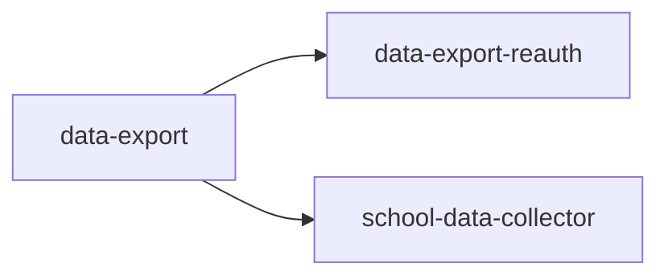

<!-- AUTO-GENERATED by scripts/generate-module-deps — do not edit -->

# Data Export

## Dependency summary

| Fan-out | Fan-in | Hub rank | Blast radius | Dependency rate | Type |
|---------|--------|----------|--------------|-----------------|------|
| 2 | 1 | 33/61 | 4 | 5% | Standard |

- **Backend module:** `backend/src/modules/data-export/data-export.module.ts`
- **Category:** Utilities

## Depends on (outbound)

| Module | Layer | Via | Condition |
|--------|-------|-----|----------|
| data-export-reauth | BE service | backend/src/modules/data-export/data-export.service.ts → DataExportReauthService | — |
| school-data-collector | BE service | backend/src/modules/data-export/data-export.service.ts → SchoolDataCollectorService | — |

## Depended on by (inbound)

| Consumer | Layer | Via | Condition |
|----------|-------|-----|----------|
| hook:useDataExport | FE hook | /api/v1/data-export | — |
| settings | FE feature | components/features/settings | — |

## Access gates

| Gate type | Condition | Applies to | Source |
|-----------|-----------|------------|--------|
| jwt | JwtAuthGuard | data-export API | `backend/src/modules/data-export/data-export.controller.ts` |
| branch | BranchGuard (X-Branch-Id) | data-export API | `backend/src/modules/data-export/data-export.controller.ts` |
| role | school_admin only | data-export API | `backend/src/modules/data-export/data-export.controller.ts` |

## Database tables

| Table | Source file |
|-------|-------------|
| `branches` | `backend/src/modules/data-export/data-export.service.ts` |
| `school_data_export_logs` | `backend/src/modules/data-export/data-export.service.ts` |
| `staff` | `backend/src/modules/data-export/school-data-collector.service.ts` |
| `tenants` | `backend/src/modules/data-export/data-export.service.ts` |
| `user_branches` | `backend/src/modules/data-export/data-export.service.ts` |

## Troubleshooting

| Symptom | Likely cause | Check first |
|---------|--------------|-------------|
| API 401/403 | Auth, branch, or permission gate | Controller guards + `ensureFeatureEditAccess` |
| Empty list or wrong branch data | Missing branch_id filter | Service `.eq('branch_id', branchId)` |
| Frontend not loading data | Hook or API mismatch | `frontend/src/hooks/` + Network tab |

## Dependency graph

