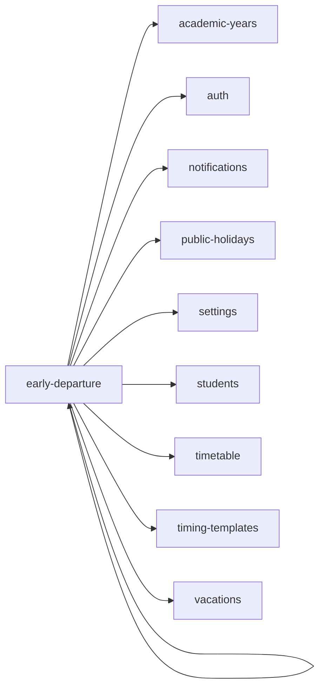

<!-- AUTO-GENERATED by scripts/generate-module-deps — do not edit -->

# Early Departure

## Dependency summary

| Fan-out | Fan-in | Hub rank | Blast radius | Dependency rate | Type |
|---------|--------|----------|--------------|-----------------|------|
| 9 | 1 | 34/61 | 1 | 16% | Standard |

- **Backend module:** `backend/src/modules/early-departure/early-departure.module.ts`
- **Frontend feature:** `frontend/src/components/features/early-departure`
- **Category:** Attendance & Leave

## Depends on (outbound)

| Module | Layer | Via | Condition |
|--------|-------|-----|----------|
| academic-years | BE module, BE service | backend/src/modules/early-departure/early-departure.module.ts imports; backend/src/modules/early-departure/early-departure.service.ts → AcademicYearsService | — |
| auth | FE feature | components/features/early-departure | — |
| early-departure | FE feature | components/features/early-departure | — |
| notifications | BE module, BE service | backend/src/modules/early-departure/early-departure.module.ts imports; backend/src/modules/early-departure/early-departure.service.ts → NotificationsService | — |
| public-holidays | FE feature | components/features/early-departure | — |
| settings | FE feature | components/features/early-departure | — |
| students | FE feature | components/features/early-departure | — |
| timetable | BE module, BE service | backend/src/modules/early-departure/early-departure.module.ts imports; backend/src/modules/early-departure/early-departure.service.ts → TimetableService | — |
| timing-templates | FE feature | components/features/early-departure | — |
| vacations | FE feature | components/features/early-departure | — |

## Depended on by (inbound)

| Consumer | Layer | Via | Condition |
|----------|-------|-----|----------|
| dashboard | FE feature | components/features/dashboard | — |
| dashboard | FE feature | widget:pending_tasks | — |
| dashboard | FE feature | widget:pending_approvals | — |
| early-departure | FE feature | components/features/early-departure | — |
| hook:useEarlyDepartures | FE hook | /api/v1/early-departures | — |
| sidebar | FE nav | /early-departure | RBAC feature early_departure |

## Access gates

| Gate type | Condition | Applies to | Source |
|-----------|-----------|------------|--------|
| jwt | JwtAuthGuard | early-departure API | `backend/src/modules/early-departure/early-departure.controller.ts` |
| branch | BranchGuard (X-Branch-Id) | early-departure API | `backend/src/modules/early-departure/early-departure.controller.ts` |
| rbac | ensureFeatureEditAccess('early_departure') | early-departure write endpoints | `backend/src/modules/early-departure/early-departure.controller.ts` |
| nav-rbac | canView('early_departure') | nav path /early-departure | `frontend/src/lib/permission/navFeatureMap.ts` |

## Database tables

| Table | Source file |
|-------|-------------|
| `class_sections` | `backend/src/modules/early-departure/early-departure.service.ts` |
| `early_departure_requests` | `backend/src/modules/early-departure/early-departure.service.ts` |
| `features` | `backend/src/modules/early-departure/early-departure.controller.ts` |
| `parent_students` | `backend/src/modules/early-departure/early-departure.service.ts` |
| `profiles` | `backend/src/modules/early-departure/early-departure.service.ts` |
| `role_permissions` | `backend/src/modules/early-departure/early-departure.controller.ts` |
| `roles` | `backend/src/modules/early-departure/early-departure.controller.ts` |
| `staff` | `backend/src/modules/early-departure/early-departure.service.ts` |
| `students` | `backend/src/modules/early-departure/early-departure.service.ts` |
| `user_roles` | `backend/src/modules/early-departure/early-departure.service.ts` |

## Troubleshooting

| Symptom | Likely cause | Check first |
|---------|--------------|-------------|
| API 401/403 | Auth, branch, or permission gate | Controller guards + `ensureFeatureEditAccess` |
| Empty list or wrong branch data | Missing branch_id filter | Service `.eq('branch_id', branchId)` |
| Frontend not loading data | Hook or API mismatch | `frontend/src/hooks/` + Network tab |

## Dependency graph

