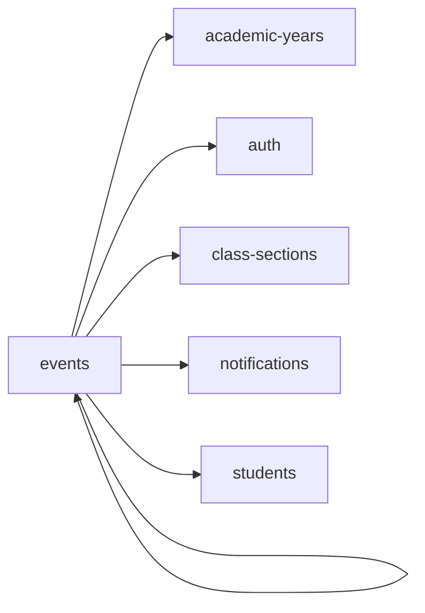

<!-- AUTO-GENERATED by scripts/generate-module-deps — do not edit -->

# Events

## Dependency summary

| Fan-out | Fan-in | Hub rank | Blast radius | Dependency rate | Type |
|---------|--------|----------|--------------|-----------------|------|
| 5 | 1 | 35/61 | 1 | 10% | Standard |

- **Backend module:** `backend/src/modules/events/events.module.ts`
- **Frontend feature:** `frontend/src/components/features/events`
- **Category:** Events & Behaviour

## Depends on (outbound)

| Module | Layer | Via | Condition |
|--------|-------|-----|----------|
| academic-years | BE module, BE service | backend/src/modules/events/events.module.ts imports; backend/src/modules/events/events.service.ts → AcademicYearsService | — |
| auth | FE feature | components/features/events | — |
| class-sections | BE module, BE service, FE feature | backend/src/modules/events/events.module.ts imports; backend/src/modules/events/events.service.ts → ClassSectionsService | — |
| events | FE feature | components/features/events | — |
| notifications | BE module, BE service | backend/src/modules/events/events.module.ts imports; backend/src/modules/events/events.service.ts → NotificationsService | — |
| students | FE feature | components/features/events | — |

## Depended on by (inbound)

| Consumer | Layer | Via | Condition |
|----------|-------|-----|----------|
| dashboard | FE feature | components/features/dashboard | — |
| dashboard | FE feature | widget:upcoming_events | — |
| events | FE feature | components/features/events | — |
| hook:useEvents | FE hook | /api/v1/events | — |
| sidebar | FE nav | /my-events | RBAC feature events_personal |
| sidebar | FE nav | /events | RBAC feature events_management |

## Access gates

| Gate type | Condition | Applies to | Source |
|-----------|-----------|------------|--------|
| jwt | JwtAuthGuard | events API | `backend/src/modules/events/events.controller.ts` |
| branch | BranchGuard (X-Branch-Id) | events API | `backend/src/modules/events/events.controller.ts` |
| rbac | ensureFeatureEditAccess('events_management') | events write endpoints | `backend/src/modules/events/events.controller.ts` |
| nav-rbac | canView('events_personal') | nav path /my-events | `frontend/src/lib/permission/navFeatureMap.ts` |
| nav-rbac | canView('events_management') | nav path /events | `frontend/src/lib/permission/navFeatureMap.ts` |

## Database tables

| Table | Source file |
|-------|-------------|
| `assessments` | `backend/src/modules/events/events.service.ts` |
| `class_sections` | `backend/src/modules/events/events.service.ts` |
| `event_consents` | `backend/src/modules/events/events.service.ts` |
| `event_participants` | `backend/src/modules/events/events.service.ts` |
| `events` | `backend/src/modules/events/events.service.ts` |
| `features` | `backend/src/modules/events/events.controller.ts` |
| `parent_students` | `backend/src/modules/events/events.service.ts` |
| `profiles` | `backend/src/modules/events/events.service.ts` |
| `role_permissions` | `backend/src/modules/events/events.controller.ts` |
| `roles` | `backend/src/modules/events/events.controller.ts` |
| `staff` | `backend/src/modules/events/events.service.ts` |
| `student_enrolments` | `backend/src/modules/events/events.service.ts` |
| `students` | `backend/src/modules/events/events.service.ts` |
| `subjects` | `backend/src/modules/events/events.service.ts` |
| `teacher_assignments` | `backend/src/modules/events/events.service.ts` |

## Troubleshooting

| Symptom | Likely cause | Check first |
|---------|--------------|-------------|
| API 401/403 | Auth, branch, or permission gate | Controller guards + `ensureFeatureEditAccess` |
| Empty list or wrong branch data | Missing branch_id filter | Service `.eq('branch_id', branchId)` |
| Frontend not loading data | Hook or API mismatch | `frontend/src/hooks/` + Network tab |

## Dependency graph

