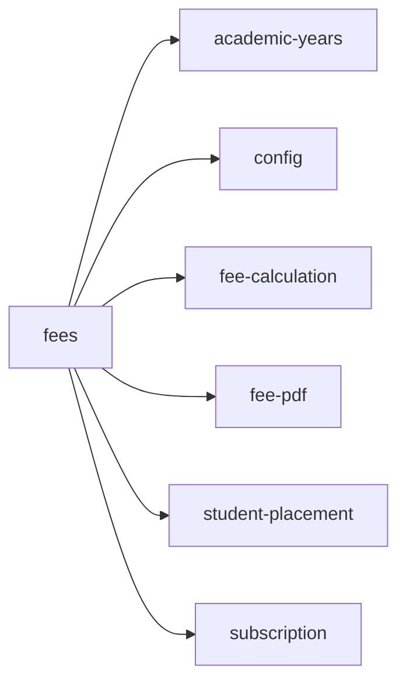

<!-- AUTO-GENERATED by scripts/generate-module-deps — do not edit -->

# Fees

## Dependency summary

| Fan-out | Fan-in | Hub rank | Blast radius | Dependency rate | Type |
|---------|--------|----------|--------------|-----------------|------|
| 6 | 1 | 36/61 | 4 | 11% | Standard |

- **Backend module:** `backend/src/modules/fees/fees.module.ts`
- **Category:** Finance

## Depends on (outbound)

| Module | Layer | Via | Condition |
|--------|-------|-----|----------|
| academic-years | BE module, BE service | backend/src/modules/fees/fees.module.ts imports; backend/src/modules/fees/challan.service.ts → AcademicYearsService | — |
| config | BE service | backend/src/modules/fees/late-fee.service.ts → ConfigService | — |
| fee-calculation | BE service | backend/src/modules/fees/challan.service.ts → FeeCalculationService | — |
| fee-pdf | BE service | backend/src/modules/fees/challan.service.ts → FeePdfService; backend/src/modules/fees/payment.service.ts → FeePdfService | — |
| student-placement | BE service | backend/src/modules/fees/challan.service.ts → StudentPlacementService | — |
| subscription | BE module | backend/src/modules/fees/fees.module.ts imports | — |

## Depended on by (inbound)

| Consumer | Layer | Via | Condition |
|----------|-------|-----|----------|
| hook:useFees | FE hook | /api/v1/fees | — |
| settings | FE feature | components/features/settings | — |

## Access gates

| Gate type | Condition | Applies to | Source |
|-----------|-----------|------------|--------|
| jwt | JwtAuthGuard | fees API | `backend/src/modules/fees/challan.controller.ts` |
| branch | BranchGuard (X-Branch-Id) | fees API | `backend/src/modules/fees/challan.controller.ts` |
| plan | RequiresFeature('hasFeeManagement') | fees API | `backend/src/modules/fees/challan.controller.ts` |
| jwt | JwtAuthGuard | fees API | `backend/src/modules/fees/fee-challan-settings.controller.ts` |
| branch | BranchGuard (X-Branch-Id) | fees API | `backend/src/modules/fees/fee-challan-settings.controller.ts` |
| plan | RequiresFeature('hasFeeManagement') | fees API | `backend/src/modules/fees/fee-challan-settings.controller.ts` |
| jwt | JwtAuthGuard | fees API | `backend/src/modules/fees/fee-reports.controller.ts` |
| branch | BranchGuard (X-Branch-Id) | fees API | `backend/src/modules/fees/fee-reports.controller.ts` |
| plan | RequiresFeature('hasFeeManagement') | fees API | `backend/src/modules/fees/fee-reports.controller.ts` |
| jwt | JwtAuthGuard | fees API | `backend/src/modules/fees/fee-student-config.controller.ts` |
| branch | BranchGuard (X-Branch-Id) | fees API | `backend/src/modules/fees/fee-student-config.controller.ts` |
| plan | RequiresFeature('hasFeeManagement') | fees API | `backend/src/modules/fees/fee-student-config.controller.ts` |
| jwt | JwtAuthGuard | fees API | `backend/src/modules/fees/fee-students.controller.ts` |
| branch | BranchGuard (X-Branch-Id) | fees API | `backend/src/modules/fees/fee-students.controller.ts` |
| plan | RequiresFeature('hasFeeManagement') | fees API | `backend/src/modules/fees/fee-students.controller.ts` |
| jwt | JwtAuthGuard | fees API | `backend/src/modules/fees/late-fee.controller.ts` |
| branch | BranchGuard (X-Branch-Id) | fees API | `backend/src/modules/fees/late-fee.controller.ts` |
| plan | RequiresFeature('hasFeeManagement') | fees API | `backend/src/modules/fees/late-fee.controller.ts` |
| jwt | JwtAuthGuard | fees API | `backend/src/modules/fees/payment.controller.ts` |
| branch | BranchGuard (X-Branch-Id) | fees API | `backend/src/modules/fees/payment.controller.ts` |
| plan | RequiresFeature('hasFeeManagement') | fees API | `backend/src/modules/fees/payment.controller.ts` |
| jwt | JwtAuthGuard | fees API | `backend/src/modules/fees/template.controller.ts` |
| branch | BranchGuard (X-Branch-Id) | fees API | `backend/src/modules/fees/template.controller.ts` |
| plan | RequiresFeature('hasFeeManagement') | fees API | `backend/src/modules/fees/template.controller.ts` |
| nav-plan | hasFeeManagement | nav path /fees (planLocked when false) | `frontend/src/components/layout/Sidebar.tsx` |

## Database tables

| Table | Source file |
|-------|-------------|
| `branches` | `backend/src/modules/fees/challan.service.ts` |
| `class_sections` | `backend/src/modules/fees/challan.service.ts` |
| `fee_challan_items` | `backend/src/modules/fees/challan.service.ts` |
| `fee_challan_month_coverage` | `backend/src/modules/fees/challan.service.ts` |
| `fee_challan_settings` | `backend/src/modules/fees/challan.service.ts` |
| `fee_challans` | `backend/src/modules/fees/challan.service.ts` |
| `fee_late_fee_applications` | `backend/src/modules/fees/late-fee.service.ts` |
| `fee_metric_exclusions` | `backend/src/modules/fees/fee-calculation.service.ts` |
| `fee_payments` | `backend/src/modules/fees/fee-reports.service.ts` |
| `fee_student_template_links` | `backend/src/modules/fees/fee-calculation.service.ts` |
| `fee_template_assignments` | `backend/src/modules/fees/challan.service.ts` |
| `fee_template_metrics` | `backend/src/modules/fees/challan.service.ts` |
| `fee_templates` | `backend/src/modules/fees/challan.service.ts` |
| `level_classes` | `backend/src/modules/fees/challan.service.ts` |
| `parent_students` | `backend/src/modules/fees/challan.service.ts` |
| `profiles` | `backend/src/modules/fees/challan.service.ts` |
| `staff` | `backend/src/modules/fees/challan.service.ts` |
| `student_enrolments` | `backend/src/modules/fees/fee-calculation.service.ts` |
| `students` | `backend/src/modules/fees/challan.service.ts` |
| `tenants` | `backend/src/modules/fees/challan.service.ts` |

## Troubleshooting

| Symptom | Likely cause | Check first |
|---------|--------------|-------------|
| Feature locked or 403 | Subscription plan missing feature | `FeatureAccessGuard`, `useSubscriptionFeatures()` |
| Nav item dimmed/disabled | Plan gate on sidebar | `Sidebar.tsx` subscriptionNavFeatures |

## Dependency graph

