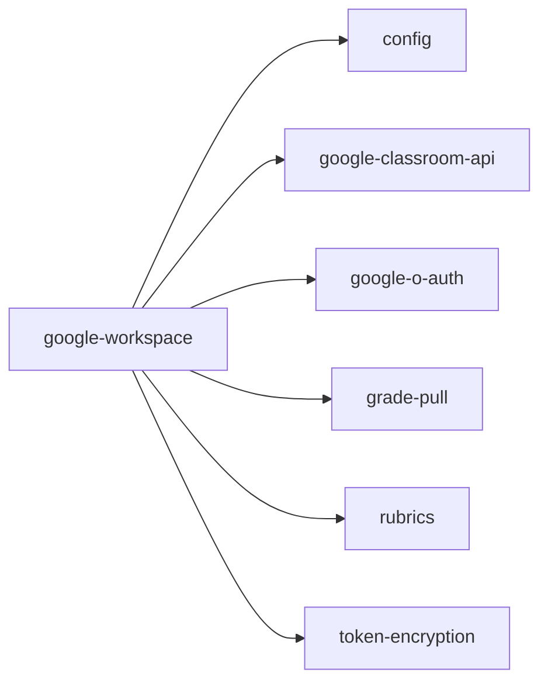

<!-- AUTO-GENERATED by scripts/generate-module-deps — do not edit -->

# Google Workspace

## Dependency summary

| Fan-out | Fan-in | Hub rank | Blast radius | Dependency rate | Type |
|---------|--------|----------|--------------|-----------------|------|
| 6 | 2 | 24/61 | 5 | 13% | Standard |

- **Backend module:** `backend/src/modules/google-workspace/google-workspace.module.ts`
- **Category:** Integrations

## Depends on (outbound)

| Module | Layer | Via | Condition |
|--------|-------|-----|----------|
| config | BE module, BE service | backend/src/modules/google-workspace/google-workspace.module.ts imports; backend/src/modules/google-workspace/google-workspace.service.ts → ConfigService | — |
| google-classroom-api | BE service | backend/src/modules/google-workspace/google-workspace.service.ts → GoogleClassroomApiService; backend/src/modules/google-workspace/services/grade-pull.service.ts → GoogleClassroomApiService | — |
| google-o-auth | BE service | backend/src/modules/google-workspace/google-workspace.service.ts → GoogleOAuthService; backend/src/modules/google-workspace/services/grade-pull.service.ts → GoogleOAuthService | — |
| grade-pull | BE service | backend/src/modules/google-workspace/google-workspace.service.ts → GradePullService | — |
| rubrics | BE module, BE service | backend/src/modules/google-workspace/google-workspace.module.ts imports; backend/src/modules/google-workspace/google-workspace.service.ts → RubricsService | — |
| token-encryption | BE service | backend/src/modules/google-workspace/google-workspace.service.ts → TokenEncryptionService; backend/src/modules/google-workspace/services/grade-pull.service.ts → TokenEncryptionService | — |

## Depended on by (inbound)

| Consumer | Layer | Via | Condition |
|----------|-------|-----|----------|
| google-classroom | FE feature | components/features/google-classroom | — |
| hook:useGoogleWorkspace | FE hook | /api/v1/google-workspace | — |
| settings | FE feature | components/features/settings | — |

## Access gates

| Gate type | Condition | Applies to | Source |
|-----------|-----------|------------|--------|
| jwt | JwtAuthGuard | google-workspace API | `backend/src/modules/google-workspace/google-workspace.controller.ts` |
| branch | BranchGuard (X-Branch-Id) | google-workspace API | `backend/src/modules/google-workspace/google-workspace.controller.ts` |

## Database tables

| Table | Source file |
|-------|-------------|
| `assessments` | `backend/src/modules/google-workspace/google-workspace.service.ts` |
| `class_sections` | `backend/src/modules/google-workspace/google-workspace.service.ts` |
| `classes` | `backend/src/modules/google-workspace/google-workspace.service.ts` |
| `features` | `backend/src/modules/google-workspace/google-workspace.controller.ts` |
| `google_classroom_course_mappings` | `backend/src/modules/google-workspace/google-workspace.service.ts` |
| `google_sync_audit_log` | `backend/src/modules/google-workspace/google-workspace.service.ts` |
| `google_workspace_settings` | `backend/src/modules/google-workspace/google-workspace.service.ts` |
| `profiles` | `backend/src/modules/google-workspace/services/grade-pull.service.ts` |
| `role_permissions` | `backend/src/modules/google-workspace/google-workspace.controller.ts` |
| `roles` | `backend/src/modules/google-workspace/google-workspace.controller.ts` |
| `sections` | `backend/src/modules/google-workspace/google-workspace.service.ts` |
| `student_enrolments` | `backend/src/modules/google-workspace/services/grade-pull.service.ts` |
| `student_grades` | `backend/src/modules/google-workspace/services/grade-pull.service.ts` |
| `student_rubric_scores` | `backend/src/modules/google-workspace/services/grade-pull.service.ts` |
| `students` | `backend/src/modules/google-workspace/services/grade-pull.service.ts` |
| `subjects` | `backend/src/modules/google-workspace/google-workspace.service.ts` |

## Troubleshooting

| Symptom | Likely cause | Check first |
|---------|--------------|-------------|
| API 401/403 | Auth, branch, or permission gate | Controller guards + `ensureFeatureEditAccess` |
| Empty list or wrong branch data | Missing branch_id filter | Service `.eq('branch_id', branchId)` |
| Frontend not loading data | Hook or API mismatch | `frontend/src/hooks/` + Network tab |

## Dependency graph

