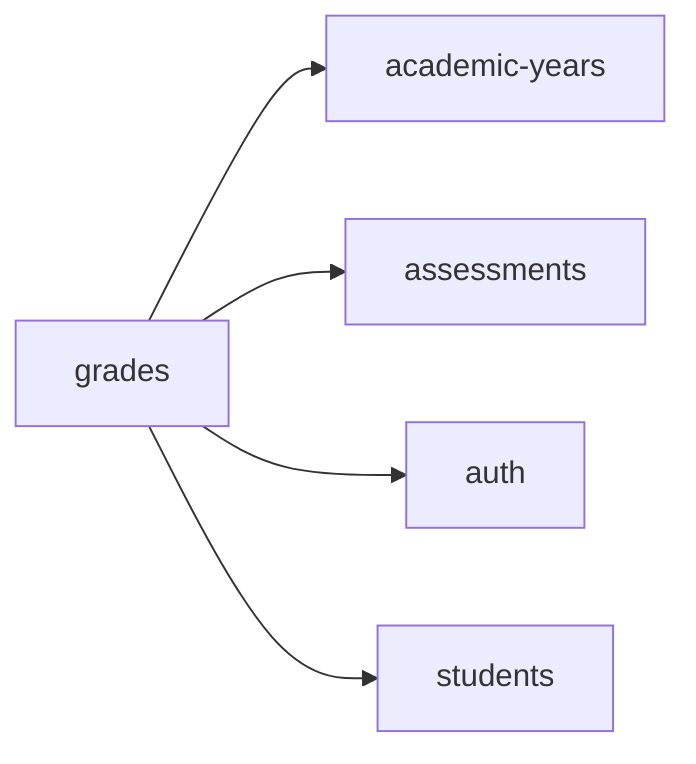

<!-- AUTO-GENERATED by scripts/generate-module-deps — do not edit -->

# Grades

## Dependency summary

| Fan-out | Fan-in | Hub rank | Blast radius | Dependency rate | Type |
|---------|--------|----------|--------------|-----------------|------|
| 4 | 3 | 16/61 | 5 | 11% | Standard |

- **Backend module:** `backend/src/modules/grades/grades.module.ts`
- **Category:** Academic Structure

## Depends on (outbound)

| Module | Layer | Via | Condition |
|--------|-------|-----|----------|
| academic-years | BE module, BE service | backend/src/modules/grades/grades.module.ts imports; backend/src/modules/grades/grades.service.ts → AcademicYearsService | — |
| assessments | BE module, BE service | backend/src/modules/grades/grades.module.ts imports; backend/src/modules/grades/grades.service.ts → AssessmentsService | — |
| auth | BE module | backend/src/modules/grades/grades.module.ts imports | — |
| students | BE module, BE service | backend/src/modules/grades/grades.module.ts imports; backend/src/modules/grades/grades.service.ts → StudentsService | — |

## Depended on by (inbound)

| Consumer | Layer | Via | Condition |
|----------|-------|-----|----------|
| dashboard | FE feature | components/features/dashboard | — |
| dashboard | FE feature | widget:grades_overview | — |
| google-classroom | FE feature | components/features/google-classroom | — |
| hook:useGrades | FE hook | /api/v1/grades | — |
| reports | BE module | backend/src/modules/reports/reports.module.ts imports | — |
| reports | BE service | backend/src/modules/reports/reports.service.ts → GradesService | — |

## Access gates

| Gate type | Condition | Applies to | Source |
|-----------|-----------|------------|--------|
| jwt | JwtAuthGuard | grades API | `backend/src/modules/grades/grades.controller.ts` |
| branch | BranchGuard (X-Branch-Id) | grades API | `backend/src/modules/grades/grades.controller.ts` |

## Database tables

| Table | Source file |
|-------|-------------|
| `assessments` | `backend/src/modules/grades/grades.service.ts` |
| `class_sections` | `backend/src/modules/grades/grades.service.ts` |
| `features` | `backend/src/modules/grades/grades.controller.ts` |
| `role_permissions` | `backend/src/modules/grades/grades.controller.ts` |
| `roles` | `backend/src/modules/grades/grades.controller.ts` |
| `student_enrolments` | `backend/src/modules/grades/grades.service.ts` |
| `student_grades` | `backend/src/modules/grades/grades.service.ts` |
| `students` | `backend/src/modules/grades/grades.service.ts` |

## Troubleshooting

| Symptom | Likely cause | Check first |
|---------|--------------|-------------|
| API 401/403 | Auth, branch, or permission gate | Controller guards + `ensureFeatureEditAccess` |
| Empty list or wrong branch data | Missing branch_id filter | Service `.eq('branch_id', branchId)` |
| Frontend not loading data | Hook or API mismatch | `frontend/src/hooks/` + Network tab |

## Dependency graph

