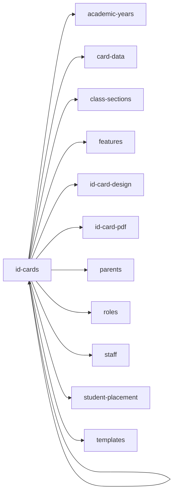

<!-- AUTO-GENERATED by scripts/generate-module-deps — do not edit -->

# Id Cards

## Dependency summary

| Fan-out | Fan-in | Hub rank | Blast radius | Dependency rate | Type |
|---------|--------|----------|--------------|-----------------|------|
| 11 | 0 | 51/61 | 0 | 18% | Standard |

- **Backend module:** `backend/src/modules/id-cards/id-cards.module.ts`
- **Frontend feature:** `frontend/src/components/features/id-cards`
- **Category:** Documents

## Depends on (outbound)

| Module | Layer | Via | Condition |
|--------|-------|-----|----------|
| academic-years | BE module, BE service, FE feature | backend/src/modules/id-cards/id-cards.module.ts imports; backend/src/modules/id-cards/id-cards.service.ts → AcademicYearsService | — |
| card-data | BE service | backend/src/modules/id-cards/id-cards.service.ts → CardDataService | — |
| class-sections | FE feature | components/features/id-cards | — |
| features | FE feature | components/features/id-cards | — |
| id-card-design | BE service | backend/src/modules/id-cards/id-cards.service.ts → IdCardDesignService | — |
| id-card-pdf | BE service | backend/src/modules/id-cards/card-data.service.ts → IdCardPdfService; backend/src/modules/id-cards/id-cards.service.ts → IdCardPdfService | — |
| id-cards | FE feature | components/features/id-cards | — |
| parents | BE module, BE service | backend/src/modules/id-cards/id-cards.module.ts imports; backend/src/modules/id-cards/card-data.service.ts → ParentsService | — |
| roles | FE feature | components/features/id-cards | — |
| staff | FE feature | components/features/id-cards | — |
| student-placement | BE service | backend/src/modules/id-cards/id-cards.service.ts → StudentPlacementService | — |
| templates | BE service | backend/src/modules/id-cards/id-cards.service.ts → TemplatesService | — |

## Depended on by (inbound)

| Consumer | Layer | Via | Condition |
|----------|-------|-----|----------|
| hook:useIdCards | FE hook | /api/v1/id-cards | — |
| id-cards | FE feature | components/features/id-cards | — |
| sidebar | FE nav | /id-cards | RBAC feature id_cards |

## Access gates

| Gate type | Condition | Applies to | Source |
|-----------|-----------|------------|--------|
| jwt | JwtAuthGuard | id-cards API | `backend/src/modules/id-cards/id-cards.controller.ts` |
| branch | BranchGuard (X-Branch-Id) | id-cards API | `backend/src/modules/id-cards/id-cards.controller.ts` |
| nav-rbac | canView('id_cards') | nav path /id-cards | `frontend/src/lib/permission/navFeatureMap.ts` |

## Database tables

| Table | Source file |
|-------|-------------|
| `academic_years` | `backend/src/modules/id-cards/card-data.service.ts` |
| `branches` | `backend/src/modules/id-cards/card-data.service.ts` |
| `class_sections` | `backend/src/modules/id-cards/id-cards.service.ts` |
| `classes` | `backend/src/modules/id-cards/card-data.service.ts` |
| `id_card_photos` | `backend/src/modules/id-cards/id-card-photo.service.ts` |
| `id_card_reprints` | `backend/src/modules/id-cards/id-cards.service.ts` |
| `id_card_templates` | `backend/src/modules/id-cards/templates.service.ts` |
| `id_cards` | `backend/src/modules/id-cards/id-card-photo.service.ts` |
| `profiles` | `backend/src/modules/id-cards/card-data.service.ts` |
| `sections` | `backend/src/modules/id-cards/card-data.service.ts` |
| `staff` | `backend/src/modules/id-cards/card-data.service.ts` |
| `student_enrolments` | `backend/src/modules/id-cards/card-data.service.ts` |
| `students` | `backend/src/modules/id-cards/card-data.service.ts` |
| `system_settings` | `backend/src/modules/id-cards/card-data.service.ts` |
| `tenants` | `backend/src/modules/id-cards/card-data.service.ts` |
| `user_roles` | `backend/src/modules/id-cards/card-data.service.ts` |

## Troubleshooting

| Symptom | Likely cause | Check first |
|---------|--------------|-------------|
| API 401/403 | Auth, branch, or permission gate | Controller guards + `ensureFeatureEditAccess` |
| Empty list or wrong branch data | Missing branch_id filter | Service `.eq('branch_id', branchId)` |
| Frontend not loading data | Hook or API mismatch | `frontend/src/hooks/` + Network tab |

## Dependency graph

