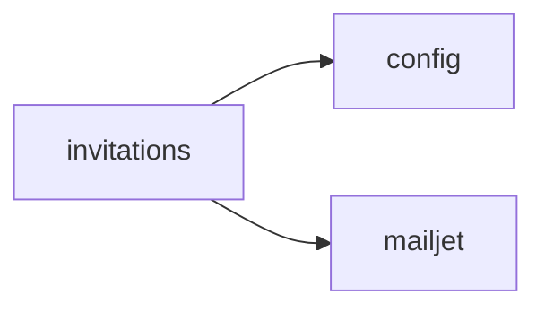

<!-- AUTO-GENERATED by scripts/generate-module-deps — do not edit -->

# Invitations

## Dependency summary

| Fan-out | Fan-in | Hub rank | Blast radius | Dependency rate | Type |
|---------|--------|----------|--------------|-----------------|------|
| 2 | 2 | 25/61 | 18 | 7% | Standard |

- **Backend module:** `backend/src/modules/invitations/invitations.module.ts`
- **Category:** Core System

## Depends on (outbound)

| Module | Layer | Via | Condition |
|--------|-------|-----|----------|
| config | BE service | backend/src/modules/invitations/invitations.service.ts → ConfigService | — |
| mailjet | BE service | backend/src/modules/invitations/invitations.service.ts → MailjetService | — |

## Depended on by (inbound)

| Consumer | Layer | Via | Condition |
|----------|-------|-----|----------|
| hook:useInvitationsAdmin | FE hook | /api/v1/invitations | — |
| students | BE module | backend/src/modules/students/students.module.ts imports | — |
| students | BE service | backend/src/modules/students/students.service.ts → InvitationsService | — |
| students | FE feature | components/features/students | — |
| users | BE module | backend/src/modules/users/users.module.ts imports | — |
| users | BE service | backend/src/modules/users/users.service.ts → InvitationsService | — |
| users | FE feature | components/features/users | — |

## Access gates

| Gate type | Condition | Applies to | Source |
|-----------|-----------|------------|--------|
| jwt | JwtAuthGuard | invitations API | `backend/src/modules/invitations/invitations.controller.ts` |
| branch | BranchGuard (X-Branch-Id) | invitations API | `backend/src/modules/invitations/invitations.controller.ts` |

## Database tables

| Table | Source file |
|-------|-------------|
| `branches` | `backend/src/modules/invitations/invitations.service.ts` |
| `invitations` | `backend/src/modules/invitations/invitations.service.ts` |
| `parent_students` | `backend/src/modules/invitations/invitations.service.ts` |
| `profiles` | `backend/src/modules/invitations/invitations.service.ts` |
| `students` | `backend/src/modules/invitations/invitations.service.ts` |
| `tenants` | `backend/src/modules/invitations/invitations.service.ts` |
| `user_branches` | `backend/src/modules/invitations/invitations.service.ts` |
| `user_roles` | `backend/src/modules/invitations/invitations.service.ts` |

## Known anomalies

| Kind | Detail | Source |
|------|--------|--------|
| duplicate-provider | Re-provides MailjetService without importing auth module | backend/src/modules/invitations/invitations.module.ts |

## Troubleshooting

| Symptom | Likely cause | Check first |
|---------|--------------|-------------|
| API 401/403 | Auth, branch, or permission gate | Controller guards + `ensureFeatureEditAccess` |
| Empty list or wrong branch data | Missing branch_id filter | Service `.eq('branch_id', branchId)` |
| Frontend not loading data | Hook or API mismatch | `frontend/src/hooks/` + Network tab |

## Dependency graph

