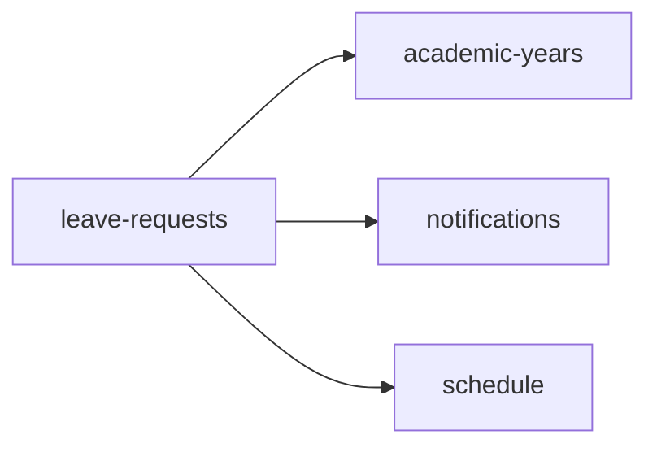

<!-- AUTO-GENERATED by scripts/generate-module-deps — do not edit -->

# Leave Requests

## Dependency summary

| Fan-out | Fan-in | Hub rank | Blast radius | Dependency rate | Type |
|---------|--------|----------|--------------|-----------------|------|
| 3 | 3 | 17/61 | 5 | 10% | Standard |

- **Backend module:** `backend/src/modules/leave-requests/leave-requests.module.ts`
- **Category:** Attendance & Leave

## Depends on (outbound)

| Module | Layer | Via | Condition |
|--------|-------|-----|----------|
| academic-years | BE module, BE service | backend/src/modules/leave-requests/leave-requests.module.ts imports; backend/src/modules/leave-requests/leave-requests.service.ts → AcademicYearsService | — |
| notifications | BE module, BE service | backend/src/modules/leave-requests/leave-requests.module.ts imports; backend/src/modules/leave-requests/leave-requests.service.ts → NotificationsService | — |
| schedule | BE module, BE service | backend/src/modules/leave-requests/leave-requests.module.ts imports; backend/src/modules/leave-requests/leave-requests.service.ts → ScheduleService | — |

## Depended on by (inbound)

| Consumer | Layer | Via | Condition |
|----------|-------|-----|----------|
| attendance | BE module | backend/src/modules/attendance/attendance.module.ts imports | — |
| attendance | BE service | backend/src/modules/attendance/attendance.service.ts → LeaveRequestsService | — |
| dashboard | FE feature | components/features/dashboard | — |
| dashboard | FE feature | widget:pending_tasks | — |
| dashboard | FE feature | widget:pending_approvals | — |
| hook:useLeaveRequests | FE hook | /api/v1/leave-requests | — |
| leaves | FE feature | components/features/leaves | — |
| sidebar | FE nav | /leaves | RBAC feature leaves |

## Access gates

| Gate type | Condition | Applies to | Source |
|-----------|-----------|------------|--------|
| jwt | JwtAuthGuard | leave-requests API | `backend/src/modules/leave-requests/leave-requests.controller.ts` |
| branch | BranchGuard (X-Branch-Id) | leave-requests API | `backend/src/modules/leave-requests/leave-requests.controller.ts` |
| rbac | ensureFeatureEditAccess('leaves') | leave-requests write endpoints | `backend/src/modules/leave-requests/leave-requests.controller.ts` |

## Database tables

| Table | Source file |
|-------|-------------|
| `class_sections` | `backend/src/modules/leave-requests/leave-requests.service.ts` |
| `features` | `backend/src/modules/leave-requests/leave-requests.controller.ts` |
| `leave_requests` | `backend/src/modules/leave-requests/leave-requests.service.ts` |
| `leave_settings` | `backend/src/modules/leave-requests/leave-requests.service.ts` |
| `parent_students` | `backend/src/modules/leave-requests/leave-requests.service.ts` |
| `profiles` | `backend/src/modules/leave-requests/leave-requests.service.ts` |
| `role_permissions` | `backend/src/modules/leave-requests/leave-requests.controller.ts` |
| `roles` | `backend/src/modules/leave-requests/leave-requests.controller.ts` |
| `staff` | `backend/src/modules/leave-requests/leave-requests.service.ts` |
| `students` | `backend/src/modules/leave-requests/leave-requests.service.ts` |
| `system_settings` | `backend/src/modules/leave-requests/leave-requests.service.ts` |
| `user_roles` | `backend/src/modules/leave-requests/leave-requests.service.ts` |

## Troubleshooting

| Symptom | Likely cause | Check first |
|---------|--------------|-------------|
| API 401/403 | Auth, branch, or permission gate | Controller guards + `ensureFeatureEditAccess` |
| Empty list or wrong branch data | Missing branch_id filter | Service `.eq('branch_id', branchId)` |
| Frontend not loading data | Hook or API mismatch | `frontend/src/hooks/` + Network tab |

## Dependency graph

