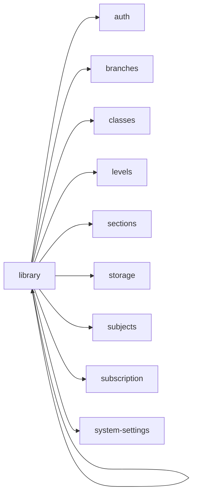

<!-- AUTO-GENERATED by scripts/generate-module-deps — do not edit -->

# Library

## Dependency summary

| Fan-out | Fan-in | Hub rank | Blast radius | Dependency rate | Type |
|---------|--------|----------|--------------|-----------------|------|
| 9 | 0 | 52/61 | 0 | 15% | Standard |

- **Backend module:** `backend/src/modules/library/library.module.ts`
- **Frontend feature:** `frontend/src/components/features/library`
- **Category:** Library & Resources

## Depends on (outbound)

| Module | Layer | Via | Condition |
|--------|-------|-----|----------|
| auth | FE feature | components/features/library | — |
| branches | BE module, BE service, FE feature | backend/src/modules/library/library.module.ts imports; backend/src/modules/library/library.service.ts → BranchesService | — |
| classes | FE feature | components/features/library | — |
| levels | FE feature | components/features/library | — |
| library | FE feature | components/features/library | — |
| sections | FE feature | components/features/library | — |
| storage | BE module | backend/src/modules/library/library.module.ts imports | — |
| subjects | FE feature | components/features/library | — |
| subscription | BE module | backend/src/modules/library/library.module.ts imports | — |
| system-settings | BE module, BE service | backend/src/modules/library/library.module.ts imports; backend/src/modules/library/library.service.ts → SystemSettingsService | — |

## Depended on by (inbound)

| Consumer | Layer | Via | Condition |
|----------|-------|-----|----------|
| hook:useLibrary | FE hook | /api/v1/library | — |
| library | FE feature | components/features/library | — |
| sidebar | FE nav | /library | RBAC feature library |

## Access gates

| Gate type | Condition | Applies to | Source |
|-----------|-----------|------------|--------|
| jwt | JwtAuthGuard | library API | `backend/src/modules/library/library.controller.ts` |
| branch | BranchGuard (X-Branch-Id) | library API | `backend/src/modules/library/library.controller.ts` |
| plan | RequiresFeature('hasLibraryManagement') | library API | `backend/src/modules/library/library.controller.ts` |
| nav-rbac | canView('library') | nav path /library | `frontend/src/lib/permission/navFeatureMap.ts` |
| nav-plan | hasLibraryManagement | nav path /library (planLocked when false) | `frontend/src/components/layout/Sidebar.tsx` |

## Database tables

| Table | Source file |
|-------|-------------|
| `branches` | `backend/src/modules/library/library.controller.ts` |
| `classes` | `backend/src/modules/library/library.service.ts` |
| `library_items` | `backend/src/modules/library/library.service.ts` |
| `subjects` | `backend/src/modules/library/library.service.ts` |

## Troubleshooting

| Symptom | Likely cause | Check first |
|---------|--------------|-------------|
| Feature locked or 403 | Subscription plan missing feature | `FeatureAccessGuard`, `useSubscriptionFeatures()` |
| Nav item dimmed/disabled | Plan gate on sidebar | `Sidebar.tsx` subscriptionNavFeatures |

## Dependency graph

