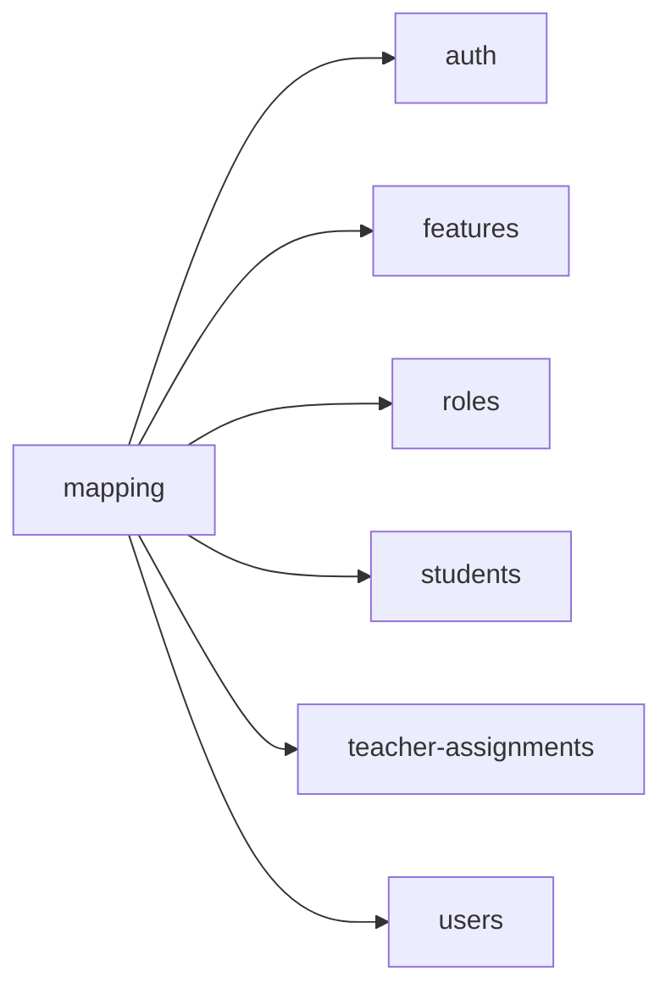

<!-- AUTO-GENERATED by scripts/generate-module-deps — do not edit -->

# Mapping

> **Aggregator module** — composes multiple other modules (often via frontend widgets/hooks).

## Dependency summary

| Fan-out | Fan-in | Hub rank | Blast radius | Dependency rate | Type |
|---------|--------|----------|--------------|-----------------|------|
| 6 | 0 | 59/61 | 0 | 10% | Aggregator |

- **Frontend feature:** `frontend/src/components/features/mapping`
- **Category:** Frontend Feature

## Depends on (outbound)

| Module | Layer | Via | Condition |
|--------|-------|-----|----------|
| auth | FE feature | components/features/mapping | — |
| features | FE feature | components/features/mapping | — |
| roles | FE feature | components/features/mapping | — |
| students | FE feature | components/features/mapping | — |
| teacher-assignments | FE feature | components/features/mapping | — |
| users | FE feature | components/features/mapping | — |

## Depended on by (inbound)

_No inbound dependencies detected._

## Access gates

| Gate type | Condition | Applies to | Source |
|-----------|-----------|------------|--------|
| nav-rbac | canView('teacher_mapping') | nav path /academic/teacher-mapping | `frontend/src/lib/permission/navFeatureMap.ts` |

## Database tables

_No `.from()` table references found in this module's services/controllers._

## Troubleshooting

| Symptom | Likely cause | Check first |
|---------|--------------|-------------|
| API 401/403 | Auth, branch, or permission gate | Controller guards + `ensureFeatureEditAccess` |
| Empty list or wrong branch data | Missing branch_id filter | Service `.eq('branch_id', branchId)` |
| Frontend not loading data | Hook or API mismatch | `frontend/src/hooks/` + Network tab |

## Dependency graph

