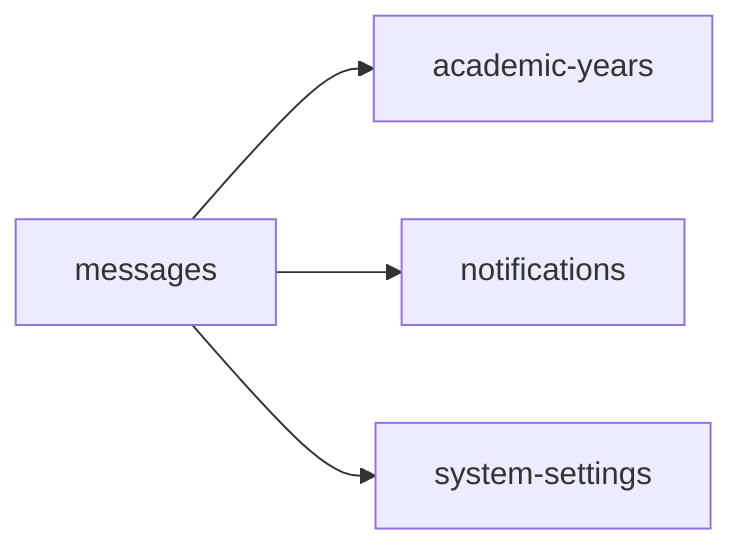

<!-- AUTO-GENERATED by scripts/generate-module-deps — do not edit -->

# Messages

## Dependency summary

| Fan-out | Fan-in | Hub rank | Blast radius | Dependency rate | Type |
|---------|--------|----------|--------------|-----------------|------|
| 3 | 1 | 37/61 | 17 | 7% | Standard |

- **Backend module:** `backend/src/modules/messages/messages.module.ts`
- **Category:** Communication

## Depends on (outbound)

| Module | Layer | Via | Condition |
|--------|-------|-----|----------|
| academic-years | BE module, BE service | backend/src/modules/messages/messages.module.ts imports; backend/src/modules/messages/messages.service.ts → AcademicYearsService | — |
| notifications | BE module, BE service | backend/src/modules/messages/messages.module.ts imports; backend/src/modules/messages/messages.service.ts → NotificationsService | — |
| system-settings | BE module, BE service | backend/src/modules/messages/messages.module.ts imports; backend/src/modules/messages/messages.service.ts → SystemSettingsService | — |

## Depended on by (inbound)

| Consumer | Layer | Via | Condition |
|----------|-------|-----|----------|
| sidebar | FE nav | /notifications | RBAC feature communication |
| sidebar | FE nav | /messages | RBAC feature communication |
| students | BE module | backend/src/modules/students/students.module.ts imports | — |
| students | BE service | backend/src/modules/students/students.service.ts → MessagesService | — |

## Access gates

| Gate type | Condition | Applies to | Source |
|-----------|-----------|------------|--------|
| jwt | JwtAuthGuard | messages API | `backend/src/modules/messages/conversations.controller.ts` |
| branch | BranchGuard (X-Branch-Id) | messages API | `backend/src/modules/messages/conversations.controller.ts` |
| jwt | JwtAuthGuard | messages API | `backend/src/modules/messages/messages.controller.ts` |
| branch | BranchGuard (X-Branch-Id) | messages API | `backend/src/modules/messages/messages.controller.ts` |
| nav-rbac | canView('communication') | nav path /messages | `frontend/src/lib/permission/navFeatureMap.ts` |

## Database tables

| Table | Source file |
|-------|-------------|
| `branches` | `backend/src/modules/messages/messages.service.ts` |
| `class_sections` | `backend/src/modules/messages/messages.service.ts` |
| `conversation_cleared` | `backend/src/modules/messages/messages.service.ts` |
| `conversation_hidden` | `backend/src/modules/messages/messages.service.ts` |
| `conversation_participants` | `backend/src/modules/messages/messages.service.ts` |
| `conversations` | `backend/src/modules/messages/messages.service.ts` |
| `message_reads` | `backend/src/modules/messages/messages.service.ts` |
| `messages` | `backend/src/modules/messages/messages.service.ts` |
| `profiles` | `backend/src/modules/messages/messages.service.ts` |
| `student_enrolments` | `backend/src/modules/messages/messages.service.ts` |
| `students` | `backend/src/modules/messages/messages.service.ts` |
| `user_roles` | `backend/src/modules/messages/messages.service.ts` |

## Troubleshooting

| Symptom | Likely cause | Check first |
|---------|--------------|-------------|
| API 401/403 | Auth, branch, or permission gate | Controller guards + `ensureFeatureEditAccess` |
| Empty list or wrong branch data | Missing branch_id filter | Service `.eq('branch_id', branchId)` |
| Frontend not loading data | Hook or API mismatch | `frontend/src/hooks/` + Network tab |

## Dependency graph

