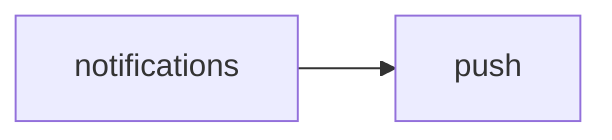

<!-- AUTO-GENERATED by scripts/generate-module-deps — do not edit -->

# Notifications

## Dependency summary

| Fan-out | Fan-in | Hub rank | Blast radius | Dependency rate | Type |
|---------|--------|----------|--------------|-----------------|------|
| 1 | 8 | 6/61 | 23 | 15% | Standard |

- **Backend module:** `backend/src/modules/notifications/notifications.module.ts`
- **Category:** Communication

## Depends on (outbound)

| Module | Layer | Via | Condition |
|--------|-------|-----|----------|
| push | BE module, BE service | backend/src/modules/notifications/notifications.module.ts imports; backend/src/modules/notifications/notifications.service.ts → PushService | — |

## Depended on by (inbound)

| Consumer | Layer | Via | Condition |
|----------|-------|-----|----------|
| assessments | BE module | backend/src/modules/assessments/assessments.module.ts imports | — |
| assessments | BE service | backend/src/modules/assessments/assessments.service.ts → NotificationsService | — |
| attendance | BE module | backend/src/modules/attendance/attendance.module.ts imports | — |
| attendance | BE service | backend/src/modules/attendance/attendance.service.ts → NotificationsService | — |
| early-departure | BE module | backend/src/modules/early-departure/early-departure.module.ts imports | — |
| early-departure | BE service | backend/src/modules/early-departure/early-departure.service.ts → NotificationsService | — |
| events | BE module | backend/src/modules/events/events.module.ts imports | — |
| events | BE service | backend/src/modules/events/events.service.ts → NotificationsService | — |
| leave-requests | BE module | backend/src/modules/leave-requests/leave-requests.module.ts imports | — |
| leave-requests | BE service | backend/src/modules/leave-requests/leave-requests.service.ts → NotificationsService | — |
| messages | BE module | backend/src/modules/messages/messages.module.ts imports | — |
| messages | BE service | backend/src/modules/messages/messages.service.ts → NotificationsService | — |
| substitutions | BE module | backend/src/modules/substitutions/substitutions.module.ts imports | — |
| substitutions | BE service | backend/src/modules/substitutions/substitutions.service.ts → NotificationsService | — |
| uniform-requests | BE module | backend/src/modules/uniform-requests/uniform-requests.module.ts imports | — |
| uniform-requests | BE service | backend/src/modules/uniform-requests/uniform-requests.service.ts → NotificationsService | — |

## Access gates

| Gate type | Condition | Applies to | Source |
|-----------|-----------|------------|--------|
| jwt | JwtAuthGuard | notifications API | `backend/src/modules/notifications/notifications.controller.ts` |
| nav-rbac | canView('communication') | nav path /notifications | `frontend/src/lib/permission/navFeatureMap.ts` |

## Database tables

| Table | Source file |
|-------|-------------|
| `notifications` | `backend/src/modules/notifications/notifications.service.ts` |
| `parent_students` | `backend/src/modules/notifications/notifications.service.ts` |
| `profiles` | `backend/src/modules/notifications/notifications.service.ts` |
| `students` | `backend/src/modules/notifications/notifications.service.ts` |

## Troubleshooting

| Symptom | Likely cause | Check first |
|---------|--------------|-------------|
| API 401/403 | Auth, branch, or permission gate | Controller guards + `ensureFeatureEditAccess` |
| Empty list or wrong branch data | Missing branch_id filter | Service `.eq('branch_id', branchId)` |
| Frontend not loading data | Hook or API mismatch | `frontend/src/hooks/` + Network tab |

## Dependency graph

