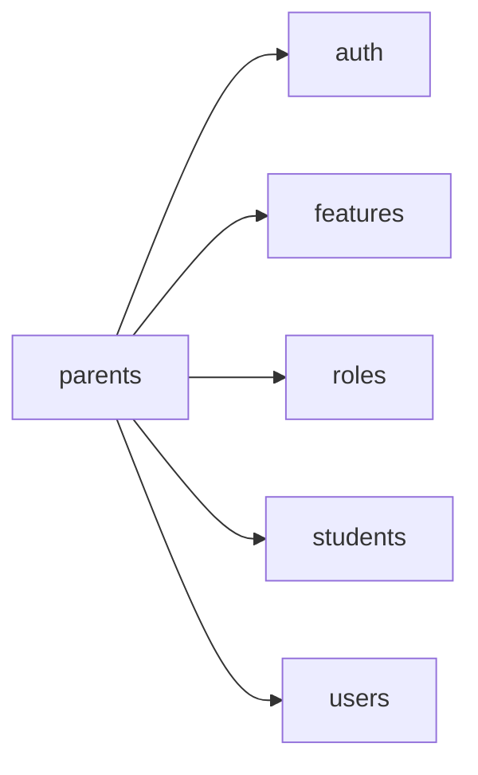

<!-- AUTO-GENERATED by scripts/generate-module-deps — do not edit -->

# Parents

> **Aggregator module** — composes multiple other modules (often via frontend widgets/hooks).

## Dependency summary

| Fan-out | Fan-in | Hub rank | Blast radius | Dependency rate | Type |
|---------|--------|----------|--------------|-----------------|------|
| 5 | 3 | 18/61 | 17 | 13% | Aggregator |

- **Backend module:** `backend/src/modules/parents/parents.module.ts`
- **Frontend feature:** `frontend/src/components/features/parents`
- **Category:** Student Management

## Depends on (outbound)

| Module | Layer | Via | Condition |
|--------|-------|-----|----------|
| auth | FE feature | components/features/parents | — |
| features | FE feature | components/features/parents | — |
| roles | FE feature | components/features/parents | — |
| students | FE feature | components/features/parents | — |
| users | FE feature | components/features/parents | — |

## Depended on by (inbound)

| Consumer | Layer | Via | Condition |
|----------|-------|-----|----------|
| certificates | BE module | backend/src/modules/certificates/certificates.module.ts imports | — |
| certificates | BE service | backend/src/modules/certificates/certificate-student-data.service.ts → ParentsService | — |
| id-cards | BE module | backend/src/modules/id-cards/id-cards.module.ts imports | — |
| id-cards | BE service | backend/src/modules/id-cards/card-data.service.ts → ParentsService | — |
| sidebar | FE nav | /parent-associations | RBAC feature parent_associations |
| sidebar | FE nav | /my-children | RBAC feature parent_associations |
| students | BE module | backend/src/modules/students/students.module.ts imports | — |
| students | BE service | backend/src/modules/students/students.service.ts → ParentsService | — |

## Access gates

| Gate type | Condition | Applies to | Source |
|-----------|-----------|------------|--------|
| jwt | JwtAuthGuard | parents API | `backend/src/modules/parents/parents.controller.ts` |
| branch | BranchGuard (X-Branch-Id) | parents API | `backend/src/modules/parents/parents.controller.ts` |
| rbac | ensureFeatureEditAccess('parent_associations') | parents write endpoints | `backend/src/modules/parents/parents.controller.ts` |

## Database tables

| Table | Source file |
|-------|-------------|
| `features` | `backend/src/modules/parents/parents.controller.ts` |
| `parent_students` | `backend/src/modules/parents/parents.service.ts` |
| `profiles` | `backend/src/modules/parents/parents.service.ts` |
| `role_permissions` | `backend/src/modules/parents/parents.controller.ts` |
| `roles` | `backend/src/modules/parents/parents.controller.ts` |
| `students` | `backend/src/modules/parents/parents.service.ts` |

## Troubleshooting

| Symptom | Likely cause | Check first |
|---------|--------------|-------------|
| API 401/403 | Auth, branch, or permission gate | Controller guards + `ensureFeatureEditAccess` |
| Empty list or wrong branch data | Missing branch_id filter | Service `.eq('branch_id', branchId)` |
| Frontend not loading data | Hook or API mismatch | `frontend/src/hooks/` + Network tab |

## Dependency graph

