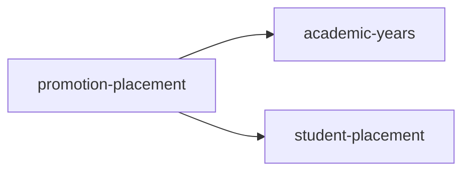

<!-- AUTO-GENERATED by scripts/generate-module-deps — do not edit -->

# Promotion Placement

## Dependency summary

| Fan-out | Fan-in | Hub rank | Blast radius | Dependency rate | Type |
|---------|--------|----------|--------------|-----------------|------|
| 2 | 1 | 38/61 | 33 | 5% | Standard |

- **Backend module:** `backend/src/modules/promotion-placement/promotion-placement.module.ts`
- **Category:** Academic Structure

## Depends on (outbound)

| Module | Layer | Via | Condition |
|--------|-------|-----|----------|
| academic-years | BE module, BE service | backend/src/modules/promotion-placement/promotion-placement.module.ts imports; forwardRef | — |
| student-placement | BE service | backend/src/modules/promotion-placement/promotion-placement.service.ts → StudentPlacementService | — |

## Depended on by (inbound)

| Consumer | Layer | Via | Condition |
|----------|-------|-----|----------|
| academic-years | BE module | backend/src/modules/academic-years/academic-years.module.ts imports | — |
| academic-years | BE module | forwardRef | — |
| hook:usePromotionPlacement | FE hook | /api/v1/promotion-placement | — |

## Access gates

| Gate type | Condition | Applies to | Source |
|-----------|-----------|------------|--------|
| jwt | JwtAuthGuard | promotion-placement API | `backend/src/modules/promotion-placement/promotion-placement.controller.ts` |
| branch | BranchGuard (X-Branch-Id) | promotion-placement API | `backend/src/modules/promotion-placement/promotion-placement.controller.ts` |
| nav-rbac | canView('students') | nav path /promotion-placement | `frontend/src/lib/permission/navFeatureMap.ts` |

## Database tables

| Table | Source file |
|-------|-------------|
| `class_sections` | `backend/src/modules/promotion-placement/promotion-placement.service.ts` |
| `student_enrolments` | `backend/src/modules/promotion-placement/promotion-placement.service.ts` |
| `student_promotion_decisions` | `backend/src/modules/promotion-placement/promotion-placement.service.ts` |
| `students` | `backend/src/modules/promotion-placement/promotion-placement.service.ts` |

## Known anomalies

| Kind | Detail | Source |
|------|--------|--------|
| forwardRef-cycle | Circular forwardRef between promotion-placement and academic-years | — |

## Troubleshooting

| Symptom | Likely cause | Check first |
|---------|--------------|-------------|
| API 401/403 | Auth, branch, or permission gate | Controller guards + `ensureFeatureEditAccess` |
| Empty list or wrong branch data | Missing branch_id filter | Service `.eq('branch_id', branchId)` |
| Frontend not loading data | Hook or API mismatch | `frontend/src/hooks/` + Network tab |

## Dependency graph

