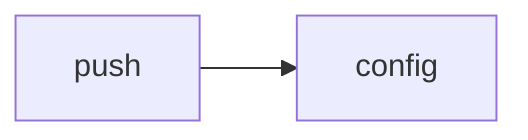

<!-- AUTO-GENERATED by scripts/generate-module-deps — do not edit -->

# Push

## Dependency summary

| Fan-out | Fan-in | Hub rank | Blast radius | Dependency rate | Type |
|---------|--------|----------|--------------|-----------------|------|
| 1 | 1 | 39/61 | 17 | 3% | Standard |

- **Backend module:** `backend/src/modules/push/push.module.ts`
- **Category:** Communication

## Depends on (outbound)

| Module | Layer | Via | Condition |
|--------|-------|-----|----------|
| config | BE module, BE service | backend/src/modules/push/push.module.ts imports; backend/src/modules/push/push.service.ts → ConfigService | — |

## Depended on by (inbound)

| Consumer | Layer | Via | Condition |
|----------|-------|-----|----------|
| hook:usePushSubscribe | FE hook | /api/v1/push | — |
| notifications | BE module | backend/src/modules/notifications/notifications.module.ts imports | — |
| notifications | BE service | backend/src/modules/notifications/notifications.service.ts → PushService | — |

## Access gates

| Gate type | Condition | Applies to | Source |
|-----------|-----------|------------|--------|
| jwt | JwtAuthGuard | push API | `backend/src/modules/push/push.controller.ts` |

## Database tables

| Table | Source file |
|-------|-------------|
| `push_subscriptions` | `backend/src/modules/push/push.service.ts` |

## Troubleshooting

| Symptom | Likely cause | Check first |
|---------|--------------|-------------|
| API 401/403 | Auth, branch, or permission gate | Controller guards + `ensureFeatureEditAccess` |
| Empty list or wrong branch data | Missing branch_id filter | Service `.eq('branch_id', branchId)` |
| Frontend not loading data | Hook or API mismatch | `frontend/src/hooks/` + Network tab |

## Dependency graph

