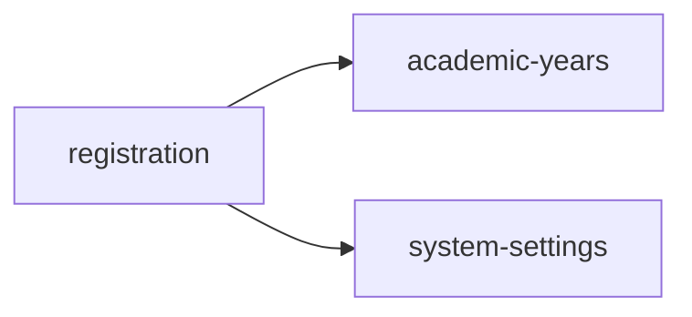

<!-- AUTO-GENERATED by scripts/generate-module-deps — do not edit -->

# Registration

## Dependency summary

| Fan-out | Fan-in | Hub rank | Blast radius | Dependency rate | Type |
|---------|--------|----------|--------------|-----------------|------|
| 2 | 0 | 53/61 | 0 | 3% | Standard |

- **Backend module:** `backend/src/modules/registration/registration.module.ts`
- **Category:** Core System

## Depends on (outbound)

| Module | Layer | Via | Condition |
|--------|-------|-----|----------|
| academic-years | BE module, BE service | backend/src/modules/registration/registration.module.ts imports; backend/src/modules/registration/registration.service.ts → AcademicYearsService | — |
| system-settings | BE module, BE service | backend/src/modules/registration/registration.module.ts imports; backend/src/modules/registration/registration.service.ts → SystemSettingsService | — |

## Depended on by (inbound)

_No inbound dependencies detected._

## Access gates

_No specific gates detected — may inherit default JWT + Branch guards._

## Database tables

| Table | Source file |
|-------|-------------|
| `academic_years` | `backend/src/modules/registration/registration.service.ts` |
| `branches` | `backend/src/modules/registration/registration.service.ts` |
| `profiles` | `backend/src/modules/registration/registration.service.ts` |
| `roles` | `backend/src/modules/registration/registration.service.ts` |
| `tenants` | `backend/src/modules/registration/registration.service.ts` |
| `user_branches` | `backend/src/modules/registration/registration.service.ts` |
| `user_roles` | `backend/src/modules/registration/registration.service.ts` |

## Troubleshooting

| Symptom | Likely cause | Check first |
|---------|--------------|-------------|
| API 401/403 | Auth, branch, or permission gate | Controller guards + `ensureFeatureEditAccess` |
| Empty list or wrong branch data | Missing branch_id filter | Service `.eq('branch_id', branchId)` |
| Frontend not loading data | Hook or API mismatch | `frontend/src/hooks/` + Network tab |

## Dependency graph

