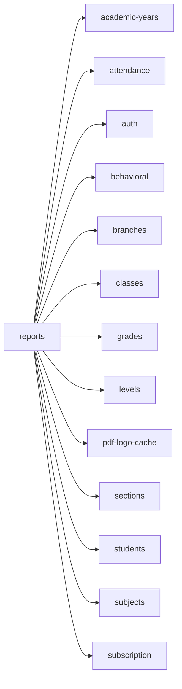

<!-- AUTO-GENERATED by scripts/generate-module-deps — do not edit -->

# Reports

## Dependency summary

| Fan-out | Fan-in | Hub rank | Blast radius | Dependency rate | Type |
|---------|--------|----------|--------------|-----------------|------|
| 13 | 1 | 40/61 | 4 | 23% | Standard |

- **Backend module:** `backend/src/modules/reports/reports.module.ts`
- **Frontend feature:** `frontend/src/components/features/reports`
- **Category:** Reporting & Analytics

## Depends on (outbound)

| Module | Layer | Via | Condition |
|--------|-------|-----|----------|
| academic-years | BE module, BE service | backend/src/modules/reports/reports.module.ts imports; backend/src/modules/reports/reports.service.ts → AcademicYearsService | — |
| attendance | BE module, BE service | backend/src/modules/reports/reports.module.ts imports; backend/src/modules/reports/reports.service.ts → AttendanceService | — |
| auth | FE feature | components/features/reports | — |
| behavioral | BE module, BE service | backend/src/modules/reports/reports.module.ts imports; backend/src/modules/reports/reports.service.ts → BehavioralService | — |
| branches | BE module, FE feature | backend/src/modules/reports/reports.module.ts imports; components/features/reports | — |
| classes | FE feature | components/features/reports | — |
| grades | BE module, BE service | backend/src/modules/reports/reports.module.ts imports; backend/src/modules/reports/reports.service.ts → GradesService | — |
| levels | FE feature | components/features/reports | — |
| pdf-logo-cache | BE service | backend/src/modules/reports/reports.service.ts → PdfLogoCacheService; backend/src/modules/reports/revenue/revenue-reports.service.ts → PdfLogoCacheService | — |
| sections | FE feature | components/features/reports | — |
| students | BE module, BE service | backend/src/modules/reports/reports.module.ts imports; backend/src/modules/reports/reports.service.ts → StudentsService | — |
| subjects | FE feature | components/features/reports | — |
| subscription | BE module | backend/src/modules/reports/reports.module.ts imports | — |

## Depended on by (inbound)

| Consumer | Layer | Via | Condition |
|----------|-------|-----|----------|
| results | BE module | backend/src/modules/results/results.module.ts imports | — |
| sidebar | FE nav | /reports | RBAC feature reports |
| sidebar | FE nav | /reports/public | RBAC feature reports |
| sidebar | FE nav | /reports/administrative | RBAC feature reports |

## Access gates

| Gate type | Condition | Applies to | Source |
|-----------|-----------|------------|--------|
| jwt | JwtAuthGuard | reports API | `backend/src/modules/reports/reports.controller.ts` |
| branch | BranchGuard (X-Branch-Id) | reports API | `backend/src/modules/reports/reports.controller.ts` |
| nav-rbac | canView('reports') | nav path /reports | `frontend/src/lib/permission/navFeatureMap.ts` |
| nav-rbac | canView('reports') | nav path /reports/public | `frontend/src/lib/permission/navFeatureMap.ts` |
| nav-rbac | canView('reports') | nav path /reports/administrative | `frontend/src/lib/permission/navFeatureMap.ts` |

## Database tables

| Table | Source file |
|-------|-------------|
| `academic_years` | `backend/src/modules/reports/reports.service.ts` |
| `assessments` | `backend/src/modules/reports/reports.service.ts` |
| `branches` | `backend/src/modules/reports/reports.service.ts` |
| `class_grade_assignments` | `backend/src/modules/reports/reports.service.ts` |
| `class_sections` | `backend/src/modules/reports/reports.service.ts` |
| `classes` | `backend/src/modules/reports/reports.service.ts` |
| `grade_ranges` | `backend/src/modules/reports/reports.service.ts` |
| `parent_students` | `backend/src/modules/reports/reports.service.ts` |
| `profiles` | `backend/src/modules/reports/reports.service.ts` |
| `sections` | `backend/src/modules/reports/reports.service.ts` |
| `staff` | `backend/src/modules/reports/reports.service.ts` |
| `student_assessment_statuses` | `backend/src/modules/reports/reports.service.ts` |
| `student_enrolments` | `backend/src/modules/reports/reports.service.ts` |
| `student_grades` | `backend/src/modules/reports/reports.service.ts` |
| `students` | `backend/src/modules/reports/reports.service.ts` |
| `subjects` | `backend/src/modules/reports/reports.service.ts` |
| `teacher_assignments` | `backend/src/modules/reports/reports.service.ts` |
| `tenants` | `backend/src/modules/reports/reports.service.ts` |
| `user_branches` | `backend/src/modules/reports/revenue/revenue-reports.service.ts` |

## Troubleshooting

| Symptom | Likely cause | Check first |
|---------|--------------|-------------|
| API 401/403 | Auth, branch, or permission gate | Controller guards + `ensureFeatureEditAccess` |
| Empty list or wrong branch data | Missing branch_id filter | Service `.eq('branch_id', branchId)` |
| Frontend not loading data | Hook or API mismatch | `frontend/src/hooks/` + Network tab |

## Dependency graph

