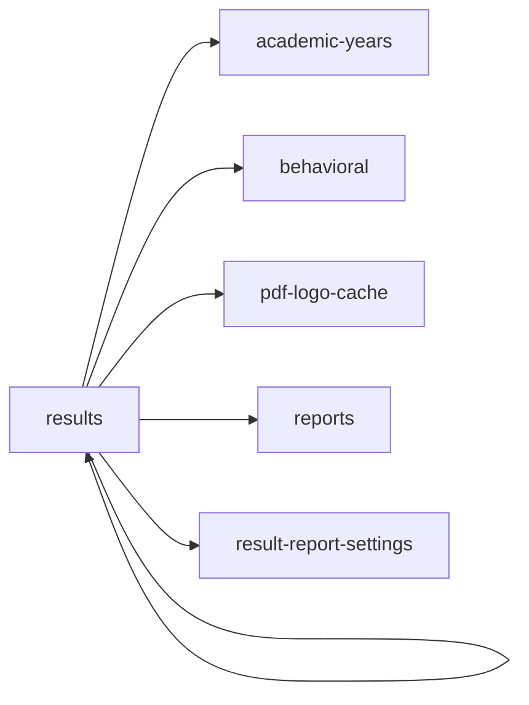

<!-- AUTO-GENERATED by scripts/generate-module-deps — do not edit -->

# Results

## Dependency summary

| Fan-out | Fan-in | Hub rank | Blast radius | Dependency rate | Type |
|---------|--------|----------|--------------|-----------------|------|
| 5 | 1 | 41/61 | 4 | 10% | Standard |

- **Backend module:** `backend/src/modules/results/results.module.ts`
- **Frontend feature:** `frontend/src/components/features/results`
- **Category:** Assessment & Grading

## Depends on (outbound)

| Module | Layer | Via | Condition |
|--------|-------|-----|----------|
| academic-years | BE module, BE service | backend/src/modules/results/results.module.ts imports; backend/src/modules/results/results.service.ts → AcademicYearsService | — |
| behavioral | BE module, BE service | backend/src/modules/results/results.module.ts imports; backend/src/modules/results/results.service.ts → BehavioralService | — |
| pdf-logo-cache | BE service | backend/src/modules/results/results.service.ts → PdfLogoCacheService | — |
| reports | BE module | backend/src/modules/results/results.module.ts imports | — |
| result-report-settings | BE service | backend/src/modules/results/results.service.ts → ResultReportSettingsService | — |
| results | FE feature | components/features/results | — |

## Depended on by (inbound)

| Consumer | Layer | Via | Condition |
|----------|-------|-----|----------|
| hook:useResults | FE hook | /api/v1/results | — |
| results | FE feature | components/features/results | — |
| settings | FE feature | components/features/settings | — |
| sidebar | FE nav | /results | RBAC feature results |

## Access gates

| Gate type | Condition | Applies to | Source |
|-----------|-----------|------------|--------|
| jwt | JwtAuthGuard | results API | `backend/src/modules/results/result-report-settings.controller.ts` |
| branch | BranchGuard (X-Branch-Id) | results API | `backend/src/modules/results/result-report-settings.controller.ts` |
| jwt | JwtAuthGuard | results API | `backend/src/modules/results/results.controller.ts` |
| branch | BranchGuard (X-Branch-Id) | results API | `backend/src/modules/results/results.controller.ts` |
| nav-rbac | canView('results') | nav path /results | `frontend/src/lib/permission/navFeatureMap.ts` |

## Database tables

| Table | Source file |
|-------|-------------|
| `academic_years` | `backend/src/modules/results/results.service.ts` |
| `assessments` | `backend/src/modules/results/results.service.ts` |
| `branches` | `backend/src/modules/results/results.service.ts` |
| `class_grade_assignments` | `backend/src/modules/results/results.service.ts` |
| `class_sections` | `backend/src/modules/results/results.service.ts` |
| `classes` | `backend/src/modules/results/results.service.ts` |
| `grade_ranges` | `backend/src/modules/results/results.service.ts` |
| `profiles` | `backend/src/modules/results/results.service.ts` |
| `result_card_deliveries` | `backend/src/modules/results/results.service.ts` |
| `result_cards` | `backend/src/modules/results/results.service.ts` |
| `result_report_settings` | `backend/src/modules/results/result-report-settings.service.ts` |
| `sections` | `backend/src/modules/results/results.service.ts` |
| `student_enrolments` | `backend/src/modules/results/results.service.ts` |
| `student_grades` | `backend/src/modules/results/results.service.ts` |
| `students` | `backend/src/modules/results/results.service.ts` |
| `subjects` | `backend/src/modules/results/results.service.ts` |
| `system_settings` | `backend/src/modules/results/results.service.ts` |
| `tenants` | `backend/src/modules/results/results.service.ts` |

## Known anomalies

| Kind | Detail | Source |
|------|--------|--------|
| duplicate-provider | Re-provides PdfLogoCacheService without importing assessments module | backend/src/modules/results/results.module.ts |

## Troubleshooting

| Symptom | Likely cause | Check first |
|---------|--------------|-------------|
| API 401/403 | Auth, branch, or permission gate | Controller guards + `ensureFeatureEditAccess` |
| Empty list or wrong branch data | Missing branch_id filter | Service `.eq('branch_id', branchId)` |
| Frontend not loading data | Hook or API mismatch | `frontend/src/hooks/` + Network tab |

## Dependency graph

