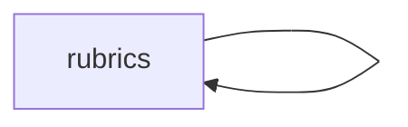

<!-- AUTO-GENERATED by scripts/generate-module-deps — do not edit -->

# Rubrics

> **Leaf module** — minimal outbound dependencies at module-import level.

## Dependency summary

| Fan-out | Fan-in | Hub rank | Blast radius | Dependency rate | Type |
|---------|--------|----------|--------------|-----------------|------|
| 0 | 2 | 26/61 | 6 | 3% | Leaf |

- **Backend module:** `backend/src/modules/rubrics/rubrics.module.ts`
- **Frontend feature:** `frontend/src/components/features/rubrics`
- **Category:** Assessment & Grading

## Depends on (outbound)

| Module | Layer | Via | Condition |
|--------|-------|-----|----------|
| rubrics | FE feature | components/features/rubrics | — |

## Depended on by (inbound)

| Consumer | Layer | Via | Condition |
|----------|-------|-----|----------|
| google-workspace | BE module | backend/src/modules/google-workspace/google-workspace.module.ts imports | — |
| google-workspace | BE service | backend/src/modules/google-workspace/google-workspace.service.ts → RubricsService | — |
| google-workspace | BE service | backend/src/modules/google-workspace/services/grade-pull.service.ts → RubricsService | — |
| hook:useRubrics | FE hook | /api/v1/rubrics | — |
| rubrics | FE feature | components/features/rubrics | — |
| settings | FE feature | components/features/settings | — |

## Access gates

| Gate type | Condition | Applies to | Source |
|-----------|-----------|------------|--------|
| jwt | JwtAuthGuard | rubrics API | `backend/src/modules/rubrics/rubrics.controller.ts` |
| branch | BranchGuard (X-Branch-Id) | rubrics API | `backend/src/modules/rubrics/rubrics.controller.ts` |

## Database tables

| Table | Source file |
|-------|-------------|
| `assessment_rubrics` | `backend/src/modules/rubrics/rubrics.service.ts` |
| `assessments` | `backend/src/modules/rubrics/rubrics.service.ts` |
| `features` | `backend/src/modules/rubrics/rubrics.controller.ts` |
| `role_permissions` | `backend/src/modules/rubrics/rubrics.controller.ts` |
| `roles` | `backend/src/modules/rubrics/rubrics.controller.ts` |
| `rubric_categories` | `backend/src/modules/rubrics/rubrics.service.ts` |
| `rubric_preset_categories` | `backend/src/modules/rubrics/rubrics.service.ts` |
| `rubric_presets` | `backend/src/modules/rubrics/rubrics.service.ts` |
| `student_grades` | `backend/src/modules/rubrics/rubrics.service.ts` |
| `student_rubric_scores` | `backend/src/modules/rubrics/rubrics.service.ts` |

## Troubleshooting

| Symptom | Likely cause | Check first |
|---------|--------------|-------------|
| API 401/403 | Auth, branch, or permission gate | Controller guards + `ensureFeatureEditAccess` |
| Empty list or wrong branch data | Missing branch_id filter | Service `.eq('branch_id', branchId)` |
| Frontend not loading data | Hook or API mismatch | `frontend/src/hooks/` + Network tab |

## Dependency graph

