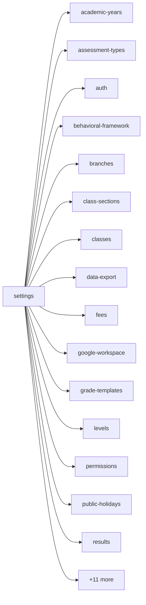

<!-- AUTO-GENERATED by scripts/generate-module-deps — do not edit -->

# Settings

> **Aggregator module** — composes multiple other modules (often via frontend widgets/hooks).

## Dependency summary

| Fan-out | Fan-in | Hub rank | Blast radius | Dependency rate | Type |
|---------|--------|----------|--------------|-----------------|------|
| 25 | 2 | 30/61 | 3 | 44% | Aggregator |

- **Frontend feature:** `frontend/src/components/features/settings`
- **Category:** Frontend Feature

## Depends on (outbound)

| Module | Layer | Via | Condition |
|--------|-------|-----|----------|
| academic-years | FE feature | components/features/settings | — |
| assessment-types | FE feature | components/features/settings | — |
| auth | FE feature | components/features/settings | — |
| behavioral-framework | FE feature | components/features/settings | — |
| branches | FE feature | components/features/settings | — |
| class-sections | FE feature | components/features/settings | — |
| classes | FE feature | components/features/settings | — |
| data-export | FE feature | components/features/settings | — |
| fees | FE feature | components/features/settings | — |
| google-workspace | FE feature | components/features/settings | — |
| grade-templates | FE feature | components/features/settings | — |
| levels | FE feature | components/features/settings | — |
| permissions | FE feature | components/features/settings | — |
| public-holidays | FE feature | components/features/settings | — |
| results | FE feature | components/features/settings | — |
| rubrics | FE feature | components/features/settings | — |
| sections | FE feature | components/features/settings | — |
| settings | FE feature | components/features/settings | — |
| settings-status | FE feature | components/features/settings | — |
| setup-wizard | FE feature | components/features/settings | — |
| student-self | FE feature | components/features/settings | — |
| subject-templates | FE feature | components/features/settings | — |
| subjects | FE feature | components/features/settings | — |
| tenants | FE feature | components/features/settings | — |
| timing-templates | FE feature | components/features/settings | — |
| vacations | FE feature | components/features/settings | — |

## Depended on by (inbound)

| Consumer | Layer | Via | Condition |
|----------|-------|-----|----------|
| early-departure | FE feature | components/features/early-departure | — |
| hook:useAssessmentSettings | FE hook | /api/v1/settings | — |
| hook:useScheduleSettings | FE hook | /api/v1/settings | — |
| settings | FE feature | components/features/settings | — |
| sidebar | FE nav | /settings | RBAC feature settings |
| timetable | FE feature | components/features/timetable | — |

## Access gates

| Gate type | Condition | Applies to | Source |
|-----------|-----------|------------|--------|
| jwt | JwtAuthGuard | settings-import API | `backend/src/modules/settings-import/settings-import.controller.ts` |
| branch | BranchGuard (X-Branch-Id) | settings-import API | `backend/src/modules/settings-import/settings-import.controller.ts` |
| jwt | JwtAuthGuard | settings-status API | `backend/src/modules/settings-status/settings-status.controller.ts` |
| branch | BranchGuard (X-Branch-Id) | settings-status API | `backend/src/modules/settings-status/settings-status.controller.ts` |
| jwt | JwtAuthGuard | system-settings API | `backend/src/modules/system-settings/system-settings.controller.ts` |
| branch | BranchGuard (X-Branch-Id) | system-settings API | `backend/src/modules/system-settings/system-settings.controller.ts` |
| nav-rbac | canView('settings') | nav path /settings | `frontend/src/lib/permission/navFeatureMap.ts` |
| nav-rbac | canView('certificates') | nav path /settings/certificates | `frontend/src/lib/permission/navFeatureMap.ts` |
| settings-gate | inventoryManagement | settings tab visibility | `frontend/src/components/features/settings/SettingsSectionNav.tsx` |
| settings-gate | dataExport | settings tab visibility | `frontend/src/components/features/settings/SettingsSectionNav.tsx` |
| settings-gate | feeManagement | settings tab visibility | `frontend/src/components/features/settings/SettingsSectionNav.tsx` |
| settings-gate | schoolAdmin | settings tab visibility | `frontend/src/components/features/settings/SettingsSectionNav.tsx` |

## Database tables

_No `.from()` table references found in this module's services/controllers._

## Troubleshooting

| Symptom | Likely cause | Check first |
|---------|--------------|-------------|
| API 401/403 | Auth, branch, or permission gate | Controller guards + `ensureFeatureEditAccess` |
| Empty list or wrong branch data | Missing branch_id filter | Service `.eq('branch_id', branchId)` |
| Frontend not loading data | Hook or API mismatch | `frontend/src/hooks/` + Network tab |

## Dependency graph

