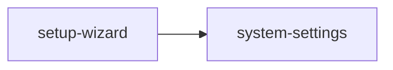

<!-- AUTO-GENERATED by scripts/generate-module-deps — do not edit -->

# Setup Wizard

## Dependency summary

| Fan-out | Fan-in | Hub rank | Blast radius | Dependency rate | Type |
|---------|--------|----------|--------------|-----------------|------|
| 1 | 1 | 43/61 | 4 | 3% | Standard |

- **Backend module:** `backend/src/modules/setup-wizard/setup-wizard.module.ts`
- **Category:** Utilities

## Depends on (outbound)

| Module | Layer | Via | Condition |
|--------|-------|-----|----------|
| system-settings | BE module, BE service | backend/src/modules/setup-wizard/setup-wizard.module.ts imports; backend/src/modules/setup-wizard/setup-wizard.service.ts → SystemSettingsService | — |

## Depended on by (inbound)

| Consumer | Layer | Via | Condition |
|----------|-------|-----|----------|
| hook:useSetupWizard | FE hook | /api/v1/setup-wizard | — |
| settings | FE feature | components/features/settings | — |

## Access gates

| Gate type | Condition | Applies to | Source |
|-----------|-----------|------------|--------|
| jwt | JwtAuthGuard | setup-wizard API | `backend/src/modules/setup-wizard/setup-wizard.controller.ts` |
| branch | BranchGuard (X-Branch-Id) | setup-wizard API | `backend/src/modules/setup-wizard/setup-wizard.controller.ts` |

## Database tables

_No `.from()` table references found in this module's services/controllers._

## Troubleshooting

| Symptom | Likely cause | Check first |
|---------|--------------|-------------|
| API 401/403 | Auth, branch, or permission gate | Controller guards + `ensureFeatureEditAccess` |
| Empty list or wrong branch data | Missing branch_id filter | Service `.eq('branch_id', branchId)` |
| Frontend not loading data | Hook or API mismatch | `frontend/src/hooks/` + Network tab |

## Dependency graph

