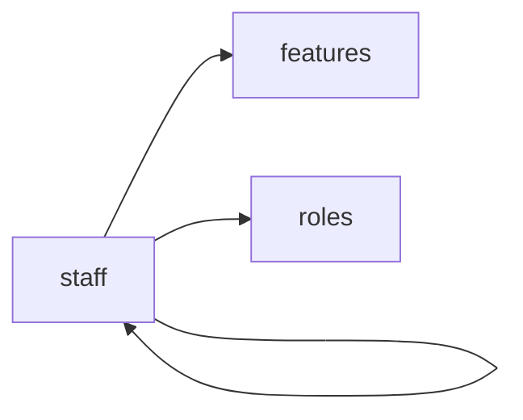

<!-- AUTO-GENERATED by scripts/generate-module-deps — do not edit -->

# Staff

## Dependency summary

| Fan-out | Fan-in | Hub rank | Blast radius | Dependency rate | Type |
|---------|--------|----------|--------------|-----------------|------|
| 2 | 7 | 9/61 | 14 | 15% | Standard |

- **Backend module:** `backend/src/modules/staff/staff.module.ts`
- **Frontend feature:** `frontend/src/components/features/staff`
- **Category:** Student Management

## Depends on (outbound)

| Module | Layer | Via | Condition |
|--------|-------|-----|----------|
| features | FE feature | components/features/staff | — |
| roles | FE feature | components/features/staff | — |
| staff | FE feature | components/features/staff | — |

## Depended on by (inbound)

| Consumer | Layer | Via | Condition |
|----------|-------|-----|----------|
| academic | FE feature | components/features/academic | — |
| assessments | BE module | backend/src/modules/assessments/assessments.module.ts imports | — |
| assessments | BE service | backend/src/modules/assessments/assessments.service.ts → StaffService | — |
| attendance | FE feature | components/features/attendance | — |
| dashboard | FE feature | components/features/dashboard | — |
| dashboard | FE feature | widget:class_attendance | — |
| dashboard | FE feature | widget:schedule_today | — |
| dashboard | FE feature | widget:branch_overview | — |
| hook:useStaff | FE hook | /api/v1/staff | — |
| id-cards | FE feature | components/features/id-cards | — |
| staff | FE feature | components/features/staff | — |
| substitutions | FE feature | components/features/substitutions | — |
| timetable | BE module | backend/src/modules/timetable/timetable.module.ts imports | — |
| timetable | FE feature | components/features/timetable | — |

## Access gates

| Gate type | Condition | Applies to | Source |
|-----------|-----------|------------|--------|
| jwt | JwtAuthGuard | staff API | `backend/src/modules/staff/staff.controller.ts` |
| branch | BranchGuard (X-Branch-Id) | staff API | `backend/src/modules/staff/staff.controller.ts` |
| rbac | ensureFeatureEditAccess('staff') | staff write endpoints | `backend/src/modules/staff/staff.controller.ts` |

## Database tables

| Table | Source file |
|-------|-------------|
| `class_sections` | `backend/src/modules/staff/staff.service.ts` |
| `features` | `backend/src/modules/staff/staff.controller.ts` |
| `profiles` | `backend/src/modules/staff/staff.service.ts` |
| `role_permissions` | `backend/src/modules/staff/staff.controller.ts` |
| `roles` | `backend/src/modules/staff/staff.controller.ts` |
| `staff` | `backend/src/modules/staff/staff.service.ts` |
| `teacher_assignments` | `backend/src/modules/staff/staff.service.ts` |
| `user_branches` | `backend/src/modules/staff/staff.service.ts` |
| `user_roles` | `backend/src/modules/staff/staff.service.ts` |

## Troubleshooting

| Symptom | Likely cause | Check first |
|---------|--------------|-------------|
| API 401/403 | Auth, branch, or permission gate | Controller guards + `ensureFeatureEditAccess` |
| Empty list or wrong branch data | Missing branch_id filter | Service `.eq('branch_id', branchId)` |
| Frontend not loading data | Hook or API mismatch | `frontend/src/hooks/` + Network tab |

## Dependency graph

