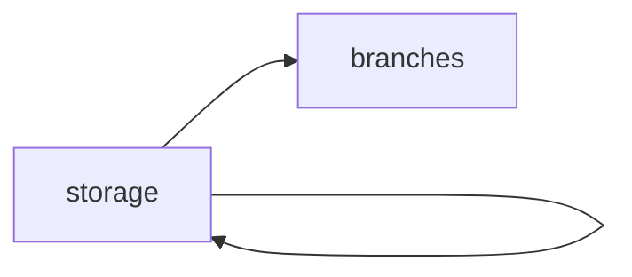

<!-- AUTO-GENERATED by scripts/generate-module-deps — do not edit -->

# Storage

## Dependency summary

| Fan-out | Fan-in | Hub rank | Blast radius | Dependency rate | Type |
|---------|--------|----------|--------------|-----------------|------|
| 1 | 4 | 11/61 | 12 | 8% | Standard |

- **Backend module:** `backend/src/modules/storage/storage.module.ts`
- **Frontend feature:** `frontend/src/components/features/storage`
- **Category:** Utilities

## Depends on (outbound)

| Module | Layer | Via | Condition |
|--------|-------|-----|----------|
| branches | BE module, BE service | backend/src/modules/storage/storage.module.ts imports; backend/src/modules/storage/storage.service.ts → BranchesService | — |
| storage | FE feature | components/features/storage | — |

## Depended on by (inbound)

| Consumer | Layer | Via | Condition |
|----------|-------|-----|----------|
| assessments | BE module | backend/src/modules/assessments/assessments.module.ts imports | — |
| assessments | BE service | backend/src/modules/assessments/assessments.service.ts → StorageService | — |
| dashboard | FE feature | components/features/dashboard | — |
| dashboard | FE feature | widget:storage | — |
| hook:useStorage | FE hook | /api/v1/storage | — |
| library | BE module | backend/src/modules/library/library.module.ts imports | — |
| storage | FE feature | components/features/storage | — |
| uniforms | BE module | backend/src/modules/uniforms/uniforms.module.ts imports | — |

## Access gates

| Gate type | Condition | Applies to | Source |
|-----------|-----------|------------|--------|
| jwt | JwtAuthGuard | storage API | `backend/src/modules/storage/storage.controller.ts` |
| branch | BranchGuard (X-Branch-Id) | storage API | `backend/src/modules/storage/storage.controller.ts` |

## Database tables

| Table | Source file |
|-------|-------------|
| `assessment_attachments` | `backend/src/modules/storage/storage.service.ts` |
| `assessments` | `backend/src/modules/storage/storage.service.ts` |
| `branches` | `backend/src/modules/storage/storage.service.ts` |
| `library_items` | `backend/src/modules/storage/storage.service.ts` |
| `storage_alerts` | `backend/src/modules/storage/storage.service.ts` |
| `storage_usage` | `backend/src/modules/storage/storage.service.ts` |
| `uniform_items` | `backend/src/modules/storage/storage.service.ts` |

## Troubleshooting

| Symptom | Likely cause | Check first |
|---------|--------------|-------------|
| API 401/403 | Auth, branch, or permission gate | Controller guards + `ensureFeatureEditAccess` |
| Empty list or wrong branch data | Missing branch_id filter | Service `.eq('branch_id', branchId)` |
| Frontend not loading data | Hook or API mismatch | `frontend/src/hooks/` + Network tab |

## Dependency graph

