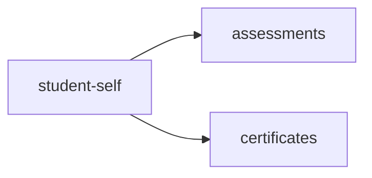

<!-- AUTO-GENERATED by scripts/generate-module-deps — do not edit -->

# Student Self

## Dependency summary

| Fan-out | Fan-in | Hub rank | Blast radius | Dependency rate | Type |
|---------|--------|----------|--------------|-----------------|------|
| 2 | 1 | 44/61 | 4 | 5% | Standard |

- **Backend module:** `backend/src/modules/student-self/student-self.module.ts`
- **Category:** Student Management

## Depends on (outbound)

| Module | Layer | Via | Condition |
|--------|-------|-----|----------|
| assessments | BE module | backend/src/modules/student-self/student-self.module.ts imports | — |
| certificates | BE module | backend/src/modules/student-self/student-self.module.ts imports | — |

## Depended on by (inbound)

| Consumer | Layer | Via | Condition |
|----------|-------|-----|----------|
| hook:useFees | FE hook | /api/v1/student | — |
| hook:useStudentAssessments | FE hook | /api/v1/student | — |
| hook:useStudentSelf | FE hook | /api/v1/student | — |
| settings | FE feature | components/features/settings | — |

## Access gates

| Gate type | Condition | Applies to | Source |
|-----------|-----------|------------|--------|
| student-jwt | StudentJwtGuard | student-self student portal API | `backend/src/modules/student-self/student-fees.controller.ts` |
| student-jwt | StudentJwtGuard | student-self student portal API | `backend/src/modules/student-self/student-self.controller.ts` |

## Database tables

| Table | Source file |
|-------|-------------|
| `certificates` | `backend/src/modules/student-self/student-self.controller.ts` |
| `students` | `backend/src/modules/student-self/student-self.controller.ts` |

## Known anomalies

| Kind | Detail | Source |
|------|--------|--------|
| duplicate-provider | Re-provides AcademicYearsService without importing academic-years module | backend/src/modules/student-self/student-self.module.ts |
| duplicate-provider | Re-provides FeeCalculationService without importing fees module | backend/src/modules/student-self/student-self.module.ts |
| duplicate-provider | Re-provides FeePdfService without importing fees module | backend/src/modules/student-self/student-self.module.ts |
| duplicate-provider | Re-provides ChallanService without importing fees module | backend/src/modules/student-self/student-self.module.ts |
| duplicate-provider | Re-provides PaymentService without importing fees module | backend/src/modules/student-self/student-self.module.ts |

## Troubleshooting

| Symptom | Likely cause | Check first |
|---------|--------------|-------------|
| API 401/403 | Auth, branch, or permission gate | Controller guards + `ensureFeatureEditAccess` |
| Empty list or wrong branch data | Missing branch_id filter | Service `.eq('branch_id', branchId)` |
| Frontend not loading data | Hook or API mismatch | `frontend/src/hooks/` + Network tab |

## Dependency graph

