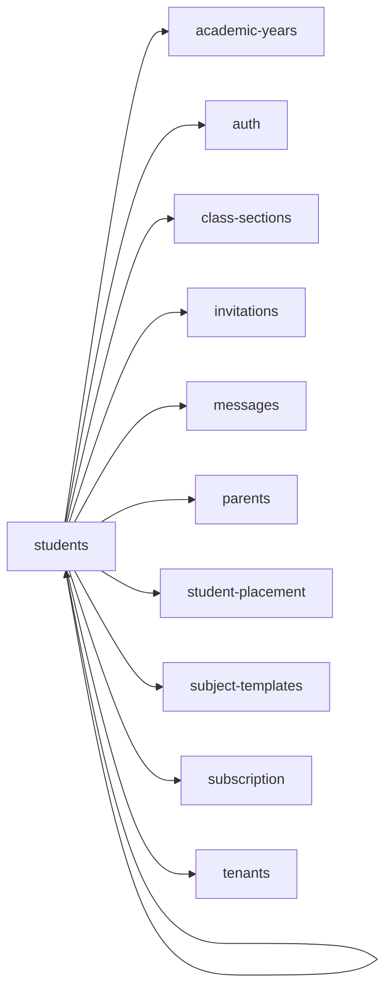

<!-- AUTO-GENERATED by scripts/generate-module-deps — do not edit -->

# Students

> **Hub module** — many other modules depend on this. Changes here have wide impact.

## Dependency summary

| Fan-out | Fan-in | Hub rank | Blast radius | Dependency rate | Type |
|---------|--------|----------|--------------|-----------------|------|
| 10 | 12 | 4/61 | 17 | 36% | Hub |

- **Backend module:** `backend/src/modules/students/students.module.ts`
- **Frontend feature:** `frontend/src/components/features/students`
- **Category:** Student Management

## Depends on (outbound)

| Module | Layer | Via | Condition |
|--------|-------|-----|----------|
| academic-years | BE module, BE service, FE feature | backend/src/modules/students/students.module.ts imports; backend/src/modules/students/students.service.ts → AcademicYearsService | — |
| auth | FE feature | components/features/students | — |
| class-sections | FE feature | components/features/students | — |
| invitations | BE module, BE service, FE feature | backend/src/modules/students/students.module.ts imports; backend/src/modules/students/students.service.ts → InvitationsService | — |
| messages | BE module, BE service | backend/src/modules/students/students.module.ts imports; backend/src/modules/students/students.service.ts → MessagesService | — |
| parents | BE module, BE service | backend/src/modules/students/students.module.ts imports; backend/src/modules/students/students.service.ts → ParentsService | — |
| student-placement | BE service | backend/src/modules/students/students.service.ts → StudentPlacementService | — |
| students | FE feature | components/features/students | — |
| subject-templates | FE feature | components/features/students | — |
| subscription | BE module, BE service | backend/src/modules/students/students.module.ts imports; backend/src/modules/students/students.service.ts → SubscriptionService | — |
| tenants | FE feature | components/features/students | — |

## Depended on by (inbound)

| Consumer | Layer | Via | Condition |
|----------|-------|-----|----------|
| attendance | FE feature | components/features/attendance | — |
| bulk-import | BE module | backend/src/modules/bulk-import/bulk-import.module.ts imports | — |
| bulk-import | BE service | backend/src/modules/bulk-import/bulk-import.service.ts → StudentsService | — |
| certificates | FE feature | components/features/certificates | — |
| dashboard | FE feature | components/features/dashboard | — |
| dashboard | FE feature | widget:branch_overview | — |
| dashboard | FE feature | widget:today_schedule | — |
| dashboard | FE feature | widget:grades_overview | — |
| early-departure | FE feature | components/features/early-departure | — |
| events | FE feature | components/features/events | — |
| grades | BE module | backend/src/modules/grades/grades.module.ts imports | — |
| grades | BE service | backend/src/modules/grades/grades.service.ts → StudentsService | — |
| hook:useStudents | FE hook | /api/v1/students | — |
| inventory | FE feature | components/features/inventory | — |
| leaves | FE feature | components/features/leaves | — |
| mapping | FE feature | components/features/mapping | — |
| parents | FE feature | components/features/parents | — |
| reports | BE module | backend/src/modules/reports/reports.module.ts imports | — |
| reports | BE service | backend/src/modules/reports/reports.service.ts → StudentsService | — |
| sidebar | FE nav | /students | RBAC feature students |
| sidebar | FE nav | /promotion-placement | RBAC feature students |
| students | FE feature | components/features/students | — |

## Access gates

| Gate type | Condition | Applies to | Source |
|-----------|-----------|------------|--------|
| jwt | JwtAuthGuard | students API | `backend/src/modules/students/students.controller.ts` |
| branch | BranchGuard (X-Branch-Id) | students API | `backend/src/modules/students/students.controller.ts` |
| rbac | ensureFeatureEditAccess('students') | students write endpoints | `backend/src/modules/students/students.controller.ts` |
| nav-rbac | canView('students') | nav path /students | `frontend/src/lib/permission/navFeatureMap.ts` |

## Database tables

| Table | Source file |
|-------|-------------|
| `branches` | `backend/src/modules/students/students.service.ts` |
| `class_subject_template_assignments` | `backend/src/modules/students/students.service.ts` |
| `classes` | `backend/src/modules/students/students.service.ts` |
| `features` | `backend/src/modules/students/students.controller.ts` |
| `invitations` | `backend/src/modules/students/students.service.ts` |
| `level_classes` | `backend/src/modules/students/students.service.ts` |
| `level_subject_template_assignments` | `backend/src/modules/students/students.service.ts` |
| `parent_students` | `backend/src/modules/students/students.service.ts` |
| `profiles` | `backend/src/modules/students/students.service.ts` |
| `role_permissions` | `backend/src/modules/students/students.controller.ts` |
| `roles` | `backend/src/modules/students/students.controller.ts` |
| `sections` | `backend/src/modules/students/students.service.ts` |
| `student_enrolments` | `backend/src/modules/students/students.service.ts` |
| `student_subject_template_assignments` | `backend/src/modules/students/students.service.ts` |
| `students` | `backend/src/modules/students/students.service.ts` |
| `tenants` | `backend/src/modules/students/students.service.ts` |
| `user_branches` | `backend/src/modules/students/students.service.ts` |
| `user_roles` | `backend/src/modules/students/students.service.ts` |

## Troubleshooting

| Symptom | Likely cause | Check first |
|---------|--------------|-------------|
| Many features broken after change | High fan-in hub — wide blast radius | Inbound dependents; blast radius: 17 |
| API returns 403 | RBAC or plan gate | Access gates section + `role_permissions` matrix |

## Dependency graph

