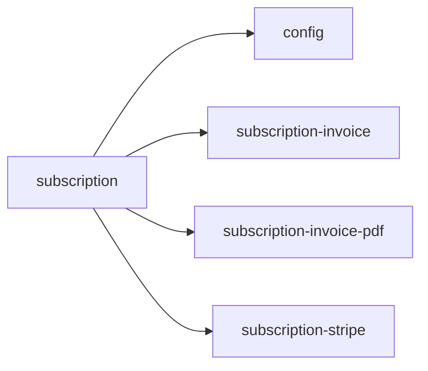

<!-- AUTO-GENERATED by scripts/generate-module-deps — do not edit -->

# Subscription

> **Hub module** — many other modules depend on this. Changes here have wide impact.

## Dependency summary

| Fan-out | Fan-in | Hub rank | Blast radius | Dependency rate | Type |
|---------|--------|----------|--------------|-----------------|------|
| 4 | 11 | 5/61 | 33 | 25% | Hub |

- **Backend module:** `backend/src/modules/subscription/subscription.module.ts`
- **Category:** Core System

## Depends on (outbound)

| Module | Layer | Via | Condition |
|--------|-------|-----|----------|
| config | BE service | backend/src/modules/subscription/subscription.service.ts → ConfigService | — |
| subscription-invoice | BE service | backend/src/modules/subscription/subscription-stripe.service.ts → SubscriptionInvoiceService; backend/src/modules/subscription/subscription.service.ts → SubscriptionInvoiceService | — |
| subscription-invoice-pdf | BE service | backend/src/modules/subscription/subscription-invoice.service.ts → SubscriptionInvoicePdfService | — |
| subscription-stripe | BE service | backend/src/modules/subscription/subscription.service.ts → SubscriptionStripeService | — |

## Depended on by (inbound)

| Consumer | Layer | Via | Condition |
|----------|-------|-----|----------|
| behavioral | BE module | backend/src/modules/behavioral/behavioral.module.ts imports | — |
| behavioral-framework | BE module | backend/src/modules/behavioral-framework/behavioral-framework.module.ts imports | — |
| branches | BE module | backend/src/modules/branches/branches.module.ts imports | — |
| branches | BE service | backend/src/modules/branches/branches.service.ts → SubscriptionService | — |
| class-sections | BE module | backend/src/modules/class-sections/class-sections.module.ts imports | — |
| class-sections | BE service | backend/src/modules/class-sections/class-sections.service.ts → SubscriptionService | — |
| dashboard | FE feature | components/features/dashboard | — |
| dashboard | FE feature | widget:low_stock | plan: hasInventoryManagement |
| fees | BE module | backend/src/modules/fees/fees.module.ts imports | — |
| hook:useSubscription | FE hook | /api/v1/subscription | — |
| library | BE module | backend/src/modules/library/library.module.ts imports | — |
| reports | BE module | backend/src/modules/reports/reports.module.ts imports | — |
| students | BE module | backend/src/modules/students/students.module.ts imports | — |
| students | BE service | backend/src/modules/students/students.service.ts → SubscriptionService | — |
| uniforms | BE module | backend/src/modules/uniforms/uniforms.module.ts imports | — |
| users | BE module | backend/src/modules/users/users.module.ts imports | — |
| users | BE service | backend/src/modules/users/users.service.ts → SubscriptionService | — |

## Access gates

| Gate type | Condition | Applies to | Source |
|-----------|-----------|------------|--------|
| jwt | JwtAuthGuard | subscription API | `backend/src/modules/subscription/subscription.controller.ts` |
| branch | BranchGuard (X-Branch-Id) | subscription API | `backend/src/modules/subscription/subscription.controller.ts` |
| role | school_admin only | subscription API | `backend/src/modules/subscription/subscription.controller.ts` |

## Database tables

| Table | Source file |
|-------|-------------|
| `billing_payment_events` | `backend/src/modules/subscription/subscription-invoice.service.ts` |
| `branches` | `backend/src/modules/subscription/subscription-stripe.service.ts` |
| `class_sections` | `backend/src/modules/subscription/subscription.service.ts` |
| `roles` | `backend/src/modules/subscription/subscription-stripe.service.ts` |
| `students` | `backend/src/modules/subscription/subscription.service.ts` |
| `subscription_invoices` | `backend/src/modules/subscription/subscription-invoice.service.ts` |
| `subscription_usage` | `backend/src/modules/subscription/subscription.service.ts` |
| `subscriptions` | `backend/src/modules/subscription/subscription-stripe.service.ts` |
| `tenants` | `backend/src/modules/subscription/subscription-invoice.service.ts` |
| `user_roles` | `backend/src/modules/subscription/subscription-stripe.service.ts` |

## Troubleshooting

| Symptom | Likely cause | Check first |
|---------|--------------|-------------|
| Many features broken after change | High fan-in hub — wide blast radius | Inbound dependents; blast radius: 33 |
| API returns 403 | RBAC or plan gate | Access gates section + `role_permissions` matrix |

## Dependency graph

