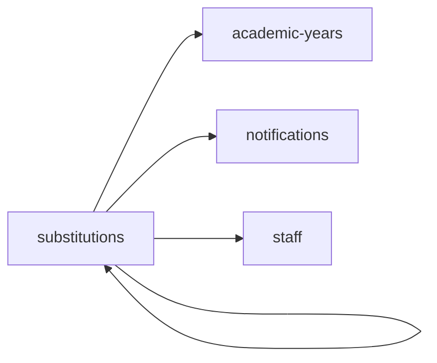

<!-- AUTO-GENERATED by scripts/generate-module-deps — do not edit -->

# Substitutions

## Dependency summary

| Fan-out | Fan-in | Hub rank | Blast radius | Dependency rate | Type |
|---------|--------|----------|--------------|-----------------|------|
| 3 | 1 | 45/61 | 3 | 7% | Standard |

- **Backend module:** `backend/src/modules/substitutions/substitutions.module.ts`
- **Frontend feature:** `frontend/src/components/features/substitutions`
- **Category:** Scheduling

## Depends on (outbound)

| Module | Layer | Via | Condition |
|--------|-------|-----|----------|
| academic-years | BE module, BE service | backend/src/modules/substitutions/substitutions.module.ts imports; backend/src/modules/substitutions/substitutions.service.ts → AcademicYearsService | — |
| notifications | BE module, BE service | backend/src/modules/substitutions/substitutions.module.ts imports; backend/src/modules/substitutions/substitutions.service.ts → NotificationsService | — |
| staff | FE feature | components/features/substitutions | — |
| substitutions | FE feature | components/features/substitutions | — |

## Depended on by (inbound)

| Consumer | Layer | Via | Condition |
|----------|-------|-----|----------|
| hook:useSubstitutions | FE hook | /api/v1/substitutions | — |
| sidebar | FE nav | /substitution | RBAC feature teacher_substitution |
| sidebar | FE nav | /substitution/history | RBAC feature teacher_substitution |
| sidebar | FE nav | /substitution/assign | RBAC feature teacher_substitution |
| substitutions | FE feature | components/features/substitutions | — |
| timetable | FE feature | components/features/timetable | — |

## Access gates

| Gate type | Condition | Applies to | Source |
|-----------|-----------|------------|--------|
| jwt | JwtAuthGuard | substitutions API | `backend/src/modules/substitutions/substitutions.controller.ts` |
| branch | BranchGuard (X-Branch-Id) | substitutions API | `backend/src/modules/substitutions/substitutions.controller.ts` |
| rbac | ensureFeatureEditAccess() | substitutions write endpoints | `backend/src/modules/substitutions/substitutions.controller.ts` |

## Database tables

| Table | Source file |
|-------|-------------|
| `class_sections` | `backend/src/modules/substitutions/substitutions.service.ts` |
| `features` | `backend/src/modules/substitutions/substitutions.controller.ts` |
| `profiles` | `backend/src/modules/substitutions/substitutions.service.ts` |
| `role_permissions` | `backend/src/modules/substitutions/substitutions.controller.ts` |
| `roles` | `backend/src/modules/substitutions/substitutions.controller.ts` |
| `staff` | `backend/src/modules/substitutions/substitutions.service.ts` |
| `teacher_assignments` | `backend/src/modules/substitutions/substitutions.service.ts` |
| `teacher_substitutions` | `backend/src/modules/substitutions/substitutions.service.ts` |
| `timetable_slots` | `backend/src/modules/substitutions/substitutions.service.ts` |

## Troubleshooting

| Symptom | Likely cause | Check first |
|---------|--------------|-------------|
| API 401/403 | Auth, branch, or permission gate | Controller guards + `ensureFeatureEditAccess` |
| Empty list or wrong branch data | Missing branch_id filter | Service `.eq('branch_id', branchId)` |
| Frontend not loading data | Hook or API mismatch | `frontend/src/hooks/` + Network tab |

## Dependency graph

